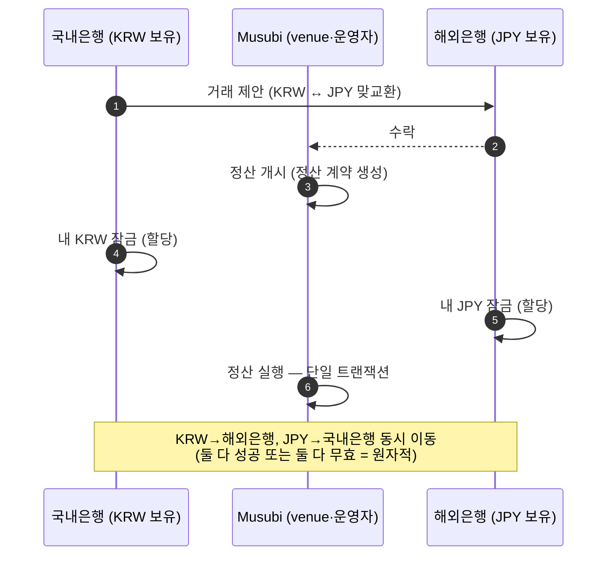
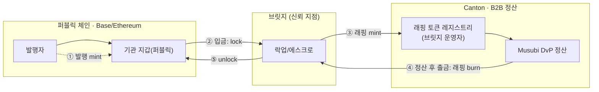
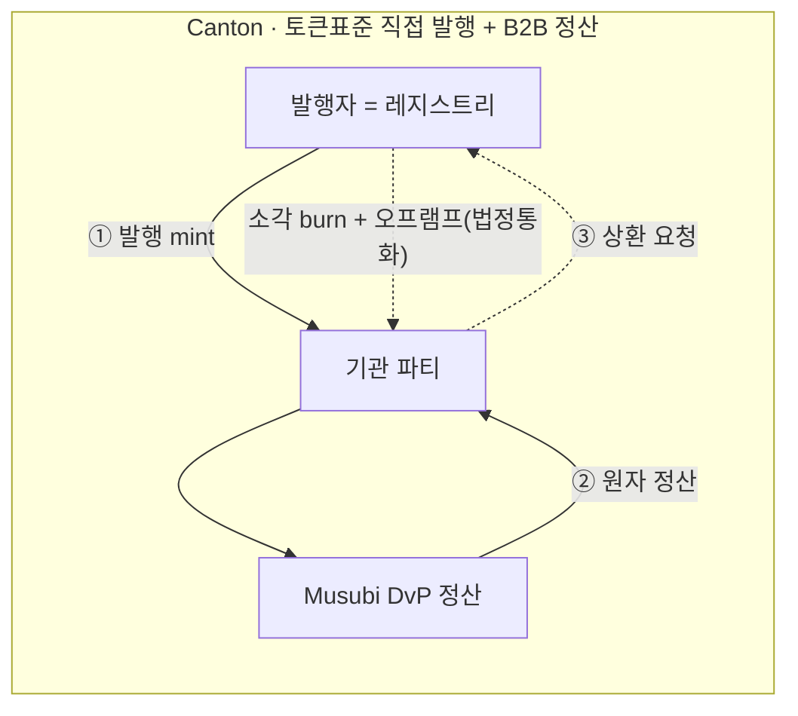

# 아키텍처 — B2B/B2C 역할 분담 & 멀티체인 (프로젝트)

> 우리 프로젝트의 계층 분담 결정 메모. 일반 Canton B2B/B2C 적합성은 위키 [Canton B2B vs B2C](../../wiki/notes/canton-b2b-vs-b2c.md) 참고.
> (dev 문서 — 위키와는 목적상 분리. 대외비는 아님: 공개 정보 기반.)

## 결정된 방향: 계층별 역할 분담
```
[B2C] 일반유저 ↔ 스테이블코인        → 퍼블릭 체인 (Base/Ethereum)
                       │ 브릿지(필수)
[B2B] 적격기관 ↔ 적격기관 정산(DvP)   → Canton (프라이버시·원자적 결정적 정산)
```
- **B2C는 Canton에서 안 한다.** 리테일 접점(소비자용 스테이블코인)은 **퍼블릭 체인**(Base/Ethereum)에서.
- **Canton은 B2B 정산 전용** — 기관 간 원자적 DvP(통화↔통화), 프라이버시 보존.
- 두 계층은 **브릿지로 연결**(필수 컴포넌트).

## 왜 이렇게 나누나
| 계층 | 체인 | 이유 |
|---|---|---|
| B2C(리테일) | 퍼블릭(Base/Eth) | 대량·저비용·간편 온보딩·기존 지갑 생태계(리테일이 이미 있음) |
| B2B(기관 정산) | Canton | 프라이버시(거래 상대·금액 비공개)·결정적 확정·허가형 자산·다자 권한 |

→ Canton 강점은 B2B에서만 결정적이고, B2C엔 오버스펙. 그래서 분담.

## DvP 정산이란 — 실제 교환 과정
아래 흐름도들은 정산을 **"Musubi DvP 정산" 상자 하나**로만 그리지만, 그 안에서 실제로 자산이 오가는 과정은 이렇다.

**정산(settlement)** = 거래 약속을 **실제 자산 이동으로 마무리**하는 단계.
문제는 *누가 먼저 보내나* — 국내은행이 KRW를 먼저 보냈는데 해외은행이 JPY를 안 보내면 떼인다(**카운터파티 리스크**).
**DvP(Delivery versus Payment)** 는 이걸 없앤다: **두 통화를 동시에, 한 묶음으로** 교환 → **전부 성공 or 전부 무효**, 한쪽만 가는 일은 구조적으로 불가능.

교환은 다음 순서로 일어난다(데모 구현과 동일):


1. **제안**: 국내은행이 "KRW ↔ JPY 맞교환"을 제안.
2. **수락**: 해외은행이 조건에 동의.
3. **개시**: venue(Musubi)가 정산을 개시 — 양 통화 다리를 묶은 *정산 계약* 생성.
4. **잠금(할당)**: 각 은행이 **자기 통화를 잠근다**(아직 안 넘어감, 예약만). 잠근 자산은 정산에만 쓸 수 있게 묶임.
5. **실행**: venue가 **단 하나의 트랜잭션**으로 두 통화를 **동시에** 맞바꿈. 한쪽이라도 부족·실패하면 **트랜잭션 전체가 무효** → 아무 자산도 안 움직임.

> 즉 "Musubi DvP 정산" 상자 = **③개시 → ④양측 잠금 → ⑤원자적 실행**. 이래서 **한쪽만 받고 떼이는 일이 불가능**(카운터파티 리스크 0)하고, 이게 Canton을 B2B 정산에 쓰는 핵심 이유다. (개념 더보기: 위키 [원자적 DvP](../../wiki/notes/atomic-dvp-real-differentiator.md))

## 미확정 (열어둘 것)
- **스테이블코인 발행 체인 세부**: KRWStable·JPYSC를 어느 체인에서 발행할지 **미정** → 아래 양쪽 시나리오 병기.
- 브릿지 방식(어떤 브릿지·신뢰 모델)도 설계 대상.

## 발행 시나리오 (양쪽 병기)
어느 쪽이든 **B2B 정산은 Canton(Musubi DvP)에서** 일어난다. 차이는 *정산에 쓰는 토큰이 Canton에 어떻게 들어오나*다.
정산이 도는 데 필요한 것: 그 토큰의 **레지스트리(발행/소각 관장 + 이체·정산 증빙 제공)** 가 Canton에 존재해야 함. (레지스트리=발행자가 운영, [stablecoin-instruments-plan](stablecoin-instruments-plan.md) 참고.)

### 시나리오 1 — 외부 체인 발행 + 브릿지
- 스테이블코인을 **퍼블릭 체인(Base/Ethereum)에서 발행**, Canton 정산용으로 **브릿지로 래핑(wrapped) 토큰** 반입.
- Canton의 **래핑 토큰 레지스트리 = 브릿지 운영자(또는 발행자 위임)** 가 운영. 정산은 이 래핑 토큰끼리 원자 교환.
- **신뢰 지점 = 브릿지**(락업 자산 ↔ 래핑 발행의 1:1 보장).


1. 발행자가 퍼블릭 체인에서 KRWK/JPYSC 발행 → 기관 퍼블릭 지갑.
2. 기관이 정산에 쓰려고 브릿지에 입금(퍼블릭에서 **lock**).
3. 브릿지가 Canton에 **래핑 토큰 mint** → 기관 Canton 파티 보유.
4. Musubi DvP로 KRWK(wrapped) ↔ JPYSC(wrapped) **원자 정산**. 이후 기관이 출금하면 래핑 **burn**.
5. 브릿지가 퍼블릭에서 **unlock** → 기관 퍼블릭 지갑 복귀.

### 시나리오 2 — Canton 직접 발행 (토큰표준)
- 스테이블코인을 **Canton 토큰표준으로 발행자가 직접 발행**. 브릿지 없이 네이티브.
- **발행자 = Canton 레지스트리** (발행/소각·증빙을 직접). 정산은 네이티브 토큰끼리.
- 신뢰 지점 = **발행자**(법정통화 준비금 ↔ 발행량). 퍼블릭/리테일(B2C)과 잇는다면 *그때* 반대 방향 브릿지 필요.


1. 발행자(레지스트리)가 기관 요청 시 Canton에서 KRWK/JPYSC **mint** → 기관 파티.
2. Musubi DvP로 두 통화 **원자 정산**(브릿지 불필요).
3. 기관이 상환 요청 → 발행자가 Canton에서 **burn** + 법정통화 오프램프.

### 두 시나리오 비교
| 항목 | 시나리오 1 (외부발행+브릿지) | 시나리오 2 (Canton 직접발행) |
|---|---|---|
| 발행 장소 | 퍼블릭 체인(Base/Eth) | Canton(토큰표준) |
| 브릿지 | **필수** | 불필요(B2B 정산엔) |
| Canton 레지스트리 운영 | 브릿지 운영자(래핑) | 발행자 직접 |
| 신뢰 지점 | 브릿지(lock↔wrapped) | 발행자(준비금↔발행) |
| 리테일/B2C 연결 | 이미 퍼블릭에 있음(자연스러움) | 반대 방향 브릿지 필요 |
| 구현 부담 | 브릿지+래핑 레지스트리 | Canton 레지스트리만 |
| 데모(옵션 A) 매핑 | 래핑 토큰 레지스트리 구현 | 네이티브 토큰 레지스트리 구현 |

> 어느 쪽이든 **Musubi = venue(정산 운영자), 발행/소각 = 레지스트리(발행자)** 로 역할은 동일. 차이는 레지스트리를 *누가/어디서* 운영하느냐와 브릿지 유무.

## Musubi 매핑
- Musubi가 담당하는 건 **B2B 정산 계층(Canton)** — OTCTrade형 기관↔기관 DvP. (참고: [dvp-licensing-code-walkthrough.md](dvp-licensing-code-walkthrough.md))
- B2C 측(소비자 스테이블코인)은 Musubi/Canton 범위 밖 — 퍼블릭 체인 + 브릿지 연동 지점만 신경.

## 관련
- 위키 일반 정리: [Canton B2B vs B2C](../../wiki/notes/canton-b2b-vs-b2c.md)
- 로드맵 Phase 3(백엔드·브릿지 연동): [roadmap.md](roadmap.md)
