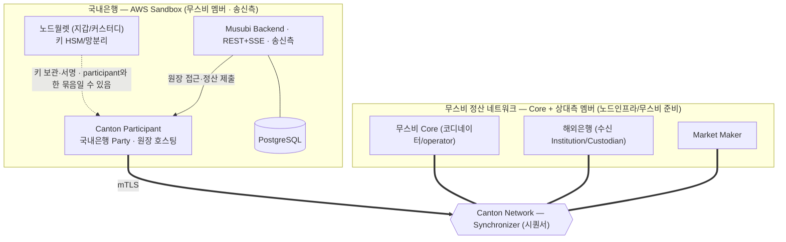
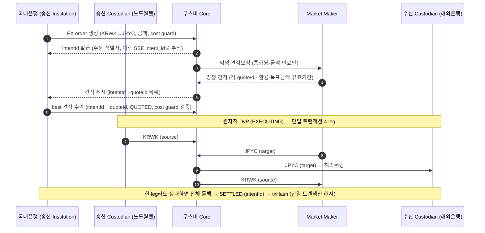
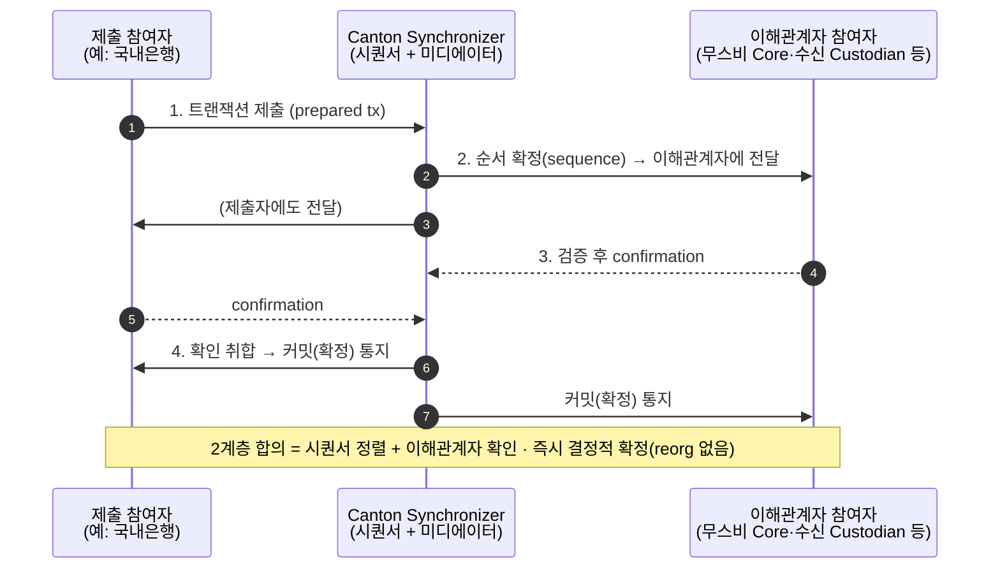

# PoC 아키텍처 메모

> 1차 PoC의 구성요소·데이터 흐름·신뢰 지점. 국내은행은 적격기관으로 무스비에 연결해 정산을 수행·검증한다.
> 환경: **DevNet/TestNet** · 인프라: **AWS Sandbox** · 지갑: **노드월렛**.
> 관련: 무스비 제품 [musubi-overview.md](musubi-overview.md), 지갑 비교 [wallet-comparison.md](wallet-comparison.md), 진행 [aws-sandbox-devnet-setup.md](aws-sandbox-devnet-setup.md), 요청 [nodeinfra-asks.md](nodeinfra-asks.md).

## 0. 큰 그림

무스비/캔톤은 **적격기관 간 정산(DvP)** 을 처리한다 — 통화↔통화 원자적 교환, 거래 상대·금액 프라이버시. 1차 PoC는 이 **기관 간 정산**만 다룬다(고객·Fiat 온오프램프·브릿지 제외).

## 1. DvP (Delivery versus Payment)

정산 = 거래 약속을 실제 자산 이동으로 마무리하는 단계. 문제는 *누가 먼저 보내나* — 국내은행이 KRWK를 먼저 보냈는데 해외은행이 JPYC를 안 보내면 떼인다(**카운터파티/Herstatt 리스크**).

**DvP**: 양 통화를 한 트랜잭션에 동시 교환 → **전부 성공 or 전부 무효**. 한쪽만 가는 일이 구조적으로 불가능. 이게 무스비를 기관 간 정산에 쓰는 핵심 이유이자 1차 PoC의 1순위 검증 항목([verification.md](verification.md)).

## 2. 무스비 구성요소 (역할)

| 구성요소 | 무엇 | 1차 PoC에서 국내은행 |
|---|---|---|
| **무스비 Core** | 정산 코디네이터 — DAML(`FXOrder`), 4-leg 원자 정산 개시·실행 | 무스비/노드인프라 운영 |
| **Institution** | 송금 개시, 견적(RFQ) 비교·선택 | **국내은행 역할(송신측)** |
| **Custodian** | 자산 이동 승인·co-sign, 감사추적 | 국내은행이 Custodian · 지갑은 **노드월렛**(캔톤 네이티브 파티 호스팅·고객 HSM) |
| **Market Maker** | 익명 RFQ에 호가, 유동성 공급. 4-leg 필수 | PoC용 테스트 MM은 무스비/노드인프라 준비 |
| **Gateway** | TradFi 통합(fiat·온오프램프·온보딩) | 1차 PoC 범위 밖 |

> 무스비 정산은 **4-leg / 4 confirming party**(송신 커스터디언·MM·무스비 Core·수신 커스터디언). 상세 [musubi-overview.md](musubi-overview.md) 3절.

## 3. 1차 PoC 아키텍처 (AWS Sandbox + DevNet/TestNet)

> 레이어: **Synchronizer = Canton Network 공용 인프라**. **무스비 = Core(operator) + Gateway**(Gateway=fiat·온오프램프, 1차 범위 밖).
> **무스비 정산 네트워크 = 무스비 Core + 멤버(국내은행·해외은행·Market Maker)가 이 Synchronizer 위에서 정산하는 것.** 위 박스는 국내은행(우리 측)을 제외한 상대측 멤버+Core만 묶은 것이고, 국내은행도 같은 네트워크의 멤버다. 노드월렛이 participant까지 묶어 운영하는지(일체형)는 통합 방식 확인 대상.

- **AWS Sandbox** — 은행 내부망 밖 격리 환경에서 국내은행 스택을 전부 띄운다. 내부 시스템 연동 최소화. 진행 [aws-sandbox-devnet-setup.md](aws-sandbox-devnet-setup.md).
- **노드월렛 = 지갑/커스터디** — 노드인프라 제공 SW. **캔톤 네이티브 파티 호스팅(담당자 확인)** · 고객 HSM 자가 키보유·3-키 멀티시그·컴플라이언스 정책 엔진·망분리 내장(Fireblocks 옴니버스 대안). 공개 문서는 Solana 기준 → 비교·출처 [wallet-comparison.md](wallet-comparison.md).
- **배포 구성(footprint)**: participant + 노드월렛 + Musubi backend + Postgres, 정산 네트워크로 mTLS.
- **프로비저닝**: 노드인프라/무스비가 Party ID·JWT·엔드포인트/TLS·노드월렛 SW·배포물 제공.
- **대부분 노드인프라/무스비 준비**: 무스비 Core·테스트 MM·수신 카운터파티(해외은행)와 Synchronizer 접속을 노드인프라/무스비가 준비. 국내은행은 AWS Sandbox에 송신측 스택을 띄워 연결.

### 프라이버시의 근거 (Canton 메커니즘)

각 참여자 노드는 **자기 파티가 이해관계자인 컨트랙트만 보유**한다 → 무관한 제3자는 거래를 데이터로 갖고 있지도 않다. RFQ도 MM에 **익명**으로 가 송수신자 신원이 노출되지 않는다. (검증 방법은 [verification.md](verification.md) 2절)

## 4. 정산 데이터 흐름 (4-leg)

> 아래는 **논리 흐름**(읽기 쉽게 직접 화살표로 압축)이다. 실제로 참여자는 서로 직접 통신하지 않고 **모든 트랜잭션이 Canton Synchronizer(시퀀서)를 거친다** — 그 메커니즘은 4.1절 참고. (물리 토폴로지는 3절)

상태(`FXOrder`): `PENDING` → `QUOTED` → `EXECUTING` → `SETTLED` (실패: `FAILED`/`EXPIRED`). 검증·합격 기준은 [verification.md](verification.md).

### 4.1 참고 — Canton 트랜잭션이 시퀀서를 거치는 법 (2계층 합의)

위 정산 흐름의 화살표 하나하나는 실제로 아래처럼 **시퀀서를 거쳐** 처리된다. (4-leg 정산도 이 메커니즘으로 도는 **단일 트랜잭션** 1건)

- **순서·전달**은 시퀀서가, **유효성 확인(confirmation)** 은 각 이해관계자 참여자가 한다(2계층 합의) — 단일 주체가 결과를 좌우하지 못함.
- 4절의 직접 화살표는 이 메커니즘을 매번 반복하지 않으려고 압축한 것이다.

## 5. 단계별 진화 (1차 → 최종)

| 축 | 1차 PoC (올해) | 최종 PoC (내년) |
|---|---|---|
| 환경 | DevNet/TestNet, AWS Sandbox | 망분리 + 국내은행 지갑 시스템 연동 |
| 통화 | KRWK ↔ JPYC (테스트 인스트루먼트) | 실제 발행 인스트루먼트 |
| 당사자 | 은행 자기계정 (고객 없음) | 국내은행 유저(고객) 온/오프램프 |
| 지갑/커스터디 | **노드월렛**(내부, 캔톤 네이티브 파티 호스팅) | **Fireblocks**(외부, 국내은행 지갑 시스템) |
| Fiat | 없음 | (가능성) 온/오프램프 |
| MM/유동성 | 무스비 준비(테스트 MM) | MM 구조 확정(비즈니스 협의) |

> 지갑 외부/내부 차이·시퀀스는 [wallet-comparison.md](wallet-comparison.md).

## 6. 신뢰 지점

- **정산 자체**: 원자성·프라이버시가 원장 메커니즘으로 보장. 무스비 Core는 코디네이션·실행만, 4-leg co-sign으로 단일 주체가 자산 일방 이동 불가.
- **네트워크 연결**: mTLS + JWT(무스비 발급). 노드인프라/무스비를 통해 DevNet/TestNet 온보딩(allowlist 등). (이번 PoC는 별도 스폰서 SV 없음)
- **키 보관(1차)**: AWS Sandbox의 노드월렛(고객 HSM 자가 키보유·망분리)이 파티 키 보관·서명. 키 HSM 관리 주체는 확인 대상. 최종 단계에서 Fireblocks 검토.

## 7. 결론

1차 PoC는 무스비 정산 한 건을 DevNet/TestNet에서 적격기관으로 직접 수행해 **무스비/캔톤을 왜 쓰는지(원자 DvP·프라이버시·기능·DAML·캔톤 이해)를 검증**한다. 고객·Fiat·Fireblocks는 최종 PoC로 미룬다.

## 참고 (출처)

- 무스비 정산 모델·4-leg: https://musubinetwork.com/how-it-works
- 왜 캔톤(프라이버시·원자성): https://musubinetwork.com/why-canton
- API 규약(REST+SSE): https://musubinetwork.com/api-conventions
- Canton Network 문서: https://docs.canton.network
