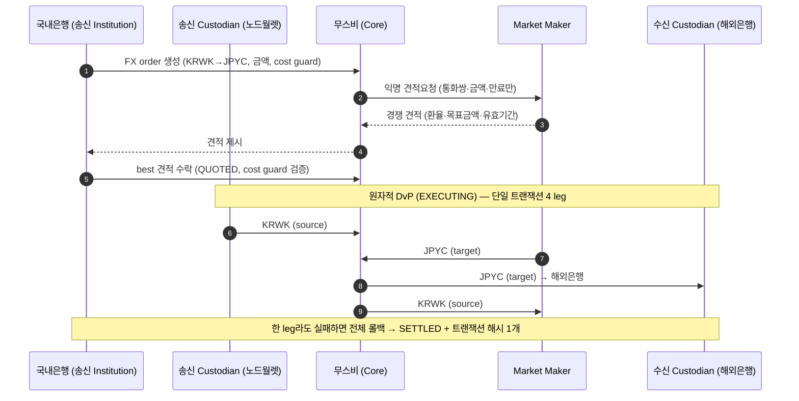

# PoC 아키텍처 메모

> 1차 PoC의 구성요소·데이터 흐름·신뢰 지점. 우리는 적격기관(국내은행)으로 무스비에 연결해 정산을 수행·검증한다.
> 환경: **DevNet/TestNet** · 인프라: **AWS Sandbox**(망분리) · 지갑: **노드월렛**.
> 관련: 무스비 제품 [musubi-overview.md](musubi-overview.md), 지갑 비교 [wallet-comparison.md](wallet-comparison.md), 진행 [aws-sandbox-devnet-setup.md](aws-sandbox-devnet-setup.md), 요청 [nodeinfra-asks.md](nodeinfra-asks.md).

## 0. 큰 그림

무스비/캔톤은 **적격기관 간 정산(DvP)** 을 처리한다 — 통화↔통화 원자적 교환, 거래 상대·금액 프라이버시. 1차 PoC는 이 **기관 간 정산**만 다룬다(고객·Fiat 온오프램프·브릿지 제외).

## 1. DvP (Delivery versus Payment)

정산 = 거래 약속을 실제 자산 이동으로 마무리하는 단계. 문제는 *누가 먼저 보내나* — 국내은행이 KRWK를 먼저 보냈는데 해외은행이 JPYC를 안 보내면 떼인다(**카운터파티/Herstatt 리스크**).

**DvP**: 양 통화를 한 트랜잭션에 동시 교환 → **전부 성공 or 전부 무효**. 한쪽만 가는 일이 구조적으로 불가능. 이게 무스비를 기관 간 정산에 쓰는 핵심 이유이자 1차 PoC의 1순위 검증 항목([verification.md](verification.md)).

## 2. 무스비 구성요소 (역할)

| 구성요소 | 무엇 | 1차 PoC에서 우리(국내은행) |
|---|---|---|
| **Core(무스비)** | 정산 코디네이터 — DAML(`FXOrder`), 4-leg 원자 정산 개시·실행 | 무스비/노드인프라 운영 |
| **Institution** | 송금 개시, 견적(RFQ) 비교·선택 | **우리 역할(송신측)** |
| **Custodian** | 자산 이동 승인·co-sign, 감사추적 | 우리가 Custodian · 지갑은 **노드월렛**(네이티브 파티 호스팅, HSM/망분리) |
| **Market Maker** | 익명 RFQ에 호가, 유동성 공급. 4-leg 필수 | PoC용 테스트 MM은 무스비/노드인프라 준비 |
| **Gateway** | TradFi 통합(fiat·온오프램프·온보딩) | 1차 PoC 범위 밖 |

> 무스비 정산은 **4-leg / 4 confirming party**(송신 커스터디언·MM·Core·수신 커스터디언). 상세 [musubi-overview.md](musubi-overview.md) §3.

## 3. 1차 PoC 아키텍처 (AWS Sandbox + DevNet/TestNet)

```
┌─ AWS Sandbox (우리, 망분리 격리 환경) ──────────────────────────┐
│  Canton Participant Node          (우리 Party ID)              │
│  노드월렛 (네이티브 파티 호스팅 + 키 HSM/망분리)  ← 지갑/커스터디 │
│  Musubi Backend (REST+SSE)        (role: 송신측)               │
│  PostgreSQL                                                    │
└───────────────────────────┬─────────────── mTLS ───────────────┘
                            ▼
        ┌──────────── 무스비 정산 네트워크 (DevNet 또는 TestNet) ────────────┐
        │  Synchronizer(시퀀서) · 스폰서 SV · Core(코디네이터)               │
        │  카운터파티(해외은행) · Market Maker  ← 무스비/노드인프라 준비        │
        └──────────────────────────────────────────────────────────────────┘
```

- **AWS Sandbox = 망분리 때문** — 은행 내부망 밖 격리 환경에서 우리 스택을 전부 띄운다. 내부 시스템 연동 최소화. 진행 [aws-sandbox-devnet-setup.md](aws-sandbox-devnet-setup.md).
- **노드월렛 = 지갑/커스터디** — 노드인프라 제공 SW. 캔톤 노드에 우리 파티를 네이티브로 호스팅 + 키 HSM/망분리. Fireblocks(옴니버스)의 대안 → 비교 [wallet-comparison.md](wallet-comparison.md).
- **footprint**: participant + 노드월렛 + Musubi backend + Postgres, 정산 네트워크로 mTLS.
- **프로비저닝**: 노드인프라/무스비가 Party ID·JWT·엔드포인트/TLS·노드월렛 SW·배포물 제공.
- **대부분 노드인프라/무스비 준비**: 카운터파티·MM·Core·네트워크는 무스비 측. 우리는 AWS Sandbox에 송신측 스택을 띄워 연결.

### 프라이버시의 근거 (Canton 메커니즘)

각 참여자 노드는 **자기 파티가 이해관계자인 컨트랙트만 보유**한다 → 무관한 제3자는 거래를 데이터로 갖고 있지도 않다. RFQ도 MM에 **익명**으로 가 송수신자 신원이 노출되지 않는다. (검증 방법은 [verification.md](verification.md) §2)

## 4. 정산 데이터 흐름 (4-leg)



상태(`FXOrder`): `PENDING` → `QUOTED` → `EXECUTING` → `SETTLED` (실패: `FAILED`/`EXPIRED`). 검증·합격 기준은 [verification.md](verification.md).

## 5. 단계별 진화 (1차 → 최종)

| 축 | 1차 PoC (올해) | 최종 PoC (내년) |
|---|---|---|
| 환경 | DevNet/TestNet, AWS Sandbox(망분리) | 망분리 검토 + 국내은행 지갑 시스템 연동 |
| 통화 | KRWK ↔ JPYC (테스트 인스트루먼트) | 실제 발행 인스트루먼트 |
| 당사자 | 은행 자기계정 (고객 없음) | 국내은행 유저(고객) 온/오프램프 |
| 지갑/커스터디 | **노드월렛**(내부, 네이티브 파티 호스팅) | **Fireblocks**(외부, 국내은행 지갑 시스템) |
| Fiat | 없음 | (가능성) 온/오프램프 |
| MM/유동성 | 무스비 준비(테스트 MM) | MM 구조 확정(비즈니스 협의) |

> 지갑 외부/내부 차이·시퀀스는 [wallet-comparison.md](wallet-comparison.md).

## 6. 신뢰 지점

- **정산 자체**: 원자성·프라이버시가 원장 메커니즘으로 보장. Core(무스비)는 코디네이션·실행만, 4-leg co-sign으로 단일 주체가 자산 일방 이동 불가.
- **네트워크 연결**: mTLS + JWT(무스비 발급). 스폰서 SV·allowlist로 DevNet/TestNet 온보딩.
- **키 보관(1차)**: AWS Sandbox의 노드월렛(네이티브 파티 호스팅, HSM/망분리)이 파티 키 보관·서명. 키 HSM 관리 주체는 확인 대상. 최종 단계에서 Fireblocks 검토.

## 7. 결론

1차 PoC는 무스비 정산 한 건을 DevNet/TestNet에서 적격기관으로 직접 수행해 **무스비/캔톤을 왜 쓰는지(원자 DvP·프라이버시·기능·DAML·캔톤 이해)를 검증**한다. 고객·Fiat·Fireblocks는 최종 PoC로 미룬다.
</content>
