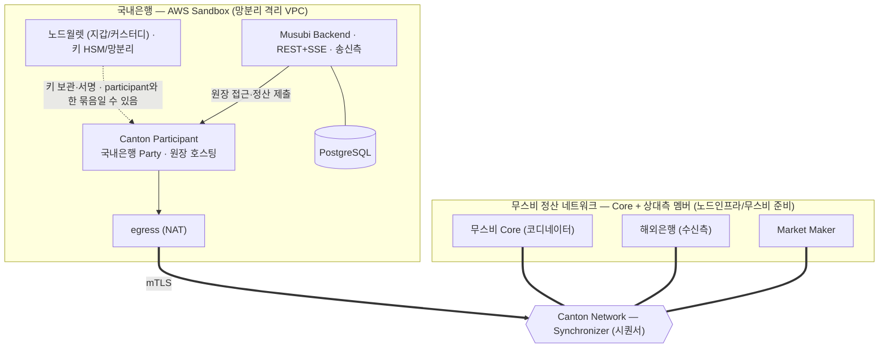
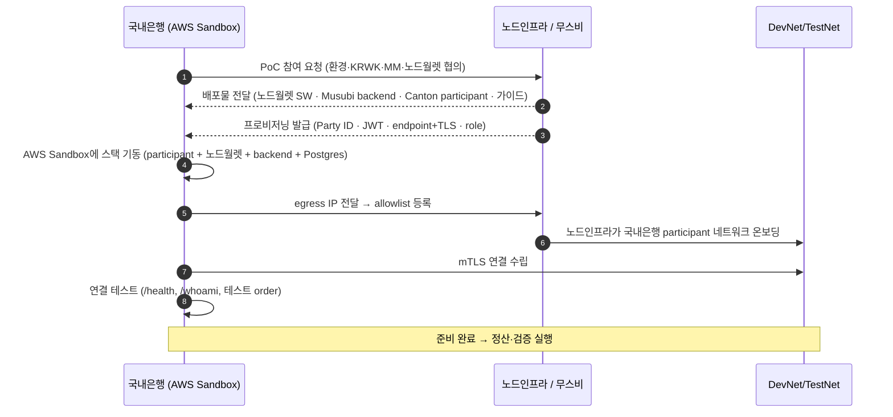

# 진행 방식 — AWS Sandbox + DevNet/TestNet

> 1차 PoC를 **AWS Sandbox** 에서 **DevNet 또는 TestNet** 으로 진행한다. 국내은행은 적격기관(송신 Institution + Custodian).
> **AWS Sandbox는 망분리 때문에 쓴다**(은행 내부망 밖 격리) — 여기에 국내은행 스택을 띄운다. 지갑은 **노드월렛**(고객 HSM 자가 키보유).
> 받아야 할 것은 [nodeinfra-asks.md](nodeinfra-asks.md), 무스비 제품은 [musubi-overview.md](musubi-overview.md).

## 1. AWS Sandbox를 쓰는 이유

- 은행 내부망 안에서 외부 네트워크(DevNet/TestNet) 연결·노드 운영은 망분리 제약이 크다 → **내부망과 분리된 AWS 격리 환경(Sandbox)** 에서 진행.
- 국내은행 내부 시스템 연동 최소화(1차 방침). **국내은행 스택은 전부 AWS Sandbox에**.

## 2. 환경 사다리

```
DevNet / TestNet (이번 PoC)  →  MainNet (추후)
```

| | DevNet | TestNet |
|---|---|---|
| 성격 | 개발용, 잦은 리셋 가능 | 더 안정적, 운영 환경에 근접 |
| 용도 | 연동·기능 검증 | 시연·이해관계자 데모 |

> 선택은 노드인프라와 확정([nodeinfra-asks.md](nodeinfra-asks.md) A). 온보딩(IP allowlist 등)은 노드인프라/무스비가 준비. (이번 PoC는 별도 스폰서 SV 없음)

## 3. 구성 (AWS Sandbox에 국내은행 스택)



> Synchronizer는 **Canton Network 공용 인프라**, 무스비 Core·해외은행·Market Maker는 같은 Synchronizer에 붙는 **멤버**(각자 인프라).

- **노드월렛** = 노드인프라 제공 지갑 SW. **캔톤 네이티브 파티 호스팅(담당자 확인)** · 고객 HSM 자가 키보유·3-키 멀티시그·컴플라이언스 정책 엔진·망분리 내장(Fireblocks 옴니버스 대안). 공개 문서는 Solana 기준. (비교·출처: [wallet-comparison.md](wallet-comparison.md))
- **배포 구성(footprint)**: participant + 노드월렛 + Musubi backend + Postgres. egress(NAT)로 정산 네트워크에 mTLS.
- **노드인프라/무스비 준비**: 수신 카운터파티·MM·무스비 Core·Synchronizer 접속 + 노드월렛 SW·Musubi backend·participant 배포물·프로비저닝.
- 컴퓨트는 EC2 또는 EKS(배포 자료 형식에 맞춤 — [nodeinfra-asks.md](nodeinfra-asks.md) F). 은행 내부 시스템 연동 없음; 결과는 Console/Statements로 확인.
- **mTLS**(mutual TLS)는 양측이 인증서로 서로를 인증하는 TLS다(일반 TLS는 서버만 인증). 무스비가 발급한 TLS 인증서로 국내은행 participant와 정산 네트워크가 상호 인증해, 허가된 노드만 연결된다.

## 4. 온보딩 순서



## 5. 단계 체크리스트

1. **협의·확정** — 환경(DevNet/TestNet)·노드월렛·KRWK 발행·MM·카운터파티([nodeinfra-asks.md](nodeinfra-asks.md) A·D·E).
2. **배포물·프로비저닝 수령** — 노드월렛 SW·Musubi backend·participant 이미지·가이드(C·F), Party ID·JWT·endpoint+TLS·role(B).
3. **AWS Sandbox 기동** — 격리 VPC/egress, participant + 노드월렛 + backend + Postgres, role·Party ID·Postgres·mTLS 구성. **정산 DAR(`FXOrder`) 업로드·벳팅 확인**(누가 하는지 [nodeinfra-asks.md](nodeinfra-asks.md) C).
4. **온보딩** — egress IP allowlist 등록 → 노드인프라가 네트워크 온보딩 → mTLS 연결.
5. **연결 테스트** — `/health`, `/whoami`, 테스트 order 생성.
6. **검증 실행** — [verification.md](verification.md)의 항목별 검증(원자성·프라이버시·기능·DAML·캔톤).
7. **정리** — 합격 기준 확인, 대시보드(`/api/v1/dashboard/stats`) 모니터링.

## 6. Day-2 / 모니터링

- `GET /api/v1/dashboard/stats` — 상태별 order·정산량. PENDING 적체·실패 order 주시.
- 정합성: Statements(정산 확인서·FX 실행 보고) 다운로드.
- 운영 연락처·에스컬레이션 채널 확보([nodeinfra-asks.md](nodeinfra-asks.md) G).

## 7. 범위 / 미결

- **범위 밖(1차)**: 은행 내부 시스템 연동, Fireblocks, 고객·Fiat 온오프램프.
- **미결(노드인프라 확정 필요)**: 환경 선택, 노드월렛 배포·키 HSM 관리 주체, 배포 지원 범위, KRWK 발행, MM·수신 카운터파티, allowlist 방법 — 전부 [nodeinfra-asks.md](nodeinfra-asks.md).

## 참고 (출처)

- 배포 구성: https://musubinetwork.com/custodian/integration/deploy
- 온보딩: https://musubinetwork.com/institution/integration/onboard
- 통합 개요: https://musubinetwork.com/institution/integration/overview
- API 인증(`/auth/token`·`/whoami`): https://musubinetwork.com/authentication
- API 규약(`/api/v1`·`dashboard/stats`): https://musubinetwork.com/api-conventions
- Canton Network 환경·네트워크: https://docs.canton.network
