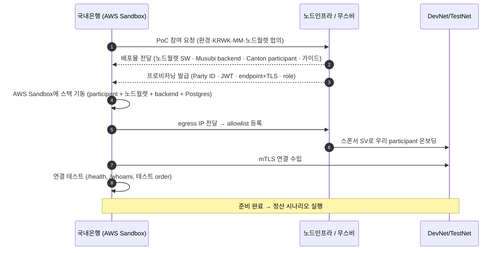

# 진행 방식 — AWS Sandbox + DevNet/TestNet

> 단기 PoC를 **AWS Sandbox** 에서 **DevNet 또는 TestNet** 으로 진행한다. 우리는 **적격기관(송신 Institution + Custodian)**.
> **AWS Sandbox는 망분리 때문에 쓴다**(은행 내부망 밖 격리 환경) — 여기에 우리 스택을 띄운다.
> 지갑/커스터디는 **노드월렛**(캔톤 노드에 파티를 네이티브로 호스팅, 키 HSM/망분리). 노드인프라에 받아야 할 것은 [nodeinfra-asks.md](nodeinfra-asks.md), 무스비 제품/SDK는 [musubi-overview.md](musubi-overview.md).

## 1. AWS Sandbox를 쓰는 이유 = 망분리

- 은행 내부망 안에서 외부 네트워크(DevNet/TestNet) 연결·노드 운영은 망분리 제약이 크다 → **내부망과 분리된 AWS 격리 환경(Sandbox)** 에서 진행.
- 국내은행 내부 시스템 연동 최소화(단기 방침). **우리 스택은 전부 AWS Sandbox에** 둔다.
- LocalNet 검증은 완료 → 이제 DevNet/TestNet.

## 2. 환경 사다리

```
LocalNet (완료)  →  DevNet / TestNet (이번 PoC)  →  MainNet (추후)
```

| | DevNet | TestNet |
|---|---|---|
| 성격 | 개발용, 잦은 리셋 가능 | 더 안정적, 운영 환경에 근접 |
| 용도 | 연동·기능 검증 | 시연·이해관계자 데모 |

> 선택은 노드인프라와 확정([nodeinfra-asks.md](nodeinfra-asks.md) A). 둘 다 **스폰서 SV + IP allowlist** 온보딩이 필요하고, 무스비/노드인프라가 스폰서·연결을 준비한다.

## 3. 구성 (AWS Sandbox에 우리 스택)

```
┌─ AWS Sandbox (우리, 망분리 격리 VPC) ──────────────────────────┐
│  Canton Participant Node          (우리 Party ID)              │
│  노드월렛 (네이티브 파티 호스팅 + 키 HSM/망분리)  ← 지갑/커스터디 │
│  Musubi Backend (REST+SSE)        (role: 송신측)               │
│  PostgreSQL                       (백엔드 상태)                 │
│  egress(NAT) ── mTLS ──▶ DevNet/TestNet                        │
└────────────────────────────────────────────────────────────────┘
        DevNet/TestNet (노드인프라/무스비 준비):
        Synchronizer(시퀀서) · 스폰서 SV · Core(코디네이터) · MM · 수신 카운터파티
```

- **노드월렛** = 노드인프라가 제공하는 지갑 SW. **캔톤 노드에 우리 파티를 네이티브로 호스팅** + 키를 HSM/망분리로 보관. Fireblocks(옴니버스)의 대안 — 최종 PoC에서 Fireblocks가 들어갈 지갑 자리를 **단기엔 노드월렛**이 채운다.
- **footprint**: participant + 노드월렛 + Musubi backend + Postgres. egress(NAT)로 정산 네트워크(Synchronizer·SV·무스비 endpoint)에 mTLS 아웃바운드.
- **노드인프라/무스비 준비**: 카운터파티·MM·Core·네트워크 + 노드월렛 SW·Musubi backend·participant 배포물·프로비저닝.
- 컴퓨트는 EC2 또는 EKS(노드인프라 배포 자료 형식에 맞춤 — [nodeinfra-asks.md](nodeinfra-asks.md) F). 은행 내부 시스템 연동 없음; 결과는 Console/Statements로 확인.

## 4. 온보딩 순서



## 5. 단계 체크리스트

1. **협의·확정** — 환경(DevNet/TestNet)·노드월렛·KRWK 발행·MM·카운터파티([nodeinfra-asks.md](nodeinfra-asks.md) A·D·E).
2. **배포물·프로비저닝 수령** — 노드월렛 SW·Musubi backend·participant 이미지·가이드(C·F), Party ID·JWT·endpoint+TLS·role(B).
3. **AWS Sandbox 기동** — 격리 VPC/egress, participant + 노드월렛 + backend + Postgres, role·Party ID·Postgres·mTLS 구성.
4. **온보딩** — egress IP allowlist 등록 → 스폰서 SV로 네트워크 온보딩 → mTLS 연결.
5. **연결 테스트** — `/health`, `/whoami`, 테스트 order 생성.
6. **시나리오 실행** — KRWK↔JPYC 정산([short-term-scenario.md](short-term-scenario.md)).
7. **검증·정리** — 합격 기준 확인, 대시보드(`/api/v1/dashboard/stats`) 모니터링.

## 6. Day-2 / 모니터링

- `GET /api/v1/dashboard/stats` — 상태별 order·정산량. PENDING 적체(견적/지연)·실패 order 주시.
- 정합성: Statements(정산 확인서·FX 실행 보고) 다운로드.
- 운영 연락처·에스컬레이션 채널 확보([nodeinfra-asks.md](nodeinfra-asks.md) G).

## 7. 범위 / 미결

- **범위 밖(단기)**: 은행 내부 시스템 연동, Fireblocks, 고객·Fiat 온오프램프.
- **미결(노드인프라 확정 필요)**: 환경 선택, 노드월렛 배포·키 HSM 관리 주체, 배포 지원 범위, KRWK 발행, MM·수신 카운터파티, allowlist 방법 — 전부 [nodeinfra-asks.md](nodeinfra-asks.md).
</content>
