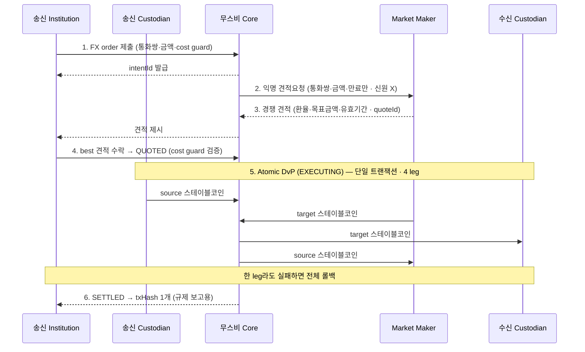

# 무스비 네트워크 — 제품/SDK 개요

> 단기 PoC에서 국내은행이 연결해 쓰는 무스비 측 소프트웨어.

## 1. 이 PoC에서 무스비는 무엇이고, 왜 쓰나

**무스비 = 국내은행이 KRWK↔JPYSC 정산을 수행할 Canton 기반 정산 네트워크/소프트웨어.** 국내은행은 무스비를 직접 만들지 않는다. **보내는 쪽(송신 기관)으로 무스비에 연결**해, 송금 한 건을 주문 생성부터 정산 완료까지 실행해 본다.

**왜 쓰나** (이 PoC가 검증하려는 가치):

- **원자적 DvP** — KRWK·JPYSC를 한 트랜잭션에 교환, 카운터파티(Herstatt) 리스크 0.
- **프라이버시** — 거래 상대·금액이 무관한 제3자에 안 보이고, MM에도 신원이 익명.
- **이미 만들어진 정산 레일** — 특정 회사가 아니라 참여 기관들이 공동 소유하고, 자금을 쥔 중앙 운영자 없이(무스비 Core는 자산을 일방적으로 못 움직임) Canton 위에서 도는 정산 네트워크. 연결만 하면 됨(대부분 노드인프라/무스비 준비). 현재 Canton 테스트넷에서 기관 멤버들과 검증 중.
- **기존 환거래은행 방식 대비** — 지금의 해외송금은 중개은행을 2~4곳 거쳐 1~3영업일이 걸리고, 적용 환율이 불투명하며, 거래 기록도 은행마다 흩어져 대사(맞춰보기)가 어렵다. 무스비는 같은 송금을 약 15초 만에 한 번에 끝내고, 그 거래 하나가 트랜잭션 해시 1개로 증명된다.

## 2. 역할(참여자)

| 역할 | 하는 일 |
|---|---|
| **Institution** | 송금 개시, best execution 선택(견적 비교) |
| **Custodian** | 자산 이동 승인, 거래 **co-sign**, 감사추적 유지 |
| **Market Maker** | 익명 RFQ 수신, 가격 경쟁, 원자 정산. **송수신자 신원을 못 봄** |
| **무스비 Core** | 정산 코디네이터(중간자) — 정산 개시·실행 |

## 3. 정산 흐름 — 4 leg / 4 confirming party

무스비 정산은 **4-leg**다 — MM이 중간에서 양 통화를 매개하기 때문이다.



**4 leg 풀어보기** — MM이 원화↔엔화를 매개하기 때문에 4 leg가 된다(source=KRWK, target=JPYSC).

| leg | 이동 | 자산 | 무슨 뜻인가 |
|---|---|---|---|
| **leg1** | 송신 Custodian → 무스비 Core | KRWK (source) | 국내은행이 보낼 원화 스테이블코인을 무스비에 잠근다 |
| **leg2** | Market Maker → 무스비 Core | JPYSC (target) | MM이 내줄 엔화 스테이블코인을 무스비에 잠근다 |
| **leg3** | 무스비 Core → 수신 Custodian | JPYSC (target) | 수취인(해외은행)이 받을 엔화가 전달된다 |
| **leg4** | 무스비 Core → Market Maker | KRWK (source) | MM이 원화를 가져간다(유동성 공급의 대가) |

4 leg는 **한 트랜잭션에서 동시에** 일어난다 — 하나라도 실패하면 전부 무효(원자성). 결과적으로 국내은행의 KRWK가 MM을 거쳐, 해외은행에는 JPYSC로·MM에는 KRWK로 정확히 맞교환된다.

- **cost guard** — 송신자(국내은행)가 거는 보호 장치다. 받아들일 최악 환율(또는 최소 수취액·최대 지급액) 한도를 정해두면, 무스비가 수락 견적을 이 한도와 대조해 벗어나는 견적은 정산하지 않고 거부한다(나쁜 환율 체결 방지). FX의 슬리피지 허용치·지정가에 해당.
- **4 confirming party**: sender custodian · market maker · Musubi · receiver custodian.
- **타임라인 ~15초**: 생성→첫 견적 ~8s, 수락 ~3s, 원자 정산 ~4s. 출처: https://musubinetwork.com/how-it-works

**핵심 템플릿 `FXOrder`** — 주문 1건의 상태를 담아 원장에 올라가는 컨트랙트. 주요 필드:

| 필드 | 설명 |
|---|---|
| `operator` | 정산 코디네이터(무스비 Core) |
| `intentId` | 주문 1건의 고유 식별자 — 추적·SSE 필터(`intent_id`)·중복 방지(멱등성) 키 |
| `status` | 주문 상태(아래 상태 흐름) |
| `sender` / `receiver` | 송신·수신 당사자 |
| `sourceAsset` / `targetAsset` | 보내는/받는 자산·금액 (KRWK / JPYSC) |
| `quoteInfo` | 견적 정보 — 수락된 견적 식별자 `quoteId` 포함 |
| `marketMakerInfo` | 체결된 MM 정보(견적 수락 후 채워짐) |
| `settlementInfo` | 정산 결과 — `transactionHash` 포함 |

> 그 외 `createdAt`·`expiresAt`·`failureReason`·`failedAt`·`memo` 등. 전체 필드·정의는 무스비 FXOrder 문서 참고: https://musubinetwork.com/technical/fxorder

- **`settlementInfo.transactionHash`** (SETTLED 때 채워짐) — 정산이 끝나면 남는 Canton 트랜잭션 해시 하나. 4 leg가 모두 한 트랜잭션으로 처리되므로 **이 해시 1개가 그 정산 전체의 증빙**이 된다.
- **상태 흐름**: `PENDING` → `QUOTED` → `EXECUTING` → `SETTLED` (실패: `FAILED` / `EXPIRED`)

**서명자 / 관찰자** — 프라이버시 경계가 여기서 정해진다.

| 구분 | 파티 |
|---|---|
| 서명자(signatory) | `operator` + 송신 Custodian |
| 관찰자(observer) | sender · receiver · 수신 Custodian · MM(견적 수락 후) |

> 위 서명자는 `FXOrder` **조율 레코드**의 서명자(operator + 송신 Custodian)다. 실제 자산이 오가는 **정산 실행(4-leg)** 은 별도로 **4 confirming party**(송신 Custodian·MM·무스비·수신 Custodian)가 각자 자기 leg를 승인한다 — 조율 레코드의 서명자와 정산의 confirming party는 서로 다른 층이다.

## 4. 지원 자산/송금 경로

- **송금 경로**: 일본 ↔ 한국.
- **스테이블코인**: `JPYSC` / `KRWK`.

## 5. 소유/거버넌스 구조

무스비 네트워크를 **누가 소유·운영하고, 멤버십과 권한을 어떻게 통제하는가**.

| 소유 주체 | 담당 |
|---|---|
| **무스비 Core** | 정산 프로토콜 — DAML 컨트랙트, 트랜잭션 코디네이션, SDK |

**멤버십·권한·규칙은 온체인 레지스트리 3단계로 관리된다** — 특정 회사 서버가 아니라 원장에 기록된다.

| 단계 | 무슨 뜻인가 |
|---|---|
| **Membership** | 누가 이 네트워크의 멤버인가 — 가입 기관 명부 |
| **Mandate** | 각 멤버가 무엇을 할 수 있는가 — 역할·권한(institution·custodian·market-maker 등) |
| **Rulebook** | 멤버들이 합의한 규칙 — 정산·거버넌스 규칙 |

즉 멤버·권한·규칙이 온체인에 남고, **validator node가 그 온체인 멤버십의 기준점(권위)** 이 된다.

## 6. 연동/배포 (SDK·API)

### 참여자가 배포하는 것 (배포 구성: "두 프로세스 + Postgres 하나 + TLS")

1. **Canton Participant Node** — 정산 네트워크 상의 Party ID 신원
2. **Musubi Backend** — REST + SSE API, 자기 인프라에서 구동
3. **PostgreSQL** — 백엔드 상태 저장(단일 인스턴스)
4. **mTLS** — 정산 네트워크 엔드포인트로 연결(네트워크 연결용 TLS; REST API 인증은 아래 JWT)
5. **Custody Platform(지갑)** — holding을 승인. 1차 PoC에선 **노드월렛**([wallet-comparison.md](wallet-comparison.md))

> 단기 PoC에선 위 스택을 **AWS Sandbox**에 띄운다 → [architecture.md](architecture.md) 3절 · [aws-sandbox-devnet-setup.md](aws-sandbox-devnet-setup.md).

### 무스비가 발급(provision)하는 것

> 출처: https://musubinetwork.com/institution/integration/onboard

- **Canton Party ID** · **JWT signing credentials** · **정산 네트워크 endpoint + TLS 인증서**.

### 인증 (문서 명시)

> API 출처: https://musubinetwork.com/authentication

- **인증 방식 = JWT Bearer 토큰** — 모든 API 요청 헤더에 `Authorization: Bearer {token}`을 붙여 "누가 호출하는지"를 증명한다. 토큰을 받는 곳은 단계에 따라 다르다.
  - 개발 단계: 무스비 백엔드의 `POST /auth/token`으로 직접 발급받는다.
  - 프로덕션: 회사 표준 로그인(외부 IdP — Keycloak·Auth0 등 SSO)으로 발급받는다.
- **내가 누구로 붙었는지 확인** — `GET /api/v1/whoami`를 호출하면 접속한 신원 정보를 돌려준다: `party_id`(내 Canton 파티), `operator_party_id`(무스비 Core 파티), `participant_id`(내 participant 노드), `schema_version`(API 스키마 버전).
- **토큰 안에 담기는 정보(JWT claim)** — 토큰 자체에 다음이 들어 있다.
  - `sub` + `canton_party_id` — 누구인지(신원).
  - `role` — 권한 종류. `institution` / `custodian` / `market-maker` 중 하나.
  - `exp` — 만료 시각(기본 1시간). 지나면 토큰을 다시 발급받아야 한다.
- **토큰 없이 호출되는 예외** — `/health`(상태 점검)와 `/auth/token`(토큰 발급 자체)은 인증이 필요 없다.

### API 규약 (문서 명시)

> API 출처: https://musubinetwork.com/api-conventions

- base `/api/v1`. 모든 응답을 **공통 형식으로 감싼다** — `data`(실제 내용)·`meta`(부가정보)·`pagination`(목록 페이지). 금액은 문자열, 시간 ISO8601 UTC.
- 에러는 `error` 객체(`code`·`message`·`details`)로 반환: `VALIDATION_ERROR`·`UNAUTHORIZED`·`NOT_FOUND`·`CONFLICT`·`CANTON_ERROR`·`INTERNAL_ERROR`.
- **SSE**(Server-Sent Events, 서버가 상태 변화를 실시간 push): 참여자별 SSE 엔드포인트, `EventSource`로 연결(`intent_id` 필터, 30s heartbeat). Webhook 규약은 문서에 없음.
  - SSE는 국내은행이 **밖으로 연결(outbound)** → AWS Sandbox에 유리. Webhook은 무스비가 **국내은행 엔드포인트로 들어와야(inbound)** 해 망분리엔 번거로움 → 최종(TMS/ERP 연동) 단계에서 검토.

성공 응답 예:

```json
{
  "data": {
    "intentId": "fxo_01H...",
    "status": "QUOTED",
    "sourceAsset": { "currency": "KRWK", "amount": "100000.00" },
    "targetAsset": { "currency": "JPYSC", "amount": "11000.00" }
  },
  "meta": {},
  "pagination": null
}
```

에러 응답 예:

```json
{
  "error": {
    "code": "VALIDATION_ERROR",
    "message": "cost guard exceeded",
    "details": []
  }
}
```

### 자료 / 콘솔

- **Console**(주문 생성·견적 비교·정산 모니터) / **Statements**(정산 확인서·FX 실행 보고·정합성 데이터). 출처: Console https://musubinetwork.com/institution/integration/console · Statements https://musubinetwork.com/institution/integration/statements
- **Audit Exports**(Custodian) — 체결된 FXOrder 레코드(서명된 FXOrder + 정산 leg + 4-leg `txHash`)를 **CSV(일/주 대사)·JSON(월 아카이브)** 로 내보내기. 회계 대사·컴플라이언스 아카이브용(날짜·상태·기관·통화쌍 필터). 배치 엔드포인트는 **예정**(현재는 per-intent 조회로 대체). 출처: https://musubinetwork.com/custodian/integration/audit-exports
- **OpenAPI 스펙 5종**(인덱스 언급): core-api, custodian-api, market-maker-api, institution-api, openapi — 파일 위치는 노드인프라 확인([nodeinfra-asks.md](nodeinfra-asks.md) C).
- 역할별 API 레퍼런스: https://musubinetwork.com/institution/api-reference · https://musubinetwork.com/custodian/api-reference · https://musubinetwork.com/market-maker/api-reference

## 7. PoC 역할 → 무스비 역할 매핑

| PoC 역할 | 무스비 역할 | 비고 |
|---|---|---|
| 국내은행(VASP, KRWK 보유) | **Institution** + **Custodian** | 송금 개시 + co-sign. 지갑=노드월렛 |
| 해외은행(일본은행 그룹) | **Institution/Custodian**(수신측) | 카운터파티 |
| (유동성 공급) | **Market Maker** | 4-leg 필수 참여자 |
| 무스비 | **무스비 Core**(코디네이터) | 정산 개시·실행 |

## 참고 (출처)

- 소개·지원 자산·거버넌스: https://musubinetwork.com/introduction
- 정산 흐름·타임라인: https://musubinetwork.com/how-it-works
- FXOrder: https://musubinetwork.com/technical/fxorder
- 인증: https://musubinetwork.com/authentication
- API 규약: https://musubinetwork.com/api-conventions
- 역할별 API 레퍼런스: https://musubinetwork.com/institution/api-reference · https://musubinetwork.com/custodian/api-reference · https://musubinetwork.com/market-maker/api-reference
- 배포 구성: https://musubinetwork.com/custodian/integration/deploy
- 온보딩·프로비저닝: https://musubinetwork.com/institution/integration/onboard
- Console·Statements: https://musubinetwork.com/institution/integration/console · https://musubinetwork.com/institution/integration/statements
- 왜 캔톤: https://musubinetwork.com/why-canton
