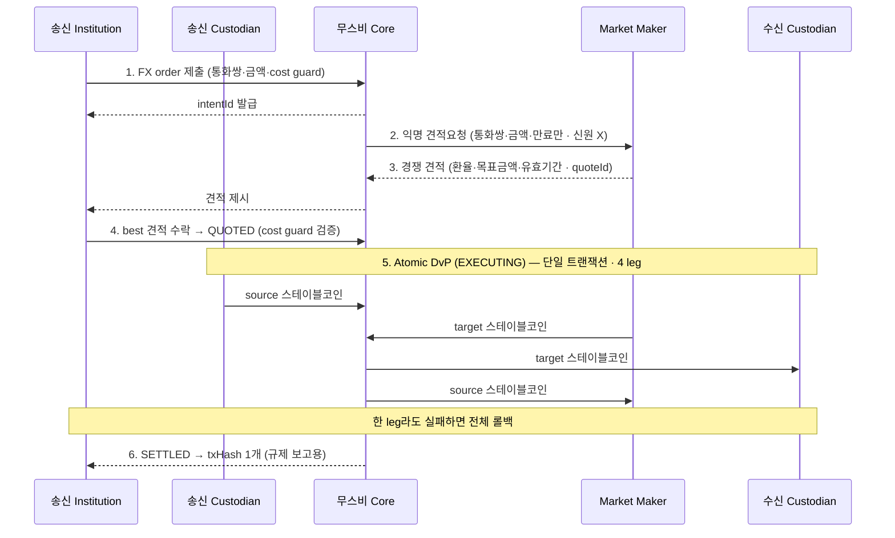

# 무스비 네트워크 — 제품/SDK 개요

> 단기 PoC에서 국내은행이 연결해 쓰는 무스비 측 소프트웨어. 여기 적힌 "주장"(원자성·프라이버시·4-leg 등)을 [verification.md](verification.md)에서 검증한다.

## 1. 이 PoC에서 무스비는 무엇이고, 왜 쓰나

**무스비 = 국내은행이 KRWK↔JPYC 정산을 수행할 Canton 기반 정산 네트워크/소프트웨어.** 국내은행은 직접 구축하지 않고, 송신측으로 **연결**해 정산 한 건을 끝까지 돌린다.

**왜 쓰나** (이 PoC가 검증하려는 가치):

- **원자적 DvP** — KRWK·JPYC를 한 트랜잭션에 교환, 카운터파티(Herstatt) 리스크 0.
- **프라이버시** — 거래 상대·금액이 무관한 제3자에 안 보이고, MM에도 신원이 익명.
- **이미 만들어진 정산 레일** — 특정 회사가 아니라 참여 기관들이 공동 소유하고, 자금을 쥔 중앙 운영자 없이(무스비 Core는 자산을 일방적으로 못 움직임) Canton 위에서 도는 정산 네트워크. 연결만 하면 됨(대부분 노드인프라/무스비 준비). 현재 Canton 테스트넷에서 기관 멤버들과 검증 중.
- **기존 환거래은행 방식 대비** — 기존엔 1~3영업일이 걸리고 중개은행을 2~4곳 거치며 FX가 불투명하고 감사추적도 흩어졌다. 이를 약 15초 원자 정산과 단일 해시 증빙으로 대체한다.

## 2. 역할(참여자)

| 역할 | 하는 일 |
|---|---|
| **Institution** | 송금 개시, best execution 선택(견적 비교) |
| **Custodian** | 자산 이동 승인, 거래 **co-sign**, 감사추적 유지 |
| **Market Maker** | 익명 RFQ 수신, 가격 경쟁, 원자 정산. **송수신자 신원을 못 봄** |
| **무스비 Core** | 정산 코디네이터(중간자) — 정산 개시·실행 |

## 3. 정산 흐름 — 4 leg / 4 confirming party

무스비 정산은 **4-leg**다 — MM이 중간에서 양 통화를 매개하기 때문이다.



- **cost guard** — 송신자(국내은행)가 거는 보호 장치다. 받아들일 최악 환율(또는 최소 수취액·최대 지급액) 한도를 정해두면, 무스비가 수락 견적을 이 한도와 대조해 벗어나는 견적은 정산하지 않고 거부한다(나쁜 환율 체결 방지). FX의 슬리피지 허용치·지정가에 해당.
- **4 confirming party**: sender custodian · market maker · Musubi · receiver custodian.
- **타임라인 ~15초**: 생성→첫 견적 ~8s, 수락 ~3s, 원자 정산 ~4s.
- **핵심 템플릿 `FXOrder`** (on-ledger 코디네이션 레코드):
  - 필드: `operator` · `intentId` · `status` · `sender`/`receiver` · `sourceAsset`/`targetAsset` · `quoteInfo` · `marketMakerInfo` · `settlementInfo`
  - `intentId` = 주문(송금 의도) 1건의 고유 식별자 — 라이프사이클 추적·SSE 필터(`intent_id`)·멱등성 키.
  - `quoteId`(명칭은 OpenAPI 확인) = 견적 식별자 — 여러 MM 견적 중 수락 대상 지정. 정산 완료 시 `txHash`(4 leg를 덮는 단일 트랜잭션 해시 = 정산 증빙).
  - 상태: `PENDING` → `QUOTED` → `EXECUTING` → `SETTLED` (실패: `FAILED` / `EXPIRED`)
  - 서명자: operator + 송신 Custodian · 관찰자: sender, receiver, 수신 Custodian, MM(견적 수락 후) — 프라이버시 경계가 여기서 정해짐

> 함의: **MM은 정산 경로의 필수 confirming party**다(항상 MM 경유).

## 4. 지원 자산/송금 경로

- **송금 경로**: 일본 ↔ 한국.
- **스테이블코인**: `JPYSC0`(일본, 라이브) / `KRWK`(한국, PoC용 신규).

> KRWK는 **국내은행이 들여올 새 자산**이다. 라이브 자산은 JPYSC0이며, KRWK 인스트루먼트 편입은 협의 대상([nodeinfra-asks.md](nodeinfra-asks.md) D).

## 5. 소유/거버넌스 구조

| 소유 주체 | 담당 |
|---|---|
| **무스비 Core** | 정산 프로토콜 — DAML 컨트랙트, 트랜잭션 코디네이션, SDK |

**Membership(온체인 3-tier registry)**: 누가 멤버인가(**Membership**) · 멤버가 할 수 있는 것(**Mandate**) · 합의 규칙(**Rulebook**). validator node가 온체인 멤버십 권위.

## 6. 연동/배포 (SDK·API)

### 참여자가 배포하는 것 (배포 구성: "두 프로세스 + Postgres 하나 + TLS")

1. **Canton Participant Node** — 정산 네트워크 상의 Party ID 신원
2. **Musubi Backend** — REST + SSE API, 자기 인프라에서 구동
3. **PostgreSQL** — 백엔드 상태 저장(단일 인스턴스)
4. **mTLS** — 정산 네트워크 엔드포인트로 연결(네트워크 연결용 TLS; REST API 인증은 아래 JWT)
5. **Custody Platform(지갑)** — holding을 승인. 1차 PoC에선 **노드월렛**([wallet-comparison.md](wallet-comparison.md))

> 단기 PoC에선 위 스택을 **AWS Sandbox**에 띄운다 → [architecture.md](architecture.md) 3절 · [aws-sandbox-devnet-setup.md](aws-sandbox-devnet-setup.md).

### 무스비가 발급(provision)하는 것

- **Canton Party ID** · **JWT signing credentials** · **정산 네트워크 endpoint + TLS 인증서**.

### 인증 (문서 명시)

> API 출처: https://musubinetwork.com/authentication

- **JWT bearer** — `Authorization: Bearer {token}`. 토큰은 백엔드 `POST /auth/token`(개발) / 프로덕션은 외부 IdP(Keycloak·Auth0 등 SSO).
- `GET /api/v1/whoami` 로 `party_id`·`operator_party_id`·`participant_id`·`schema_version` 확인.
- JWT claim: `sub`+`canton_party_id`(신원), `role`(`institution`/`custodian`/`market-maker`), `exp`(기본 1h). `/health`·`/auth/token`은 인증 예외.

### API 규약 (문서 명시)

> API 출처: https://musubinetwork.com/api-conventions

- base `/api/v1`. 모든 응답을 **공통 형식으로 감싼다** — `data`(실제 내용)·`meta`(부가정보)·`pagination`(목록 페이지). 금액은 문자열, 시간 ISO8601 UTC.
- 에러는 `error` 객체(`code`·`message`·`details`)로 반환: `VALIDATION_ERROR`·`UNAUTHORIZED`·`NOT_FOUND`·`CONFLICT`·`CANTON_ERROR`·`INTERNAL_ERROR`.
- **SSE**(Server-Sent Events, 서버가 상태 변화를 실시간 push): 참여자별 SSE 엔드포인트, `EventSource`로 연결(`intent_id` 필터, 30s heartbeat). Webhook 규약은 문서에 없음.
  - SSE는 국내은행이 **밖으로 연결(outbound)** → AWS Sandbox에 유리. Webhook은 무스비가 **국내은행 엔드포인트로 들어와야(inbound)** 해 망분리엔 번거로움 → 최종(TMS/ERP 연동) 단계에서 검토.

성공 응답 예:

```json
{
  "data": {
    "intentId": "fxo_01H...",
    "status": "QUOTED",
    "sourceAsset": { "currency": "KRWK", "amount": "100000.00" },
    "targetAsset": { "currency": "JPYC", "amount": "11000.00" }
  },
  "meta": {},
  "pagination": null
}
```

에러 응답 예:

```json
{
  "error": {
    "code": "VALIDATION_ERROR",
    "message": "cost guard exceeded",
    "details": []
  }
}
```

### 자료 / 콘솔

- **Console**(주문 생성·견적 비교·정산 모니터) / **Statements**(정산 확인서·FX 실행 보고·정합성 데이터).
- **Audit Exports**(Custodian) — 체결된 FXOrder 레코드(서명된 FXOrder + 정산 leg + 4-leg `txHash`)를 **CSV(일/주 대사)·JSON(월 아카이브)** 로 내보내기. 회계 대사·컴플라이언스 아카이브용(날짜·상태·기관·통화쌍 필터). 배치 엔드포인트는 **예정**(현재는 per-intent 조회로 대체). 출처: https://musubinetwork.com/custodian/integration/audit-exports
- **OpenAPI 스펙 5종**(인덱스 언급): core-api, custodian-api, market-maker-api, institution-api, openapi — 파일 위치는 노드인프라 확인([nodeinfra-asks.md](nodeinfra-asks.md) C).
- 역할별 API 레퍼런스: https://musubinetwork.com/institution/api-reference · https://musubinetwork.com/custodian/api-reference · https://musubinetwork.com/market-maker/api-reference

## 7. PoC 역할 → 무스비 역할 매핑

| PoC 역할 | 무스비 역할 | 비고 |
|---|---|---|
| 국내은행(VASP, KRWK 보유) | **Institution** + **Custodian** | 송금 개시 + co-sign. 지갑=노드월렛 |
| 해외은행(일본은행 그룹) | **Institution/Custodian**(수신측) | 카운터파티 |
| (유동성 공급) | **Market Maker** | 4-leg 필수 참여자 |
| 무스비 | **무스비 Core**(코디네이터) | 정산 개시·실행 |

## 참고 (출처)

- 소개·지원 자산·거버넌스: https://musubinetwork.com/introduction
- 정산 흐름·타임라인: https://musubinetwork.com/how-it-works
- FXOrder: https://musubinetwork.com/technical/fxorder
- 인증: https://musubinetwork.com/authentication
- API 규약: https://musubinetwork.com/api-conventions
- 역할별 API 레퍼런스: https://musubinetwork.com/institution/api-reference · https://musubinetwork.com/custodian/api-reference · https://musubinetwork.com/market-maker/api-reference
- 배포 구성: https://musubinetwork.com/custodian/integration/deploy
- 왜 캔톤: https://musubinetwork.com/why-canton
