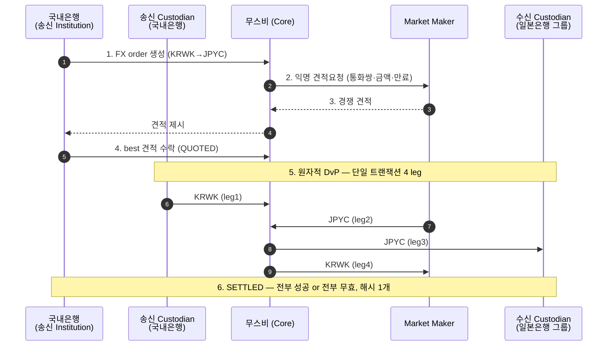

# 단기 PoC 기술 시나리오 설계

> 단기 PoC를 **파티·leg·상태 전이·검증 기준**으로 설계. 환경은 **DevNet/TestNet**(AWS Sandbox), 정산은 **무스비 4-leg**.
> 우리는 **적격기관(국내은행)** — 송신 Institution(+ Custodian). 스택은 AWS Sandbox(망분리), 지갑은 노드월렛. 진행 방식 [aws-sandbox-devnet-setup.md](aws-sandbox-devnet-setup.md), 무스비 모델 [musubi-overview.md](musubi-overview.md).

## 1. 시나리오 한 줄

국내은행이 보유한 **KRWK**를 무스비를 통해 **JPYC와 원자적으로 맞교환**한다(은행 자기계정, 고객 없음). 양 통화는 한 트랜잭션에 동시 이동하고, MM에는 신원이 익명으로만 전달되며, 무관한 제3자는 거래를 보지 못한다.

## 2. 파티 / 역할

| 역할(무스비) | 단기 PoC 담당 | 비고 |
|---|---|---|
| **송신 Institution** | 국내은행 | 송금 개시·견적 선택 |
| **송신 Custodian** | 국내은행 (지갑=노드월렛) | KRWK 이동 승인·co-sign |
| **Core** | 무스비 | 정산 코디네이션·실행 |
| **Market Maker** | (협의 — 무스비 준비 테스트 MM 유력) | 4-leg 필수, 익명 RFQ |
| **수신 Custodian / Institution** | 일본은행 그룹 | JPYC 수신측 |
| **제3자** | 무관 기관 | 프라이버시 검증용(스테이크 없음) |

> KRWK는 국내은행이 들여오는 자산. 테스트 인스트루먼트 발급·MM 준비 협의는 [nodeinfra-asks.md](nodeinfra-asks.md) D·E.

## 3. 거래 leg (4-leg 원자)

| leg | 송신 | 수신 | 통화 |
|---|---|---|---|
| 1 | 송신 Custodian(국내은행) | 무스비(Core) | KRWK (source) |
| 2 | Market Maker | 무스비(Core) | JPYC (target) |
| 3 | 무스비(Core) | 수신 Custodian(일본은행 그룹) | JPYC (target) |
| 4 | 무스비(Core) | Market Maker | KRWK (source) |

→ 4 leg가 **단일 트랜잭션**. 하나라도 실패하면 전체 롤백.

## 4. 상태 전이 (FXOrder 라이프사이클)

> `FXOrder` 상태값: `PENDING` → `QUOTED` → `EXECUTING` → `SETTLED` (실패: `FAILED` / `EXPIRED`).

```
[PENDING] 송신 Institution이 FX order 생성 (KRWK→JPYC, 금액, cost guard)
   │ 무스비가 전 MM에 익명 견적요청 → MM들 경쟁 견적
   │ 송신자가 best 견적 수락 (cost guard 검증)
   ▼
[QUOTED]
   │ 4-leg 원자 DvP 실행 (송신·수신 Custodian, MM, Core co-sign)
   ▼
[EXECUTING] → [SETTLED] 트랜잭션 해시 1개 (규제 보고용)

   (견적 미수신/만료 → EXPIRED · 정산 실패 → FAILED, 전체 롤백)
```

## 5. 시퀀스 다이어그램



## 6. 시연 흐름 (말 + 화면)

> Console(또는 API 응답)로 단계마다 상태를 보여준다. ~15초 정산.

1. **주문 생성** — "국내은행이 KRWK→JPYC FX order 제출. cost guard로 최악 환율 한도 설정."
2. **익명 RFQ** — "무스비가 전 MM에 익명 견적요청. **MM은 송수신자가 누군지 모른다**(통화쌍·금액·만료만 봄)."
3. **경쟁 견적·수락** — "여러 MM 호가 중 best 선택. cost guard 통과 시 QUOTED."
4. **원자 정산** — "4 leg가 한 트랜잭션에 동시 실행. KRWK·JPYC가 같은 순간 이동 — **전부 성공 or 전부 무효**. 한쪽만 받고 떼이는 일이 구조적으로 불가능."
5. **완료·프라이버시** — "SETTLED + 해시 1개로 규제 보고. 무관한 제3자는 이 거래를 데이터로 갖고 있지도 않다 = 프라이버시."

## 7. 합격 기준 (PoC 성공 판정)

- [ ] **원자성**: 정산 후 KRWK·JPYC 동시 이동. 일부 leg 실패 시 전체 롤백 확인.
- [ ] **프라이버시**: MM에 신원 미노출(익명 RFQ) · 제3자 거래 0건.
- [ ] **DvP 순서**: 견적 수락 전 정산 불가, cost guard 위반 견적 거부.
- [ ] **최종성**: SETTLED 상태 + 트랜잭션 해시 1개 산출.
- [ ] **연결/운영**: DevNet/TestNet 온보딩·mTLS·연결 테스트 통과, 대시보드에 정산 반영.

## 8. 단기 PoC 범위 밖

- 통화 경로 USD 경유·MM 구조 확정 (비즈니스 협의 — 단기 기술 PoC 범위 밖).
- Fireblocks·외부 지갑(최종 PoC — `dev/docs/wallet-custody-fireblocks.md`).
- 고객·온/오프램프·Fiat·브릿지.
</content>
