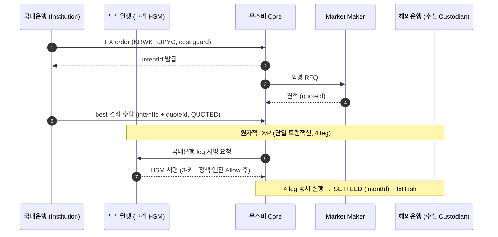
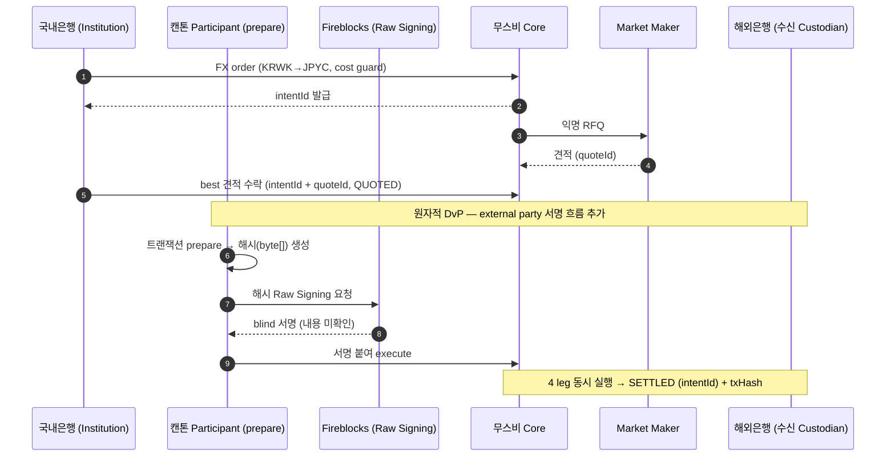

# 지갑 비교 — 외부(Fireblocks) vs 내부(노드월렛)

> 캔톤 파티 키를 누가 어떻게 보관·서명하느냐. **1차 PoC = 노드월렛(내부), 최종 PoC = Fireblocks(외부) 가능성.** 둘을 비교하고, 국내은행→해외은행 정산 시퀀스가 어떻게 달라지는지 본다.
> 정산 흐름 자체는 [verification.md](verification.md) 6절, 무스비 모델은 [musubi-overview.md](musubi-overview.md).

## 1. 한눈 비교

| 구분 | 외부 지갑 — **Fireblocks** | 내부 지갑 — **노드월렛** |
|---|---|---|
| 구조 | **옴니버스**(다수를 한 파티 아래 뭉치고 내부 SQL 장부) | **캔톤 네이티브 파티 호스팅**(담당자 확인) · 자가 키보유(고객 HSM) |
| 키 위치/서명 | Fireblocks 보관, **Raw Signing**(prepared-tx 해시 byte[] blind 서명) | **고객 HSM**(FIPS 140-3 L3) 보관 · 3-키 멀티시그 · Ed25519 |
| 캔톤 파티 입도 | 거칠다 — 여러 주체(예: 고객들)를 캔톤 파티 1개로 묶음 | 잘다 — 주체마다 별도 캔톤 파티 |
| 프라이버시·원자성 보장 | 묶은 파티(예: 은행) 단위까지만 — 그 안 개별 주체는 원장 밖(내부 DB 신뢰) | 각 파티 단위로 원장이 직접 보장 |
| 캔톤 네이티브 기능 | 제한적(옴니버스라 내부 거래가 캔톤 TX 안 됨) | 폭넓음(내부 dApp·세밀한 권한 가능) |
| 망분리/HSM | 별도 구성 | **HSM/망분리 내장** |
| 트래블룰 | 별도 | 캔톤 네이티브 트래블룰(예: VerifyVASP) 연동 가능 |
| 1차 PoC 적합성 | blind signing 검증 부담 | **적합 — 1차 기본** |
| 최종 PoC | 국내은행 지갑 시스템이 Fireblocks 예정 → 최종 대상 | (단기 검증 자산으로 활용) |

> **"파티 입도"·"파티 경계까지만" 쉽게:** 캔톤의 보장(프라이버시·원자성)은 **"파티" 단위**로 적용된다.
> - **옴니버스(Fireblocks)**: 예컨대 은행이 고객 100명을 캔톤 파티 **1개("은행")** 로 묶으면, 원장엔 "은행" 하나만 보이고 고객 100명은 원장에 없다 → 누가 얼마인지는 **은행 내부 SQL DB**가 안다. 그래서 캔톤 보장이 "은행(파티)" 경계까지만 미치고, **그 안 고객 단위 구분·보호는 DB를 믿어야** 한다(블록체인 보장이 DB 신뢰로 후퇴 = "DB 신뢰로 회귀").
> - **네이티브 방식**(예: 노드월렛): 주체(은행·필요시 고객)마다 **별도 파티** → 원장이 개별 주체를 직접 인식하고 그 단위까지 캔톤이 보장.
> - 1차 PoC는 고객이 없어(은행 자기계정) 이 차이가 당장은 작지만, **고객 온램프가 들어오는 최종 단계에서 결정적**이다.

### 노드월렛 핵심 (노드인프라 문서 기준)

> 출처: https://docs.nodeinfra.com (접근 코드 필요). **공개 문서는 Solana 제품 기준**이나, **캔톤 네이티브 파티 호스팅은 노드인프라 담당자 확인**(문서 미기재). Daml(prepared-tx) 서명 세부는 확인 대상.

- **벤더 무의존 자가 키보유** — 키는 **고객 HSM**(Thales Luna·YubiHSM, FIPS 140-3 L3) 내부, 정책은 고객 **SGX**. VASP 위탁·SaaS MPC와 달리 벤더 탈취/종속 리스크 제거.
- **3-키 다중서명** — 개시 키(SDK) + 승인 키(정책 엔진) 등 독립 서비스가 각자 HSM 키로 서명해야 tx 전송. 한 축 탈취돼도 차단.
- **컴플라이언스 정책 엔진(승인자)** — **서명 전** 규칙 평가(Allow/Held/Deny): AML·KYC·트래블룰(FATF R.16)·전금법·가이법, 한도·속도·영업시간·2-of-3 승인 등. → Fireblocks blind signing의 "내용을 못 봐 fund-drain 못 막음"과 **정반대**로 서명 전에 차단.
- **망분리 구조 내장**(외부망·DMZ·내부망) + 테넌트 격리(테넌트별 개시 키·SPKI-hash).
- **SDK**: Java/Spring, **Ed25519 요청 서명**(PKCS#11 HSM 자동), 멱등성(`reference_id`) 필수.
- **raw transaction 서명 지원**(임의 tx 바이트 서명·브로드캐스트) — Canton 4자 Daml 호출(prepared-tx) 서명에 활용 가능. 단 "unsafe"(가드레일 없음)이라 정책 엔진으로 감싸야.

## 2. 핵심 차이 — 서명 방식

무스비 정산은 4자간 Daml 컨트랙트 호출이라 각 당사자가 자기 leg에 **서명(co-sign)** 해야 한다. 지갑 차이는 결국 **이 서명을 어떻게 하느냐**다.

- **노드월렛(내부)**: 키가 **고객 HSM**에 있어 (정책 엔진 평가 후) **HSM이 직접 서명** — 외부로 보내 blind 서명받는 라운드트립이 없다.
- **Fireblocks(외부)**: 캔톤 external party 흐름 — 참여자 노드가 트랜잭션을 **prepare** → prepared-tx **해시(byte[])** 를 Fireblocks가 **Raw/blind 서명** → 서명을 붙여 **execute**. prepare→sign(byte[])→execute 라운드트립이 추가되고, Fireblocks 정책엔진은 **내용을 못 본다**(blind → 악성 fund-drain tx도 정상 tx와 구분 불가).

## 3. 시퀀스 차이 — 국내은행 → 해외은행

공통 흐름(주문→견적→정산)은 같다. **국내은행(송신 Custodian)이 자기 KRWK leg를 승인·서명하는 지점**에서 갈린다.

### 3-1. 내부 지갑 — 노드월렛 (1차 PoC)

- 서명이 **고객 HSM에서 직접**(정책 엔진 평가 후). 외부 blind 서명·prepare 라운드트립 없음.
- 파티가 1급이라 프라이버시·원자성·세밀 권한이 원장 단에서 그대로.

### 3-2. 외부 지갑 — Fireblocks (최종 PoC 가능성)

- 서명에 **prepare → Fireblocks blind 서명(byte[]) → execute** 추가 라운드트립.
- Fireblocks 정책엔진이 tx 내용을 못 봐 **fund-drain 방어가 prepare 인프라/Daml 제약으로 이동**(별도 검증 필요).
- 옴니버스라 고객 단위까지 캔톤 보장이 안 내려감(고객은 1급 파티 아님).

## 4. 결론 — PoC 단계별 선택

- **1차 PoC = 노드월렛(내부)** — 캔톤 네이티브 파티 호스팅(담당자 확인)·자가 키보유·컴플라이언스 정책 엔진·HSM/망분리 내장. blind signing 리스크 없이 캔톤 가치(원자성·프라이버시·DAML 권한)를 검증하기에 적합. (Daml 서명 세부는 확인 대상)
- **최종 PoC = Fireblocks(외부) 검토** — 국내은행 지갑 시스템이 Fireblocks 예정이므로 연동성을 확인하되, Raw Signing 정책 훅·fund-drain 방어를 도입 전 검증해야 함.

> 최종 PoC의 Fireblocks Raw Signing 심층 분석은 poc 밖 `dev/docs/wallet-custody-fireblocks.md` 참조(단기 범위 밖).

## 참고 (출처)

- 무스비 정산 흐름: https://musubinetwork.com/how-it-works
- 노드월렛 문서: https://docs.nodeinfra.com (접근 코드 필요 · 공개 문서는 Solana 기준)
- 캔톤 external party 서명(interactive submission): https://docs.canton.network
- (옴니버스·Raw Signing 심층 분석: dev/docs/wallet-custody-fireblocks.md)
