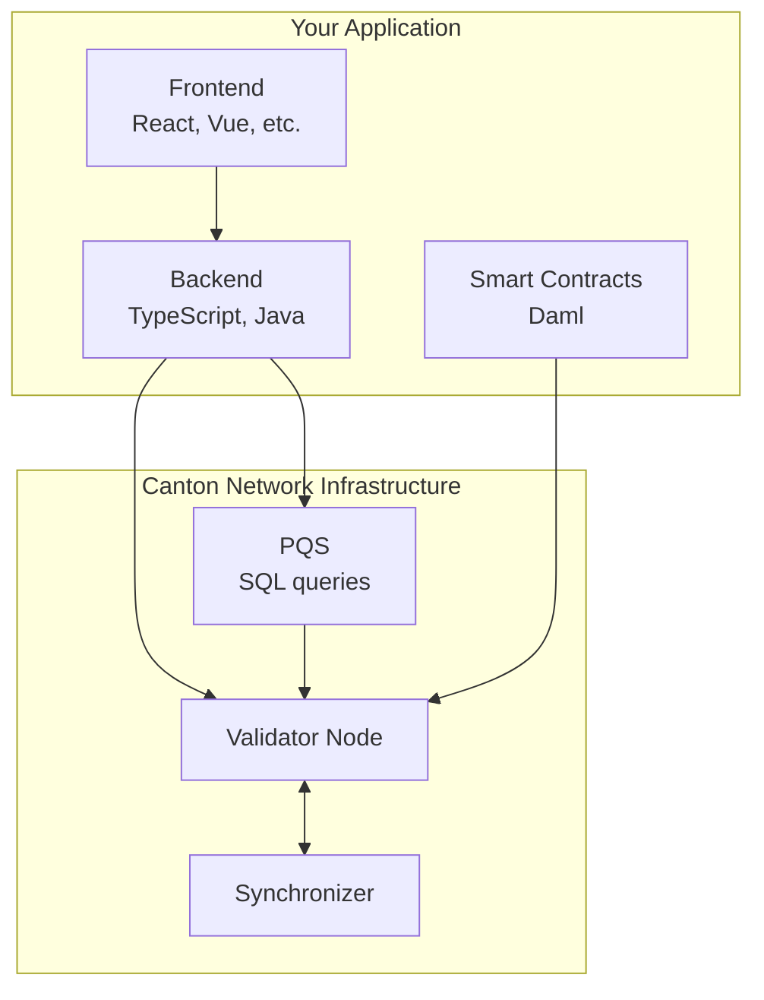

> **출처(원문)**: [Choose Your Path](https://docs.canton.network/appdev/get-started/choose-your-path) · 번역일 2026-06-15

## 📌 개발자 노트
- **한 줄 요약**: 배경(블록체인 입문/Ethereum 경험/타 체인 경험/비개발 아키텍트)별 권장 학습 경로와, 7개 학습 모듈·개발 스택·사전 요구사항을 안내.
- **핵심 용어**: <abbr class="gloss" title="다자간 워크플로를 위해 설계된 Canton의 스마트 컨트랙트 언어">Daml</abbr> SDK, 학습 모듈(Module 1~7), 개발 스택(프론트엔드/백엔드/스마트 <abbr class="gloss" title="원장에 기록되는 불변 데이터 단위. 상태 변경은 새 컨트랙트 생성으로 표현됨">컨트랙트</abbr>), PQS
- **선행 개념**: [핵심 개념](../../overview/understand/core-concepts.md). 다음 → [모듈 1: Canton 이해](../modules/m1-understanding-canton.md)

---

# 학습 경로 선택

> 배경과 목표에 맞는 학습 경로 찾기

블록체인이 처음이든 다른 플랫폼에서 옮겨오든, 이 가이드는 Canton Network 위에서 구축하는 가장 효율적인 경로를 찾도록 돕는다.

## 빠른 진단

### 블록체인 개발이 처음입니다

**권장 경로:**

1. [5분 개요](../../overview/understand/five-minute-overview.md) — Canton이 무엇인지 이해
2. [핵심 개념](../../overview/understand/core-concepts.md) — 기본 익히기
3. [모듈 1: Canton 이해](../modules/m1-understanding-canton.md) — 멘탈 모델 구축
4. [모듈 3: Daml 스마트 컨트랙트](https://docs.canton.network/appdev/modules/m3-dev-environment) — 코딩 시작
5. [모듈 4: 애플리케이션 구축](https://docs.canton.network/appdev/modules/m4-building-apps-intro) — 예제 애플리케이션으로 실습

### Ethereum/Solidity 경험이 있습니다

**권장 경로:**

1. [Ethereum 개발자를 위한 Canton](../modules/m2-canton-for-ethereum-devs.md) — 지식 매핑
2. [프라이버시 모델](../../overview/learn/privacy-model.md) — 핵심 차이 이해
3. [모듈 3: Daml 스마트 컨트랙트](https://docs.canton.network/appdev/modules/m3-dev-environment) — Daml 문법 학습
4. [모듈 4: 애플리케이션 구축](https://docs.canton.network/appdev/modules/m4-building-apps-intro) — 풀스택 Canton 앱 구축 실습

**체득해야 할 핵심 차이:**

* 불변 컨트랙트 (수정이 아니라 보관 + 생성)
* 명시적 권한 (msg.sender가 아니라 signatory/controller)
* 기본 프라이버시 (데이터를 숨기는 게 아니라 관찰자를 선언)

### 다른 블록체인(Solana, Cosmos 등) 경험이 있습니다

**권장 경로:**

1. [5분 개요](../../overview/understand/five-minute-overview.md) — Canton의 접근
2. [Ethereum 개발자를 위한 Canton](../modules/m2-canton-for-ethereum-devs.md) — 개념 매핑 (여전히 유용)
3. [아키텍처 개요](../../overview/learn/architecture.md) — 구성 요소 작동 방식
4. [모듈 3: Daml 스마트 컨트랙트](https://docs.canton.network/appdev/modules/m3-dev-environment) — 코딩 시작

### 코딩 없이 Canton을 이해하고 싶습니다 (아키텍트/PM)

**권장 경로:**

1. [5분 개요](../../overview/understand/five-minute-overview.md)
2. [Canton이 푸는 문제](../../overview/understand/the-problem.md)
3. [Canton의 해법](../../overview/understand/cantons-solution.md)
4. [활용 사례](../../overview/understand/use-cases.md)
5. [아키텍처 개요](../../overview/learn/architecture.md)

## 학습 모듈

개발자 문서는 점진적 모듈로 구성된다:

| 모듈 | 초점 | 선수 |
| --- | --- | --- |
| **모듈 1** | Canton 이해 | 없음 |
| **모듈 2** | Ethereum 개발자를 위한 Canton | Ethereum/블록체인 경험 |
| **모듈 3** | Daml 스마트 컨트랙트 | 모듈 1 또는 2 |
| **모듈 4** | 애플리케이션 구축 | 모듈 3 |
| **모듈 5** | 테스트 & 배포 | 모듈 4 |
| **모듈 6** | 스마트 컨트랙트 업그레이드 | 모듈 3-5 |
| **모듈 7** | 프로덕션 모범 사례 | 모듈 5 |

## 개발 스택 개요

Canton Network 개발은 다음 구성 요소를 포함한다:

## 사전 요구사항

개발 시작 전:

### 필수

* 임의 언어의 **프로그래밍 경험**
* **명령줄(command line)** 친숙도
* 버전 관리를 위한 **Git**

### 도움이 됨 (필수 아님)

* **함수형 프로그래밍** 개념 (Haskell, OCaml, F# 등)
* 로컬 환경 실행을 위한 **Docker**
* PQS 쿼리를 위한 **PostgreSQL**

### 개발 환경

* **[Daml SDK](https://docs.canton.network/sdks-tools/sdks/daml-sdk)**: Daml 컴파일러와 도구를 포함한 SDK 설치.
* **[VS Code 확장](https://marketplace.visualstudio.com/items?itemName=DigitalAssetHoldingsLLC.daml)**: 구문 강조와 IDE 지원을 위한 Daml VS Code 확장 설치.

## 실습

구축할 준비가 되었나? [모듈 4: 애플리케이션 구축](https://docs.canton.network/appdev/modules/m4-building-apps-intro)이 풀스택 Canton Network 애플리케이션을 처음부터 끝까지 안내한다 — 사전 요구사항, 데모 실행, 백엔드·프론트엔드 개발, JSON Ledger API, 관측성(observability).

## 도움 받기

* **[커뮤니티 Slack](mailto:cf-global-synchronize-aaaapqznpatdmupdm5thaarsly@daholdings.slack.com)**: 앱 개발자 Slack 채널 참여를 이메일로 요청.
* **[포럼](https://forum.canton.network/)**: 기술 토론과 Q&A
* **[FAQ](https://docs.canton.network/appdev/faq)**: 흔한 질문 정리
