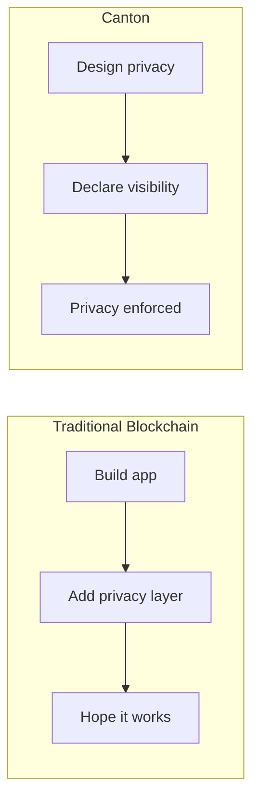

> **출처(원문)**: [Module 1: Understanding Canton](https://docs.canton.network/appdev/modules/m1-understanding-canton) · 번역일 2026-06-15

## 📌 개발자 노트
- **한 줄 요약**: Canton 코드를 쓰기 전에 갖춰야 할 개념적 토대 — 프라이버시 우선, 전역 상태 없음, 모든 것이 불변, 명시적 권한이라는 4대 원칙을 멘탈 모델로 정리.
- **핵심 용어**: 프라이버시 우선, 전역 상태 없음, 불변성, 명시적 권한(structural authorization)
- **선행 개념**: [5분 개요](../../overview/understand/five-minute-overview.md), [핵심 개념](../../overview/understand/core-concepts.md). 다음 → [Ethereum 개발자를 위한 Canton](m2-canton-for-ethereum-devs.md)

---

# 모듈 1: Canton 이해

> Canton 개발에 필요한 기초적 이해 쌓기

이 모듈은 Canton 코드를 쓰기 전에 필요한 개념적 토대를 제공한다. 코딩을 빨리 시작하고 싶더라도, 이 개념들을 이해하는 데 시간을 들이면 더 효과적으로 일하게 된다.

## 모듈 개요

| 절 | 목적 |
| --- | --- |
| **멘탈 모델** | Canton 작동 방식에 대한 직관 구축 |
| **개발 스택** | 도구와 기술 이해 |
| **Canton은 무엇이 다른가** | Canton을 고유하게 만드는 것 파악 |

## 이 모듈이 중요한 이유

Canton은 단지 문법이 다른 또 하나의 블록체인이 아니다. 분산 <abbr class="gloss" title="거래·컨트랙트가 기록되는 장부. Canton에선 활성 컨트랙트의 모음">원장</abbr>에 대한 근본적으로 다른 접근을 대표한다:

* **프라이버시가 네이티브**다, 덧붙인 게 아니라
* **<abbr class="gloss" title="여러 노드가 트랜잭션의 유효성·순서에 함께 동의하는 절차">합의</abbr>가 표적화**된다, 전역적이지 않고
* **상태가 분산**된다, 복제되지 않고
* **권한이 선언**된다, 코딩되지 않고

이 원칙들을 미리 이해하면 나중에 아키텍처에 맞서 싸우는 일을 피할 수 있다.

## 핵심 통찰

### 프라이버시 우선

대부분의 블록체인에서는 애플리케이션을 만든 다음 프라이버시를 더하려 한다. Canton에서는 프라이버시에서 시작해 무엇을, 누구에게 드러낼지 선택한다.

### 전역 상태 없음

모든 정보를 조회할 수 있는 단일 "블록체인"은 없다. 각 <abbr class="gloss" title="Canton에서 권한과 데이터 가시성의 주체가 되는 식별 가능한 참여 주체">파티</abbr>는 원장에 대한 자신만의 <abbr class="gloss" title="한 트랜잭션을 당사자별로 나눈 조각. 각 당사자는 자기 권한에 해당하는 뷰(자기 몫)만 받아 본다">뷰</abbr>를 갖는다.

| 전통적 관점 | Canton의 실제 |
| --- | --- |
| "블록체인을 조회" | *당신의* <abbr class="gloss" title="파티를 호스팅하고 그 파티의 컨트랙트 데이터를 저장하는 참여자 노드">밸리데이터</abbr>에서 *당신의* 데이터를 조회 |
| "총 공급량" | 애플리케이션이 API로 노출할 때만 보임 |
| "모든 <abbr class="gloss" title="원장 상태를 바꾸는 원자적 작업 단위. 하나 이상의 컨트랙트를 생성·보관하며, 전부 적용되거나 전혀 적용되지 않음">트랜잭션</abbr>" | *당신의* 트랜잭션만 |

### 모든 것이 불변

<abbr class="gloss" title="원장에 기록되는 불변 데이터 단위. 상태 변경은 새 컨트랙트 생성으로 표현됨">컨트랙트</abbr>는 변하지 않는다. 컨트랙트를 "업데이트"할 때는 옛것을 <abbr class="gloss" title="컨트랙트를 소비해 비활성으로 만드는 것(archive). 보관된 컨트랙트는 더 이상 쓸 수 없음">보관</abbr>하고 새것을 생성한다. 이는 한계가 아니라 프라이버시·무결성 보장의 토대다.

### 명시적 권한

각 파티가 무엇을 할 수 있는지 컴파일 타임에 선언하고, 프로토콜이 그것을 강제한다. 런타임에 호출자 신원을 <abbr class="gloss" title="이해관계자 밸리데이터가 트랜잭션이 유효함을 미디에이터에 응답하는 것(confirmation)">확인</abbr>하는 전통적 시스템과 달리, Canton의 권한은 구조적(structural)이다.

## 사전 요구사항 점검

진행하기 전에:

* Canton이 무엇인지 **이해** ([5분 개요](../../overview/understand/five-minute-overview.md))
* 기본 구성 요소를 **앎** ([핵심 개념](../../overview/understand/core-concepts.md))
* 프로그래밍 경험을 **가짐** (임의 언어)

블록체인 경험은 필요 없다 — 그리고 가지고 있다면, 일부는 잊을(unlearn) 준비를 하라.

## 무엇을 배우나

이 모듈을 마치면 다음을 이해하게 된다:

1. Canton의 프라이버시 모델을 어떻게 생각해야 하는지
2. 파티, 밸리데이터, <abbr class="gloss" title="상태를 저장하지 않고 트랜잭션 합의·순서를 조율하는 Canton 구성요소">Synchronizer</abbr> 사이의 관계
3. 트랜잭션이 시스템을 통해 흐르는 방식
4. 개발에 사용할 도구

## 학습 경로

* **[멘탈 모델](https://docs.canton.network/appdev/modules/m1-mental-models)**: 분산 원장에 대한 Canton의 접근에 대한 직관 구축.
* **[개발 스택](https://docs.canton.network/appdev/modules/m1-development-stack)**: 사용할 도구와 기술 이해.

이 모듈을 마친 후 계속:

* **[모듈 2](m2-canton-for-ethereum-devs.md)**: Ethereum/블록체인 경험이 있다면
* **[학습 경로 선택](../get-started/choose-your-path.md)**: <abbr class="gloss" title="다자간 워크플로를 위해 설계된 Canton의 스마트 컨트랙트 언어">Daml</abbr> 작성을 시작할 준비가 됐다면

<!-- nav:start -->

---

⬅️ **이전**: [학습 경로 선택](../get-started/choose-your-path.md) ・ ➡️ **다음**: [블록체인 개발자를 위한 Canton (모듈 2)](m2-canton-for-ethereum-devs.md)

<!-- nav:end -->
