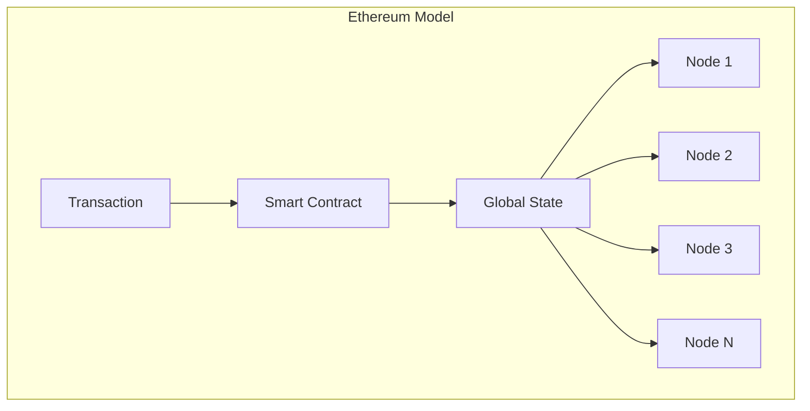
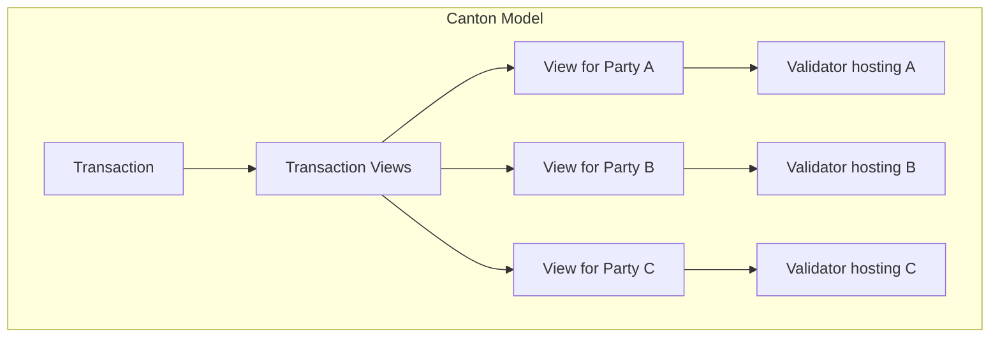
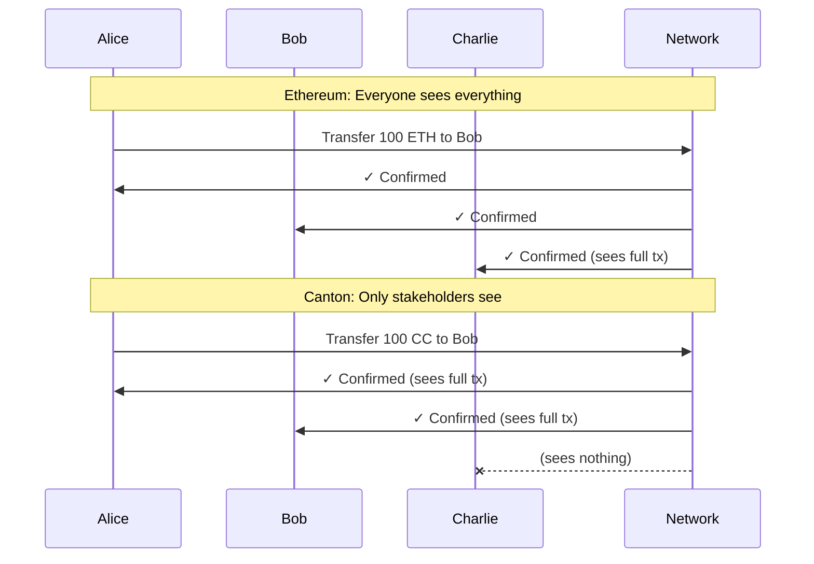

> **출처(원문)**: [Canton for Blockchain Developers](https://docs.canton.network/appdev/modules/m2-canton-for-ethereum-devs) · 번역일 2026-06-15

## 📌 개발자 노트
- **한 줄 요약**: Ethereum/Solidity 지식을 Canton 개념에 매핑 — 개념 대응표, 멘탈 모델 전환, <abbr class="gloss" title="컨트랙트의 구조와 규칙(권한·초이스)을 정의하는 Daml 청사진">템플릿</abbr> vs Solidity, 프라이버시·권한 모델 차이, 도구 비교, 다자간 워크플로, 잊어야 할 습관과 흔한 함정.
- **핵심 용어**: 템플릿 vs <abbr class="gloss" title="원장에 기록되는 불변 데이터 단위. 상태 변경은 새 컨트랙트 생성으로 표현됨">컨트랙트</abbr>, <abbr class="gloss" title="컨트랙트에서 수행 가능한 동작(권한이 부여된 당사자만 실행 가능)">초이스</abbr> vs 함수, <abbr class="gloss" title="Canton에서 권한과 데이터 가시성의 주체가 되는 식별 가능한 참여 주체">파티</abbr> vs EOA, 트래픽 vs 가스, signatory/controller vs msg.sender
- **선행 개념**: [모듈 1: Canton 이해](m1-understanding-canton.md), [프라이버시 모델](../../overview/learn/privacy-model.md). 다음 → [모듈 3: Daml 개발](https://docs.canton.network/appdev/modules/m3-dev-environment)

---

# 블록체인 개발자를 위한 Canton

> 당신의 Ethereum·블록체인 지식을 Canton 개념으로 잇기

Ethereum, Solana, 또는 다른 블록체인 플랫폼에서 왔다면, Canton은 친숙하면서도 근본적으로 다르게 느껴질 것이다. 이 절은 당신이 아는 개념을 Canton의 등가물에 매핑하고, 멘탈 모델이 바뀌어야 하는 지점을 강조한다.

## 핵심 개념 매핑

다음 표는 익숙한 Ethereum 개념을 Canton 등가물에 매핑한다.

| Ethereum 개념 | Canton 등가물 | Canton 비고 |
| --- | --- | --- |
| 블록체인(Blockchain) | <abbr class="gloss" title="상태를 저장하지 않고 트랜잭션 합의·순서를 조율하는 Canton 구성요소">Synchronizer</abbr> | 상태를 저장하지 않고 합의 조율 |
| 스마트 컨트랙트(Smart Contract) | 템플릿(Template) | 데이터 스키마와 실행 가능한 초이스 정의 |
| 컨트랙트 인스턴스 | 컨트랙트(Contract) | 불변; 상태 변경은 새 컨트랙트 생성 |
| 함수(Function) | 초이스(Choice) | 컨트랙트를 보관·생성하는 동작 |
| EOA(주소) | 파티(Party) | 명시적 권한을 갖는 암호학적 신원 |
| 트랜잭션 | 트랜잭션 | 권한 있는 파티만 관련 뷰를 봄 |
| 전역 상태(Global State) | 분산 상태(Distributed State) | 전역 상태 없음; 각 노드는 자기 파티 데이터 저장 |
| 노드(Node) | <abbr class="gloss" title="파티를 호스팅하고 그 파티의 컨트랙트 데이터를 저장하는 참여자 노드">밸리데이터</abbr>(참여자) | 자기 호스팅 파티의 데이터만 저장 |
| 가스(Gas) | 트래픽(Traffic) | <abbr class="gloss" title="트랜잭션 수수료와 밸리데이터 보상에 쓰이는 네이티브 유틸리티 토큰(CC)">Canton Coin</abbr>으로 내는 네트워크 사용료 |

## 멘탈 모델 전환

**Ethereum에서**: 전역 상태를 변경하는 코드를 쓴다. 모두가 모든 것을 본다. 컨트랙트는 누구나 호출할 수 있는 주소에 위치한다.

**Canton에서**: 어떤 데이터가 존재하고 어떤 동작이 가능한지 정의하는 템플릿을 쓴다. 컨트랙트는 생성·보관된다(결코 변경되지 않음). 관련 파티만 데이터를 본다. 권한은 모델에 내장되어 있다, 덧붙인 게 아니라.





## 스마트 컨트랙트 패러다임: 템플릿 vs Solidity

Solidity에서는 가변 상태와 그 상태를 수정하는 함수로 컨트랙트를 정의한다:

```solidity
// Solidity: Mutable state
contract Token {
    mapping(address => uint256) public balances;
    
    function transfer(address to, uint256 amount) public {
        balances[msg.sender] -= amount;
        balances[to] += amount;
    }
}
```

<abbr class="gloss" title="다자간 워크플로를 위해 설계된 Canton의 스마트 컨트랙트 언어">Daml</abbr>(Canton의 스마트 컨트랙트 언어)에서는 불변 컨트랙트와, 기존 컨트랙트를 보관하고 새것을 생성하는 초이스로 템플릿을 정의한다:

```haskell
-- Daml: Immutable contracts with choices
template Token
  with
    owner : Party
    issuer : Party
    amount : Decimal
  where
    signatory issuer
    observer owner
    
    choice Transfer : ContractId Token
      with
        newOwner : Party
      controller owner
      do
        create this with owner = newOwner
```

### 핵심 차이

다음은 Solidity와 Daml 프로그래밍 모델의 근본적 차이다.

| 측면 | Solidity | Daml |
| --- | --- | --- |
| **상태 모델** | 가변 스토리지 변수 | 불변 컨트랙트; 변경은 새 컨트랙트 생성 |
| **권한** | 런타임 `msg.sender` 확인 | 컴파일 타임 `signatory`/`controller` 선언 |
| **기본 가시성** | 기본 공개 | 기본 비공개; 명시적 `observer` 선언 |
| **실행 제어** | 누구나 공개 함수 호출 가능 | 선언된 컨트롤러만 초이스 실행 가능 |

Daml의 `Transfer` 초이스는 기존 컨트랙트를 변경하지 않는다. 현재 컨트랙트를 **보관(archive)** 하고 새 소유자로 새것을 **생성(create)** 한다. 이 불변성이 Canton의 프라이버시·무결성 보장의 근간이다.

## 프라이버시 모델 차이

**Ethereum 기본**: 모든 것이 공개.

**Canton 기본**: 모든 것이 비공개. 가시성은 명시적 선언을 요구한다.



## 데이터 읽기: 전역 RPC 없음

Ethereum에서는 어떤 노드든 어떤 상태에 대한 질의에 답할 수 있다. Canton에서는 **원하는 데이터의 파티를 호스팅하는 밸리데이터에 연결해야 한다**.

> **참고:** 모든 데이터를 가져오기 위해 호출할 수 있는 단일하고 모든 것을 포괄하는 블록체인 RPC 엔드포인트는 없다. 대신 당신의 파티 데이터에는 당신 밸리데이터의 Ledger API를, 그들의 데이터에는 잠재적으로 애플리케이션 제공자의 API를 사용한다.

이는 프라이버시의 직접적 결과다. Charlie가 온-원장에서 Alice의 데이터를 볼 수 없다면, Charlie의 노드에는 조회할 Alice의 데이터가 없다.

## 권한 모델

권한은 Canton에서 Ethereum과 근본적으로 다르게 작동한다.

| Ethereum | Canton |
| --- | --- |
| `msg.sender`가 권한을 결정 | `signatory`와 `controller`가 권한을 결정 |
| 누구나 공개 함수 호출 가능 | 지정된 파티만 초이스 실행 가능 |
| 권한은 런타임 확인 | 권한은 컴파일 타임 보장 + 런타임 이중 확인 |

Canton의 권한 모델은 세 가지 핵심 역할을 사용한다:

* **<abbr class="gloss" title="컨트랙트의 주된 권한자. 생성·보관(소비)에 반드시 동의해야 하는 파티">서명자</abbr>(Signatory)**: 컨트랙트 생성을 승인해야 하는 파티(들). 서명자는 항상 컨트랙트를 보며, 컨트롤러로도 선언되면 초이스를 실행할 수 있다.
* **<abbr class="gloss" title="컨트랙트를 볼 수 있으나 단독으로 행위할 수는 없는 파티">관찰자</abbr>(Observer)**: 컨트랙트를 볼 수 있는 파티이나, 컨트롤러로도 선언되지 않으면 초이스를 실행할 수 없다.
* **컨트롤러(Controller)**: 컨트랙트의 특정 초이스를 실행할 수 있는 파티. 컨트롤러는 실행할 때 컨트랙트를 본다.

### 권한 예시

```haskell
template Asset
  with
    owner : Party
    issuer : Party
    auditor : Party
  where
    signatory issuer        -- Must authorize creation; always sees contract
    observer owner, auditor -- Can see but cannot act unless also controller
    
    choice Transfer : ContractId Asset
      with
        newOwner : Party
      controller owner      -- Only owner can exercise this choice
      do
        create this with owner = newOwner
```

이 템플릿에서:

* `issuer`는 컨트랙트 생성을 위해 서명해야 함 (서명자)
* `owner`와 `auditor`는 컨트랙트를 볼 수 있음 (관찰자)
* `owner`만 `Transfer` 초이스를 실행할 수 있음 (컨트롤러)

`controller` 선언은 초이스별이라는 점에 유의하라. 템플릿은 서로 다른 컨트롤러를 가진 여러 초이스를 가질 수 있다:

```haskell
choice Transfer : ContractId Asset
      controller owner      -- Only owner can transfer
      do
        create this with owner = newOwner

    choice Audit : AuditReport
      controller auditor    -- Only auditor can audit
      do
        return AuditReport with ...
```

## 개발자 도구 비교

Canton은 대부분의 Ethereum 개발 워크플로에 대응하는 도구를 갖는다.

| Ethereum 도구 | Canton 등가물 | 비고 |
| --- | --- | --- |
| Solidity | Daml | 함수형 vs 명령형 패러다임 |
| Hardhat / Foundry | Daml SDK + dpm | 빌드·테스트·배포 툴체인 |
| Remix | VS Code + Daml 확장 | 언어 지원 IDE |
| MetaMask | Wallet SDK | 사용자 월렛 통합 |
| Web3.js / ethers.js | Ledger API (gRPC/JSON) | 애플리케이션 통합 |
| ERC 표준 | CIP | [CIP-0056](https://github.com/global-synchronizer-foundation/cips/blob/main/cip-0056/cip-0056.md)(토큰), [CIP-0103](https://github.com/mjuchli-da/cips/blob/cip-dapp-standard/cip-0103/cip-0103.md)(dApp 표준) |

## 다자간 워크플로

Canton은 다자간 조율을 일급(first-class) 관심사로 다룬다. Ethereum이 수동 조율 패턴을 요구하는 곳에서, Canton은 그것을 언어에 내장한다.

### Ethereum 방식: 수동 멀티시그

```solidity
// Solidity: Manual signature collection
contract MultiSig {
    mapping(address => bool) public approved;
    uint256 public approvalCount;
    
    function approve() public {
        require(!approved[msg.sender], "Already approved");
        approved[msg.sender] = true;
        approvalCount++;
    }
    
    function execute() public {
        require(approvalCount >= 2, "Need 2 approvals");
        // ... execute action
    }
}
```

### Canton 방식: 내장 다자간

```haskell
-- Daml: Native multi-party agreement
template Agreement
  with
    partyA : Party
    partyB : Party
    terms : Text
  where
    signatory partyA, partyB  -- Both must agree to create
    
    choice Execute : ()
      controller partyA, partyB  -- Both must agree to execute
      do
        -- ... execute action
        return ()
```

Daml 버전은 프로토콜 수준에서 강제된다. 두 서명 없이는 컨트랙트를 생성할 방법이 없고, 두 파티 없이는 `Execute`를 실행할 방법이 없다.

> **참고:** Canton의 다자간 권한은 서로 다른 밸리데이터에 호스팅될 수 있는 파티들로부터 서명을 모아야 한다. 이는 보통 한 파티가 동작을 제안하고 다른 파티가 수락하는 워크플로 패턴을 수반한다. 다자간 워크플로 구현의 상세 패턴은 개발자 모듈을 참고하라.

## 잊어야 할 것

Ethereum에서 왔다면, 다음 습관을 바꿔야 한다.

| Ethereum 습관 | Canton의 실제 |
| --- | --- |
| **어떤 노드에서든 모든 상태 조회** | 관련 파티를 호스팅하는 밸리데이터에서 조회 |
| **컨트랙트 스토리지 변경** | 상태 변경은 새 컨트랙트 생성; 옛것은 보관됨 |
| **msg.sender를 통한 암묵적 권한** | 서명자·컨트롤러의 명시적 선언 |
| **기본 공개** | 기본 비공개; 가시성을 위해 관찰자를 명시적으로 추가 |
| **교체 가능한 노드** | 밸리데이터는 자기 호스팅 파티의 상태를 저장 |

### 네 가지 멘탈 전환

1. **전역 상태 조회 없음**: 네트워크 전체의 "모든 토큰"을 조회할 수 없다
2. **불변 컨트랙트**: 상태 변경은 새 컨트랙트를 생성; 옛것은 보관됨
3. **명시적 권한**: 모든 동작이 명시적 서명자/컨트롤러 선언을 요구
4. **기본 프라이버시**: 가시성에 옵트인해야 한다, 옵트아웃이 아니라

## 흔한 함정

> ⚠️ **주의:** 다음은 블록체인 개발자가 Canton에서 처음 구축할 때 가장 흔히 저지르는 실수다.

| 함정 | 왜 일어나나 | 피하는 법 |
| --- | --- | --- |
| **공개 상태 조회 구축** | Ethereum식 전역 조회를 기대 | 처음부터 파티 범위 조회로 설계 |
| **다자간 권한 망각** | Ethereum의 무허가 모델 | 항상 고려: 누가 서명해야 하나? 누가 행위할 수 있나? |
| **컨트랙트 변경 시도** | Solidity의 가변 스토리지 모델 | 생성/보관 패턴을 받아들이기 |
| **너무 많은 파티 설계** | Ethereum 주소는 무료 | 각 파티가 스토리지 오버헤드를 만듦; 파티 구조를 신중히 설계 |

## 다음 단계

* **[아키텍처 개요](../../overview/learn/architecture.md)** — Canton의 구성 요소 모델 심층 분석
* **[프라이버시 모델 설명](../../overview/learn/privacy-model.md)** — <abbr class="gloss" title="한 트랜잭션을 &quot;뷰&quot;로 분해해, 각 파티가 자신과 관련된 부분만 보도록 하는 Canton의 핵심 프라이버시 방식">부분 트랜잭션 프라이버시</abbr> 이해
* **[개발자 트랙 모듈 3: Daml 개발](https://docs.canton.network/appdev/modules/m3-dev-environment)** — Daml 코드 작성 시작

<!-- nav:start -->
---
<sub>⬅️ **이전**: [모듈 1 — Canton 이해](m1-understanding-canton.md) ・ ➡️ **다음**: [블록체인 계층 (L0 / L1 / L2)와 Canton의 위치](../../notes/blockchain-layers-l0-l1-l2.md)</sub>
<!-- nav:end -->
