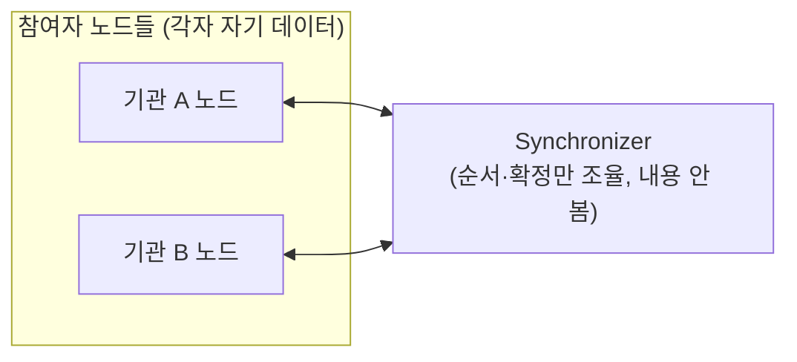

> **학습 코스 (번역본 아님)** — Canton 공식 문서의 충실 번역이 아니라, Canton을 모르는 백엔드 개발자가 핵심 개념을 순서대로 익히도록 직접 쓴 코스다. 정확한 정의는 [용어집](../glossary.md), 공식 번역은 [overview/](../index.md) 섹션 참고.

## Canton 한눈에
Canton은 **공개-허가형(public-permissioned) 프라이버시 보존 네트워크**다. 하나의 거대한 글로벌 체인이 아니라:

- **<abbr class="gloss" title="파티를 호스팅하고 그 파티의 컨트랙트를 저장·실행하는 노드. 밸리데이터의 핵심 구성요소">참여자 노드</abbr>**(<abbr class="gloss" title="파티를 호스팅하고 그 파티의 컨트랙트 데이터를 저장하는 참여자 노드">밸리데이터</abbr>)들이 각자 자기 <abbr class="gloss" title="Canton에서 권한과 데이터 가시성의 주체가 되는 식별 가능한 참여 주체">파티</abbr>의 데이터를 <abbr class="gloss" title="컨트랙트를 소비해 비활성으로 만드는 것(archive). 보관된 컨트랙트는 더 이상 쓸 수 없음">보관</abbr>하고,
- **<abbr class="gloss" title="상태를 저장하지 않고 트랜잭션 합의·순서를 조율하는 Canton 구성요소">Synchronizer</abbr>**가 <abbr class="gloss" title="원장 상태를 바꾸는 원자적 작업 단위. 하나 이상의 컨트랙트를 생성·보관하며, 전부 적용되거나 전혀 적용되지 않음">트랜잭션</abbr>의 순서·확정만 조율한다(내용은 안 봄).
- 공개 백본인 **<abbr class="gloss" title="슈퍼 밸리데이터들이 공동 운영하는 Canton의 퍼블릭 조율(합의) 계층">글로벌 Synchronizer</abbr>**는 여러 **<abbr class="gloss" title="글로벌 Synchronizer를 운영하고 네트워크 거버넌스에 참여하는 노드">슈퍼 밸리데이터</abbr>**가 공동 운영하고, 그 수수료(<abbr class="gloss" title="Synchronizer에 쓰기를 요청할 때 소비하는 자원. Canton Coin으로 비용을 지불">트래픽</abbr>)는 **<abbr class="gloss" title="트랜잭션 수수료와 밸리데이터 보상에 쓰이는 네이티브 유틸리티 토큰(CC)">Canton Coin</abbr>**으로 낸다.

핵심은 한 줄로: **"데이터는 그게 필요한 당사자에게만 간다."** 모두가 모든 것을 복제하는 퍼블릭 체인과 정반대다.

## Canton으로 푸는 기관 시나리오
Canton은 기관 간(B2B) 워크플로를 위한 인프라다. 대표 시나리오:

- **해외송금** — 국내 기관 A가 해외 기관 B에게 자금을 한 방향으로 보낸다.
- **정산(<abbr class="gloss" title="인도-대-지급(Delivery vs Payment). 자산 인도와 대금 지급을 동시·원자적으로 처리">DvP</abbr>)** — A와 B가 서로 다른 통화를 양방향으로 맞교환하되, **전부 아니면 전무**(원자적)로 처리한다.
- 그 밖에 <abbr class="gloss" title="실물·금융 자산을 원장 위의 토큰(컨트랙트)으로 표현하는 것">토큰화</abbr> 증권, 신디케이트 대출, 공급망 금융 등.

**이 코스는 두 개를 다룬다.** 주축은 **해외송금**(대부분의 개념을 이걸로 가르친다). 정산(DvP)은 <abbr class="gloss" title="트랜잭션이 전부 적용되거나 전혀 적용되지 않는 성질. 일부만 반영되는 일이 없음">원자성</abbr> 단계([S6](s06-atomicity-dvp.md))에서 "한쪽만 가면 떼인다"는 문제로 도입하는 고급 변형이다. 핵심 개념(파티·규칙·저장·프라이버시·원자성·토큰·<abbr class="gloss" title="트랜잭션이 되돌려지지 않는다고 보장되는 상태. 확률적(점점 굳음) vs 결정적(즉시 최종)">확정성</abbr>)은 시나리오와 무관하게 공통이다.

> **주의** — "국경 간"은 개념을 또렷하게 보여주는 예시 프레임일 뿐이다. 프라이버시·원자성·확정성 같은 차별점은 국내·기관 간 일반 워크플로에도 똑같이 적용된다. "Canton = 국경 간 전용"이 아니다.

## 3-way 대응표 (전통[국경 간] vs 이더리움 vs Canton)
세 세계를 같은 개념 축으로 비교한다. 코스 전체를 관통하는 지도다.

| 개념 | 전통 (국경 간 송금·정산) | 이더리움 | Canton |
|---|---|---|---|
| 자금 이동/정산 보장 | <abbr class="gloss" title="다른 나라 은행과 제휴해 국경 간 송금·결제를 대행하는 중개 은행(correspondent bank)">환거래은행</abbr>·<abbr class="gloss" title="은행 간 결제 지시를 주고받는 국제 메시징 망. 자금 자체가 아니라 메시지만 오감">SWIFT</abbr> / 맞교환은 <abbr class="gloss" title="외환 거래를 동시 맞교환(PvP)으로 정산해 Herstatt 리스크를 없애는 다통화 정산 기관">CLS</abbr>(<abbr class="gloss" title="지급-대-지급(Payment vs Payment). 두 통화의 지급을 동시·원자적으로 처리해 한쪽만 가는 일을 막음">PvP</abbr>)·<abbr class="gloss" title="증권을 집중 예탁·결제하는 중앙예탁기관(Central Securities Depository)">CSD</abbr> | <abbr class="gloss" title="원장 위에서 규칙대로 자동 실행되는 코드화된 계약. Canton에선 Daml 템플릿으로 작성">스마트 컨트랙트</abbr>(공개) | <abbr class="gloss" title="거래·컨트랙트가 기록되는 장부. Canton에선 활성 컨트랙트의 모음">원장</abbr> 위 직접·원자적(프라이빗) |
| 신뢰 주체 | 중개은행·중앙기관 | 퍼블릭 <abbr class="gloss" title="여러 노드가 트랜잭션의 유효성·순서에 함께 동의하는 절차">합의</abbr>(익명) | 프로토콜 + <abbr class="gloss" title="어떤 컨트랙트와 관계를 맺어 그것을 보거나 승인하는 파티 = 서명자 + 관찰자">이해관계자</abbr>(신원 기반) |
| 결제 시점 | T+1·<abbr class="gloss" title="거래 체결(T) 후 2영업일 뒤에 실제 결제가 이뤄지는 전통 금융 관행">T+2</abbr> 등 지연 | 블록 확정(확률적/에폭) | 즉시 결정적 확정 |
| 장부 | 노스트로/보스트로 등 기관별 장부 → 대조(reconciliation) | 단일 글로벌 공개 장부 | 이해관계자별 분산, 공유 진실(대조 불필요) |
| 메시징 | SWIFT 등 별도 메시지 | 온체인 | 원장 자체 |
| 가시성 | 중개기관은 다 봄 | 전부 공개 | 당사자만(<abbr class="gloss" title="한 트랜잭션을 &quot;뷰&quot;로 분해해, 각 파티가 자신과 관련된 부분만 보도록 하는 Canton의 핵심 프라이버시 방식">부분 트랜잭션 프라이버시</abbr>) |
| 자산 표현 | 예탁/계좌 기재 | 토큰 | 토큰표준(<abbr class="gloss" title="토큰(자산)의 발행자가 운영하며 발행·소각과 정산 증빙(choice context)을 책임지는 주체">레지스트리</abbr> = 발행자) |
| 식별 | 계좌·BIC/LEI | 주소(키 파생) | 파티(`hint::키지문`, <abbr class="gloss" title="참여자 노드가 파티를 대신해 원장에서 활동(컨트랙트 저장·트랜잭션 제출·확인)해 주는 것. 로컬 파티는 키까지 노드가 관리하고, 외부 파티는 제출 키를 파티 자신이 보유(노드는 중계)">호스팅</abbr>) |

## 단계 목록 (S0-S11)
| 단계 | 제목 | 핵심 질문 |
|---|---|---|
| [S0](s00-opening.md) | 오프닝: 한 건의 자금 이동 | 이 한 건이 무엇을 불러내나? |
| [S1](s01-problem.md) | 국경 간의 두 고통 | 왜 송금은 느리고, 맞교환은 위험한가? |
| [S2](s02-party-ownership.md) | 파티 & 소유권 | A가 자산을 쓸 자격은 어떻게 증명되나? 키는? 주소는? |
| [S3](s03-daml-contract.md) | <abbr class="gloss" title="다자간 워크플로를 위해 설계된 Canton의 스마트 컨트랙트 언어">Daml</abbr> <abbr class="gloss" title="원장에 기록되는 불변 데이터 단위. 상태 변경은 새 컨트랙트 생성으로 표현됨">컨트랙트</abbr> | 규칙은 어떻게 코드가 되나? 솔리디티와 뭐가 다른가? |
| [S4](s04-nodes-ledger.md) | 참여자 노드 & 원장 | 이 기록은 어디에 저장되나? 글로벌인가? |
| [S5](s05-privacy.md) | 프라이버시 (핵심 차별 1) | 우리 거래를 제3자가 보나? |
| [S6](s06-atomicity-dvp.md) | 원자성 & DvP (핵심 차별 2) | 맞교환에서 한쪽만 가면? — 정산 도입 |
| [S7](s07-scenario-flows.md) | 시나리오 흐름 | 송금·정산의 실제 호출은 어떻게 생겼나? |
| [S8](s08-tokens-registry.md) | 토큰 & 레지스트리 | 오가는 그 통화는 어디서 왔나? |
| [S9](s09-architecture.md) | 아키텍처 & 인프라 | 무엇을 띄우고 어떻게 연결되나? |
| [S10](s10-finality-consensus.md) | 확정성 & 합의 | 되돌릴 수 없나? 누가 순서를 정하나? |
| [S11](s11-recap.md) | 정리·실습·심화 | 언제 Canton이 맞고, 언제 안 맞나? |

> 시작: [S0 — 오프닝](s00-opening.md)

<!-- nav:start -->

---

➡️ **다음**: [S0 — 오프닝: 한 건의 자금 이동](s00-opening.md)

<!-- nav:end -->
