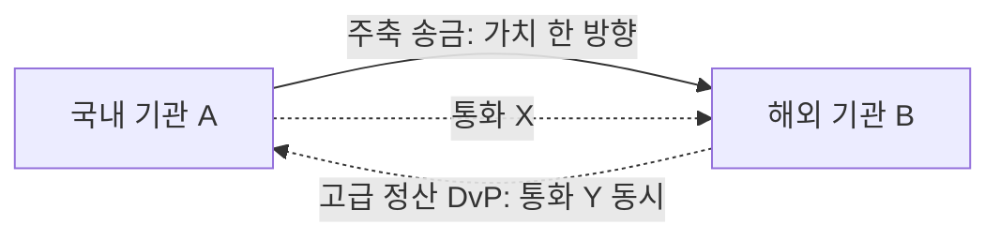

> **학습 코스 (번역본 아님)** — [코스 맵](index.md)으로 돌아가기.

# S0 — 오프닝: 한 건의 가치 이동

## 질문
**국내 기관 A가 해외 기관 B에게 가치를 보낸다. 이 한 건이 무엇을 불러낼까?**

## 기초

이 코스 전체를 관통하는 사건은 단순하다.

> 국내 기관 A가 해외 기관 B에게 **가치를 보낸다.**

한 문장이지만, 이걸 제대로 처리하려면 다음 질문들이 줄줄이 따라온다. 이 코스의 단계들이 그 질문에 하나씩 답한다.

- A가 그 자산을 보낼 **자격**은 어떻게 증명되나? → <abbr class="gloss" title="Canton에서 권한과 데이터 가시성의 주체가 되는 식별 가능한 참여 주체">파티</abbr>·키 (S2)
- "보낸다"는 **규칙**은 어디에 코드로 적혀 있나? → <abbr class="gloss" title="다자간 워크플로를 위해 설계된 Canton의 스마트 컨트랙트 언어">Daml</abbr> <abbr class="gloss" title="원장에 기록되는 불변 데이터 단위. 상태 변경은 새 컨트랙트 생성으로 표현됨">컨트랙트</abbr> (S3)
- 이 기록은 **어디에** 저장되나? A의 서버? B의 서버? 글로벌 체인? → 노드·<abbr class="gloss" title="거래·컨트랙트가 기록되는 장부. Canton에선 활성 컨트랙트의 모음">원장</abbr> (S4)
- 이 거래를 **누가 볼 수 있나?** → 프라이버시 (S5)
- 보내는 도중 사고가 나면? **절반만** 가는 일이 있나? → <abbr class="gloss" title="트랜잭션이 전부 적용되거나 전혀 적용되지 않는 성질. 일부만 반영되는 일이 없음">원자성</abbr> (S6)
- 오가는 그 "통화"는 대체 **무엇**인가? → 토큰·<abbr class="gloss" title="토큰(자산)의 발행자가 운영하며 발행·소각과 정산 증빙(choice context)을 책임지는 주체">레지스트리</abbr> (S8)
- 한번 보내면 **되돌릴 수 있나?** → <abbr class="gloss" title="트랜잭션이 되돌려지지 않는다고 보장되는 상태. 확률적(점점 굳음) vs 결정적(즉시 최종)">확정성</abbr> (S10)

### 한 방향과 양방향
이 코스의 **주축 시나리오는 해외송금** — A가 B에게 보내는 **한 방향**이다. 대부분의 Canton 핵심 개념을 이걸로 배운다.

같은 그림을 살짝 비틀면 더 어려운 시나리오가 나온다. A는 B에게 원화 토큰을 보내고, **동시에** B는 A에게 엔화 토큰을 보낸다 — **양방향 맞교환**, 곧 **정산(<abbr class="gloss" title="인도-대-지급(Delivery vs Payment). 자산 인도와 대금 지급을 동시·원자적으로 처리">DvP</abbr>)**이다. 여기선 "누가 먼저 보내지?"라는 새 문제가 생긴다. 이건 [S6](s06-atomicity-dvp.md)에서 정식으로 도입한다.

핵심 개념은 두 시나리오에서 똑같다. 송금으로 개념을 익히고, 맞교환에서 **원자성의 필요**가 왜 절실해지는지 본다.

### 왜 이더리움도, 전통 금융도 아닌 Canton인가?
A가 B에게 보내는 이 한 건을 오늘날 처리하는 두 가지 익숙한 방법이 있다.

- **전통 금융**: <abbr class="gloss" title="다른 나라 은행과 제휴해 국경 간 송금·결제를 대행하는 중개 은행(correspondent bank)">환거래은행</abbr>을 거치고 <abbr class="gloss" title="은행 간 결제 지시를 주고받는 국제 메시징 망. 자금 자체가 아니라 메시지만 오감">SWIFT</abbr> 메시지를 주고받는다. 며칠 걸리고, 중개가 많고, 양쪽 장부를 나중에 대조해야 한다.
- **이더리움(퍼블릭 체인)**: 빠르고 중개가 없지만, **모든 거래가 전 세계에 공개**된다. A와 B가 얼마를 주고받았는지 누구나 본다 — 기관 금융엔 치명적이다.

Canton은 **두 약점을 동시에** 노린다: 퍼블릭 체인의 원자성·즉시성은 가져오되, **당사자만 보는 프라이버시**를 더한다. 이게 왜 가능한지가 이 코스의 본론이다.

## 심화

지금 단계에서 미리 던져두는 구체 좌표(뒤에서 실제 값으로 채운다):

- A·B는 이더리움 주소 같은 게 아니라 **파티(party)**로 식별된다. 형태는 `<hint>::<키지문>` (S2).
- "보낸다"는 행위는 Daml **컨트랙트의 choice**(권한 있는 당사자만 실행) (S3).
- 저장 위치는 글로벌 체인이 아니라 **A의 노드와 B의 노드** — 각자 자기 것만 (S4).

## 강의 노트
- **핵심 한 문장**: "A가 B에게 가치를 보낸다 — 이 한 건을 끝까지 따라가면 Canton의 모든 개념이 나온다."
- **비유**: 추리 소설의 첫 장면. 사건(가치 이동)을 던지고, 각 단계가 단서를 하나씩 푼다.
- **무엇을 보여주며 짚을지**: 위 한 방향/양방향 다이어그램. "오늘은 한 방향만, 양방향은 S6에서"라고 못 박는다.
- **예상 질문 & 답**:
  - Q: "그냥 송금이면 은행으로 충분하잖아요?" → A: "맞다. 그래서 S1에서 '그 은행 방식이 왜 느리고 위험한지'부터 본다."
  - Q: "Canton은 코인인가요?" → A: "아니다. Canton은 네트워크(인프라). <abbr class="gloss" title="트랜잭션 수수료와 밸리데이터 보상에 쓰이는 네이티브 유틸리티 토큰(CC)">Canton Coin</abbr>은 그 위 수수료 토큰일 뿐. S8·S9에서 구분한다."

## 다음 단계
그럼 오늘날 이 송금은 실제로 어떻게 처리되고, 왜 느리고 위험한가? → [S1 — 국경 간의 두 고통](s01-problem.md)

<!-- nav:start -->

---

⬅️ **이전**: [Canton 입문 학습 코스 (백엔드 개발자용)](index.md) ・ ➡️ **다음**: [S1 — 국경 간의 두 고통](s01-problem.md)

<!-- nav:end -->
