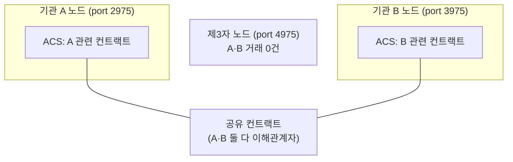

> **학습 코스 (번역본 아님)** — [코스 맵](index.md) · 이전: [S3](s03-daml-contract.md)

# S4 — 참여자 노드 & 원장

**이 기록은 어디에 저장되나? A의 서버? B의 서버? 아니면 글로벌 체인?**

이더리움의 <abbr class="gloss" title="거래·컨트랙트가 기록되는 장부. Canton에선 활성 컨트랙트의 모음">원장</abbr>은 단일 글로벌 상태다. 모든 풀노드가 모든 <abbr class="gloss" title="원장에 기록되는 불변 데이터 단위. 상태 변경은 새 컨트랙트 생성으로 표현됨">컨트랙트</abbr>·잔액을 복제하고, 누구의 거래든 모두가 본다. Canton은 정반대다.

## 글로벌 사본은 없다

Canton에서는 **<abbr class="gloss" title="파티를 호스팅하고 그 파티의 컨트랙트를 저장·실행하는 노드. 밸리데이터의 핵심 구성요소">참여자 노드</abbr>(<abbr class="gloss" title="파티를 호스팅하고 그 파티의 컨트랙트 데이터를 저장하는 참여자 노드">밸리데이터</abbr>)**가 각자 **자기 <abbr class="gloss" title="Canton에서 권한과 데이터 가시성의 주체가 되는 식별 가능한 참여 주체">파티</abbr>가 <abbr class="gloss" title="어떤 컨트랙트와 관계를 맺어 그것을 보거나 승인하는 파티 = 서명자 + 관찰자">이해관계자</abbr>인 컨트랙트만** 저장한다. 전체를 담은 글로벌 사본은 어디에도 없다.

- 기관 A의 노드는 A가 <abbr class="gloss" title="컨트랙트의 주된 권한자. 생성·보관(소비)에 반드시 동의해야 하는 파티">서명자</abbr>·<abbr class="gloss" title="컨트랙트를 볼 수 있으나 단독으로 행위할 수는 없는 파티">관찰자</abbr>인 컨트랙트만 <abbr class="gloss" title="컨트랙트를 소비해 비활성으로 만드는 것(archive). 보관된 컨트랙트는 더 이상 쓸 수 없음">보관</abbr>한다.
- 기관 B의 노드는 B가 이해관계자인 컨트랙트만 보관한다.
- A·B가 **둘 다** 이해관계자인 컨트랙트는 **양쪽 노드에 같은 사본**으로 존재한다.

이 마지막이 핵심이다. A와 B가 공유하는 컨트랙트는 두 개의 별도 기록이 아니라 **하나의 공유 컨트랙트**다.

## 그래서 대조가 필요 없다

전통 금융에선 A 은행 장부와 B 은행 장부가 별개라 사후에 맞춰봐야 한다(대조, reconciliation). Canton에선 A·B가 공유하는 컨트랙트가 물리적으로 같은 한 건이라, **맞춰볼 두 장부 자체가 없다.** [S1](s01-problem.md)에서 본 대조 부담이 여기서 사라진다.

일관성은 어떻게 보장되나? 가시성만 분산될 뿐, 순서와 확정은 <abbr class="gloss" title="상태를 저장하지 않고 트랜잭션 합의·순서를 조율하는 Canton 구성요소">Synchronizer</abbr>가 책임진다([S9](s09-architecture.md)). 공유 컨트랙트는 양쪽이 같은 사본을 들고, 그 사본이 언제 유효해지는지를 <abbr class="gloss" title="여러 노드가 트랜잭션의 유효성·순서에 함께 동의하는 절차">합의</abbr>가 정한다.

## 노드가 실제로 들고 있는 것 — ACS와 offset

노드가 보관하는 "현재 유효한 컨트랙트 전체"가 **<abbr class="gloss" title="활성 컨트랙트 집합(Active Contract Set). 노드가 보관 중인, 현재 유효한 컨트랙트 전체">ACS</abbr>(<abbr class="gloss" title="아직 보관(소비)되지 않아 현재 유효한 컨트랙트">활성 컨트랙트</abbr> 집합)**다. choice로 컨트랙트를 보관하면 ACS에서 빠지고, 새로 생성하면 들어온다([S3](s03-daml-contract.md)).

데모 백엔드는 노드에 ACS를 이렇게 묻는다(Ledger API v2).

```
POST http://127.0.0.1:<port>/v2/state/active-contracts
  → 그 파티가 이해관계자인 활성 컨트랙트만 돌아온다
```

여기서 **포트가 곧 노드**다. 데모에선 기관 A 노드가 `2975`, 기관 B 노드가 `3975`, 거래에 끼지 않은 제3자 노드가 `4975`다. 같은 거래라도 어느 포트에 묻느냐에 따라 보이는 게 달라지는데, 이게 [S5](s05-privacy.md) 프라이버시의 실측 근거가 된다.

"원장의 어디까지 봤나"는 **<abbr class="gloss" title="Ledger API에서 원장 이벤트의 위치를 가리키는 단조 증가 위치값(체크포인트 용도)">offset</abbr>**으로 가리킨다. 단조 증가하는 위치값이라 "지금 원장의 끝"을 알아내(`/v2/state/ledger-end`) 그 지점부터 스트리밍하거나, 마지막으로 처리한 offset을 체크포인트로 저장한다. DB 변경 로그의 위치(LSN) 같은 개념이다.



"노드마다 자기 것만 본다"면, A·B의 거래를 제3자가 정말 못 보는 걸까? 이게 Canton의 첫 번째 핵심 차별이다. → [S5 — 프라이버시](s05-privacy.md)

<!-- nav:start -->

---

⬅️ **이전**: [S3 — Daml 컨트랙트](s03-daml-contract.md) ・ ➡️ **다음**: [S5 — 프라이버시 (핵심 차별 1)](s05-privacy.md)

<!-- nav:end -->
