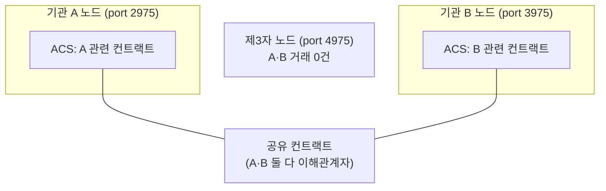

> **학습 코스 (번역본 아님)** — [코스 맵](index.md) · 이전: [S3](s03-daml-contract.md)

# S4 — 참여자 노드 & 원장

## 질문
**이 기록은 어디에 저장되나? A의 서버? B의 서버? 글로벌 체인인가?**

## 기초

이더리움의 <abbr class="gloss" title="거래·컨트랙트가 기록되는 장부. Canton에선 활성 컨트랙트의 모음">원장</abbr>은 **단일 글로벌 상태**다. 모든 풀노드가 모든 <abbr class="gloss" title="원장에 기록되는 불변 데이터 단위. 상태 변경은 새 컨트랙트 생성으로 표현됨">컨트랙트</abbr>·잔액을 복제한다. 누구 거래든 모두가 본다.

Canton은 반대다. **<abbr class="gloss" title="파티를 호스팅하고 그 파티의 컨트랙트를 저장·실행하는 노드. 밸리데이터의 핵심 구성요소">참여자 노드</abbr>(<abbr class="gloss" title="파티를 호스팅하고 그 파티의 컨트랙트 데이터를 저장하는 참여자 노드">밸리데이터</abbr>)**가 각자 **자기 <abbr class="gloss" title="Canton에서 권한과 데이터 가시성의 주체가 되는 식별 가능한 참여 주체">파티</abbr>가 <abbr class="gloss" title="어떤 컨트랙트와 관계를 맺어 그것을 보거나 승인하는 파티 = 서명자 + 관찰자">이해관계자</abbr>인 컨트랙트만** 저장한다. 글로벌 사본은 없다.

- 기관 A의 노드는 A가 <abbr class="gloss" title="컨트랙트의 주된 권한자. 생성·보관(소비)에 반드시 동의해야 하는 파티">서명자</abbr>·<abbr class="gloss" title="컨트랙트를 볼 수 있으나 단독으로 행위할 수는 없는 파티">관찰자</abbr>인 컨트랙트만 <abbr class="gloss" title="컨트랙트를 소비해 비활성으로 만드는 것(archive). 보관된 컨트랙트는 더 이상 쓸 수 없음">보관</abbr>.
- 기관 B의 노드는 B가 이해관계자인 컨트랙트만 보관.
- A·B가 **둘 다** 이해관계자인 컨트랙트는 **양쪽 노드에 같은 사본**이 있다 — 이게 "공유 진실"이다.

### "대조(reconciliation)가 불필요"의 진짜 의미
전통 금융에선 A 은행 장부와 B 은행 장부가 **별개**라 사후에 맞춰봐야 한다(대조). Canton에선 A·B가 공유하는 컨트랙트는 **물리적으로 같은 한 건**이다. 서로 다른 두 장부가 아니라 **하나의 공유 컨트랙트**라, 맞춰볼 것이 애초에 없다.

### 친숙한 것 → Canton 대응
| 친숙한 개념 | Canton |
|---|---|
| 우리 회사 DB | 우리 노드의 <abbr class="gloss" title="활성 컨트랙트 집합(Active Contract Set). 노드가 보관 중인, 현재 유효한 컨트랙트 전체">ACS</abbr>(내 파티 관련 컨트랙트만) |
| 거래 상대 회사 DB | 상대 노드의 ACS |
| 두 DB를 맞추는 배치 | (불필요 — 공유 컨트랙트는 한 건) |
| DB 변경 로그/오프셋 | Ledger API <abbr class="gloss" title="Ledger API에서 원장 이벤트의 위치를 가리키는 단조 증가 위치값(체크포인트 용도)">offset</abbr> |

### 이더리움 비교 / 전통 비교
| | 전통(국경 간) | 이더리움 | Canton |
|---|---|---|---|
| 저장 위치 | 기관마다 자기 장부 | 모든 노드가 전부 복제 | 노드마다 자기 파티 관련만 |
| 일관성 | 사후 대조 필요 | 글로벌 <abbr class="gloss" title="여러 노드가 트랜잭션의 유효성·순서에 함께 동의하는 절차">합의</abbr>로 단일 | 공유 컨트랙트라 대조 불필요 |
| 가시성 | 중개기관은 다 봄 | 전부 공개 | 이해관계자만 |

## 심화

### ACS — 노드가 실제로 들고 있는 것
노드가 보관하는 "현재 유효한 컨트랙트 전체"가 **ACS(<abbr class="gloss" title="아직 보관(소비)되지 않아 현재 유효한 컨트랙트">활성 컨트랙트</abbr> 집합)**다. choice로 컨트랙트를 보관(archive)하면 ACS에서 빠지고, 새로 생성하면 들어온다(S3).

데모 백엔드는 노드에 ACS를 이렇게 묻는다(Ledger API v2, 개념):

```
POST http://127.0.0.1:<port>/v2/state/active-contracts
  → 그 파티가 이해관계자인 활성 컨트랙트만 돌아온다
```

여기서 **포트가 곧 노드**다. 데모에선 기관 A 노드 = `2975`, 기관 B 노드 = `3975`, 제3자 노드 = `4975`. **같은 거래라도 어느 포트(노드)에 묻느냐에 따라 보이는 게 다르다** — 이게 S5 프라이버시의 실측 근거가 된다.

### offset — "원장의 어디까지 봤나"
**offset**은 원장 이벤트의 위치를 가리키는 단조 증가 값이다. "지금 원장의 끝"을 알아내(`/v2/state/ledger-end`) 그 지점부터 스트리밍하거나, 마지막으로 처리한 offset을 체크포인트로 저장한다. DB의 변경 로그 위치(LSN) 같은 개념이다.



## 강의 노트
- **핵심 한 문장**: "이더리움은 '모두가 모든 것'을 복제, Canton은 '각자 자기 것'만. 그래서 대조가 필요 없다 — 공유분은 애초에 같은 한 건이니까."
- **비유**: 공동 작업 문서. 두 사람이 같은 문서를 공유 편집하면 '두 사본 맞추기'가 필요 없다. 관계없는 사람에겐 그 문서가 보이지도 않는다.
- **무엇을 보여주며 짚을지**: 위 다이어그램에서 제3자 노드(4975)에 'A·B 거래 0건'을 짚으며 S5 예고.
- **예상 질문 & 답**:
  - Q: "그럼 전체 합은 누가 보장하나요? 노드마다 다르게 들고 있으면?" → A: "공유 컨트랙트는 양쪽이 같은 사본 + <abbr class="gloss" title="상태를 저장하지 않고 트랜잭션 합의·순서를 조율하는 Canton 구성요소">Synchronizer</abbr>가 순서·확정을 보장(S10). 일관성은 합의가, 가시성만 분산."
  - Q: "내 노드가 죽으면 내 데이터 사라지나요?" → A: "노드 운영(백업·복제)의 문제. 원장 모델과 별개로 인프라에서 다룬다(S9)."

## 다음 단계
"노드마다 자기 것만 본다"를 봤다. 그럼 A·B 거래를 **제3자가 정말 못 보나**? 이게 Canton의 첫 번째 핵심 차별이다. → [S5 — 프라이버시](s05-privacy.md)

<!-- nav:start -->

---

⬅️ **이전**: [S3 — Daml 컨트랙트](s03-daml-contract.md) ・ ➡️ **다음**: [S5 — 프라이버시 (핵심 차별 1)](s05-privacy.md)

<!-- nav:end -->
