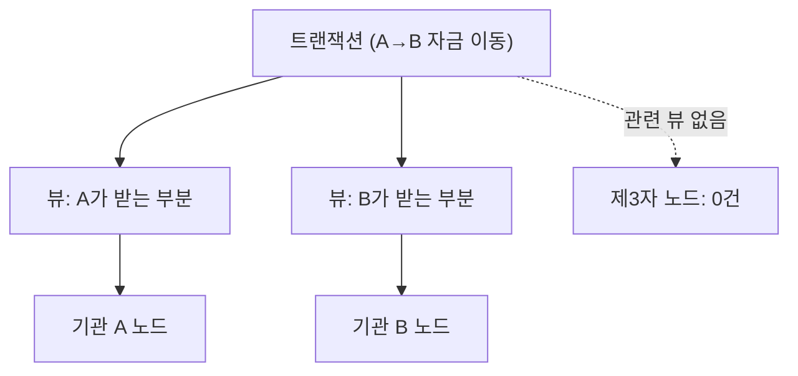

> **학습 코스 (번역본 아님)** — [코스 맵](index.md) · 이전: [S4](s04-nodes-ledger.md)

# S5 — 프라이버시 (핵심 차별 1)

**A·B의 거래를 제3자가 볼까? 이더리움이면 mempool이며 익스플로러에 다 보이는데, Canton은 어떻게 다른가?**

## 퍼블릭 체인에서 트랜잭션은 방송이다

퍼블릭 체인에 <abbr class="gloss" title="원장 상태를 바꾸는 원자적 작업 단위. 하나 이상의 컨트랙트를 생성·보관하며, 전부 적용되거나 전혀 적용되지 않음">트랜잭션</abbr>을 올리면 본질적으로 방송이 된다. 제출하면 mempool에 떠서 누구나 보고, 확정되면 익스플로러에 영구 공개된다. 금액·상대·잔액이 전부 드러난다. 비트코인 백서에서 프라이버시는 거의 맨 끝 각주에 가깝지만(가명성으로 슬쩍 다룬다), 기관 금융에선 프라이버시가 출발점이다 — 거래 상대와 규모는 그 자체가 영업비밀이고 규제 대상이다.

## 부분 트랜잭션 프라이버시 — 한 거래를 뷰로 쪼갠다

Canton의 답은 **<abbr class="gloss" title="한 트랜잭션을 &quot;뷰&quot;로 분해해, 각 파티가 자신과 관련된 부분만 보도록 하는 Canton의 핵심 프라이버시 방식">부분 트랜잭션 프라이버시</abbr>(sub-transaction privacy)**다. 한 트랜잭션을 여러 **<abbr class="gloss" title="한 트랜잭션을 당사자별로 나눈 조각. 각 당사자는 자기 권한에 해당하는 뷰(자기 몫)만 받아 본다">뷰</abbr>(view)**로 나누고, 각 <abbr class="gloss" title="Canton에서 권한과 데이터 가시성의 주체가 되는 식별 가능한 참여 주체">파티</abbr>는 **자신과 관련된 뷰만** 받는다. 같은 트랜잭션이라도 파티마다 받는 내용이 다르다. 순서를 정하는 <abbr class="gloss" title="상태를 저장하지 않고 트랜잭션 합의·순서를 조율하는 Canton 구성요소">Synchronizer</abbr>조차 내용을 보지 못하고 암호봉투만 다룬다([S9](s09-architecture.md)).

DB로 치면 행 수준 보안(row-level security)과 비슷해 보이지만, 더 강하다. 접근을 막는 게 아니라 **데이터가 아예 전달되지 않는다.**

## 같은 트랜잭션, 노드마다 다른 결과

[S4](s04-nodes-ledger.md)에서 본 대로 포트가 곧 노드다. A·B가 거래한 뒤 같은 질의를 각 노드에 보내면 결과가 갈린다.

```
GET …:2975/v2/state/active-contracts   # 기관 A 노드 → A 관련 거래 보임
GET …:3975/v2/state/active-contracts   # 기관 B 노드 → B 관련 거래 보임
GET …:4975/v2/state/active-contracts   # 제3자 노드 → A·B 거래 0건
```

제3자 노드가 0건인 건 **숨겨서가 아니라 그 데이터가 그 노드에 오지 않았기 때문이다.** 거래에 끼지 않았으니 그 <abbr class="gloss" title="원장에 기록되는 불변 데이터 단위. 상태 변경은 새 컨트랙트 생성으로 표현됨">컨트랙트</abbr>의 뷰를 애초에 받지 않는다. 프라이버시가 접근 제어가 아니라 **데이터 분배** 수준에서 보장된다는 게 핵심이다. (데모는 이 세 뷰를 나란히 그려 "당사자는 보고, 제3자는 0건"을 눈으로 보여준다. 구체 건수는 환경마다 다르므로 일반화해 설명한다.)

전통 금융과도 다르다. 전통 송금은 공개되진 않지만 중개 사슬의 은행들은 다 본다([S1](s01-problem.md)). Canton에선 거래 당사자가 아니면 중개자조차 못 본다 — 끼지 않은 제3자에게는 거래의 존재 자체가 보이지 않는다.

## 인증은 파티별 토큰으로

각 노드 호출은 그 **파티 자격의 토큰**으로 인증한다. 어느 파티 자격으로 묻느냐가 보이는 범위를 정한다. 데모는 LocalNet의 shared-secret 모드라 HS256 JWT를 쓴다(개념).

```
Authorization: Bearer <파티 자격 JWT>
  payload: { "sub": "<ledger 유저>", "aud": "<ledger audience>" }
```

운영망에선 공유 비밀 대신 정식 IdP(OAuth/OIDC)가 발급한 토큰을 쓴다. 방식이 무엇이든, 인증된 파티가 자기 뷰만 받는다는 원칙은 같다.



프라이버시는 봤다. 그런데 송금은 한 방향이라 단순했다. A·B가 서로 다른 통화를 맞바꾼다면, 한쪽만 가는 사고는 어떻게 막을까? 두 번째 핵심 차별이자 정산의 시작이다. → [S6 — 원자성 & DvP](s06-atomicity-dvp.md)

<!-- nav:start -->

---

⬅️ **이전**: [S4 — 참여자 노드 & 원장](s04-nodes-ledger.md) ・ ➡️ **다음**: [S6 — 원자성 & DvP (핵심 차별 2)](s06-atomicity-dvp.md)

<!-- nav:end -->
