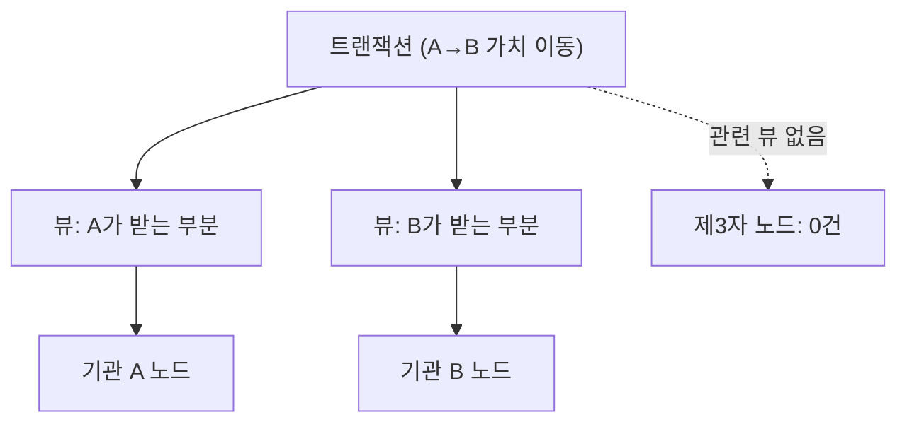

> **학습 코스 (번역본 아님)** — [코스 맵](index.md) · 이전: [S4](s04-nodes-ledger.md)

# S5 — 프라이버시 (핵심 차별 1)

## 질문
**A·B의 거래를 제3자가 볼까? 이더리움이면 mempool·익스플로러에 다 보이잖아?**

## 기초

퍼블릭 체인에서 <abbr class="gloss" title="원장 상태를 바꾸는 원자적 작업 단위. 하나 이상의 컨트랙트를 생성·보관하며, 전부 적용되거나 전혀 적용되지 않음">트랜잭션</abbr>은 본질적으로 **방송**이다. 제출하면 mempool에 떠서 누구나 보고, 확정되면 익스플로러에 영구 공개된다. 금액·상대·잔액이 전부 드러난다. 기관 금융엔 출발선부터 부적합하다.

> 비트코인 백서에서 프라이버시는 **맨 끝 각주**에 가깝다(가명성으로 슬쩍). 기관 금융에선 프라이버시가 **출발점**이다 — 거래 상대·규모는 그 자체가 영업비밀이고 규제 대상이다.

Canton의 답은 **<abbr class="gloss" title="한 트랜잭션을 &quot;뷰&quot;로 분해해, 각 파티가 자신과 관련된 부분만 보도록 하는 Canton의 핵심 프라이버시 방식">부분 트랜잭션 프라이버시</abbr>(sub-transaction privacy)**다. 한 트랜잭션을 여러 **<abbr class="gloss" title="한 트랜잭션을 당사자별로 나눈 조각. 각 당사자는 자기 권한에 해당하는 뷰(자기 몫)만 받아 본다">뷰</abbr>(view)**로 쪼개고, 각 <abbr class="gloss" title="Canton에서 권한과 데이터 가시성의 주체가 되는 식별 가능한 참여 주체">파티</abbr>는 **자신과 관련된 뷰만** 받는다. 같은 트랜잭션이라도 보는 내용이 파티마다 다르다.

### 친숙한 것 → Canton 대응
| 친숙한 개념 | Canton |
|---|---|
| 행 수준 보안(row-level security) | <abbr class="gloss" title="어떤 컨트랙트와 관계를 맺어 그것을 보거나 승인하는 파티 = 서명자 + 관찰자">이해관계자</abbr>만 그 <abbr class="gloss" title="원장에 기록되는 불변 데이터 단위. 상태 변경은 새 컨트랙트 생성으로 표현됨">컨트랙트</abbr> 뷰 수신 |
| 공개 로그 vs 감사 로그 분리 | 거래 내용은 당사자만, 순서만 <abbr class="gloss" title="여러 노드가 트랜잭션의 유효성·순서에 함께 동의하는 절차">합의</abbr> 계층에 |
| 메시지 종단 암호화 | <abbr class="gloss" title="상태를 저장하지 않고 트랜잭션 합의·순서를 조율하는 Canton 구성요소">Synchronizer</abbr>는 암호봉투만 보고 내용 못 봄(S10) |

### 이더리움 비교
| | 이더리움 | Canton |
|---|---|---|
| 제출 단계 | mempool에 공개 | 당사자에게만 전달 |
| 확정 후 | 익스플로러에 영구 공개 | 이해관계자만 열람 |
| 순서 정하는 측 | 검증자가 내용을 봄 | Synchronizer는 암호봉투만(내용 못 봄) |
| 잔액·상대 | 누구나 추적 | 당사자만 |

### 전통 비교
전통 금융도 거래가 "공개"되진 않지만, **중개 사슬의 은행들은 다 본다**(<abbr class="gloss" title="다른 나라 은행과 제휴해 국경 간 송금·결제를 대행하는 중개 은행(correspondent bank)">환거래은행</abbr>·메시징 망). Canton은 중개자조차 **거래 당사자가 아니면 못 본다**. 거래에 끼지 않은 제3자에게는 **존재 자체가 안 보인다.**

## 심화

### 같은 트랜잭션, 파티마다 다른 결과
[S4](s04-nodes-ledger.md)에서 본 대로, 포트가 곧 노드다. A·B가 거래를 한 뒤 **같은 종류의 질의**를 각 노드에 보내면 결과가 다르다.

```
GET …:2975/v2/state/active-contracts   # 기관 A 노드 → A 관련 거래 보임
GET …:3975/v2/state/active-contracts   # 기관 B 노드 → B 관련 거래 보임
GET …:4975/v2/state/active-contracts   # 제3자 노드 → A·B 거래 0건
```

제3자 노드는 거래에 끼지 않았으므로 **그 컨트랙트의 뷰를 애초에 받지 않는다.** 0건이 나오는 건 "숨겨서"가 아니라 **그 데이터가 그 노드에 오지 않았기** 때문이다. 프라이버시가 접근 제어가 아니라 **데이터 분배** 수준에서 보장된다.

> 데모는 이 세 뷰를 나란히 그려 "당사자는 보고, 제3자는 0건"을 눈으로 보여준다. 구체 건수는 환경마다 다르므로 일반화해 설명한다.

### 인증은 어떻게? (파티별 토큰)
각 노드 호출은 **그 파티 자격의 토큰**으로 인증한다. 데모는 LocalNet의 shared-secret 모드라 **HS256** JWT를 쓴다(개념):

```
Authorization: Bearer <파티 자격 JWT>
  payload: { "sub": "<ledger 유저>", "aud": "<ledger audience>" }
```

운영망에선 공유 비밀이 아니라 정식 IdP(OAuth/OIDC) 발급 토큰을 쓴다. 어느 쪽이든 **"내가 어느 파티 자격으로 묻느냐"**가 보이는 범위를 정한다.

### 뷰 분해 그림


## 강의 노트
- **핵심 한 문장**: "이더리움 트랜잭션은 방송, Canton 트랜잭션은 뷰로 쪼개 당사자에게만 배달. 제3자가 0건인 건 막아서가 아니라 데이터가 안 와서다."
- **비유**: 단체 채팅(이더리움) vs 1:1 DM(Canton). DM은 당사자 폰에만 있고, 관계없는 사람 폰엔 메시지가 도착조차 안 한다.
- **무엇을 보여주며 짚을지**: 세 포트(2975/3975/4975) 질의 결과를 나란히. 4975의 0건을 강조.
- **예상 질문 & 답**:
  - Q: "그럼 순서를 정하는 노드는 내용을 보는 거 아닌가요?" → A: "아니다. Synchronizer는 암호봉투(누가 봐도 내용 모르는)만 받아 순서만 매긴다. 내용 검증은 이해관계자가. S10."
  - Q: "감사·규제기관은 어떻게 보나요?" → A: "<abbr class="gloss" title="컨트랙트를 볼 수 있으나 단독으로 행위할 수는 없는 파티">관찰자</abbr>로 명시적으로 넣거나 별도 공개 채널을 둔다. 기본이 '공개'가 아니라 '비공개', 공개는 선택."

## 다음 단계
프라이버시는 봤다. 그런데 송금은 한 방향이라 단순했다. A·B가 **서로 다른 통화를 맞바꾼다면**? 한쪽만 가면 떼인다 — 두 번째 핵심 차별이자 정산의 시작. → [S6 — 원자성 & DvP](s06-atomicity-dvp.md)

<!-- nav:start -->

---

⬅️ **이전**: [S4 — 참여자 노드 & 원장](s04-nodes-ledger.md) ・ ➡️ **다음**: [S6 — 원자성 & DvP (핵심 차별 2)](s06-atomicity-dvp.md)

<!-- nav:end -->
