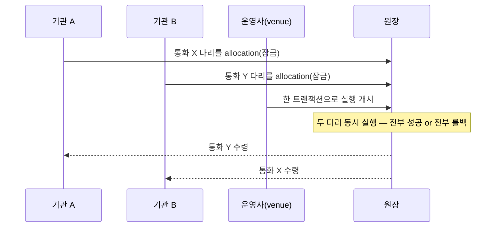

> **학습 코스 (번역본 아님)** — [코스 맵](index.md) · 이전: [S5](s05-privacy.md)

# S6 — 원자성 & DvP (핵심 차별 2)

## 질문
**송금은 한 방향이라 단순했다. 그런데 A·B가 서로 다른 통화를 맞바꾼다면? 한쪽만 가면 떼인다.**

여기서 코스의 **두 번째 시나리오 — 정산(<abbr class="gloss" title="인도-대-지급(Delivery vs Payment). 자산 인도와 대금 지급을 동시·원자적으로 처리">DvP</abbr>)**이 시작된다. 그리고 새 등장인물이 하나 나온다: **<abbr class="gloss" title="정산에서 주문을 매칭하고 원자적 실행을 개시하는 중립 당사자(venue). 자산을 보관하진 않음">운영사</abbr>(venue)**.

## 기초

[S1](s01-problem.md)의 두 번째 고통을 떠올리자. A는 원화 토큰을, B는 엔화 토큰을 맞바꾸려 한다. 둘 다 상대가 먼저 보내길 바란다(<abbr class="gloss" title="거래 상대가 의무(지급·인도)를 이행하지 않을 위험">카운터파티 리스크</abbr>). 송금처럼 "A가 transfer 한 번" 하고 끝나는 게 아니다 — **두 개의 이전(다리, leg)**이 있고, **둘 다 되거나 둘 다 안 되어야** 한다.

이 "전부 아니면 전무"가 **<abbr class="gloss" title="트랜잭션이 전부 적용되거나 전혀 적용되지 않는 성질. 일부만 반영되는 일이 없음">원자성</abbr>(atomicity)**이고, 자산 인도와 대금 지급을 묶는 게 금융의 **DvP(인도-대-지급)**다.

### 원자성·잠금·조합성 — 셋 다 이더리움도 된다
흔한 오해: "원자적 DvP는 Canton(또는 UTXO)이라서 가능하다." **방향은 맞지만 부정확하다.** DvP를 떠받치는 세 요소는 이더리움에서도 된다.

| 요소 | 뜻 | 이더리움도? | Canton의 추가점 |
|---|---|---|---|
| 원자성 | 한 <abbr class="gloss" title="원장 상태를 바꾸는 원자적 작업 단위. 하나 이상의 컨트랙트를 생성·보관하며, 전부 적용되거나 전혀 적용되지 않음">트랜잭션</abbr> 전부/전무 | 된다(한 호출 내 원자 스왑) | 결정적 확정(되감기 없음, S10) |
| 자산 잠금 | 실행 전 자산을 묶음 | 된다(에스크로·approve) | **특정 <abbr class="gloss" title="원장에 기록되는 불변 데이터 단위. 상태 변경은 새 컨트랙트 생성으로 표현됨">컨트랙트</abbr>를 집어 잠금** → 가변 잔액·approve 함정 없음 |
| 조합성 | 여러 동작을 한 트랜잭션에 | 된다("머니 레고") | **프라이버시 보존 + 다자 네이티브 권한** |

그래서 Canton의 진짜 차별점은 개별 기능이 아니라 **결합**이다:

> 원자성 + 자산 잠금 + 조합성을 **① 프라이버시(상대·금액 비공개) + ② 다자 네이티브 권한 + ③ 결정적 확정**과 **함께** 제공한다. 이더리움은 같은 원자 스왑을 **전부 공개**로, 발신자 1명(`msg.sender`) 기준으로 한다.

### 운영사(venue)는 왜 등장하나?
송금엔 보내는 기관·받는 기관·발행자(<abbr class="gloss" title="토큰(자산)의 발행자가 운영하며 발행·소각과 정산 증빙(choice context)을 책임지는 주체">레지스트리</abbr>)면 충분했다. 정산엔 하나가 더 필요하다 — **운영사**. 주문을 매칭하고 원자적 실행을 **개시(initiate)**하는 중립 당사자다.

중요한 점: **운영사는 자산을 <abbr class="gloss" title="컨트랙트를 소비해 비활성으로 만드는 것(archive). 보관된 컨트랙트는 더 이상 쓸 수 없음">보관</abbr>하지 않는다.** "내가 두 통화를 다 받았다가 바꿔주는" 중앙 중개자가 아니다. 운영사는 두 당사자가 각자 자산을 잠근 뒤 **원자적 실행 버튼**을 누르는 역할만 한다. 자산은 한순간도 운영사를 거치지 않는다 — 그래서 운영사가 떼먹을 수 없다.

> **이 코스 규칙**: 운영사는 정산(S6 이후)에서만 등장한다. 송금 챕터(S0-S5)엔 없었다.

### 전통 비교 — DvP/PvP는 원래 전통 금융 용어
"DvP"는 Canton이 만든 말이 아니다. **BIS**가 정의한 증권 결제 원칙이다(증권 인도와 대금 지급을 동시에 = DvP). 외환의 짝은 **<abbr class="gloss" title="지급-대-지급(Payment vs Payment). 두 통화의 지급을 동시·원자적으로 처리해 한쪽만 가는 일을 막음">PvP</abbr>**이고, 이를 보장하려고 **<abbr class="gloss" title="외환 거래를 동시 맞교환(PvP)으로 정산해 Herstatt 리스크를 없애는 다통화 정산 기관">CLS</abbr>** 같은 중앙 정산기관을 둔다. 즉 전통은 원자성을 **중앙 중개자 + 다단계**로 산다. Canton은 같은 보장을 **한 트랜잭션 안에서, 중앙 보관자 없이** 준다.

### 이더리움 비교
이더리움도 한 트랜잭션 안에서 원자적 스왑(atomic composability)을 한다. 하지만 (1) **전부 공개**, (2) 발신자 1명 기준이라 다자 동의는 오프체인 서명·사전 approve가 필요, (3) 확정이 **확률적/에폭 기반**이라 되감길 여지가 있다(S10). Canton은 이 세 가지를 다르게 푼다.

## 심화

### 한 트랜잭션 = 다중 동작 = 전부/전무
정산 실행은 **한 <abbr class="gloss" title="다자간 워크플로를 위해 설계된 Canton의 스마트 컨트랙트 언어">Daml</abbr> 트랜잭션** 안에서 양쪽 다리를 모두 처리한다. 한 다리라도 실패하면 트랜잭션 전체가 적용되지 않는다(보관도, 생성도 없음). 절반 상태가 <abbr class="gloss" title="거래·컨트랙트가 기록되는 장부. Canton에선 활성 컨트랙트의 모음">원장</abbr>에 남는 일이 없다.

### 잠금 = allocation
실행 직전, 각 당사자는 자기 자산을 그 거래에 **묶어둔다 — <abbr class="gloss" title="정산 실행 전에 자산을 특정 거래에 묶어두는(잠그는) 토큰표준 동작">allocation</abbr>**. 이더리움의 approve(가변 잔액에 대한 권한)와 달리, Canton은 **특정 자산 컨트랙트를 집어** 잠근다. "내 밑에서 잔액이 바뀌어 실행이 깨지는" 일이 없다.

실제 choice 이름과 단계별 시퀀스(`SettlementProposal_Accept` → `…_InitiateSettlement` → `Settlement_Execute`)는 [S7](s07-scenario-flows.md)에서 값으로 본다.

### 실측 직관 (라이선싱 예제)
이 원리는 정산 외에도 보인다. LocalNet 라이선싱 예제에서 한 choice가 **잠긴 <abbr class="gloss" title="트랜잭션 수수료와 밸리데이터 보상에 쓰이는 네이티브 유틸리티 토큰(CC)">Canton Coin</abbr> 소비 + 옛 License 폐기 + 새 License 생성**을 한 트랜잭션·원자적으로 처리했고, 카운터<abbr class="gloss" title="Canton에서 권한과 데이터 가시성의 주체가 되는 식별 가능한 참여 주체">파티</abbr>는 **자기 다리만** 봤다. 발행자가 다른 자산(CC ↔ 앱의 License)을 **프라이버시 보존 + 원자적**으로 조합한 사례다.

## 강의 노트
- **핵심 한 문장**: "원자성·잠금·조합성은 이더리움도 된다. Canton의 차별점은 그걸 프라이버시 + 다자 권한 + 결정적 확정과 **함께** 준다는 것."
- **비유**: 안전한 중고 직거래. 운영사 = 둘이 물건·돈을 각자 사물함에 넣었는지 점검하고 '동시 개봉' 버튼만 누르는 사람. 물건·돈을 자기가 들고 있지 않는다.
- **무엇을 보여주며 짚을지**: 위 시퀀스에서 "운영사는 자산을 안 거친다"를 화살표로 짚는다(L↔A, L↔B만 자산 이동, V는 개시만).
- **예상 질문 & 답**:
  - Q: "이더 atomic swap이랑 결국 같은 거 아닌가요?" → A: "원자성만 보면 비슷. 차이는 공개 여부·다자 권한·되감기. 그 결합이 핵심."
  - Q: "운영사가 자산을 안 들면 어떻게 보장하나요?" → A: "양쪽이 allocation으로 잠근 자산을 운영사가 '실행 개시'만. 한쪽이라도 안 잠그면 실행 자체가 성립 안 함."

## 다음 단계
원자성의 원리를 봤다. 그럼 송금·정산의 **실제 호출**은 어떻게 생겼나 — 단일 transfer vs 정산 choice 시퀀스를 나란히. → [S7 — 시나리오 흐름](s07-scenario-flows.md)

<!-- nav:start -->

---

⬅️ **이전**: [S5 — 프라이버시 (핵심 차별 1)](s05-privacy.md) ・ ➡️ **다음**: [S7 — 시나리오 흐름 (송금 · 정산)](s07-scenario-flows.md)

<!-- nav:end -->
