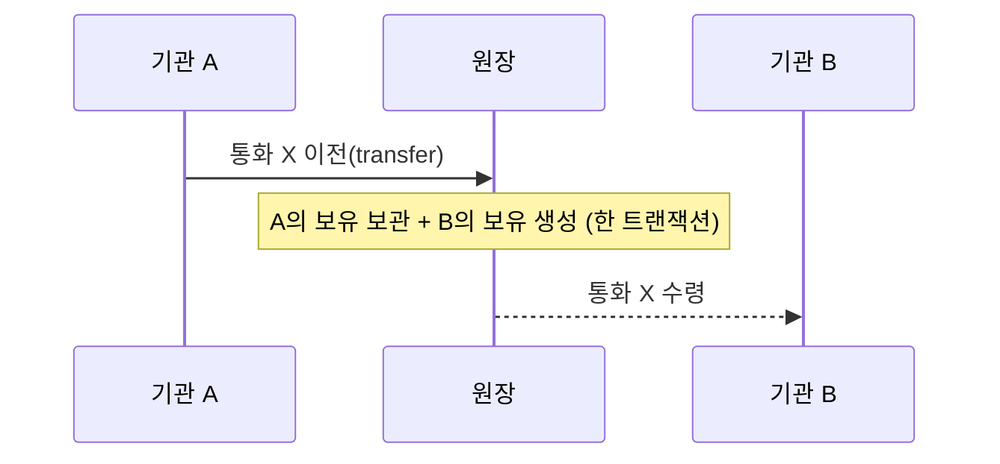
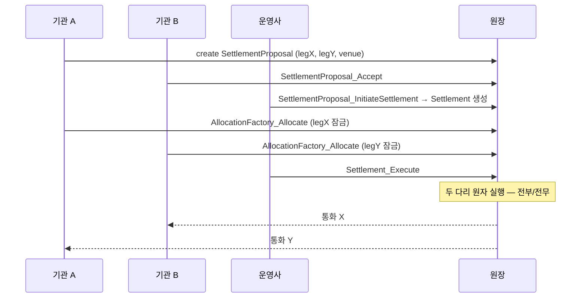

> **학습 코스 (번역본 아님)** — [코스 맵](index.md) · 이전: [S6](s06-atomicity-dvp.md)

# S7 — 시나리오 흐름 (송금 · 정산)

**송금과 정산의 실제 호출은 어떻게 생겼나? choice를 어떤 순서로 부르나?**

두 시나리오를 나란히 놓으면 "송금은 한 방, 정산은 여러 단계"가 한눈에 보인다. 같은 Canton 원리(<abbr class="gloss" title="원장에 기록되는 불변 데이터 단위. 상태 변경은 새 컨트랙트 생성으로 표현됨">컨트랙트</abbr>·choice·<abbr class="gloss" title="어떤 컨트랙트와 관계를 맺어 그것을 보거나 승인하는 파티 = 서명자 + 관찰자">이해관계자</abbr>)를 쓰되 단계 수만 다르다.

| | 해외송금 (주축) | 정산 / <abbr class="gloss" title="인도-대-지급(Delivery vs Payment). 자산 인도와 대금 지급을 동시·원자적으로 처리">DvP</abbr> (고급) |
|---|---|---|
| 방향 | 한 방향 (A→B) | 양방향 맞교환 (A↔B) |
| 다리 수 | 1 | 2 |
| 등장 <abbr class="gloss" title="Canton에서 권한과 데이터 가시성의 주체가 되는 식별 가능한 참여 주체">파티</abbr> | 보내는 기관·받는 기관·발행자 | + <abbr class="gloss" title="정산에서 주문을 매칭하고 원자적 실행을 개시하는 중립 당사자(venue). 자산을 보관하진 않음">운영사</abbr>(venue) |
| 호출 | 단일 transfer | 제안 → 수락 → 개시 → 잠금 → 실행 |
| 핵심 보장 | 이전의 <abbr class="gloss" title="트랜잭션이 되돌려지지 않는다고 보장되는 상태. 확률적(점점 굳음) vs 결정적(즉시 최종)">확정성</abbr> | 전부/전무 <abbr class="gloss" title="트랜잭션이 전부 적용되거나 전혀 적용되지 않는 성질. 일부만 반영되는 일이 없음">원자성</abbr> |

## 송금: 단일 transfer

주축 시나리오는 단순하다. A가 자기 자산(토큰)을 B에게 이전하는 한 동작이다. 토큰표준의 transfer로 처리되고, 결과로 B가 이해관계자인 새 보유(holding) 컨트랙트가 생긴다.



## 정산: 다섯 단계 choice 시퀀스

정산은 이 PoC의 정산 패키지(`Settlement.FxDvp`) <abbr class="gloss" title="컨트랙트의 구조와 규칙(권한·초이스)을 정의하는 Daml 청사진">템플릿</abbr>으로 처리된다. 실제 choice 이름과 순서는 다음과 같다.

```
1. (A) SettlementProposal 생성
        — 두 다리(transferLegs)와 운영사(venue)를 담은 제안서

2. (B) SettlementProposal_Accept            [소비형]
        — 상대 당사자가 승인. 제안서를 보관하고 승인자를 추가한 새 제안서를 생성
        (반환형 ContractId SettlementProposal — 보관+재생성으로 서명자가 쌓임)

3. (운영사) SettlementProposal_InitiateSettlement   [소비형]
        — 제안서를 소비하고 Settlement 컨트랙트를 생성

4. (A) AllocationFactory_Allocate  /  (B) AllocationFactory_Allocate
        — 각자 자기 다리 자산을 이 정산에 잠금(allocation)
        (레지스트리의 allocation factory 통해; 토큰표준 측 동작 — S8)

5. (운영사) Settlement_Execute              [소비형]
        — 한 트랜잭션에서 양쪽 다리를 원자적으로 실행
        (내부적으로 각 다리의 Allocation_ExecuteTransfer를 묶어 exercise)
```



읽을 때 짚을 점 셋이다. `SettlementProposal_Accept`는 [S3](s03-daml-contract.md)에서 본 대로 소비형이라, 승인할 때마다 제안서를 <abbr class="gloss" title="컨트랙트를 소비해 비활성으로 만드는 것(archive). 보관된 컨트랙트는 더 이상 쓸 수 없음">보관</abbr>하고 승인자를 추가한 새 제안서를 만든다 — "보관 + 재생성"으로 다자 동의가 쌓인다. `InitiateSettlement`·`Execute`도 소비형이라 단계가 넘어갈 때마다 옛 컨트랙트가 보관되고 다음 컨트랙트가 생긴다. 그리고 자산이 실제로 움직이는 건 마지막 `Settlement_Execute` 한 번뿐이며, 그게 전부/전무다 — 그 전(<abbr class="gloss" title="정산 실행 전에 자산을 특정 거래에 묶어두는(잠그는) 토큰표준 동작">allocation</abbr>까지)은 잠금일 뿐이고 한쪽이라도 안 잠그면 실행 자체가 성립하지 않는다. (운영사가 Execute를 안 누르면? 잠긴 자산은 취소로 풀 수 있다. 자산이 운영사를 거치지 않으니 떼이지 않는다.)

호출 흐름은 봤다. 그럼 그 다리에서 오가는 "통화 X·통화 Y"는 대체 무엇이고 어디서 왔을까? → [S8 — 토큰 & 레지스트리](s08-tokens-registry.md)

<!-- nav:start -->

---

⬅️ **이전**: [S6 — 원자성 & DvP (핵심 차별 2)](s06-atomicity-dvp.md) ・ ➡️ **다음**: [S8 — 토큰 & 레지스트리](s08-tokens-registry.md)

<!-- nav:end -->
