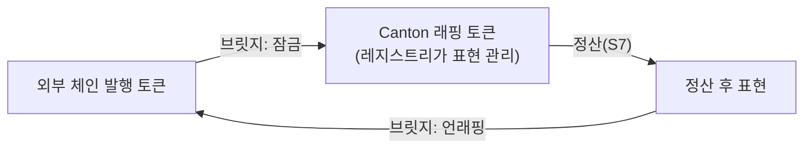
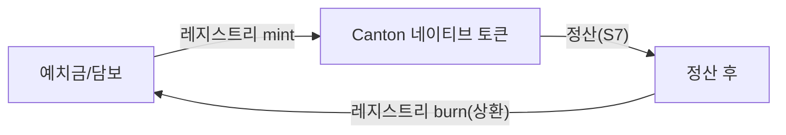

> **학습 코스 (번역본 아님)** — [코스 맵](index.md) · 이전: [S7](s07-scenario-flows.md)

# S8 — 토큰 & 레지스트리

## 질문
**오가는 그 "통화 X·통화 Y"는 대체 무엇이고, 어디서 왔나? 누가 발행하나?**

## 기초

[S7](s07-scenario-flows.md)의 다리에서 움직인 자산은 **토큰**이다. 하지만 토큰이 그냥 떠다니는 게 아니다 — 누군가 **발행**하고, 그 가치를 **보증**해야 한다. 그 주체가 **<abbr class="gloss" title="토큰(자산)의 발행자가 운영하며 발행·소각과 정산 증빙(choice context)을 책임지는 주체">레지스트리</abbr>(registry)**, 곧 **발행자**다.

### 레지스트리 = 발행자
레지스트리는 그 자산의 발행자가 운영하며 두 가지를 책임진다.

1. **발행·소각(mint/burn)** — 토큰을 만들고 없앤다. 보통 실제 예치금·담보에 1:1로 묶여(예: 원화 예치 1단위당 토큰 1단위).
2. **정산 증빙(choice context)** — 정산 실행 시 "이 자산을 이 거래에 써도 된다"는 발행자 측 맥락을 제공한다. [S7](s07-scenario-flows.md)의 `AllocationFactory_Allocate`·`Settlement_Execute`가 이 context를 참조한다.

핵심: 정산 패키지(S3·S7)는 **특정 토큰에 종속되지 않는다.** 토큰표준 인터페이스(보유·잠금·이전)만 쓰므로, 토큰표준을 따르는 **어떤 발행자의 자산으로도** 같은 정산이 돈다.

### 친숙한 것 → Canton 대응
| 친숙한 개념 | Canton |
|---|---|
| 스테이블코인 발행사 | 레지스트리(발행자) |
| 예치금 ↔ 토큰 1:1 | mint/burn |
| ERC-20 <abbr class="gloss" title="원장에 기록되는 불변 데이터 단위. 상태 변경은 새 컨트랙트 생성으로 표현됨">컨트랙트</abbr> 주소 | <abbr class="gloss" title="토큰표준에서 자산을 식별하는 값. 발행자(admin 파티)와 자산 id로 구성">instrumentId</abbr> (발행자 + 자산 id) |
| 결제 승인 콜백 | 레지스트리의 choice context API |

### 이더리움 비교
이더리움 토큰은 보통 **컨트랙트 주소 하나**로 식별되고, 그 컨트랙트 자체가 발행 로직을 담는다. Canton 토큰표준에서 자산은 **instrumentId**(발행자 <abbr class="gloss" title="Canton에서 권한과 데이터 가시성의 주체가 되는 식별 가능한 참여 주체">파티</abbr> + 자산 id)로 식별되고, 발행자(레지스트리)는 정산에 필요한 맥락을 **오프-레저 API**로 함께 제공한다. "토큰 = 온체인 코드 한 덩어리"가 아니라 "토큰 = 표준 인터페이스 + 발행자 서비스"에 가깝다.

## 심화

### instrumentId — 자산의 식별자
토큰표준에서 자산은 다음 구조로 식별된다(필드명).

```
instrumentId {
  admin : Party    -- 발행자(레지스트리) 파티. 예: DSO 파티
  id    : Text     -- 자산 식별 문자열. 예: "Amulet"(Canton Coin의 기술명)
}
```

정산의 각 다리(transferLeg)는 `sender`·`receiver`·`amount`·`instrumentId`를 담는다. 즉 "누가 누구에게, 무엇을, 얼마나"가 한 다리에 들어간다.

> 코스는 형식만 보여준다. `admin`에 들어가는 실제 파티 ID, `id` 문자열은 발행자·환경마다 다르다.

### 레지스트리 오프-레저 API
정산 실행 시 토큰표준은 발행자에게 "이 잠금/실행이 유효한가"의 맥락을 묻는다. 데모에선 개념적으로:

```
GET <레지스트리>/registry/allocations/v1/<allocationCid>/choice-contexts/execute-transfer
  → Settlement_Execute에 넘길 발행자 측 context
```

이 호출이 <abbr class="gloss" title="원장(Daml 컨트랙트) 위에서 실행·기록되는 것. 모든 이해관계자가 공유·검증·강제">온-원장</abbr> choice(`Settlement_Execute`)와 <abbr class="gloss" title="원장 밖, 내 백엔드 인프라에서 실행되는 것. 외부 API·UI·복잡 계산 등 나만 처리">오프-원장</abbr> 발행자 서비스를 잇는다.

### 토큰을 Canton 정산에 들이는 두 패턴
실제 통화 토큰을 Canton 정산에 쓰는 방법은 발행 위치에 따라 갈린다. **둘 다 유효하며, 어느 쪽이 맞는지는 발행 정책에 달렸다.**

**패턴 1 — 외부 발행 + 브릿지(래핑)**
토큰이 다른 체인(예: 퍼블릭 L1)에서 이미 발행돼 있다. 그 토큰을 브릿지로 잠그고, Canton에 **래핑된 표현**을 만들어 정산에 쓴다. 정산이 끝나면 필요 시 다시 언래핑.



- 장점: 기존 토큰·유동성을 그대로 활용.
- 비용: 브릿지 신뢰·운영, 래핑/언래핑 단계.

**패턴 2 — Canton 직접 발행**
레지스트리가 토큰을 **Canton에서 직접** 발행한다(브릿지 없음). 예치금에 1:1로 묶어 Canton 위에서 mint/burn.



- 장점: 브릿지 불필요, 정산과 발행이 같은 <abbr class="gloss" title="거래·컨트랙트가 기록되는 장부. Canton에선 활성 컨트랙트의 모음">원장</abbr>.
- 비용: 발행자가 Canton에서 직접 발행·운영해야.

| | 외부 발행 + 브릿지 | Canton 직접 발행 |
|---|---|---|
| 발행 위치 | 다른 체인 | Canton |
| 브릿지 | 필요 | 불필요 |
| 기존 유동성 | 재사용 | 새로 형성 |
| 신뢰 추가 | 브릿지 | (없음, 발행자만) |

> 어떤 통화를 어느 패턴으로 들일지는 **발행 정책의 문제**이고 고정된 정답은 없다. 코스는 두 경로를 병기한다.

## 강의 노트
- **핵심 한 문장**: "토큰은 그냥 떠다니지 않는다 — 레지스트리(발행자)가 발행·소각하고 정산 증빙을 댄다. 정산 패키지는 토큰 비종속이라 표준만 맞으면 어떤 자산이든 돈다."
- **비유**: 레지스트리 = 상품권 발행사. 상품권(토큰)은 발행사가 보증하고, 가맹점 정산(S7) 때 '이 상품권 진짜냐'를 발행사 시스템(choice context)에 조회.
- **무엇을 보여주며 짚을지**: 두 패턴 다이어그램을 나란히. "브릿지 있냐 없냐"가 유일한 큰 차이임을 짚는다.
- **예상 질문 & 답**:
  - Q: "그래서 우리 통화는 어디서 발행하나요?" → A: "발행 정책에 달렸다. 외부발행+브릿지와 Canton 직접발행 둘 다 가능 — 정해진 건 없다."
  - Q: "<abbr class="gloss" title="트랜잭션 수수료와 밸리데이터 보상에 쓰이는 네이티브 유틸리티 토큰(CC)">Canton Coin</abbr>이 그 통화인가요?" → A: "아니다. CC는 네트워크 수수료(<abbr class="gloss" title="Synchronizer에 쓰기를 요청할 때 소비하는 자원. Canton Coin으로 비용을 지불">트래픽</abbr>) 토큰. 정산되는 통화 토큰은 별개의 레지스트리가 발행한다."

## 다음 단계
토큰의 출처까지 봤다. 그럼 이 모든 걸 돌리려면 실제로 **무엇을 띄우고 어떻게 연결**하나? → [S9 — 아키텍처 & 인프라](s09-architecture.md)

<!-- nav:start -->

---

⬅️ **이전**: [S7 — 시나리오 흐름 (송금 · 정산)](s07-scenario-flows.md) ・ ➡️ **다음**: [S9 — 아키텍처 & 인프라](s09-architecture.md)

<!-- nav:end -->
