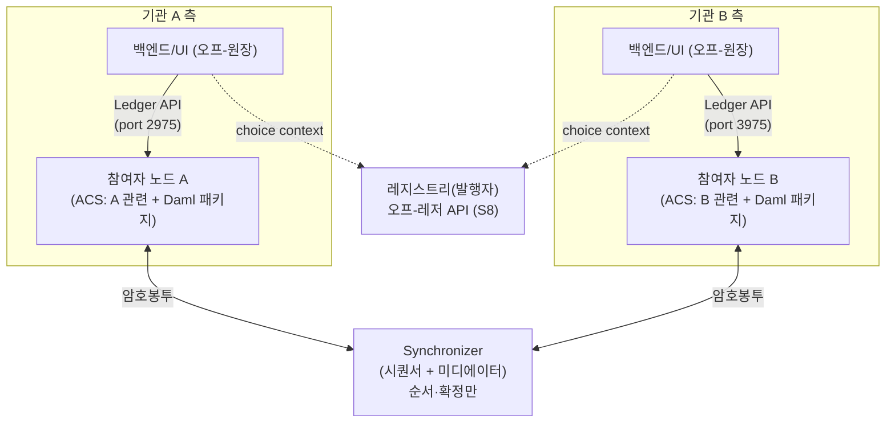

> **학습 코스 (번역본 아님)** — [코스 맵](index.md) · 이전: [S8](s08-tokens-registry.md)

# S9 — 아키텍처 & 인프라

## 질문
**Canton을 돌리려면 무엇을 띄우고 어떻게 연결되나? 앞 단계의 노드·<abbr class="gloss" title="거래·컨트랙트가 기록되는 장부. Canton에선 활성 컨트랙트의 모음">원장</abbr>·choice가 실제 인프라로는 어떤 모습인가?**

이 단계는 S2-S8에 흩어진 구성요소를 **하나의 그림**으로 모은다.

## 기초

Canton 앱은 크게 네 덩어리다.

| 구성요소 | 역할 | 앞 단계 연결 |
|---|---|---|
| **<abbr class="gloss" title="파티를 호스팅하고 그 파티의 컨트랙트를 저장·실행하는 노드. 밸리데이터의 핵심 구성요소">참여자 노드</abbr>(<abbr class="gloss" title="파티를 호스팅하고 그 파티의 컨트랙트 데이터를 저장하는 참여자 노드">밸리데이터</abbr>)** | <abbr class="gloss" title="Canton에서 권한과 데이터 가시성의 주체가 되는 식별 가능한 참여 주체">파티</abbr>를 <abbr class="gloss" title="참여자 노드가 파티를 대신해 원장에서 활동(컨트랙트 저장·트랜잭션 제출·확인)해 주는 것. 로컬 파티는 키까지 노드가 관리하고, 외부 파티는 제출 키를 파티 자신이 보유(노드는 중계)">호스팅</abbr>하고 그 파티의 <abbr class="gloss" title="원장에 기록되는 불변 데이터 단위. 상태 변경은 새 컨트랙트 생성으로 표현됨">컨트랙트</abbr>(<abbr class="gloss" title="활성 컨트랙트 집합(Active Contract Set). 노드가 보관 중인, 현재 유효한 컨트랙트 전체">ACS</abbr>)를 저장·검증 | S2(파티), S4(ACS) |
| **<abbr class="gloss" title="상태를 저장하지 않고 트랜잭션 합의·순서를 조율하는 Canton 구성요소">Synchronizer</abbr>** | <abbr class="gloss" title="원장 상태를 바꾸는 원자적 작업 단위. 하나 이상의 컨트랙트를 생성·보관하며, 전부 적용되거나 전혀 적용되지 않음">트랜잭션</abbr>의 순서·확정만 조율(내용 안 봄). <abbr class="gloss" title="Synchronizer 구성요소. 암호화된 메시지에 전체 순서·타임스탬프를 부여하고 참여자에게 전달">시퀀서</abbr> + <abbr class="gloss" title="Synchronizer 구성요소. 이해관계자들의 확인을 모아 트랜잭션 승인/거부를 판정">미디에이터</abbr>로 구성 | S5(암호봉투), S10(<abbr class="gloss" title="여러 노드가 트랜잭션의 유효성·순서에 함께 동의하는 절차">합의</abbr>) |
| **Ledger API** | 앱이 노드와 대화하는 인터페이스(컨트랙트 조회·command 제출) | S4(<abbr class="gloss" title="Ledger API에서 원장 이벤트의 위치를 가리키는 단조 증가 위치값(체크포인트 용도)">offset</abbr>/ACS) |
| **앱** | <abbr class="gloss" title="원장(Daml 컨트랙트) 위에서 실행·기록되는 것. 모든 이해관계자가 공유·검증·강제">온-원장</abbr> **<abbr class="gloss" title="다자간 워크플로를 위해 설계된 Canton의 스마트 컨트랙트 언어">Daml</abbr> 패키지** + <abbr class="gloss" title="원장 밖, 내 백엔드 인프라에서 실행되는 것. 외부 API·UI·복잡 계산 등 나만 처리">오프-원장</abbr> **백엔드/UI** | S3(<abbr class="gloss" title="컨트랙트의 구조와 규칙(권한·초이스)을 정의하는 Daml 청사진">템플릿</abbr>), S7(흐름) |

### 온-원장 vs 오프-원장
- **온-원장** — Daml 패키지(정산 규칙). 모든 <abbr class="gloss" title="어떤 컨트랙트와 관계를 맺어 그것을 보거나 승인하는 파티 = 서명자 + 관찰자">이해관계자</abbr>가 공유·검증·강제. 바꿀 수 없는 진실.
- **오프-원장** — 백엔드(매칭·RFQ·외부 API 연동·UI). 각자 자기 인프라에서 돌리고, 결과만 Ledger API로 원장에 반영.

정산 보장(<abbr class="gloss" title="트랜잭션이 전부 적용되거나 전혀 적용되지 않는 성질. 일부만 반영되는 일이 없음">원자성</abbr>·프라이버시)은 **온-원장**이 책임지고, 편의·연동은 **오프-원장**이 맡는다.

### Synchronizer의 종류
- **사설/컨소시엄 Synchronizer** — 특정 기관(들)이 운영하는 닫힌 조율 계층.
- **<abbr class="gloss" title="슈퍼 밸리데이터들이 공동 운영하는 Canton의 퍼블릭 조율(합의) 계층">글로벌 Synchronizer</abbr>** — 여러 **<abbr class="gloss" title="글로벌 Synchronizer를 운영하고 네트워크 거버넌스에 참여하는 노드">슈퍼 밸리데이터</abbr>**가 공동 운영하는 공개 백본. 수수료(<abbr class="gloss" title="Synchronizer에 쓰기를 요청할 때 소비하는 자원. Canton Coin으로 비용을 지불">트래픽</abbr>)는 **<abbr class="gloss" title="트랜잭션 수수료와 밸리데이터 보상에 쓰이는 네이티브 유틸리티 토큰(CC)">Canton Coin</abbr>**으로 낸다.

어느 쪽이든 Synchronizer는 **상태를 저장하지 않는다.** 자산·컨트랙트는 참여자 노드에 있고, Synchronizer는 순서·확정만 맡는다.

### 전통 비교
전통 금융에선 중앙 **<abbr class="gloss" title="증권을 집중 예탁·결제하는 중앙예탁기관(Central Securities Depository)">CSD</abbr>·커스터디안**이 장부·결제 인프라를 대행한다(모두가 그 한 곳에 의존). Canton에선 **각 기관이 자기 노드를 직접** 운영하고, 공유 컨트랙트는 같은 사본이라 **대조가 불필요**하다(S4). 중앙 <abbr class="gloss" title="컨트랙트를 소비해 비활성으로 만드는 것(archive). 보관된 컨트랙트는 더 이상 쓸 수 없음">보관</abbr>자에 대한 의존이 사라진다.

## 심화

### 구성요소도 + 데이터 흐름

흐름: 앱(백엔드) → **Ledger API** → 참여자 노드 → (트랜잭션 암호봉투) → **Synchronizer**가 순서·확정 → 이해관계자 노드들이 자기 <abbr class="gloss" title="한 트랜잭션을 당사자별로 나눈 조각. 각 당사자는 자기 권한에 해당하는 뷰(자기 몫)만 받아 본다">뷰</abbr> 수신·검증·<abbr class="gloss" title="트랜잭션이 최종 확정되어 원장에 반영되는 것">커밋</abbr>. 정산이면 발행자 **<abbr class="gloss" title="토큰(자산)의 발행자가 운영하며 발행·소각과 정산 증빙(choice context)을 책임지는 주체">레지스트리</abbr> API**(S8)도 옆에서 호출한다.

### 포트 = 노드 (데모 매핑)
데모에서 각 참여자의 **JSON Ledger API v2** 포트:

| 포트 | 노드(역할) |
|---|---|
| `2975` | 기관 A 쪽 참여자 노드 |
| `3975` | 기관 B 쪽 참여자 노드 |
| `4975` | 제3자(비당사자) 노드 — S5에서 0건 점검용 |

"포트가 곧 노드"라 같은 거래도 어느 포트에 묻느냐로 보이는 게 갈린다(S5).

### 무엇을 어디에 배포하나
- **Daml 패키지(DAR)** — 정산에 참여하는 **모든 참여자 노드**에 업로드·승인(vetting)되어야 한다. 한 노드만 가지면 안 되고, 공유 컨트랙트의 이해관계자 노드 전부가 같은 패키지를 알아야 트랜잭션이 검증된다.
- **<abbr class="gloss" title="정산에서 주문을 매칭하고 원자적 실행을 개시하는 중립 당사자(venue). 자산을 보관하진 않음">운영사</abbr> 백엔드·파티** — 운영사만 배포·보유한다(정산에서만 등장, S6). 다른 기관은 운영사 백엔드를 띄우지 않는다.
- **레지스트리 서비스** — 발행자가 배포(S8).

### 자체호스팅 vs NaaS
- **자체호스팅** — 기관이 참여자 노드를 직접 운영(키·DB·업그레이드 책임). 통제력 ↑, 운영 부담 ↑.
- **NaaS(Node-as-a-Service)** — 노드 운영을 위탁. 운영 부담 ↓, 위탁처 신뢰 필요. (<abbr class="gloss" title="키를 노드(밸리데이터)가 보관·서명하는 파티(=수탁형). '로컬'은 노드 시점 작명 — 키·신원이 노드 안에 있음">로컬 파티</abbr>/<abbr class="gloss" title="키를 파티 주인이 직접 보관하고 거래마다 외부 서명하는 파티(=자기수탁). '외부'는 노드 시점 — 키가 노드 밖에 있음">외부 파티</abbr> 선택[S2]과 맞물린다 — 위탁해도 키는 외부 파티로 직접 쥘 수 있다.)

## 강의 노트
- **핵심 한 문장**: "네 덩어리 — 참여자 노드(저장·검증), Synchronizer(순서·확정만), Ledger API(대화 창구), 앱(온-원장 Daml + 오프-원장 백엔드). DAR은 모든 참여 노드에, 운영사 것은 운영사만."
- **비유**: Synchronizer = 우체국 분류기(봉투 순서만 매기고 내용은 안 봄). 참여자 노드 = 각 기관의 사서함. Ledger API = 창구.
- **무엇을 보여주며 짚을지**: 위 구성요소도. "자산·상태는 노드에, Synchronizer엔 없음"과 "암호봉투"를 짚는다.
- **예상 질문 & 답**:
  - Q: "Synchronizer가 다운되면 거래가 다 멈추나요?" → A: "글로벌 Synchronizer는 분산 <abbr class="gloss" title="비잔틴 장애 허용(Byzantine Fault Tolerance). 일부 노드가 악의적이거나 고장 나도 시스템이 올바르게 동작하는 성질">BFT</abbr>라 일부 SV 장애를 견딘다(S10). 단일 장애점이 아니다."
  - Q: "DAR을 한 노드만 올리면요?" → A: "안 된다. 이해관계자 노드 전부가 같은 패키지를 vetting해야 트랜잭션이 검증·커밋된다."

## 다음 단계
무엇을 띄우는지 봤다. 마지막 핵심: 한번 정산되면 **되돌릴 수 없나? 누가 순서를 정하나?** → [S10 — 확정성 & 합의](s10-finality-consensus.md)

<!-- nav:start -->

---

⬅️ **이전**: [S8 — 토큰 & 레지스트리](s08-tokens-registry.md) ・ ➡️ **다음**: [S10 — 확정성 & 합의](s10-finality-consensus.md)

<!-- nav:end -->
