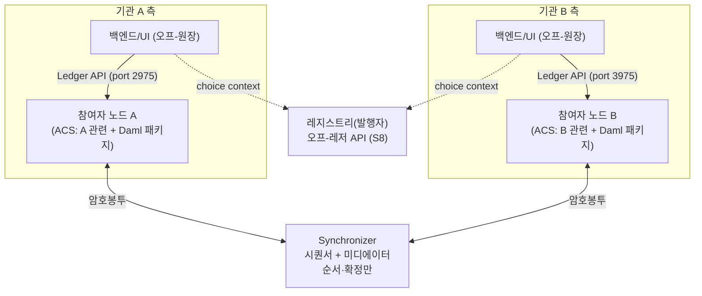
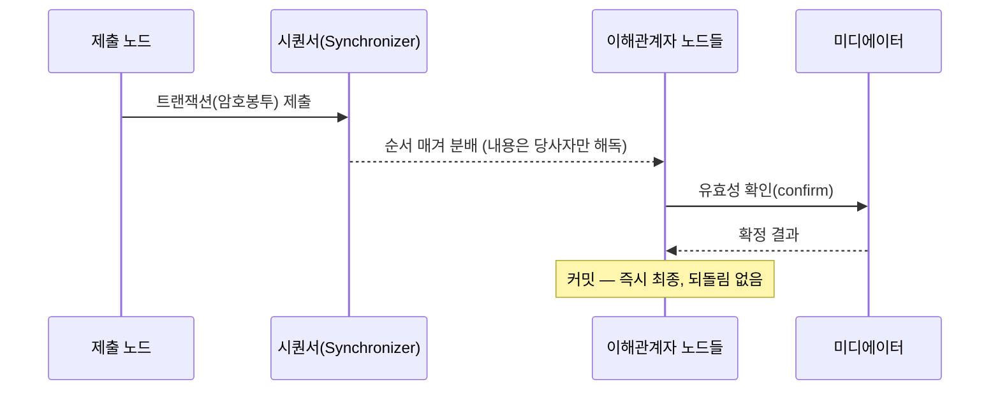

> **학습 코스 (번역본 아님)** — [코스 맵](index.md) · 이전: [S8](s08-tokens-registry.md)

# S9 — 아키텍처 & 합의·확정

**Canton을 돌리려면 무엇을 띄우고 어떻게 연결되나? 그리고 한번 정산되면 되돌릴 수 없나, 순서는 누가 정하나?**

앞 챕터들에 흩어진 구성요소(<abbr class="gloss" title="Canton에서 권한과 데이터 가시성의 주체가 되는 식별 가능한 참여 주체">파티</abbr>·노드·<abbr class="gloss" title="원장에 기록되는 불변 데이터 단위. 상태 변경은 새 컨트랙트 생성으로 표현됨">컨트랙트</abbr>·<abbr class="gloss" title="상태를 저장하지 않고 트랜잭션 합의·순서를 조율하는 Canton 구성요소">Synchronizer</abbr>)를 여기서 하나의 그림으로 모으고, 그 그림이 어떻게 <abbr class="gloss" title="여러 노드가 트랜잭션의 유효성·순서에 함께 동의하는 절차">합의</abbr>에 이르러 되돌릴 수 없는 확정에 도달하는지까지 본다.

## 네 덩어리

Canton 앱은 크게 네 부분이다.

- **<abbr class="gloss" title="파티를 호스팅하고 그 파티의 컨트랙트를 저장·실행하는 노드. 밸리데이터의 핵심 구성요소">참여자 노드</abbr>(<abbr class="gloss" title="파티를 호스팅하고 그 파티의 컨트랙트 데이터를 저장하는 참여자 노드">밸리데이터</abbr>)** — 파티를 <abbr class="gloss" title="참여자 노드가 파티를 대신해 원장에서 활동(컨트랙트 저장·트랜잭션 제출·확인)해 주는 것. 로컬 파티는 키까지 노드가 관리하고, 외부 파티는 제출 키를 파티 자신이 보유(노드는 중계)">호스팅</abbr>하고 그 파티의 컨트랙트(<abbr class="gloss" title="활성 컨트랙트 집합(Active Contract Set). 노드가 보관 중인, 현재 유효한 컨트랙트 전체">ACS</abbr>)를 저장·검증한다([S2](s02-party-ownership.md)·[S4](s04-nodes-ledger.md)).
- **Synchronizer** — <abbr class="gloss" title="원장 상태를 바꾸는 원자적 작업 단위. 하나 이상의 컨트랙트를 생성·보관하며, 전부 적용되거나 전혀 적용되지 않음">트랜잭션</abbr>의 순서·확정만 조율한다(내용은 안 봄). **<abbr class="gloss" title="Synchronizer 구성요소. 암호화된 메시지에 전체 순서·타임스탬프를 부여하고 참여자에게 전달">시퀀서</abbr> + <abbr class="gloss" title="Synchronizer 구성요소. 이해관계자들의 확인을 모아 트랜잭션 승인/거부를 판정">미디에이터</abbr>**로 이뤄진다.
- **Ledger API** — 앱이 노드와 대화하는 인터페이스. 컨트랙트를 조회하고 command를 제출한다.
- **앱** — <abbr class="gloss" title="원장(Daml 컨트랙트) 위에서 실행·기록되는 것. 모든 이해관계자가 공유·검증·강제">온-원장</abbr> **<abbr class="gloss" title="다자간 워크플로를 위해 설계된 Canton의 스마트 컨트랙트 언어">Daml</abbr> 패키지**(정산 규칙)와 <abbr class="gloss" title="원장 밖, 내 백엔드 인프라에서 실행되는 것. 외부 API·UI·복잡 계산 등 나만 처리">오프-원장</abbr> **백엔드/UI**.

여기서 **온-<abbr class="gloss" title="거래·컨트랙트가 기록되는 장부. Canton에선 활성 컨트랙트의 모음">원장</abbr>**은 모든 <abbr class="gloss" title="어떤 컨트랙트와 관계를 맺어 그것을 보거나 승인하는 파티 = 서명자 + 관찰자">이해관계자</abbr>가 공유·검증·강제하는 바꿀 수 없는 진실이고(정산의 <abbr class="gloss" title="트랜잭션이 전부 적용되거나 전혀 적용되지 않는 성질. 일부만 반영되는 일이 없음">원자성</abbr>·프라이버시를 책임진다), **오프-원장**은 매칭·외부 API 연동·UI처럼 각자 자기 인프라에서 돌리고 결과만 Ledger API로 원장에 반영하는 부분이다.

Synchronizer는 두 종류다. **사설/컨소시엄 Synchronizer**는 특정 기관(들)이 운영하는 닫힌 조율 계층이고, **<abbr class="gloss" title="슈퍼 밸리데이터들이 공동 운영하는 Canton의 퍼블릭 조율(합의) 계층">글로벌 Synchronizer</abbr>**는 여러 <abbr class="gloss" title="글로벌 Synchronizer를 운영하고 네트워크 거버넌스에 참여하는 노드">슈퍼 밸리데이터</abbr>가 공동 운영하는 공개 백본이다(수수료는 <abbr class="gloss" title="트랜잭션 수수료와 밸리데이터 보상에 쓰이는 네이티브 유틸리티 토큰(CC)">Canton Coin</abbr>으로). 어느 쪽이든 **Synchronizer는 상태를 저장하지 않는다** — 자산·컨트랙트는 참여자 노드에 있고, Synchronizer는 순서·확정만 맡는다.

## 데이터 흐름

흐름은 이렇다. 앱(백엔드) → **Ledger API** → 참여자 노드 → 트랜잭션 암호봉투를 **Synchronizer**가 순서·확정 → 이해관계자 노드들이 자기 <abbr class="gloss" title="한 트랜잭션을 당사자별로 나눈 조각. 각 당사자는 자기 권한에 해당하는 뷰(자기 몫)만 받아 본다">뷰</abbr>를 받아 검증·<abbr class="gloss" title="트랜잭션이 최종 확정되어 원장에 반영되는 것">커밋</abbr>. 정산이면 발행자 **<abbr class="gloss" title="토큰(자산)의 발행자가 운영하며 발행·소각과 정산 증빙(choice context)을 책임지는 주체">레지스트리</abbr> API**([S8](s08-tokens-registry.md))도 옆에서 호출한다. 데모에선 포트가 곧 노드라, 기관 A 노드 `2975`, 기관 B 노드 `3975`, 제3자 노드 `4975`다 — 같은 거래도 어느 포트에 묻느냐로 보이는 게 갈린다([S5](s05-privacy.md)).

## 순서는 누가 정하나 — 2계층 합의

Canton 합의의 핵심은 **내용 검증과 순서화를 분리**한 것이다.

- **내용 검증(이해관계자 계층)** — "이 트랜잭션이 규칙에 맞나"는 그 거래의 이해관계자 노드들이 검증해 미디에이터에 <abbr class="gloss" title="이해관계자 밸리데이터가 트랜잭션이 유효함을 미디에이터에 응답하는 것(confirmation)">확인</abbr>(confirm)을 보낸다. 관계없는 노드는 내용을 보지도 않는다([S5](s05-privacy.md)).
- **순서화(Synchronizer 계층)** — "트랜잭션들의 전역 순서"는 시퀀서가 정한다. 시퀀서는 **암호봉투**만 받아 순서를 매긴다 — 내용은 못 본다.

"Synchronizer가 내용을 안 보는데 어떻게 합의하나?"의 답이 이것이다. **내용은 당사자가, 순서만 Synchronizer가.** 둘이 분리돼 프라이버시와 합의가 양립한다.

글로벌 Synchronizer의 순서화는 **<abbr class="gloss" title="비잔틴 장애 허용(Byzantine Fault Tolerance). 일부 노드가 악의적이거나 고장 나도 시스템이 올바르게 동작하는 성질">BFT</abbr>(비잔틴 장애 허용)**다. 슈퍼 밸리데이터의 1/3 미만이 고장·악의적이어도 전체는 올바른 단일 순서에 도달한다. 단일 시퀀서 한 대에 의존하지 않으니 단일 장애점이 아니다.

## 되돌릴 수 없다 — 즉시 결정적 확정

[S1](s01-problem.md)의 전통 송금은 <abbr class="gloss" title="거래 체결(T) 후 2영업일 뒤에 실제 결제가 이뤄지는 전통 금융 관행">T+2</abbr>라 그 사이 정정·취소 구간이 있고, 퍼블릭 체인은 빠르지만 되감길 수 있다(체인 재구성). Canton은 **즉시 결정적 확정(immediate deterministic finality)**을 준다 — 트랜잭션이 커밋되면 되돌리지 않는다. 확률적으로 "점점 굳는" 게 아니라 그 순간 최종이다.

무엇이 트랜잭션을 확정시키나. 이해관계자 노드들이 유효성을 미디에이터에 확인하고, 시퀀서가 정한 순서대로 미디에이터가 결과를 확정하면 그 트랜잭션은 커밋된다. 커밋된 컨트랙트는 ACS에 반영되고, <abbr class="gloss" title="컨트랙트를 소비해 비활성으로 만드는 것(archive). 보관된 컨트랙트는 더 이상 쓸 수 없음">보관</abbr>된 컨트랙트는 다시 살릴 수 없다 — 구조적 <abbr class="gloss" title="같은 자산을 두 번 쓰는 부정행위">이중지불</abbr> 방지다. 누가 어떤 파티를 호스팅하고 어떤 키로 서명하는지(<abbr class="gloss" title="어떤 노드·파티·키가 네트워크에 참여하는지를 정의하는 구성 정보">토폴로지</abbr>)도 서명된 트랜잭션으로 관리돼, "누가 무엇에 권한이 있나"가 암호학적으로 못 박힌다.

이게 [S6](s06-atomicity-dvp.md)의 원자성과 합쳐져야 진짜 정산 완결성이 된다. 원자성(한 트랜잭션 전부/전무) + 결정적 확정(되돌림 없음)이 함께여야 "실행됐는데 나중에 되감겼다"가 없다. 이더리움은 검증자가 내용을 보고 확정이 확률적/에폭 단위지만, Canton은 내용 비공개 + 즉시 결정적이라는 점이 다르다.

## 무엇을 어디에 배포하나

- **Daml 패키지(DAR)** — 정산에 참여하는 **모든 참여자 노드**에 업로드·승인(vetting)되어야 한다. 한 노드만 가지면 안 되고, 공유 컨트랙트의 이해관계자 노드 전부가 같은 패키지를 알아야 트랜잭션이 검증·커밋된다.
- **<abbr class="gloss" title="정산에서 주문을 매칭하고 원자적 실행을 개시하는 중립 당사자(venue). 자산을 보관하진 않음">운영사</abbr> 백엔드·파티** — 운영사만 배포·보유한다(정산에서만 등장, [S6](s06-atomicity-dvp.md)). 다른 기관은 운영사 백엔드를 띄우지 않는다.
- **레지스트리 서비스** — 발행자가 배포한다([S8](s08-tokens-registry.md)).

운영 형태는 **자체호스팅**(기관이 노드를 직접 운영 — 통제력↑, 운영 부담↑)과 **NaaS(Node-as-a-Service)**(운영 위탁 — 부담↓, 위탁처 신뢰 필요)로 갈린다. 위탁하더라도 키는 <abbr class="gloss" title="키를 파티 주인이 직접 보관하고 거래마다 외부 서명하는 파티(=자기수탁). '외부'는 노드 시점 — 키가 노드 밖에 있음">외부 파티</abbr>로 직접 쥘 수 있다([S2](s02-party-ownership.md)). 전통 금융이 중앙 <abbr class="gloss" title="증권을 집중 예탁·결제하는 중앙예탁기관(Central Securities Depository)">CSD</abbr>·커스터디안에 장부·결제 인프라를 맡기는 것과 달리, Canton에선 각 기관이 자기 노드를 직접 들고 공유 컨트랙트로 대조 없이 맞물린다([S4](s04-nodes-ledger.md)) — 중앙 보관자 의존이 사라진다.

핵심 개념을 다 봤다. 이제 묶고, 언제 Canton이 맞고 언제 안 맞는지 가린다. → [S10 — 정리·실습·심화](s10-recap.md)

<!-- nav:start -->

---

⬅️ **이전**: [S8 — 토큰 & 레지스트리](s08-tokens-registry.md) ・ ➡️ **다음**: [S10 — 정리·실습·심화](s10-recap.md)

<!-- nav:end -->
