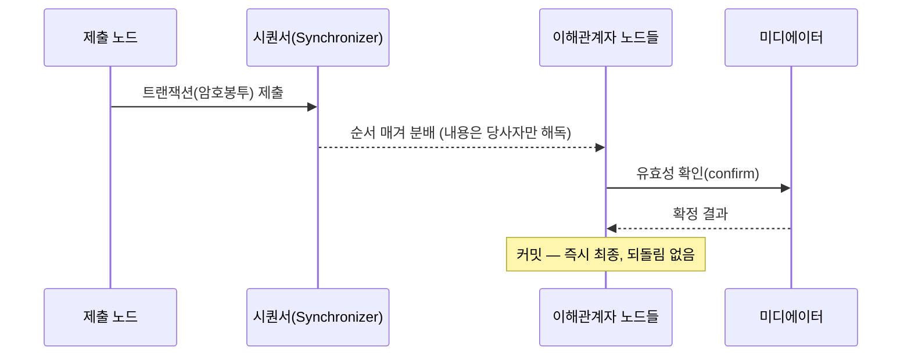

> **학습 코스 (번역본 아님)** — [코스 맵](index.md) · 이전: [S9](s09-architecture.md)

# S10 — 확정성 & 합의

## 질문
**한번 정산되면 되돌릴 수 없나? 누가 <abbr class="gloss" title="원장 상태를 바꾸는 원자적 작업 단위. 하나 이상의 컨트랙트를 생성·보관하며, 전부 적용되거나 전혀 적용되지 않음">트랜잭션</abbr> 순서를 정하나? <abbr class="gloss" title="상태를 저장하지 않고 트랜잭션 합의·순서를 조율하는 Canton 구성요소">Synchronizer</abbr>는 내용을 안 본다면서 어떻게 <abbr class="gloss" title="여러 노드가 트랜잭션의 유효성·순서에 함께 동의하는 절차">합의</abbr>하나?**

## 기초

[S1](s01-problem.md)의 두 고통을 한 번 더 떠올리자. 전통 송금은 **<abbr class="gloss" title="거래 체결(T) 후 2영업일 뒤에 실제 결제가 이뤄지는 전통 금융 관행">T+2</abbr>**라 그 사이 정정·취소 구간이 있다. 퍼블릭 체인은 빠르지만 **되감길** 수 있다(체인 재구성). 기관 정산은 **"끝나면 진짜 끝"**이 필요하다.

Canton은 **즉시 결정적 확정(immediate deterministic finality)**을 준다. 트랜잭션이 <abbr class="gloss" title="트랜잭션이 최종 확정되어 원장에 반영되는 것">커밋</abbr>되면 **되돌리지 않는다** — 확률적으로 "점점 굳는" 게 아니라, 그 순간 최종이다.

### 2계층 합의 — 내용과 순서를 분리
Canton 합의의 핵심은 두 가지를 **나눈** 것이다.

1. **내용 검증(<abbr class="gloss" title="어떤 컨트랙트와 관계를 맺어 그것을 보거나 승인하는 파티 = 서명자 + 관찰자">이해관계자</abbr> 계층)** — "이 트랜잭션이 규칙에 맞나"는 그 거래의 **이해관계자 노드들**이 검증·<abbr class="gloss" title="이해관계자 밸리데이터가 트랜잭션이 유효함을 미디에이터에 응답하는 것(confirmation)">확인</abbr>(confirm)한다. 관계없는 노드는 내용을 보지도 않는다(S5).
2. **순서화(Synchronizer 계층)** — "트랜잭션들의 전역 순서"는 **Synchronizer(<abbr class="gloss" title="Synchronizer 구성요소. 암호화된 메시지에 전체 순서·타임스탬프를 부여하고 참여자에게 전달">시퀀서</abbr>)**가 정한다. 시퀀서는 **암호봉투**만 받아 순서를 매긴다 — 내용은 못 본다.

그래서 "Synchronizer가 내용을 안 보는데 어떻게?"의 답은: **내용 검증은 당사자가, 순서만 Synchronizer가.** 둘이 분리돼 프라이버시와 합의가 양립한다.

### BFT — 일부 노드가 고장·악의여도
<abbr class="gloss" title="슈퍼 밸리데이터들이 공동 운영하는 Canton의 퍼블릭 조율(합의) 계층">글로벌 Synchronizer</abbr>의 순서화는 **<abbr class="gloss" title="비잔틴 장애 허용(Byzantine Fault Tolerance). 일부 노드가 악의적이거나 고장 나도 시스템이 올바르게 동작하는 성질">BFT</abbr>(비잔틴 장애 허용)**다. <abbr class="gloss" title="글로벌 Synchronizer를 운영하고 네트워크 거버넌스에 참여하는 노드">슈퍼 밸리데이터</abbr>의 **1/3 미만**이 고장 나거나 악의적이어도 전체는 올바른 단일 순서에 도달한다. 단일 시퀀서 한 대에 의존하지 않는다.

### 이더리움 / 전통 비교
| | 비트코인 | 이더리움(PoS) | Canton |
|---|---|---|---|
| 확정 성격 | 확률적(되감기 가능) | 에폭 단위 finality(2/3 지분) | 즉시 결정적(되감기 없음) |
| 누가 검증 | 모든 노드가 전부 | 모든 노드가 전부 | 그 거래 이해관계자만 |
| 순서 정함 | 채굴자(PoW) | 검증자(내용 봄) | Synchronizer(암호봉투만) |

| | 전통(국경 간) | Canton |
|---|---|---|
| 확정 시점 | T+1~T+2 | 즉시 |
| 정정 구간 | 있음(되돌림·취소 가능) | 없음(커밋되면 최종) |

## 심화

### 무엇이 트랜잭션을 "확정"시키나
- 이해관계자 노드들이 트랜잭션 유효성을 **<abbr class="gloss" title="Synchronizer 구성요소. 이해관계자들의 확인을 모아 트랜잭션 승인/거부를 판정">미디에이터</abbr>**에 확인(confirm)한다.
- 시퀀서가 정한 순서에 따라 미디에이터가 결과를 확정하면, 그 트랜잭션은 **커밋**된다.
- 커밋된 <abbr class="gloss" title="원장에 기록되는 불변 데이터 단위. 상태 변경은 새 컨트랙트 생성으로 표현됨">컨트랙트</abbr>는 <abbr class="gloss" title="활성 컨트랙트 집합(Active Contract Set). 노드가 보관 중인, 현재 유효한 컨트랙트 전체">ACS</abbr>에 반영되고(S4), <abbr class="gloss" title="컨트랙트를 소비해 비활성으로 만드는 것(archive). 보관된 컨트랙트는 더 이상 쓸 수 없음">보관</abbr>된 컨트랙트는 다시 살릴 수 없다 → 구조적 <abbr class="gloss" title="같은 자산을 두 번 쓰는 부정행위">이중지불</abbr> 방지.

### 토폴로지·서명
누가 어떤 <abbr class="gloss" title="Canton에서 권한과 데이터 가시성의 주체가 되는 식별 가능한 참여 주체">파티</abbr>를 <abbr class="gloss" title="참여자 노드가 파티를 대신해 원장에서 활동(컨트랙트 저장·트랜잭션 제출·확인)해 주는 것. 로컬 파티는 키까지 노드가 관리하고, 외부 파티는 제출 키를 파티 자신이 보유(노드는 중계)">호스팅</abbr>하고 어떤 키로 서명하는지는 **<abbr class="gloss" title="어떤 노드·파티·키가 네트워크에 참여하는지를 정의하는 구성 정보">토폴로지</abbr>(topology)** 상태로 관리되고, 이것도 서명된 트랜잭션으로 갱신된다. 트랜잭션 서명·토폴로지 서명이 함께 "누가 무엇에 권한이 있나"를 암호학적으로 못 박는다.

### 왜 정산에 결정적 확정이 중요한가
[S6](s06-atomicity-dvp.md)의 <abbr class="gloss" title="트랜잭션이 전부 적용되거나 전혀 적용되지 않는 성질. 일부만 반영되는 일이 없음">원자성</abbr>은 "한 트랜잭션 전부/전무"를 보장한다. 거기에 **결정적 확정**이 더해져야 "실행됐는데 나중에 되감겼다"가 없다. 원자성(한 건 안에서) + 결정적 확정(되돌림 없음)이 합쳐져 **진짜 정산 완결성(settlement finality)**이 된다.

## 강의 노트
- **핵심 한 문장**: "내용은 당사자가 검증, 순서는 Synchronizer가 (암호봉투만 보고) 매긴다. 커밋되면 되돌림 없는 즉시 최종 — T+2도 체인 재구성도 없다."
- **비유**: 시퀀서 = 봉투 내용을 모른 채 번호표만 붙이는 접수처. 내용 심사는 해당 부서(이해관계자)가.
- **무엇을 보여주며 짚을지**: 위 시퀀스에서 "시퀀서는 암호봉투"와 "커밋=즉시 최종"을 짚는다. S6 원자성과 묶어 'finality' 개념 완성.
- **예상 질문 & 답**:
  - Q: "되돌림이 없으면 실수하면 어쩌죠?" → A: "정정은 새 트랜잭션(보상거래)으로. 과거를 되감는 게 아니라 앞으로 바로잡는다 — 회계의 역분개처럼."
  - Q: "이더리움 finality랑 뭐가 본질적으로 다른가요?" → A: "이더는 검증자가 내용을 보고 확률적/에폭. Canton은 내용 비공개 + 즉시 결정적. 분리가 핵심."

## 다음 단계
핵심 차별 셋(프라이버시·원자성·신원/<abbr class="gloss" title="트랜잭션이 되돌려지지 않는다고 보장되는 상태. 확률적(점점 굳음) vs 결정적(즉시 최종)">확정성</abbr>)을 다 봤다. 이제 묶고, 언제 Canton이 맞는지 가린다. → [S11 — 정리·실습·심화](s11-recap.md)

<!-- nav:start -->

---

⬅️ **이전**: [S9 — 아키텍처 & 인프라](s09-architecture.md) ・ ➡️ **다음**: [S11 — 정리·실습·심화](s11-recap.md)

<!-- nav:end -->
