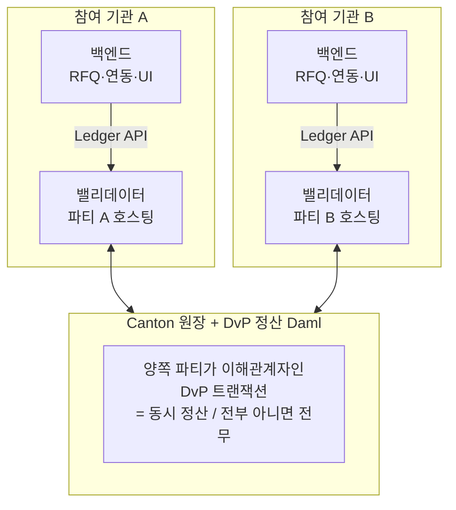

> ⚠️ **내부 작성 정리 노트** — Canton 공식 문서의 충실 번역본이 아니라, 학습을 돕기 위해 직접 작성한 배경 설명입니다. 실제 프로젝트 설계는 미확정이며, 공개 배포 문서이므로 **역할 기반 용어**(운영사·참여 기관)를 사용합니다.

# Canton 위 기관 간 DvP 정산 앱 — 2층 구조

기관 간 스테이블코인 **<abbr class="gloss" title="인도-대-지급(Delivery vs Payment). 자산 인도와 대금 지급을 동시·원자적으로 처리">DvP</abbr> 정산** 같은 앱을 Canton 위에 올릴 때의 구조. 핵심은 **"앱 = 백엔드 하나"가 아니라 <abbr class="gloss" title="원장(Daml 컨트랙트) 위에서 실행·기록되는 것. 모든 이해관계자가 공유·검증·강제">온-원장</abbr> + <abbr class="gloss" title="원장 밖, 내 백엔드 인프라에서 실행되는 것. 외부 API·UI·복잡 계산 등 나만 처리">오프-원장</abbr> 두 층**이라는 점이다.

## 앱의 두 층 (온-원장 / 오프-원장)

| 층 | 무엇 | 어디서 실행 | 역할 |
|---|---|---|---|
| **온-<abbr class="gloss" title="거래·컨트랙트가 기록되는 장부. Canton에선 활성 컨트랙트의 모음">원장</abbr> (<abbr class="gloss" title="다자간 워크플로를 위해 설계된 Canton의 스마트 컨트랙트 언어">Daml</abbr>)** | 정산 규칙·<abbr class="gloss" title="원장에 기록되는 불변 데이터 단위. 상태 변경은 새 컨트랙트 생성으로 표현됨">컨트랙트</abbr>·<abbr class="gloss" title="컨트랙트에서 수행 가능한 동작(권한이 부여된 당사자만 실행 가능)">초이스</abbr> | **<abbr class="gloss" title="파티를 호스팅하고 그 파티의 컨트랙트를 저장·실행하는 노드. 밸리데이터의 핵심 구성요소">참여자 노드</abbr>(<abbr class="gloss" title="파티를 호스팅하고 그 파티의 컨트랙트 데이터를 저장하는 참여자 노드">밸리데이터</abbr>)** 위, 원장 | **DvP 정산 그 자체** — <abbr class="gloss" title="트랜잭션이 전부 적용되거나 전혀 적용되지 않는 성질. 일부만 반영되는 일이 없음">원자성</abbr>(전부 아니면 전무)·무신뢰성을 *강제* |
| **오프-원장 (백엔드)** | RFQ 견적·매칭, UI, 기존 시스템 연동 | **각 기관의 백엔드 인프라** | 거래를 **준비·제출**하고 오케스트레이션 |

> 핵심: **정산의 핵심 보장(동시 교환·동시 성공/실패)은 온-원장 Daml에서 일어나고 강제된다.** 백엔드는 그걸 *트리거하고 연동*하는 역할.

## 구조도

## 누가 무엇을 운영하나

- **각 참여 기관**: 자기 **<abbr class="gloss" title="Canton에서 권한과 데이터 가시성의 주체가 되는 식별 가능한 참여 주체">파티</abbr> + 밸리데이터(+백엔드)**.
  - 밸리데이터는 **새로 만드는 게 아니라** 표준 소프트웨어(Canton 참여자 노드 + <abbr class="gloss" title="글로벌 Synchronizer를 구동하는 오픈소스 애플리케이션 모음(SV·밸리데이터·월렛 등)">Splice</abbr> Validator App)를 **배포·운영**.
  - **자체 <abbr class="gloss" title="참여자 노드가 파티를 대신해 원장에서 활동(컨트랙트 저장·트랜잭션 제출·확인)해 주는 것. 로컬 파티는 키까지 노드가 관리하고, 외부 파티는 제출 키를 파티 자신이 보유(노드는 중계)">호스팅</abbr>**(내 인프라에서 직접 운영, 내 데이터는 내 노드만 봄) vs **Node-as-a-Service**(업체 위탁). 데이터 통제가 중요한 기관 정산은 보통 **자체 호스팅**.
- **운영사**: 공유되는 **정산 Daml 패키지**와 조정 인프라(RFQ 등)를 제공.

> **설치 위치 한 줄**: 정산 **Daml 패키지(DAR)** 는 *모든 참여 노드(A·B·운영사)* 에 설치돼야 한다(그래야 각 파티가 <abbr class="gloss" title="어떤 컨트랙트와 관계를 맺어 그것을 보거나 승인하는 파티 = 서명자 + 관찰자">이해관계자</abbr>가 됨). 반면 **운영사 백엔드와 운영사 파티(venue)** 는 *운영사 인프라에서만* 돈다 — A·B에 설치되는 게 아니다.

## DvP가 정산되는 흐름 (한 줄)

> 백엔드가 거래를 **준비·제출** → 원장의 정산 Daml 컨트랙트가 **양쪽 파티 <abbr class="gloss" title="이해관계자 밸리데이터가 트랜잭션이 유효함을 미디에이터에 응답하는 것(confirmation)">확인</abbr>**을 받아 **원자적으로 정산**(한쪽만 정산되는 일이 구조적으로 없음).

## 왜 Canton인가 (배운 개념과 직접 연결)

| 정산 요구 | Canton 기능 |
|---|---|
| 인도·지급 **동시**(DvP) | **조합 가능성 / 원자성** (한 <abbr class="gloss" title="원장 상태를 바꾸는 원자적 작업 단위. 하나 이상의 컨트랙트를 생성·보관하며, 전부 적용되거나 전혀 적용되지 않음">트랜잭션</abbr>에 여러 다리 묶기) |
| 카운터파티 리스크 제거 | 원자적 <abbr class="gloss" title="트랜잭션이 최종 확정되어 원장에 반영되는 것">커밋</abbr> — "자산만 가고 돈은 안 옴"이 불가 |
| 거래 내용은 당사자만 | **<abbr class="gloss" title="한 트랜잭션을 &quot;뷰&quot;로 분해해, 각 파티가 자신과 관련된 부분만 보도록 하는 Canton의 핵심 프라이버시 방식">부분 트랜잭션 프라이버시</abbr>** (경쟁사·시장에 포지션 비노출) |
| 내 데이터는 내가 통제 | **자체 호스팅 밸리데이터** |
| 단계적 검증 | **LocalNet → DevNet/TestNet** 환경 사다리 |

## LocalNet에서 동일 "기능 스펙"으로 PoC 가능

이 앱 전체를 **LocalNet에 동일한 기능 스펙으로 만들어 테스트**할 수 있다. (QuickStart가 라이선스 앱으로 한 걸 정산 앱으로 하는 셈)

| | LocalNet에서 | 비고 |
|---|---|---|
| 정산 Daml 모델·초이스 | ✅ 그대로 배포 | 동일 |
| 원자성·프라이버시 보장 | ✅ 동일 동작 | 같은 Canton 프로토콜 |
| 기관 A·B·MM 파티/밸리데이터 | ✅ 로컬에서 시뮬레이션 | 한 머신에 여러 노드 |
| 백엔드·Ledger API 연동 | ✅ end-to-end | 동일 |
| **실제 망의 분산·지연·<abbr class="gloss" title="비잔틴 장애 허용(Byzantine Fault Tolerance). 일부 노드가 악의적이거나 고장 나도 시스템이 올바르게 동작하는 성질">BFT</abbr>** | ⚠️ 모사만 | 진짜는 DevNet/TestNet |
| **외부 연동**(커스터디·은행·MM·브릿지·실제 스테이블코인) | ⚠️ mock | 실제는 통합 필요 |
| **CC·<abbr class="gloss" title="Synchronizer에 쓰기를 요청할 때 소비하는 자원. Canton Coin으로 비용을 지불">트래픽</abbr> 경제, 온보딩·신원** | ⚠️ 가치 없음/절차 없음 | 실제는 DevNet+ |

> 즉 **로직(정산·원자성·프라이버시)은 진짜와 똑같이** 동작하고, **실제 망의 분산·지연·경제·외부연동만 LocalNet이 흉내**낸다. → LocalNet에서 만들고 DevNet/TestNet으로 올린다. 출발점은 cn-quickstart의 데모 자리에 DvP 정산 Daml을 넣는 것.

## 멀티체인 맥락 (미확정)

스테이블코인이 **다른 체인(Base/Ethereum)에서 발행되고 Canton으로 브릿지돼 정산**되는 시나리오도 가능 — 이 경우 "Canton에서 DvP 정산하는 대상"이 브릿지된 표현일 수 있다. 발행 체인·브릿지 설계는 열려 있으니 양쪽 시나리오를 모두 염두에 둔다.

## 참고 링크
- [아키텍처 개요](../overview/learn/architecture.md) — 온-원장 vs 오프-원장, 코드 실행 위치
- [원장 모델](../overview/learn/ledger-model.md) — 조합 가능성·원자적 DvP
- [로컬 파티 vs 외부 파티](local-vs-external-party.md) · [환경 4단계](canton-environments-localnet-to-mainnet.md) · [Canton vs Splice](canton-vs-splice.md)

<!-- nav:start -->

---

⬅️ **이전**: [Canton vs Splice — 엔진 vs 운영 소프트웨어](canton-vs-splice.md) ・ ➡️ **다음**: [eUTXO와 이중지불 방지 — "존재하지 않는 것은 쓸 수 없다" 쉽게 이해하기](eutxo-double-spend.md)

<!-- nav:end -->
