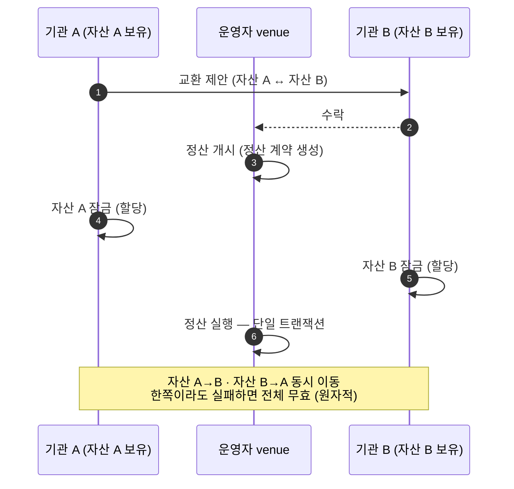
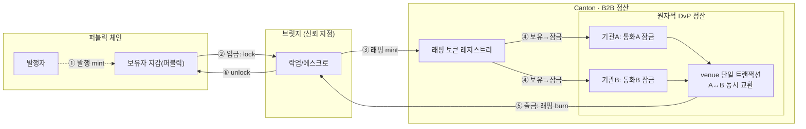
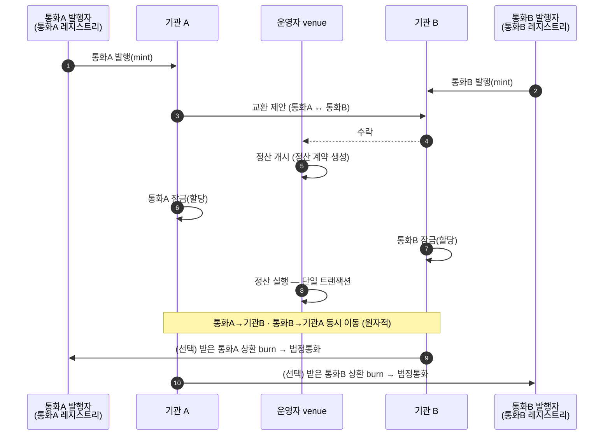

> ⚠️ **내부 작성 정리 노트** — "토큰(스테이블코인)을 Canton 위 정산에 쓰려면 어떻게 발행·반입하나"를 일반화해 정리. 토큰표준 정의는 [용어집](../glossary.md)·관련 위키 페이지 참고.

# 스테이블코인 발행·소각과 레지스트리

## 핵심 결론
> Canton에서 토큰이 정산에 쓰이려면, 그 토큰의 **<abbr class="gloss" title="토큰(자산)의 발행자가 운영하며 발행·소각과 정산 증빙(choice context)을 책임지는 주체">레지스트리</abbr>**(발행자가 운영하는 발행/소각·증빙 서비스)가 Canton에 존재해야 한다.
> 토큰을 Canton에 들이는 길은 둘 — **① 외부 체인 발행 + 브릿지(래핑)** 또는 **② Canton 토큰표준으로 직접 발행**. 정산(<abbr class="gloss" title="인도-대-지급(Delivery vs Payment). 자산 인도와 대금 지급을 동시·원자적으로 처리">DvP</abbr>) 로직은 어느 쪽이든 동일하다.

## 레지스트리란
**토큰을 발행·관리하는 주체(발행자)가 운영하는 서비스.** 그 토큰의 권위 있는 출처다.
- **온레저(<abbr class="gloss" title="거래·컨트랙트가 기록되는 장부. Canton에선 활성 컨트랙트의 모음">원장</abbr>)**: 토큰의 규칙·보유(holding) <abbr class="gloss" title="원장에 기록되는 불변 데이터 단위. 상태 변경은 새 컨트랙트 생성으로 표현됨">컨트랙트</abbr>, 발행/소각 권한.
- **오프레저(HTTP API)**: 앱이 이체·정산을 만들 때 필요한 데이터를 내려줌 — 메타데이터, 그리고 **이체/정산 실행에 필요한 choice context + disclosed contracts**.
- 원장 위 신원은 `instrumentId.admin` <abbr class="gloss" title="Canton에서 권한과 데이터 가시성의 주체가 되는 식별 가능한 참여 주체">파티</abbr>. 실무에선 *발행자 = 레지스트리 운영자*.

### 왜 정산에 꼭 필요한가
원자적 DvP를 실행하려면 <abbr class="gloss" title="원장 상태를 바꾸는 원자적 작업 단위. 하나 이상의 컨트랙트를 생성·보관하며, 전부 적용되거나 전혀 적용되지 않음">트랜잭션</abbr>이 **토큰의 규칙 컨트랙트**를 참조해야 하는데, 그건 거래 당사자 소유가 아니다. "이게 유효한 규칙"이라는 **증빙(disclosed contracts)** 을 내주는 게 레지스트리다. 이게 없으면 실행이 검증되지 않는다.

> 비유: **조폐국/발행기관**. 화폐(토큰)를 정의하고 발행량을 관리하며, 거래가 유효하다는 "서류"를 발급한다.

## 원자적 DvP 정산 — 그 안에서 일어나는 교환
아래 패턴들에 나오는 **"원자적 DvP 정산"** 상자 안의 실제 교환 과정. 두 자산을 **동시·전부/전무**로 맞바꿔 "한쪽만 받고 떼이는" 위험을 없앤다.

## 패턴 ① — 외부 체인 발행 + 브릿지
스테이블코인을 **퍼블릭 체인에서 발행**하고, 정산용으로 **브릿지로 래핑(wrapped) 토큰**을 Canton에 반입한다.
- Canton 측 레지스트리 = **브릿지 운영자**(또는 발행자 위임)가 운영. 정산은 래핑 토큰끼리.
- **신뢰 지점 = 브릿지**(외부 체인 락업 ↔ 래핑 발행의 1:1 보장).

1. 발행자가 퍼블릭 체인에서 발행 → 보유자 지갑.
2. 정산에 쓰려고 브릿지에 입금(퍼블릭에서 **lock**).
3. 브릿지가 Canton에 **래핑 토큰 mint** → Canton 파티 보유.
4~5. 두 기관이 각자 통화를 **잠금** → venue가 **단일 트랜잭션으로 A↔B 동시 교환**. 출금 시 래핑 **burn**.
6. 브릿지가 퍼블릭에서 **unlock**.

## 패턴 ② — Canton 토큰표준으로 직접 발행
발행자가 **Canton 토큰표준으로 직접 발행**한다. 브릿지 없이 네이티브.
- **통화마다 발행자(레지스트리)가 다르다** — 통화 A·통화 B는 각자 발행자가 발행/소각·증빙. (한 발행자가 둘 다 찍는 모델도 가능하나, 서로 다른 통화는 보통 별도 발행자.)
- 신뢰 지점 = **각 발행자**(법정통화 준비금 ↔ 발행량). 퍼블릭/리테일과 잇는다면 *그때* 반대 방향 브릿지가 필요.

1. **각 통화 발행자**가 자기 통화를 해당 기관에 **발행(mint)**(통화A→기관A, 통화B→기관B).
2. 두 기관이 <abbr class="gloss" title="여러 노드가 트랜잭션의 유효성·순서에 함께 동의하는 절차">합의</abbr>(제안·수락) → venue가 **정산 개시**.
3. 두 기관이 각자 통화 **잠금** → venue가 **단일 트랜잭션으로 동시 교환**(원자적, 브릿지 불필요).
4. (선택) 받은 통화를 **그 발행자에게 burn** → 법정통화 오프램프. (Canton 안에서 계속 재사용도 가능)

## 두 패턴 비교
| 항목 | ① 외부발행 + 브릿지 | ② Canton 직접발행 |
|---|---|---|
| 발행 장소 | 퍼블릭 체인 | Canton(토큰표준) |
| 브릿지 | **필수** | 정산엔 불필요 |
| Canton 레지스트리 운영 | 브릿지 운영자(래핑) | 발행자 직접 |
| 신뢰 지점 | 브릿지(lock↔wrapped) | 발행자(준비금↔발행) |
| 리테일 생태계 연결 | 이미 퍼블릭에 있음 | 반대 방향 브릿지 필요 |
| 구현 부담 | 브릿지 + 래핑 레지스트리 | Canton 레지스트리만 |

## 한 줄
> 토큰을 Canton 정산에 쓰려면 **그 토큰의 레지스트리가 Canton에 있어야** 한다. 외부에서 발행해 **브릿지로 래핑**하거나, **Canton에서 직접 발행**하거나 — 둘 중 어느 길이든 정산(DvP) 자체는 토큰 비종속으로 동일하게 돈다.

## 관련 문서
- [Canton의 B2B vs B2C — 어디에 맞나](canton-b2b-vs-b2c.md) · [원자적 DvP 진짜 차별점](atomic-dvp-real-differentiator.md)
- [Canton 위 기관 간 DvP 정산 앱 — 2층 구조](dvp-settlement-app-architecture.md)
- [Canton vs Splice — 엔진 vs 운영 소프트웨어](canton-vs-splice.md)

<!-- nav:start -->

---

⬅️ **이전**: [용어 한 컷 카드 — 자주 막히는 용어 모음](term-cheatsheet.md) ・ ➡️ **다음**: [트래블룰 (Travel Rule) — 규제 개요와 구현 방식(다른 곳은 어떻게 하나)](travel-rule.md)

<!-- nav:end -->
