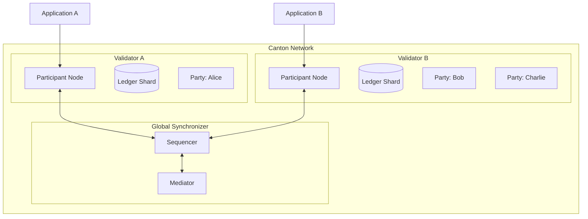
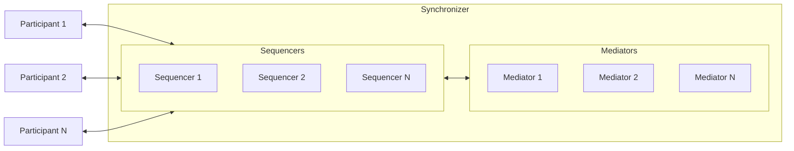
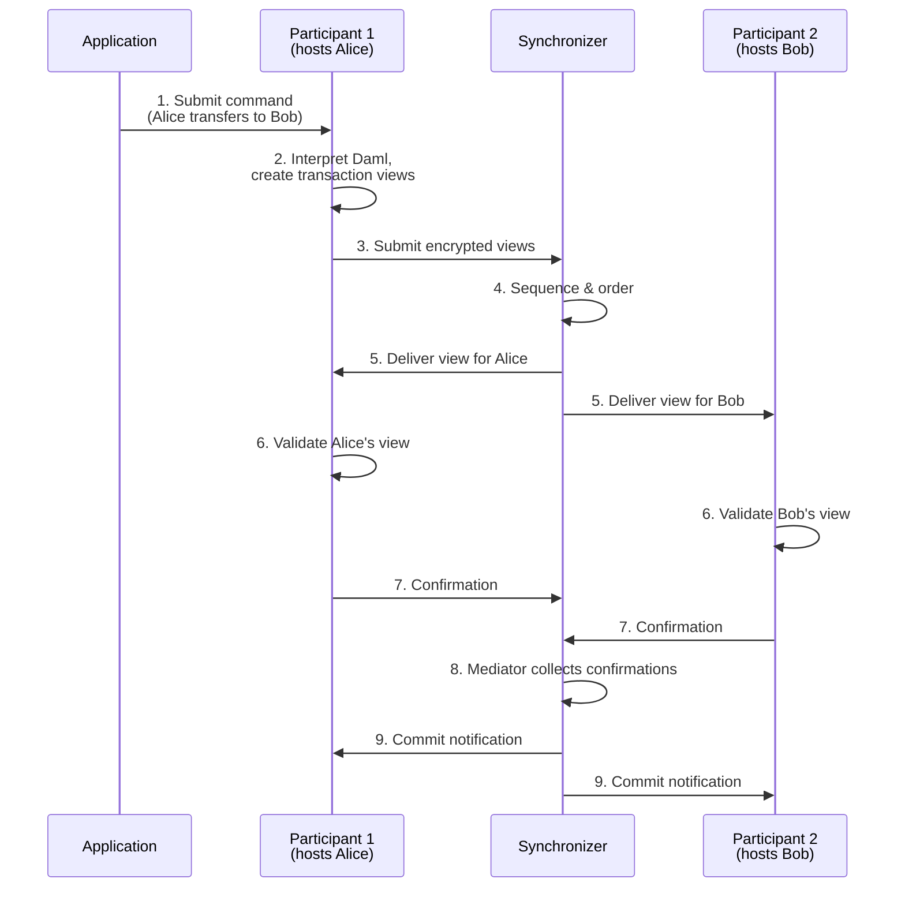
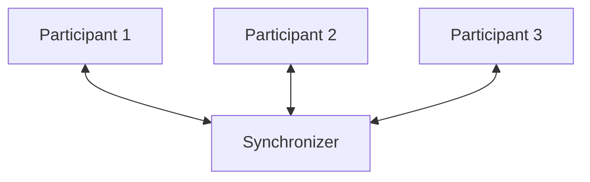
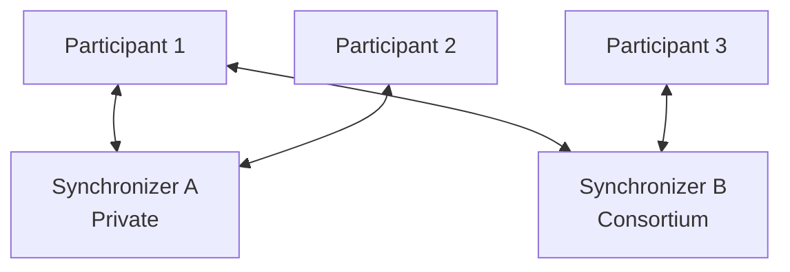
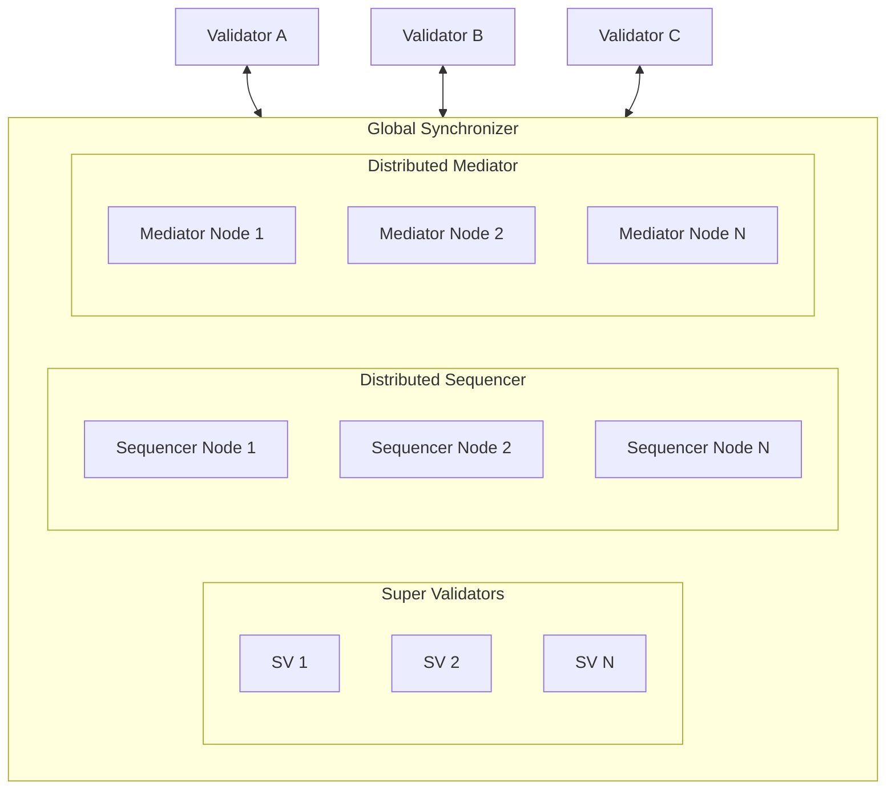
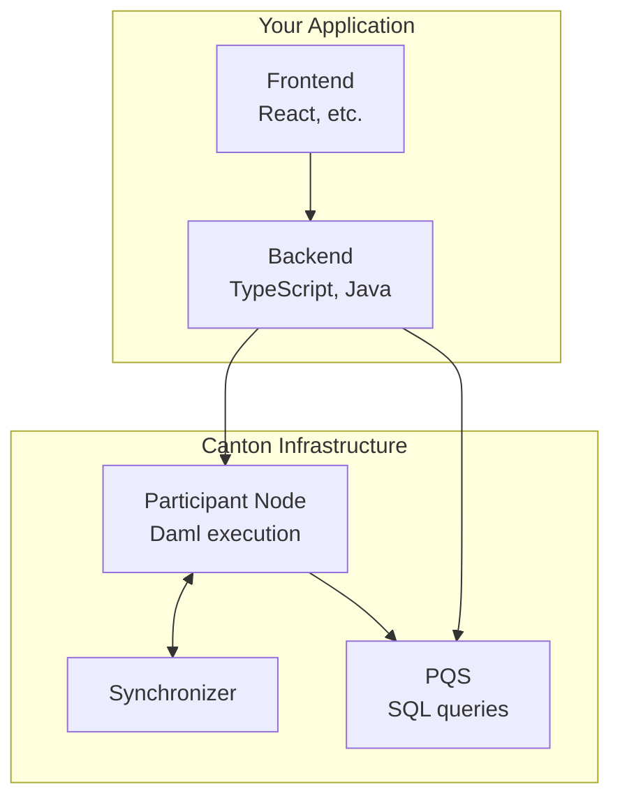

> **출처(원문)**: [Architecture Overview](https://docs.canton.network/overview/learn/architecture) · 번역일 2026-06-15

## 📌 개발자 노트
- **한 줄 요약**: Canton은 "조율(<abbr class="gloss" title="상태를 저장하지 않고 트랜잭션 합의·순서를 조율하는 Canton 구성요소">Synchronizer</abbr>)"과 "저장(<abbr class="gloss" title="파티를 호스팅하고 그 파티의 컨트랙트 데이터를 저장하는 참여자 노드">밸리데이터</abbr>)"을 분리한다 — Synchronizer는 내용을 보지 않고 순서만 잡고, 밸리데이터는 자기 <abbr class="gloss" title="Canton에서 권한과 데이터 가시성의 주체가 되는 식별 가능한 참여 주체">파티</abbr> 데이터만 저장. <abbr class="gloss" title="원장 상태를 바꾸는 원자적 작업 단위. 하나 이상의 컨트랙트를 생성·보관하며, 전부 적용되거나 전혀 적용되지 않음">트랜잭션</abbr> 흐름·네트워크 <abbr class="gloss" title="어떤 노드·파티·키가 네트워크에 참여하는지를 정의하는 구성 정보">토폴로지</abbr>·코드 실행 위치까지 시각적으로 정리.
- **핵심 용어**: <abbr class="gloss" title="파티를 호스팅하고 그 파티의 컨트랙트를 저장·실행하는 노드. 밸리데이터의 핵심 구성요소">참여자 노드</abbr>(Participant Node), <abbr class="gloss" title="Synchronizer 구성요소. 암호화된 메시지에 전체 순서·타임스탬프를 부여하고 참여자에게 전달">시퀀서</abbr>(Sequencer)·<abbr class="gloss" title="Synchronizer 구성요소. 이해관계자들의 확인을 모아 트랜잭션 승인/거부를 판정">미디에이터</abbr>(Mediator), <abbr class="gloss" title="전체 원장 중 그 참여자 노드가 보관하는 자기 조각. 자기 파티가 이해관계자인 컨트랙트만 담김(전체 사본은 어디에도 없음)">원장 샤드</abbr>(Ledger Shard), Ledger API, PQS
- **선행 개념**: [핵심 개념](https://docs.canton.network/overview/understand/core-concepts). 다음 → [원장 모델](ledger-model.md)

---

# 아키텍처 개요

> Canton Network 구성 요소가 함께 작동하는 방식의 시각적 이해

Canton의 아키텍처는 전통적 블록체인과 근본적으로 다르다. 이 구성 요소들을 이해하는 것은 Canton 애플리케이션을 설계하고 디버깅하는 데 필수적이다.

## 큰 그림

Canton은 **조율(coordination)** 과 **저장(storage)** 을 분리한다. Synchronizer는 트랜잭션 순서를 조율하고, 참여자 노드(밸리데이터)는 자신이 <abbr class="gloss" title="참여자 노드가 파티를 대신해 원장에서 활동(컨트랙트 저장·트랜잭션 제출·확인)해 주는 것. 로컬 파티는 키까지 노드가 관리하고, 외부 파티는 제출 키를 파티 자신이 보유(노드는 중계)">호스팅</abbr>하는 파티의 데이터를 저장한다.



모든 노드가 모든 상태를 저장하는 Ethereum과 달리, Canton 노드는 자신의 파티 데이터만 저장한다. Synchronizer는 조율하지만 트랜잭션 내용은 결코 저장하지 않는다.

## 핵심 구성 요소

### 밸리데이터 (Validators)

밸리데이터는 Canton의 일꾼이다. 이들은:

| 기능                                                                                     | 설명                                                                                                                         |
| -------------------------------------------------------------------------------------- | -------------------------------------------------------------------------------------------------------------------------- |
| **파티 호스팅**                                                                             | 호스팅하는 파티의 <abbr class="gloss" title="원장에 기록되는 불변 데이터 단위. 상태 변경은 새 컨트랙트 생성으로 표현됨">컨트랙트</abbr> 데이터 저장                        |
| **<abbr class="gloss" title="다자간 워크플로를 위해 설계된 Canton의 스마트 컨트랙트 언어">Daml</abbr> 로직 실행** | 트랜잭션이 자기 파티에 영향을 줄 때 <abbr class="gloss" title="원장 위에서 규칙대로 자동 실행되는 코드화된 계약. Canton에선 Daml 템플릿으로 작성">스마트 컨트랙트</abbr> 코드 실행 |
| **트랜잭션 검증**                                                                            | 자기 <abbr class="gloss" title="큰 데이터를 나눈 조각. Canton에선 참여자 노드가 보관하는 원장의 자기 몫">샤드</abbr>(shard)에 대한 권한과 정확성 <abbr class="gloss" title="이해관계자 밸리데이터가 트랜잭션이 유효함을 미디에이터에 응답하는 것(confirmation)">확인</abbr>         |
| **Ledger API 노출**                                                                      | 애플리케이션을 위한 gRPC/JSON API 제공                                                                                                |

밸리데이터는 참여자 노드(participant node)를 운영하는 Canton Network의 역할이다. 참여자 노드(흔히 "참여자participant"로 줄여 부름)는 Canton Network 내 한 주체를 위한 사적이고 자기주권적인(self-sovereign) 연산·저장 단위다.

**주요 특성:**

* 각 참여자 노드는 <abbr class="gloss" title="거래·컨트랙트가 기록되는 장부. Canton에선 활성 컨트랙트의 모음">원장</abbr>의 **국소적·사적 <abbr class="gloss" title="한 트랜잭션을 당사자별로 나눈 조각. 각 당사자는 자기 권한에 해당하는 뷰(자기 몫)만 받아 본다">뷰</abbr>**를 유지한다
* 참여자 노드는 자신이 호스팅하는 파티가 <abbr class="gloss" title="어떤 컨트랙트와 관계를 맺어 그것을 보거나 승인하는 파티 = 서명자 + 관찰자">이해관계자</abbr>인 컨트랙트만 저장한다
* 하나의 참여자 노드에 여러 파티를 호스팅할 수 있다
* 참여자 노드는 여러 Synchronizer에 연결할 수 있다

### Synchronizer (Synchronizers)

Synchronizer는 **트랜잭션 내용을 보지 않고** 트랜잭션 순서와 <abbr class="gloss" title="여러 노드가 트랜잭션의 유효성·순서에 함께 동의하는 절차">합의</abbr>를 조율한다. 두 구성 요소로 이루어진다:



**시퀀서 (Sequencer)**

* 참여자 간 암호화된 메시지를 정렬하고 분배한다
* 해당 Synchronizer의 트랜잭션에 전체 순서를 제공한다
* 복호화된 트랜잭션 내용을 **보지 않는다**
* 해당 Synchronizer의 모든 참여자가 같은 순서로 메시지를 받도록 보장한다

**미디에이터 (Mediator)**

* 합의 프로토콜을 촉진한다
* 참여자로부터 확인 평결(verdict)을 수집한다
* 트랜잭션 평결(<abbr class="gloss" title="트랜잭션이 최종 확정되어 원장에 반영되는 것">커밋</abbr> 또는 거부)을 선언한다
* 복호화된 트랜잭션 내용을 **보지 않는다**

> **참고:** Synchronizer는 조율 계층이지 상태 저장 계층이 아니다. 트랜잭션 데이터를 결코 저장하거나 접근하지 않으며, 암호화된 메시지와 확인 결과만 다룬다.

### 파티 (Parties)

파티는 Canton의 <abbr class="gloss" title="원장(Daml 컨트랙트) 위에서 실행·기록되는 것. 모든 이해관계자가 공유·검증·강제">온-원장</abbr> 신원으로, 다른 블록체인의 주소나 외부 소유 계정(EOA)과 유사하다.

```
alice::1220f2fe29866fd6a0009ecc8a64ccdc09f1958bd0f801166baaee469d1251b2eb72
└─┬─┘  └──────────────────────────────────────────────────────────────────┘
 name                   fingerprint (hash of public key)
```

**파티 능력:**

| 능력               | 설명                                                                                    |
| ---------------- | ------------------------------------------------------------------------------------- |
| **검증(Validate)** | 자기 컨트랙트에 영향을 주는 트랜잭션 확인                                                               |
| **제어(Control)**  | 특정 동작(<abbr class="gloss" title="컨트랙트에서 수행 가능한 동작(권한이 부여된 당사자만 실행 가능)">초이스</abbr>) 실행 |
| **관찰(Observe)**  | 특정 상태와 트랜잭션 관람                                                                        |

**로컬 파티 vs 외부 파티:**

| 유형 | 키 저장 | 제어 | 활용 사례 |
| --- | --- | --- | --- |
| **로컬 파티(Local Party)** | 밸리데이터가 보유 | 밸리데이터가 대신 서명 | 더 단순; 밸리데이터가 완전 통제 |
| **외부 파티(External Party)** | 외부에 보유 | 명시적 서명 필요 | 더 많은 통제; 월렛 같은 경험 |

> ⚠️ **주의:** Ethereum 주소와 달리, 파티는 생성에 비용이 따르고 밸리데이터에 상태를 생성한다. 일회성이 아니므로 파티 구조를 신중히 설계하라.

## 트랜잭션이 작동하는 방식

### 트랜잭션 흐름



### 단계별 설명

| 단계 | 구성 요소 | 동작 |
| --- | --- | --- |
| **1. 제출(Submit)** | 애플리케이션 | Ledger API로 참여자에게 <abbr class="gloss" title="애플리케이션이 원장에 제출하는 명령(컨트랙트 생성·초이스 실행 요청)">커맨드</abbr> 전송 |
| **2. 해석(Interpret)** | 제출 참여자 | Daml 코드 실행, 뷰를 가진 트랜잭션 생성 |
| **3. 제출(Submit)** | 제출 참여자 | 암호화된 뷰를 Synchronizer로 전송 |
| **4. 순서화(Sequence)** | 시퀀서 | 트랜잭션 정렬, 타임스탬프 부여 |
| **5. 분배(Distribute)** | 시퀀서 | 각 뷰를 권한 있는 참여자에게만 전송 |
| **6. 검증(Validate)** | 모든 참여자 | 각자 자기 뷰를 독립적으로 검증 |
| **7. 확인(Confirm)** | 모든 참여자 | 확인/거부 평결을 미디에이터에 전송 |
| **8. 수집(Collect)** | 미디에이터 | 평결 집계, 결과 판정 |
| **9. 커밋(Commit)** | 모든 참여자 | 로컬 원장 샤드에 트랜잭션 적용 |

**핵심 포인트:**

* 트랜잭션은 **뷰**로 분해되며, 각 파티는 자기 뷰만 본다
* Synchronizer는 순서화하지만 내용을 **결코 복호화하지 않는다**
* 확인에는 관련 참여자들의 **임계값 합의**가 필요하다
* 각 참여자는 자신이 커밋한 뷰만 저장한다

## 네트워크 토폴로지 옵션

Canton은 여러 토폴로지 구성을 지원한다:

### 단일 Synchronizer (단순)



활용 사례: 단순 배포, 테스트, 단일 조직 애플리케이션.

### 다중 Synchronizer (엔터프라이즈)



활용 사례: 워크플로별로 다른 Synchronizer; 규제 분리; 컨소시엄 거버넌스.

### 글로벌 Synchronizer (Canton Network)



활용 사례: 퍼블릭 Canton Network; 탈중앙화 애플리케이션; 조직 간 워크플로.

## 당신의 코드가 실행되는 곳

| 구성 요소 | 위치 | 기술 | 책임 |
| --- | --- | --- | --- |
| **스마트 컨트랙트(<abbr class="gloss" title="컨트랙트의 구조와 규칙(권한·초이스)을 정의하는 Daml 청사진">템플릿</abbr>)** | 참여자 노드 | Daml | 비즈니스 로직, 권한, 프라이버시 규칙 |
| **백엔드 서비스** | 당신의 인프라 | 임의 언어(TypeScript, Java, Python) | <abbr class="gloss" title="원장 밖, 내 백엔드 인프라에서 실행되는 것. 외부 API·UI·복잡 계산 등 나만 처리">오프-원장</abbr> 자동화, 통합 |
| **프론트엔드** | 브라우저/모바일 | 임의 프레임워크 | 사용자 인터페이스 |
| **쿼리** | 참여자(Ledger API) 또는 PQS | gRPC, JSON, SQL | 원장 상태 읽기 |



### 애플리케이션 아키텍처 결정

| 결정 | 온-원장(Daml) | 오프-원장(백엔드) |
| --- | --- | --- |
| **다자간 합의** | ✓ 필수 | |
| **권한 강제** | ✓ 권장 | 가능하나 더 약함 |
| **복잡한 비즈니스 로직** | 가능 | ✓ 종종 더 쉬움 |
| **외부 API 호출** | 불가능 | ✓ 필수 |
| **고빈도 연산** | 배치 고려 | ✓ 더 적합 |
| **감사 추적 요구** | ✓ 내장 | 직접 구현해야 함 |

> 💡 **읽는 법**: "여러 당사자가 공유·합의·강제해야 하는 핵심(돈·계약·권한)"은 **온-원장(Daml)**, "나 혼자 처리하는 편의 기능(외부 호출·복잡 계산·대량 처리·UI)"은 **오프-원장(백엔드)** 에 둔다.
> - **다자간 합의·권한·감사** → 원장(Daml)으로 구현하면 모두에게 자동 강제·기록됨 (Canton을 쓰는 핵심 이유)
> - **외부 API 호출·복잡한 계산·고빈도 처리** → 백엔드가 적합 (Daml은 외부 인터넷 호출 불가)
> - 둘을 **조합**해 앱을 만든다 — 핵심 합의는 원장, 편의 기능은 백엔드.

## 구성 요소 간 통신

### API 개요

| API | 프로토콜 | 활용 사례 |
| --- | --- | --- |
| **Ledger API (gRPC)** | gRPC/Protobuf | 고성능 백엔드 통합 |
| **Ledger API (JSON)** | HTTP/JSON | 더 단순한 통합, 브라우저 친화적 |
| **Admin API** | gRPC/Protobuf | 노드 관리, 파티 관리 |
| **PQS SQL API** | PostgreSQL | 복잡한 쿼리, 리포팅 |

### Ledger API 연산

| 연산 | 설명 |
| --- | --- |
| **커맨드 제출(Command Submission)** | Daml 커맨드 제출(컨트랙트 생성, 초이스 실행) |
| **트랜잭션 스트림(Transaction Stream)** | 자기 파티의 트랜잭션 이벤트 구독 |
| **<abbr class="gloss" title="아직 보관(소비)되지 않아 현재 유효한 컨트랙트">활성 컨트랙트</abbr> 집합(Active Contract Set)** | 현재 활성인 컨트랙트 조회 |
| **완료(Completions)** | 커맨드 완료 상태 추적 |

## 다음 단계

* **[프라이버시 모델 설명](privacy-model.md)** — <abbr class="gloss" title="한 트랜잭션을 &quot;뷰&quot;로 분해해, 각 파티가 자신과 관련된 부분만 보도록 하는 Canton의 핵심 프라이버시 방식">부분 트랜잭션 프라이버시</abbr> 심층 분석
* **[글로벌 Synchronizer](https://docs.canton.network/overview/understand/global-synchronizer)** — 퍼블릭 네트워크 인프라 이해
* **[밸리데이터 운영](https://docs.canton.network/global-synchronizer/understand/introduction)** — 밸리데이터 배포·운영자용

<!-- nav:start -->

---

⬅️ **이전**: [누가 이 문서를 읽어야 하나](../understand/who-should-read.md) ・ ➡️ **다음**: [Canton의 암호 키](cryptographic-keys.md)

<!-- nav:end -->
