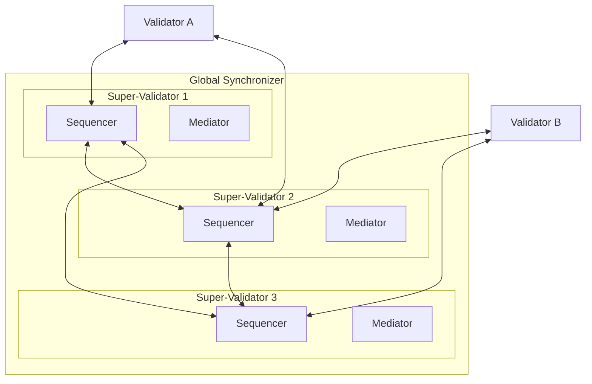

> **출처(원문)**: [Global Synchronizer Architecture](https://docs.canton.network/overview/learn/global-synchronizer-architecture) · 번역일 2026-06-15

## 📌 개발자 노트
- **한 줄 요약**: <abbr class="gloss" title="슈퍼 밸리데이터들이 공동 운영하는 Canton의 퍼블릭 조율(합의) 계층">글로벌 동기화자</abbr>가 여러 <abbr class="gloss" title="글로벌 동기화자를 운영하고 네트워크 거버넌스에 참여하는 노드">슈퍼 밸리데이터</abbr>에 분산된 시퀀서·미디에이터로 BFT 합의를 이뤄, 내용을 보지 않고 트랜잭션 순서·확인을 조율하는 방식. 트랜잭션 흐름(1초 내 완료)과 BFT 보장(SV 1/3 미만 결함 허용), 일반 <abbr class="gloss" title="파티를 호스팅하고 그 파티의 컨트랙트 데이터를 저장하는 참여자 노드">밸리데이터</abbr>의 연결 방식까지.
- **핵심 용어**: 시퀀서·미디에이터, BFT(비잔틴 장애 허용), 슈퍼 밸리데이터(SV), 암호화된 봉투(envelope)
- **선행 개념**: [글로벌 동기화자](../understand/global-synchronizer.md), [아키텍처 개요](architecture.md). 다음 → [앱 개발 입문](https://docs.canton.network/appdev/get-started/choose-your-path)

---

# 글로벌 동기화자 아키텍처

> 글로벌 <abbr class="gloss" title="상태를 저장하지 않고 트랜잭션 합의·순서를 조율하는 Canton 구성요소">동기화자</abbr>가 Canton Network 전반의 트랜잭션을 조율하는 방식

글로벌 동기화자는 서로 다른 밸리데이터에 있는 <abbr class="gloss" title="Canton에서 권한과 데이터 가시성의 주체가 되는 식별 가능한 참여 주체">파티</abbr> 간의 트랜잭션을 가능하게 하는 공유 인프라다. Canton Foundation의 거버넌스 아래 일군의 슈퍼 밸리데이터(SV)가 운영한다. 동기화자는 트랜잭션 순서와 합의를 조율하지만, 처리하는 트랜잭션의 내용은 결코 보지 않는다.

## 구성 요소

글로벌 동기화자는 슈퍼 밸리데이터 노드 전반에서 실행되는 여러 시퀀서와 미디에이터로 이루어진다. 이 분산 아키텍처는 비잔틴 장애 허용(Byzantine Fault Tolerance, BFT)을 제공한다 — 일부 노드가 침해되거나 실패해도 시스템은 올바르게 계속 작동한다.

### 시퀀서 (Sequencers)

시퀀서는 동기화자의 모든 메시지에 전체 순서(total ordering)를 제공한다. 밸리데이터로부터 암호화된 트랜잭션 메시지를 받아, 트랜잭션에 관여하는 모든 참여자에게 일관된 순서로 전달한다. 여러 시퀀서가 서로 다른 SV에서 실행되며, BFT 합의 프로토콜을 사용해 메시지 순서에 합의한다.

시퀀서는 암호화된 메시지 봉투(envelope)는 보지만 그 내용은 읽을 수 없다. 어떤 참여자가 메시지를 받아야 하는지는 (주소 메타데이터로) 알지만, 트랜잭션이 무엇을 하는지는 모른다.

### 미디에이터 (Mediators)

미디에이터는 밸리데이터로부터 확인 응답을 수집하고, 트랜잭션이 필요한 모든 당사자의 승인을 받았는지 판정한다. 시퀀서와 마찬가지로 미디에이터는 암호화된 뷰 위에서 작동한다 — 트랜잭션이 무엇을 담고 있는지 알지 못한 채, 올바른 당사자들이 트랜잭션을 확인했는지 검증할 수 있다.

각 SV는 시퀀서와 미디에이터를 모두 운영한다. 특정 트랜잭션의 미디에이터는 그 트랜잭션의 확인 요청을 처음 처리하는 시퀀서에 의해 결정된다.

## 동기화자를 통한 트랜잭션 흐름

밸리데이터가 트랜잭션을 제출할 때:

1. 밸리데이터가 각 관여 참여자 앞으로 주소가 지정된 암호화된 트랜잭션 뷰를 시퀀서에 보낸다
2. 시퀀서가 메시지를 정렬하고 주소가 지정된 참여자들에게 분배한다
3. 각 수신 참여자가 자기 뷰를 복호화하고, 트랜잭션을 검증하고, 확인 또는 거부를 미디에이터에 보낸다
4. 미디에이터가 응답을 수집하고 트랜잭션 결과를 판정한다
5. 결과가 시퀀서를 통해 모든 관여 참여자에게 다시 브로드캐스트된다
6. 각 참여자가 결과를 자기 로컬 원장에 적용한다

전체 흐름은 보통 1초 미만에 완료된다. 동기화자는 암호화되지 않은 트랜잭션 데이터에 결코 접근하지 못한다 — 무엇이 거래되는지 알지 못한 채 프로토콜을 조율한다.

## BFT 보장

분산 설계는 어떤 단일 SV도 일방적으로 트랜잭션을 검열하거나, 확인을 위조하거나, 순서를 교란할 수 없음을 의미한다. SV의 1/3 미만이 결함이 있거나 악의적인 한, 동기화자는 올바르게 작동한다. 정확한 BFT 임계값은 Canton Foundation 거버넌스가 설정하는 합의 구성에 따라 달라진다.

## 밸리데이터와 동기화자

(SV와 달리) 일반 밸리데이터는 클라이언트로서 동기화자에 연결한다. 시퀀서나 미디에이터 구성 요소를 운영하지 않는다. 밸리데이터는 SV 엔드포인트로의 아웃바운드 연결만 필요하다 — 표준 밸리데이터에는 인바운드 연결 요건이 없다.
