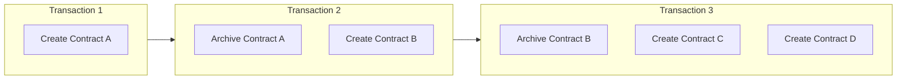
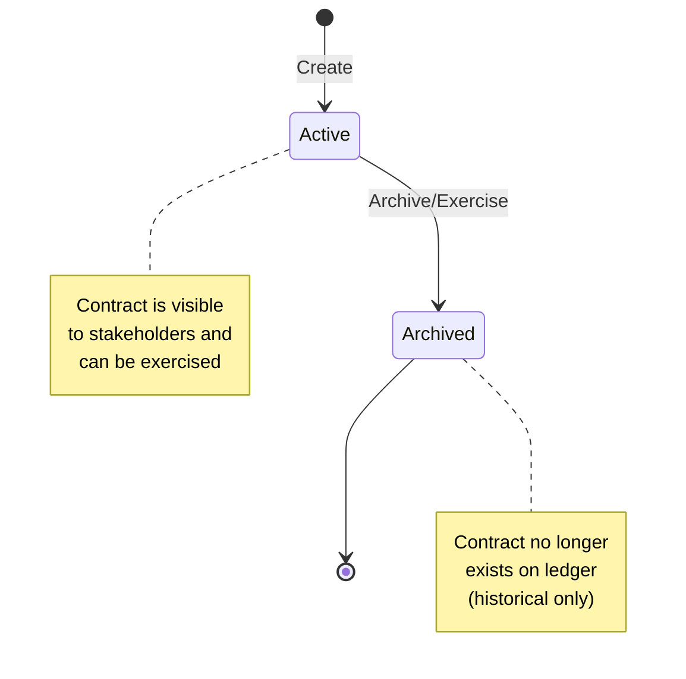
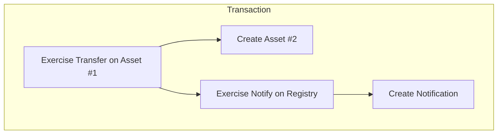
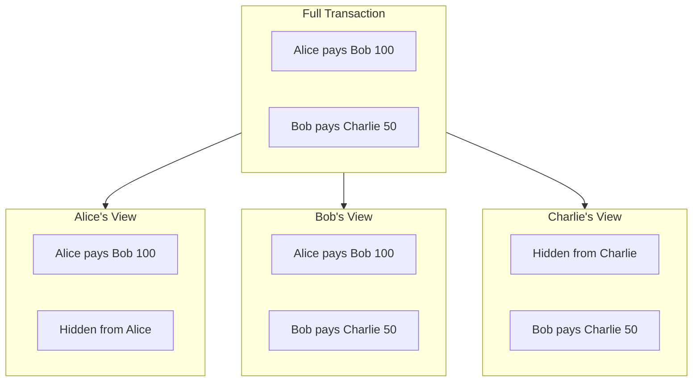

> **출처(원문)**: [The Ledger Model](https://docs.canton.network/overview/learn/ledger-model) · 번역일 2026-06-15

## 📌 개발자 노트
- **한 줄 요약**: Canton은 가변 계정 잔액이 아니라 생성·<abbr class="gloss" title="컨트랙트를 소비해 비활성으로 만드는 것(archive). 보관된 컨트랙트는 더 이상 쓸 수 없음">보관</abbr>되는 불변 <abbr class="gloss" title="원장에 기록되는 불변 데이터 단위. 상태 변경은 새 컨트랙트 생성으로 표현됨">컨트랙트</abbr>(확장 UTXO, <abbr class="gloss" title="확장 UTXO. 금액만이 아니라 임의의 상태·규칙을 담는 컨트랙트로 원장을 구성하는 모델">eUTXO</abbr>)로 <abbr class="gloss" title="거래·컨트랙트가 기록되는 장부. Canton에선 활성 컨트랙트의 모음">원장</abbr>을 구성한다. 컨트랙트 생애주기, <abbr class="gloss" title="어떤 컨트랙트와 관계를 맺어 그것을 보거나 승인하는 파티 = 서명자 + 관찰자">이해관계자</abbr> 역할(<abbr class="gloss" title="컨트랙트의 주된 권한자. 생성·보관(소비)에 반드시 동의해야 하는 파티">서명자</abbr>/<abbr class="gloss" title="컨트랙트를 볼 수 있으나 단독으로 행위할 수는 없는 파티">관찰자</abbr>/<abbr class="gloss" title="컨트랙트의 특정 초이스(동작)를 실행할 권한을 가진 파티">컨트롤러</abbr>/액터), <abbr class="gloss" title="원장 상태를 바꾸는 원자적 작업 단위. 하나 이상의 컨트랙트를 생성·보관하며, 전부 적용되거나 전혀 적용되지 않음">트랜잭션</abbr> 트리·<abbr class="gloss" title="한 트랜잭션을 당사자별로 나눈 조각. 각 당사자는 자기 권한에 해당하는 뷰(자기 몫)만 받아 본다">뷰</abbr>·키·원장 시간·원자적 조합까지.
- **핵심 용어**: eUTXO, 컨트랙트 ID, 이해관계자(stakeholder), 소비형/<abbr class="gloss" title="실행해도 컨트랙트를 활성으로 남겨두는 초이스. 조회·알림·읽기에 쓴다">비소비형 초이스</abbr>, 트랜잭션 트리, 컨트랙트 키, 원장 시간(ledger time)
- **선행 개념**: [아키텍처 개요](architecture.md). 다음 → [트랜잭션 작동 방식](how-transactions-work.md)

---

# 원장 모델

> 컨트랙트·이해관계자·트랜잭션으로 이루어진 Canton의 UTXO 기반 원장 모델 이해

Canton은 **확장 UTXO(eUTXO)** 원장 모델을 사용한다. 여기서 컨트랙트는 가변 계정 잔액이 아니라 생성·보관(archive)되는 개별 객체다. 이 모델은 Canton이 프라이버시와 조합 가능성(composability)을 달성하는 방식의 근간이다.

## UTXO로서의 컨트랙트

Canton에서 원장은 **<abbr class="gloss" title="아직 보관(소비)되지 않아 현재 유효한 컨트랙트">활성 컨트랙트</abbr>(active contracts)** 의 모음이다. 각 컨트랙트는:

* 트랜잭션에 의해 생성된다
* 다른 트랜잭션이 보관할 때까지 존재한다
* 불변이다
* 고유한 컨트랙트 ID를 갖는다



### 왜 UTXO인가?

| 속성 | UTXO 모델 | 계정 모델(Account) |
| --- | --- | --- |
| **병렬성** | 높음 — 독립 컨트랙트가 병렬 처리됨 | 낮음 — 계정 잠금 필요 |
| **프라이버시** | 자연스러움 — 각 컨트랙트에 특정 이해관계자 | 어려움 — 계정이 데이터를 집계 |
| **조합 가능성** | 내장 — 컨트랙트가 서로 참조 | 신중한 설계 필요 |
| **<abbr class="gloss" title="같은 자산을 두 번 쓰는 부정행위">이중지불</abbr> 방지** | 구조적 — 컨트랙트는 한 번만 보관됨 | 시퀀스 번호 필요 |

> 💡 **풀어 보면**: 모든 차이가 **"물건(UTXO) vs 잔액 숫자(계정)"** 에서 나온다.
> - **병렬성**: UTXO는 컨트랙트가 각각 독립된 물건이라 서로 안 겹치면 **동시 처리**(빠름). 계정 모델은 같은 잔액을 동시에 못 건드려 **잠그고 줄 세움**(느림).
> - **프라이버시**: 컨트랙트마다 이해관계자가 정해져 "그 사람들만" 보면 됨 → 분리 쉬움. 계정 모델은 한 계정에 거래가 **다 쌓여(집계)** 떼어내기 어려움.
> - **조합 가능성**: 독립 컨트랙트들을 한 거래로 **레고처럼 묶어 "전부 아니면 전무"** 로 처리. 계정 모델은 직접 설계 필요.
>   - 예시 **<abbr class="gloss" title="인도-대-지급(Delivery vs Payment). 자산 인도와 대금 지급을 동시·원자적으로 처리">DvP</abbr>(자산↔대금 동시 교환)**: "A가 자산 인도 + B가 대금 지급"을 **한 트랜잭션**으로 묶으면 → 둘 다 되거나 둘 다 안 됨. "자산만 가고 돈은 안 오는" 떼임이 **구조적으로 불가능**. (B2B 정산의 핵심)
> - **이중지불 방지**: 컨트랙트는 **한 번만 보관(소비)** 되니 구조적으로 두 번 못 씀. 계정 모델은 **논스(순번)** 로 따로 막아야.
>
> 비유: **UTXO = 지갑 속 지폐 여러 장**(각자 따로 주고받음) vs **계정 = 통장 잔액 숫자 하나**(모두가 같은 칸을 고침). 더 자세히는 [노트: eUTXO vs 계정 모델](../../notes/eutxo-double-spend.md) 참고.

### 컨트랙트 생애주기



## 이해관계자 역할

모든 컨트랙트에는 **이해관계자(stakeholders)** 가 있다 — 그 컨트랙트와 특정 관계를 갖는 <abbr class="gloss" title="Canton에서 권한과 데이터 가시성의 주체가 되는 식별 가능한 참여 주체">파티</abbr>들이다. 이해관계자 역할은 가시성과 권한을 결정한다.

### 서명자 (Signatories)

서명자는 컨트랙트의 주된 권한자다.

**속성:**

* 컨트랙트 생성을 승인해야 한다
* (<abbr class="gloss" title="실행하면 그 컨트랙트를 보관(소비)하는 초이스. 상태 변경·이전에 쓴다(기본값)">소비형 초이스</abbr>의 컨트롤러라면) 컨트랙트 보관을 승인할 수 있다
* 항상 컨트랙트와 그 위의 모든 동작을 본다
* <abbr class="gloss" title="컨트랙트의 구조와 규칙(권한·초이스)을 정의하는 Daml 청사진">템플릿</abbr>에서 `signatory` 키워드로 정의

```haskell
template Asset
  with
    issuer : Party
    owner : Party
  where
    signatory issuer, owner  -- Both must agree to create/archive
```

**언제 쓰나:** 한 파티의 동의가 컨트랙트 존재에 필수적일 때.

> 💡 풀어 보면: **"이 파티가 동의하지 않으면 이 컨트랙트가 아예 만들어질 수 없게" 하고 싶을 때** 그 파티를 서명자로 둔다. (계약서는 당사자 서명이 다 있어야 효력이 생기는 것과 같다 — 동의 없이 의무를 떠넘길 수 없다.) 위 예의 `signatory issuer, owner`는 자산이 만들어지려면 발행자·소유자 **둘 다 동의해야** 함을 뜻한다.

### 관찰자 (Observers)

관찰자는 컨트랙트를 볼 수 있지만 단독으로 행위할 수는 없다.

**속성:**

* 컨트랙트와 그 위의 동작을 본다
* <abbr class="gloss" title="컨트랙트에서 수행 가능한 동작(권한이 부여된 당사자만 실행 가능)">초이스</abbr>를 보관하거나 실행할 수 없다 (컨트롤러이기도 한 경우 제외)
* `observer` 키워드로 정의

```haskell
template RegulatedAsset
  with
    owner : Party
    regulator : Party
  where
    signatory owner
    observer regulator  -- Regulator can see but not act
```

**언제 쓰나:** 한 파티가 규정 준수·감사·정보를 위해 가시성이 필요할 때.

### 컨트롤러 (Controllers)

컨트롤러는 컨트랙트의 특정 초이스를 실행할 수 있다.

**속성:**

* 자신이 통제하는 초이스를 실행할 수 있다
* 그 초이스와 결과를 본다
* `controller` 키워드로 초이스별로 정의

```haskell
template Proposal
  with
    proposer : Party
    accepter : Party
  where
    signatory proposer
    observer accepter

    choice Accept : ContractId Agreement
      controller accepter  -- Only accepter can exercise
      do
        create Agreement with party1 = proposer, party2 = accepter
```

**언제 쓰나:** 한 파티가 특정 동작을 촉발할 수 있어야 할 때.

### 액터 (Actors)

액터는 트랜잭션을 제출하거나 승인하는 파티다.

### 역할 비교

| 역할 | 생성 가능? | 관람 가능? | 실행 가능? | 보관 가능? |
| --- | --- | --- | --- | --- |
| **서명자(Signatory)** | 예 | 항상 | 컨트롤러라면 | 승인해야 함 |
| **관찰자(Observer)** | 아니오 | 항상 | 컨트롤러라면 | 아니오 |
| **컨트롤러(Controller)** | 아니오 | 초이스 + 결과 | 예 (자기 초이스) | 소비형 초이스를 통해 |
| **액터(Actor)** | 서명자라면 | 이해관계자라면 | 컨트롤러라면 | 서명자라면 |

## 트랜잭션 구조

Canton의 트랜잭션은 **액션(actions)** 의 트리다. 각 액션은 컨트랙트를 생성·실행·페치(fetch)한다. (*페치는 보통 트랜잭션 스트림에 반환되지 않는다.*)

### 액션 유형

* **Create(생성)** 는 원장에 새 컨트랙트를 추가하고 컨트랙트 ID를 반환한다.
* **Exercise(실행)** 는 컨트랙트의 초이스를 실행하고(보관할 수도 있음) 초이스 결과와 모든 결과(consequences)를 반환한다.
* **Fetch(페치)** 는 상태를 바꾸지 않고 컨트랙트를 읽어 컨트랙트 데이터를 반환한다.

### 트랜잭션 트리

트랜잭션 트리는 단일 트랜잭션 내에서 일어나는 모든 생성·실행·페치·보관을 기록한다:



### 소비형 vs 비소비형 초이스

**소비형(consuming)** 초이스(기본값)는 실행 시 컨트랙트를 보관한다. 상태 전이와 이전에 쓴다. **비소비형(non-consuming)** 초이스는 컨트랙트를 활성으로 남겨두며, 조회·알림·읽기에 유용하다.

```haskell
-- Consuming: archives the contract
choice Transfer : ContractId Asset
  controller owner
  do
    create this with owner = newOwner

-- Non-consuming: contract remains
nonconsuming choice GetBalance : Decimal
  controller owner
  do
    return balance
```

## 뷰 (Views)

각 이해관계자는 트랜잭션의 **뷰**를 본다: 자신이 권한 있는 부분만.

### 뷰 구성



### 가시성 규칙

1. **서명자는 컨트랙트**와 그 위에서 실행되는 소비형·비소비형 초이스를 본다
2. **관찰자는 컨트랙트**와 그 위에서 실행되는 소비형 초이스를 본다
3. **컨트롤러는** 자신이 실행할 수 있는 초이스와 그 결과를 본다

## 컨트랙트 키 (Contract Keys)

> **참고:** 컨트랙트 키는 개발 중이며 Canton 3.5에 계획되어 있다.

컨트랙트는 **키(keys)** 를 가질 수 있다 — 컨트랙트 ID를 모르고도 조회할 수 있게 하는 식별자다.

```haskell
template Account
  with
    bank : Party
    owner : Party
    accountNumber : Text
  where
    signatory bank
    observer owner

    key (bank, accountNumber) : (Party, Text)
    maintainer key._1  -- bank maintains the key
```

이를 통해 **조회(lookup)** 가 가능해, 컨트랙트 ID를 모르고도 키로 컨트랙트를 찾을 수 있다. 모든 키에는 **유지자(maintainer)**, 즉 그 키를 책임지는 파티가 있다.

> ⚠️ **주의:** 키는 <abbr class="gloss" title="상태를 저장하지 않고 트랜잭션 합의·순서를 조율하는 Canton 구성요소">Synchronizer</abbr> 내에서 전역적이다. 컨트랙트 존재에 관한 정보가 새지 않도록 키를 신중히 설계하라.

## 원장 시간 (Ledger Time)

Canton은 컨트랙트 연산에 **원장 시간(ledger time)** 을 사용한다. 시간은:

* Synchronizer가 부여한다
* Synchronizer별로 단조 증가한다
* 시간 기반 컨트랙트 로직에 사용된다

```haskell
choice ClaimAfterDeadline : ()
  controller beneficiary
  do
    assertDeadlineExceeded "claim-after-deadline" deadline
    -- ... claim logic
```

Canton 3.x에서 사용 가능한 전체 시간 프리미티브는 [시간 다루기](https://docs.canton.network/appdev/modules/m3-working-with-time)를 참고하라.

## 조합 가능성 (Composability)

UTXO 모델은 **원자적 조합(atomic composition)** 을 가능하게 한다 — 여러 컨트랙트가 단일 트랜잭션에서 전부 아니면 전무로 영향을 받을 수 있다.

```haskell
-- Atomic swap: both transfers happen or neither does
choice ExecuteSwap : ()
  controller buyer
  do
    exercise assetId Transfer with newOwner = buyer
    exercise paymentId Transfer with newOwner = seller
```

원장은 이 <abbr class="gloss" title="트랜잭션이 전부 적용되거나 전혀 적용되지 않는 성질. 일부만 반영되는 일이 없음">원자성</abbr>을 강제한다 — 전체 스왑이 <abbr class="gloss" title="트랜잭션이 최종 확정되어 원장에 반영되는 것">커밋</abbr>되거나 아무것도 안 되거나.

## 관련 주제

* [컨트랙트 템플릿](https://docs.canton.network/appdev/modules/m3-contract-templates) — 첫 <abbr class="gloss" title="다자간 워크플로를 위해 설계된 Canton의 스마트 컨트랙트 언어">Daml</abbr> 컨트랙트 작성
* [초이스](https://docs.canton.network/appdev/modules/m3-choices) — 컨트랙트에 동작 추가
* [프라이버시 모델](privacy-model.md) — 뷰가 프라이버시를 가능하게 하는 방식

<!-- nav:start -->

---

⬅️ **이전**: [트랜잭션 작동 방식](how-transactions-work.md) ・ ➡️ **다음**: [다중 Synchronizer 아키텍처](multi-synchronizer.md)

<!-- nav:end -->
