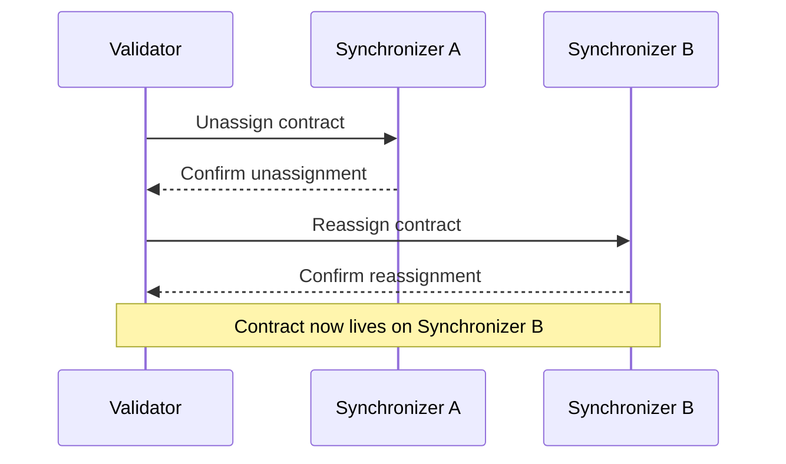

> **출처(원문)**: [Multi-Synchronizer Architecture](https://docs.canton.network/overview/learn/multi-synchronizer) · 번역일 2026-06-15

## 📌 개발자 노트
- **한 줄 요약**: <abbr class="gloss" title="원장에 기록되는 불변 데이터 단위. 상태 변경은 새 컨트랙트 생성으로 표현됨">컨트랙트</abbr>가 <abbr class="gloss" title="상태를 저장하지 않고 트랜잭션 합의·순서를 조율하는 Canton 구성요소">Synchronizer</abbr>에 "할당(assignation)"되고 Synchronizer 간에 "<abbr class="gloss" title="컨트랙트를 한 Synchronizer에서 다른 Synchronizer로 옮기는 프로토콜">재할당</abbr>(reassignment)"되는 방식, 다중 Synchronizer가 필요한 이유, 재할당 프로토콜(언어사인→어사인, 비원자적)·검증·정책, 업데이트 스트림의 비인과성, 그리고 <abbr class="gloss" title="Synchronizer 구성요소. 암호화된 메시지에 전체 순서·타임스탬프를 부여하고 참여자에게 전달">시퀀서</abbr>의 <abbr class="gloss" title="Synchronizer에 쓰기를 요청할 때 소비하는 자원. Canton Coin으로 비용을 지불">트래픽</abbr> 관리 메커니즘까지.
- **핵심 용어**: 할당(assignation), 재할당(reassignment)·언어사인/어사인, 재할당 참여자, Synchronizer 라우터, 트래픽 비용·예산, base/extra traffic, SetTrafficPurchased
- **선행 개념**: [아키텍처 개요](architecture.md), [원장 모델](ledger-model.md), [글로벌 Synchronizer](../understand/global-synchronizer.md).

---

# 다중 Synchronizer 아키텍처

> 컨트랙트가 Synchronizer에 할당되고 Synchronizer 간에 이동하는 방식

Canton Network은 여러 Synchronizer가 동시에 운영되는 것을 지원한다. <abbr class="gloss" title="거래·컨트랙트가 기록되는 장부. Canton에선 활성 컨트랙트의 모음">원장</abbr>의 각 컨트랙트는 특정 Synchronizer에 할당되며, 필요에 따라 컨트랙트를 Synchronizer 간에 옮길 수 있다. 이 설계는 네트워크가 수평 확장하게 하고, 서로 다른 활용 사례를 위한 특화 Synchronizer를 지원한다.

## 컨트랙트와 Synchronizer 할당

Canton의 모든 <abbr class="gloss" title="아직 보관(소비)되지 않아 현재 유효한 컨트랙트">활성 컨트랙트</abbr>는 임의의 시점에 정확히 하나의 Synchronizer에 할당된다. 그 Synchronizer가 해당 컨트랙트가 관여하는 <abbr class="gloss" title="원장 상태를 바꾸는 원자적 작업 단위. 하나 이상의 컨트랙트를 생성·보관하며, 전부 적용되거나 전혀 적용되지 않음">트랜잭션</abbr>의 순서화와 <abbr class="gloss" title="여러 노드가 트랜잭션의 유효성·순서에 함께 동의하는 절차">합의</abbr>를 다룬다. 트랜잭션이 서로 다른 Synchronizer에 있는 컨트랙트를 건드릴 때, Canton은 양쪽에 걸쳐 트랜잭션을 조율한다.

<abbr class="gloss" title="파티를 호스팅하고 그 파티의 컨트랙트 데이터를 저장하는 참여자 노드">밸리데이터</abbr>는 자기 <abbr class="gloss" title="Canton에서 권한과 데이터 가시성의 주체가 되는 식별 가능한 참여 주체">파티</abbr>의 컨트랙트 데이터를 로컬에 저장한다. 컨트랙트가 할당된 Synchronizer가 어떤 시퀀서·<abbr class="gloss" title="Synchronizer 구성요소. 이해관계자들의 확인을 모아 트랜잭션 승인/거부를 판정">미디에이터</abbr>가 그 트랜잭션을 다룰지 결정하지만, 컨트랙트 데이터 자체는 그 컨트랙트의 <abbr class="gloss" title="어떤 컨트랙트와 관계를 맺어 그것을 보거나 승인하는 파티 = 서명자 + 관찰자">이해관계자</abbr>를 <abbr class="gloss" title="참여자 노드가 파티의 데이터·키를 맡아 두고, 그 파티를 대신해 원장에서 활동(저장·제출·확인)해 주는 것">호스팅</abbr>하는 밸리데이터에 남는다.

## 언어사인(Unassignment)과 재할당(Reassignment)

컨트랙트는 언어사인/재할당 프로토콜을 통해 한 Synchronizer에서 다른 Synchronizer로 옮길 수 있다:

1. **언어사인(Unassignment)** — 컨트랙트가 현재 Synchronizer에서 제거된다. 이 짧은 기간 동안 컨트랙트는 트랜잭션에 쓰일 수 없다.
2. **재할당(Reassignment)** — 컨트랙트가 대상 Synchronizer에 할당되어 다시 사용 가능해진다.

이 연산은 컨트랙트 이해관계자의 관점에서 원자적이다. 컨트랙트는 결코 두 Synchronizer에 동시에 있지 않으며, 잃어버릴 수 있는 상태에 놓이지도 않는다.



## 글로벌 Synchronizer

<abbr class="gloss" title="슈퍼 밸리데이터들이 공동 운영하는 Canton의 퍼블릭 조율(합의) 계층">글로벌 Synchronizer</abbr>는 Canton Network의 주된 Synchronizer다. Canton Foundation의 거버넌스 아래 <abbr class="gloss" title="글로벌 Synchronizer를 운영하고 네트워크 거버넌스에 참여하는 노드">슈퍼 밸리데이터</abbr>가 운영한다. Canton Network의 대부분 컨트랙트가 글로벌 Synchronizer에 할당되며, 새 컨트랙트의 기본 Synchronizer 역할을 한다.

특정 활용 사례를 위해 추가 Synchronizer를 만들 수 있다 — 예컨대 특정 트랜잭션을 격리하려는 컨소시엄을 위한 프라이빗 Synchronizer. 프라이빗 Synchronizer의 컨트랙트도 크로스-Synchronizer 트랜잭션을 통해 글로벌 Synchronizer의 컨트랙트와 여전히 상호작용할 수 있다.

## 언제 다중 Synchronizer를 쓰나

대부분의 애플리케이션은 글로벌 Synchronizer만 필요하다. 다중 Synchronizer는 다음이 필요할 때 의미가 있다:

* **격리(Isolation)** — 특정 트랜잭션 흐름을 퍼블릭 네트워크와 완전히 분리
* **성능(Performance)** — 고처리량 워크플로를 Synchronizer에 분산해 경합 감소
* **규제 준수** — 특정 트랜잭션이 특정 관할권의 특정 밸리데이터에서만 처리되도록 보장

# 다중 Synchronizer (Multiple Synchronizers)

## 동기

<abbr class="gloss" title="파티를 호스팅하고 그 파티의 컨트랙트를 저장·실행하는 노드. 밸리데이터의 핵심 구성요소">참여자 노드</abbr>는 Synchronizer(글로벌 Synchronizer 또는 사설 운영 Synchronizer)를 사용해 <abbr class="gloss" title="다자간 워크플로를 위해 설계된 Canton의 스마트 컨트랙트 언어">Daml</abbr> 트랜잭션을 실행한다. 하나 이상의 Synchronizer가 필요할 수 있는 이유는 여럿이다:

* **규제**

  일부 규제 환경은 핵심 인프라에 대한 통제를 요구한다. 또는 데이터 거주(data domicile) 법이 당신의 운영 영역에 배포되지 않은 Synchronizer 연결을 금지할 수 있다.

* **성능**

  서로 다른 Synchronizer는 서로 다른 성능 특성을 갖는다: 어떤 것은 고처리량을, 어떤 것은 저지연을 지향할 수 있다. 비기능 요구사항에 맞는 Synchronizer를 골라야 한다.

* **거버넌스**

  Synchronizer의 거버넌스는 중앙집중적이거나 탈중앙적일 수 있다.

* **비용**

  고처리량 활용 사례에서는 글로벌 Synchronizer의 수수료가 너무 높을 수 있어 다른 Synchronizer를 선호할 수 있다.

* **애플리케이션 제한**

  애플리케이션 제공자로서, 애플리케이션 사용을 특정 Synchronizer로 제한하기로 결정할 수 있다.

서로 다른 활용 사례를 위해, 참여자 노드는 여러 Synchronizer에 연결될 수 있다.

> **정의: 컨트랙트의 할당(assignation)**
> 임의의 Daml 컨트랙트에 대해, 그 컨트랙트의 이해관계자를 적어도 하나 호스팅하는 참여자들은 그 컨트랙트의 변경을 조율하는 데 어떤 Synchronizer를 쓸지 합의한다. 이 합의된 Synchronizer를 컨트랙트의 *할당(assignation)* 이라 부른다.

더 일반적으로, 지도 원칙은 임의의 공유 상태에 대해 그 상태를 유지하는 참여자들이 그 상태의 변경을 조율하는 데 어떤 Synchronizer를 쓸지 합의한다는 것이다.

컨트랙트의 이해관계자는 컨트랙트의 할당 Synchronizer를 바꾸기로 합의할 수 있다. *재할당(reassignment)* 이라 부르는 이 절차는 아래에서 설명한다. 재할당이 필요한 이유는 Daml 트랜잭션이 단일 Synchronizer에서 실행되기 때문이다. 즉, 모든 입력 컨트랙트가 그 Synchronizer에 할당되어 있어야 한다.

## 다중 Synchronizer가 관여하는 트랜잭션

사용자가 현재 서로 다른 Synchronizer에 할당된 컨트랙트들이 관여하는 Daml 트랜잭션을 실행하려 한다고 하자. 트랜잭션은 다음 단계를 수행해 실행할 수 있다(아래에서 더 정확히 설명):

1. 트랜잭션에 적합한 Synchronizer `S`를 찾는다

   `S`가 충족해야 할 조건은 아래 "언어사인·어사인 요청의 검증" 절에서 더 정확히 다룬다. 최소한, 모든 이해관계자가 `S`에 호스팅되어야 하고, 모든 입력 컨트랙트의 모든 패키지가 `S`에서 베팅(vet)되어야 한다.

2. 모든 입력 컨트랙트의 할당을 `S`로 바꾼다(즉, 모든 입력 컨트랙트를 `S`로 재할당).

3. 트랜잭션을 `S`에서 실행한다.

4. 원한다면, 출력 컨트랙트의 할당을 다른 Synchronizer로 바꾼다.

컨트랙트의 할당을 바꾸는 방법은 두 가지다:

* **자동으로**

  사용자가 트랜잭션을 제출하면, Canton의 Synchronizer 라우터(Synchronizer router)가 트랜잭션 제출에 쓸 수 있는 최선의 Synchronizer를 식별하려 한다. 그런 다음 트랜잭션의 입력 컨트랙트가 선택된 Synchronizer로 재할당되도록 재할당 <abbr class="gloss" title="이해관계자 밸리데이터가 트랜잭션이 유효함을 미디에이터에 응답하는 것(confirmation)">확인</abbr> 요청을 제출한다. 모든 재할당이 완료되면, Synchronizer 라우터가 Daml 트랜잭션을 선택된 Synchronizer에 제출한다.

  이 경우 사용자는 Synchronizer 선택과 재할당 수행을 신경 쓸 필요가 없다. 이로써 애플리케이션을 Synchronizer를 고려하지 않고 설계할 수 있다. 다만 애플리케이션은 비균질 <abbr class="gloss" title="어떤 노드·파티·키가 네트워크에 참여하는지를 정의하는 구성 정보">토폴로지</abbr>(Synchronizer별 패키지 베팅 또는 파티 호스팅)와 명시적으로 공개된 컨트랙트를 사용해 라우팅에 영향을 줄 수 있다.

* **명시적으로**

  사용자는 다음과 같이 Synchronizer 라우팅을 정밀하게 제어할 수 있다:

  * Ledger API는 재할당을 제출하는 <abbr class="gloss" title="애플리케이션이 원장에 제출하는 명령(컨트랙트 생성·초이스 실행 요청)">커맨드</abbr>를 받는다.
  * Daml 트랜잭션을 제출할 때, 사용자는 어떤 Synchronizer를 쓸지 지정할 수 있다. 지정된 Synchronizer가 트랜잭션에 적합하지 않으면 제출이 실패한다.

### Synchronizer 자동 선택

모든 입력 컨트랙트가 같은 Synchronizer에 할당되어 있지 않아 트랜잭션이 단일 Synchronizer에서 실행될 수 없을 때, Synchronizer 라우터는 제출에 적합한 최선의 공통 Synchronizer를 찾으려 한다.

각 입력 컨트랙트 c_i에 대해, 제출 시점의 할당을 S_i로 표기하자. Synchronizer `S`는 다음 조건이면 트랜잭션에 허용 가능(admissible)하다:

* c_i를 S_i에서 `S`로 재할당하는 것이 유효하다.
* 제출 참여자가 각 c_i에 대해 제출 파티의 재할당 참여자(reassigning participant)다.

허용 가능한 모든 Synchronizer 중에서, 라우터는 다음을 (중요도 순으로) 만족하는 것을 고른다:

* 가장 높은 우선순위를 가진 것,
* 재할당 수를 최소화하는 것,
* 가장 낮은 Synchronizer id를 가진 것.

### 글로벌 Synchronizer의 중요성

위에서 언급했듯, Daml 트랜잭션이 실행되려면 모든 입력 컨트랙트의 모든 이해관계자가 단일 Synchronizer를 신뢰해야 한다. 또한 모든 입력 패키지가 이 공통 Synchronizer에서 베팅되어야 한다. 글로벌 Synchronizer의 목적은 모든 파티가 신뢰하는 표준 Synchronizer가 되어, 대부분의 트랜잭션을 정산하는 데 쓰일 수 있게 하는 것이다.

## 재할당 프로토콜

컨트랙트 `c`가 Synchronizer `S`를 써서 생성되면, 이해관계자는 컨트랙트의 추가 변경(예: 실행과 <abbr class="gloss" title="컨트랙트를 소비해 비활성으로 만드는 것(archive). 보관된 컨트랙트는 더 이상 쓸 수 없음">보관</abbr>)을 조율하는 데 이 Synchronizer를 쓰기로 합의한다. 이 시점에서 `c`의 할당은 `S`다. `c`의 할당을 다른 Synchronizer `S'`로 바꾸려면, `c`의 이해관계자가 `c`를 `S`에서 `S'`로 *재할당* 한다.

이 절에서는 재할당 프로토콜을 설명한다.

### 개요

컨트랙트 `c`를 Synchronizer `S1`(*소스* Synchronizer)에서 `S2`(*대상* Synchronizer)로 재할당하면 이해관계자가 할당을 `S1`에서 `S2`로 바꿀 수 있다. 절차는 두 단계로 이루어진다:

* **언어사인(Unassignment)**

  컨트랙트의 이해관계자가 소스 Synchronizer에서 컨트랙트를 언어사인하는 커맨드를 제출한다. 언어사인이 <abbr class="gloss" title="트랜잭션이 최종 확정되어 원장에 반영되는 것">커밋</abbr>되면 `c`는 소스 Synchronizer에서 비활성이 되어 더 이상 쓸 수 없다.

  언어사인은 트랜잭션 프로토콜과 같은 단계를 거친다.

* **어사인(Assignment)**

  컨트랙트의 이해관계자(언어사인을 제출한 자와 같을 필요는 없음)가 대상 Synchronizer에서 컨트랙트를 어사인하는 커맨드를 제출한다. 어사인이 커밋되면 `c`는 대상 Synchronizer에서 활성이 되어 다시 쓸 수 있다.

  어사인은 트랜잭션 프로토콜과 같은 단계를 거친다.

두 단계는 다음 다이어그램으로 시각화할 수 있다:


따라서 컨트랙트의 재할당은 두 개의 별개 Synchronizer(소스와 대상)에서 두 개의 확인 요청을 수반하는 **비원자적(non-atomic)** 절차다. 언어사인이 성공하면 컨트랙트는 **어사인 대기(pending assignment)** 로 표시되어 어사인이 수행될 때까지 쓸 수 없다.

Ledger API 관점의 재할당을 설명하기 전에, 다음 정의를 보자.

> **정의: 재할당 카운터(reassignment counter)**
> **재할당 카운터**는 컨트랙트가 재할당된 횟수를 추적한다. 컨트랙트 생성 시 0으로 설정되고 각 언어사인마다 1 증가한다. 언어사인 이벤트와 대응하는 어사인 이벤트는 같은 재할당 카운터를 갖는다.

### Ledger API와 애플리케이션 관점의 재할당

언어사인 커맨드는 다음 필드로 구성된다:

* 재할당할 컨트랙트(배치 내 모든 컨트랙트는 같은 <abbr class="gloss" title="컨트랙트의 주된 권한자. 생성·보관(소비)에 반드시 동의해야 하는 파티">서명자</abbr> 집합과 같은 이해관계자 집합을 가져야 함),
* 소스 Synchronizer(현재 할당),
* 대상 Synchronizer.

성공한 언어사인은 다음 필드를 담은 언어사인 이벤트를 산출한다:

* unassign id: 재할당을 고유하게 식별하는 불투명(opaque) 식별자로, 어사인 제출에 쓰인다.
* reassignment counter: 컨트랙트가 재할당된 횟수.
* assignment exclusivity: 이 시각(대상 Synchronizer에서 측정) 이전에는 언어사인 제출자만 어사인을 개시할 수 있다.

어사인 커맨드는 다음 필드로 구성된다:

* unassign id,
* 소스 Synchronizer(이전 할당),
* 대상 Synchronizer.

성공한 어사인은 다음 필드를 담은 어사인 이벤트를 산출한다:

* unassign id: 언어사인·어사인 이벤트를 연관짓는 데 쓸 수 있다.
* reassignment counter: 언어사인 이벤트와 같은 값.
* created event: 컨트랙트 데이터(목적은 "참여자의 가시성 진입·이탈" 참고).

### 진행 예시

여러 시나리오와 정의를 설명하기 위해, 서명자가 Bank이고 <abbr class="gloss" title="컨트랙트를 볼 수 있으나 단독으로 행위할 수는 없는 파티">관찰자</abbr>(소유자)가 Alice인 `Iou`를 가정하고 `S1`에서 `S2`로의 `Iou` 재할당을 논한다.

네트워크 토폴로지는 다음과 같다:

* 다섯 참여자 `P1`, ..., `P3`(원문 표기 유지)와 두 Synchronizer `S1`, `S2`.
* 아래 그림과 같은 호스팅 관계. 괄호 안 글자는 권한(Submission 제출, Confirmation 확인, Observation 관찰)을 나타낸다.


### 재할당 관련 주요 정의

언어사인·어사인 요청 확인의 일부로 수행되는 검증을 제시하기 전에, 몇 가지 정의가 필요하다.

#### 대상 타임스탬프 (Target timestamp)

언어사인 요청을 처리할 때, 확인 참여자는 대상 Synchronizer가 일부 요건(예: 필요한 패키지가 베팅됨)을 충족하는지 확인해야 한다. 이 요건은 시간에 따라 변할 수 있는 대상 Synchronizer의 토폴로지에 좌우된다. 관여하는 모든 참여자가 같은 검증을 수행하고 같은 결론에 도달하도록, 언어사인 요청은 모든 토폴로지 관련 검증에 쓰이는 대상 Synchronizer의 타임스탬프를 담는다.

정의: **대상 타임스탬프(target timestamp)**
언어사인이 제출되면 대상 Synchronizer에서 시간 증명(time proof)이 요청된다. 이 타임스탬프는 언어사인 처리 중 대상 Synchronizer 관련 검증(패키지 베팅, 이해관계자가 대상 Synchronizer에 호스팅됨 등)을 수행하는 데 쓰인다. 이 타임스탬프를 **대상 타임스탬프**라 한다.

#### 재할당 참여자 (Reassigning participant)

이해관계자가 여러 참여자 노드에 호스팅될 수 있고 토폴로지가 비균질일 수 있으므로(예: 참여자 노드가 연결된 일부 Synchronizer에서만 파티를 호스팅), 재할당에 관여하는 참여자 노드는 언어사인 요청만 또는 어사인 요청만의 인포미(informee)일 수 있다(아래 "참여자의 가시성 진입·이탈" 논의 참고). 그런 참여자 노드는 모든 검증을 수행할 수 없고(소스·대상 Synchronizer 모두에 연결되어야 하므로) <abbr class="gloss" title="같은 자산을 두 번 쓰는 부정행위">이중지불</abbr>(재할당된 컨트랙트가 소스·대상 Synchronizer 모두에서 활성)을 막을 수 없다. 이것이 다음 정의의 동기다.

정의: **재할당 참여자(reassigning participant)**
컨트랙트 `c`에 대해, 참여자 `P`는 다음이 성립하면 파티 `S`에 대한 **재할당 참여자**다:

1. `S`가 `c`의 이해관계자다.
2. `S`가 대상 타임스탬프에 대상 Synchronizer에서 `P`에 호스팅된다.
3. `S`가 소스 Synchronizer에서 `P`에 호스팅된다.

마지막 조건은 제출 중 최근 토폴로지 스냅숏으로, 프로토콜 3단계 중 요청 시점 토폴로지 스냅숏으로 확인된다.

진행 예시에서 `P1`, `P3`, `P5`가 재할당 참여자다. `P2`는 대상 Synchronizer에 연결되지 않으므로 재할당 참여자가 아니다. 마찬가지로 `P4`는 소스 Synchronizer에 연결되지 않아 재할당 참여자가 아니다.

#### 서명자 언어사인 참여자 (Signatory unassigning participant)

재할당의 확인 정책을 기술하는 핵심 요소는 참여자 노드가 언어사인 요청의 확인자(confirmer)가 되기 위해 충족해야 할 조건을 도출하는 것이다. 앞서 언급했듯, 한 요건은 노드가 재할당 참여자라는 것이다.

또한 우리는 컨트랙트 서명자만 확인하기를 원한다. 서명자는 소스 Synchronizer에서 컨트랙트를 보관하고 대상 Synchronizer에서 (재)생성할 수 있으므로, 관찰자 같은 다른 파티에게 언어사인 요청 확인을 요구하는 것은 추가 안전성을 가져오지 않는다.

이것이 다음 정의의 동기다.

정의: **서명자 언어사인 참여자(signatory unassigning participant)**
컨트랙트 `c`에 대해, 참여자 `P`는 다음이 성립하면 파티 `S`에 대한 **서명자 언어사인 참여자**다:

1. `S`가 `c`의 **서명자**다.
2. `P`가 `S`에 대한 재할당 참여자다.
3. `S`가 소스 Synchronizer에서 적어도 확인 권한으로 `P`에 호스팅된다.

진행 예시에서 서명자 언어사인 참여자는 `P3`와 `P5`다. 참여자 `P1`은 컨트랙트의 서명자를 호스팅하지 않고, `P2`와 `P4`는 어떤 파티에 대해서도 재할당 참여자가 아니다.

#### 서명자 어사인 참여자 (Signatory assigning participant)

정의: **서명자 어사인 참여자(signatory assigning participant)**
컨트랙트 `c`에 대해, 참여자 `P`는 다음이 성립하면 파티 `S`에 대한 **서명자 어사인 참여자**다:

1. `S`가 c의 **서명자**다.
2. `P`가 `S`에 대한 재할당 참여자다.
3. `S`가 대상 Synchronizer에서 적어도 확인 권한으로 `P`에 호스팅된다.

비공식적으로, 서명자 어사인 참여자는 컨트랙트의 언어사인과 어사인 모두를 통지받으며 어사인 요청의 확인자다.

진행 예시에서 유일한 서명자 어사인 참여자는 `P5`다:

* `P1`은 컨트랙트의 서명자를 호스팅하지 않는다.
* `P3`는 서명자를 호스팅하지만 관찰 권한만 가진다.

### 확인 정책

이 절에서는 어떤 인포미 참여자가 언어사인 또는 어사인 요청에 대한 확인 응답을 보내야 하는지 논한다.

일부 검증은 재할당 참여자만 수행할 수 있고 컨트랙트의 서명자만 재할당 요청을 확인해야 하므로, 언어사인의 확인자는 정확히 서명자 언어사인 참여자이고 어사인의 확인자는 정확히 서명자 어사인 참여자다.

한 서명자에 대해 미디에이터가 기대하는 확인 수는 정확히 그 서명자의 확인 임계값이다(언어사인은 소스 Synchronizer에서, 어사인은 대상 Synchronizer에서).

### 언어사인·어사인 요청의 검증

재할당 검증 규칙의 지도 원칙은:

* 재할당이 이해관계자가 컨트랙트를 쓸 수 있는 능력을 박탈해서는 안 된다.
* 언어사인된 후 컨트랙트를 어사인할 수 없게 될 위험을 최소한으로 줄여야 한다(재할당은 비원자적임을 상기).

이제 언어사인 요청 처리의 일부로 수행되어야 하는 검증을 형식화할 수 있다:

* 컨트랙트 `c`가 소스 Synchronizer에서 활성이다.
* 모든 이해관계자가 재할당 참여자에 호스팅된다.
* 각 서명자 `S`가 충분히 많은 서명자 어사인 참여자에 호스팅된다. 더 정확히, `S`에 대한 대상 Synchronizer의 확인 임계값이 `t`라면, `S`는 적어도 `t`개의 서명자 어사인 참여자를 가져야 한다. 이는 서명자 어사인 참여자가 충분하지 않아 재할당을 완료할 수 없게 되는 위험을 제거한다.
* 컨트랙트에 대응하는 패키지가 대상 Synchronizer에서 베팅되어야 한다.
* 요청이 여러 컨트랙트를 담으면, 배치 내 모든 컨트랙트는 같은 서명자와 이해관계자를 가져야 한다.

어사인 요청 처리의 일부로 수행되어야 하는 검증은 더 단순하다. 확인 참여자는 다음을 보장해야 한다:

* 어사인이 아직 완료되지 않은 재할당에 대응한다.
* 컨트랙트에 대응하는 패키지가 베팅되어 있다.

언어사인·어사인에 특정되지 않고 일반 Daml 트랜잭션에도 수행되는 추가 검증:

* <abbr class="gloss" title="한 트랜잭션을 당사자별로 나눈 조각. 각 당사자는 자기 권한에 해당하는 뷰(자기 몫)만 받아 본다">뷰</abbr>가 올바르게 복호화될 수 있다,
* 수신자 목록이 올바르다,
* 루트 해시 메시지가 올바르다,
* 기타 등등.

### 제출 정책

컨트랙트 `c`의 재할당(언어사인 또는 어사인)은, 참여자 `P`가 `c`의 이해관계자 `S`를 적어도 하나 호스팅하고 그에 대해 재할당 참여자라면 `P`가 제출할 수 있다. `P`가 `S`를 제출 권한으로 호스팅할 필요는 *없다*.

재할당 제출에 제출 권한을 요구하지 않는 이유는 여럿이다:

* 진행 예시에서, Alice는 `Iou`가 `S2`로 재할당되면 그에 대한 <abbr class="gloss" title="컨트랙트에서 수행 가능한 동작(권한이 부여된 당사자만 실행 가능)">초이스</abbr> 실행 능력을 잃는다(그녀가 `S2`에서 제출 권한으로 호스팅되지 않으므로). 그녀가 `S1`로의 재할당을 개시할 수 있으므로, `Iou`의 초이스를 실행할 가능성을 되찾을 방법이 있다.
* 탈중앙화 파티는 Daml 트랜잭션을 제출할 수 없지만, 애플리케이션의 조합 가능성을 위해 재할당은 제출할 수 있어야 한다.

### 참여자의 가시성 진입·이탈

이 페이지의 진행 예시를 보자.

참여자 `P2`는 언어사인 확인 요청의 인포미 참여자이지만 어사인 요청의 인포미는 아니다. `S2`에서 Alice를 호스팅하지 않기 때문이다. 따라서 `P2` 관점에서 어사인이 완료될 때 컨트랙트가 활성이 되지 않는다: 컨트랙트는 그 참여자에서 사용 불가가 된다(이는 Alice가 `S1`·`S2` 모두에서 `P1`에 호스팅되므로 허용된다). 이런 시나리오에서 컨트랙트가 `P2`의 *가시성을 이탈한다*고 말한다.

이제 "반대" 시나리오를 보자. 참여자 `P4`는 (`S2`에서 Bank를 호스팅하는 참여자로서) 어사인 확인 요청의 인포미 참여자이며, 어사인의 일부로 컨트랙트를 알게 된다. 완료되면 컨트랙트는 `P4`에서 쓸 수 있다. 이런 시나리오에서 컨트랙트가 `P4`의 *가시성에 진입한다*고 말한다. created event가 assigned event에 포함되므로, 애플리케이션은 컨트랙트가 참여자 노드의 가시성에 진입할 때 그 페이로드를 알 수 있다.

참여자 관점에서, 컨트랙트는 생애주기 동안 여러 번 그 가시성에 진입·이탈할 수 있다. 이는 참여자에 호스팅된 모든 이해관계자가 다중 호스팅(multi-hosted)일 때 일어날 수 있다.

### 업데이트 스트림의 비인과성

이 절에서는 컨트랙트의 (비)활성화만 담는 **업데이트 스트림(updates stream)** — `Created`, `Archived`, `Unassigned`, `Assigned` — 에 집중한다. 내용은 비소비형 실행도 담는 업데이트 트리 스트림을 다루도록 쉽게 확장할 수 있다.

컨트랙트 `c`와 `c`의 이해관계자를 호스팅하는 참여자 노드에 대해, `c`에 대해 업데이트 스트림에 방출된 모든 이벤트의 목록을 고려한다. 단일 Synchronizer만 관여할 때, 이 목록은 정확히 최대 두 원소를 담는다:

* 첫 원소는 `c`의 `Created`(활성화).
* 컨트랙트가 활성이 아닐 때, 마지막 원소는 `Archived` 또는 `Exercised`(비활성화)다.
* 활성화의 기록 시각(record time)은 비활성화의 기록 시각보다 엄격히 작다. 더 일반적으로, 업데이트 스트림의 이벤트는 기록 시각으로 정렬된다.

참여자 노드가 여러 Synchronizer에 연결되면, 업데이트 스트림은 모든 Synchronizer의 이벤트가 병합된 것으로 구성된다. 시간은 Synchronizer 간에 비교할 수 없으므로, 이벤트의 전역 순서에 대해 어떤 보장도 제공하지 않기로 했다. 특히:

* 서로 다른 Synchronizer에서 일어난 이벤트의 순서에 대해 어떤 가정도 할 수 없다.
* 순서가 참여자마다 다를 수 있다.

따라서 다중 Synchronizer 시나리오에서 **업데이트 스트림에 전역 인과성(global causality)은 없다**.

예를 들어 다음 시나리오를 보자:

* 컨트랙트 `c`가 Synchronizer `S1`에서 생성된다.
* `c`가 `S1`에서 `S2`로 언어사인된다.
* `c`가 `S2`에 어사인된다.
* `c`가 보관된다.

`S1`·`S2` 모두에서 이해관계자를 호스팅하는 참여자의 업데이트 스트림에서, 이벤트는 다음 순서 중 어느 것으로든 나타날 수 있다:

* `created`, `unassigned`, `assigned`, `archived`
* `created`, `assigned`, `unassigned`, `archived`
* `assigned`, `created`, `unassigned`, `archived`
* `assigned`, `archived`, `created`, `unassigned`
* `created`, `assigned`, `archived`, `unassigned`
* `assigned`, `created`, `archived`, `unassigned`

특히, `created` 이벤트가 반드시 첫 이벤트인 것도 아니고 `archived`가 반드시 마지막 이벤트인 것도 아니다.

각 Synchronizer의 이벤트 투영(projection)은 인과적으로 일관됨에 유의하라. 즉,

* `created`는 항상 모든 `unassigned`나 `archived`보다 먼저 나타나고,
* `archived`는 항상 모든 `assigned`나 `created`보다 나중에 나타나며,
* 연속된 활성화나 비활성화가 없다(특히 연속된 `assigned`나 `unassigned`가 없다).

마지막으로, 위에서 본 것처럼 참여자 노드는 어사인으로 컨트랙트를 알게 될 수 있으므로, 업데이트 스트림이 `Created`나 `Archived`를 담는다는 보장은 없다.

### 재할당과 경합 (Contention)

어사인은 활성화이므로 생성(create)과 유사한 영향을 준다. 마찬가지로 언어사인은 비활성화이므로 보관(archive)과 유사한 영향을 준다. 특히 어사인과 언어사인 모두 컨트랙트를 잠그므로(lock), 재할당은 읽기 전용 트랜잭션을 포함한 다른 워크플로와 경합을 일으킨다. 재할당이 트랜잭션 제출의 일부로 Synchronizer 라우터에 의해 자동 수행되면 이 추가 경합은 예상치 못하고 디버깅하기 어려울 수 있다. 경합을 최소화할 수 있도록 Daml 워크플로를 설계할 때 재할당을 명시적으로 고려할 것을 권한다.

## 다중 Synchronizer 시간

(원장 모델의 시간 단조성과 관련되며, 커맨드 중복제거 시간 모델과 대조된다. 상세는 원문에서 추후 보강 예정인 섹션.)

---

# 트래픽 관리 (Traffic management)

시퀀서는 Canton Synchronizer의 핵심 구성 요소이며 상당한 운영 비용을 수반한다. 따라서 Canton은 시퀀서를 남용으로부터 보호하고, Synchronizer의 개별 멤버가 시간에 걸쳐 얼마나 많은 데이터를 시퀀싱할 수 있는지 통제하는 메커니즘을 제공한다. 이를 위해 Synchronizer의 시퀀서는 트래픽 회계를 수행하고 트래픽 한도를 강제한다. 이 페이지는 그 메커니즘을 설명한다.

## 제출 요청 (Submission requests)

시퀀서 API는 Synchronizer에서 이벤트를 시퀀싱하기 위한 `SendAsync` RPC를 제공한다. 제출 요청(Submission requests)은 SendAsync RPC의 페이로드이며, 시퀀서가 대부분의 자원을 그 RPC 처리에 쓰므로 트래픽 관리의 주된 초점이다.

### 트래픽 비용 (Traffic Cost)

트래픽 비용은 제출 요청의 처리 비용을 두 차원에서 포착하는 것을 목표로 한다:

* 수신자가 이벤트를 읽으며 발생하는 네트워크 트래픽
* 시퀀서에서 이벤트의 저장 비용

트래픽 비용은 제출 요청의 두 구성 요소를 본다:

* 발신자(sender)

* 봉투(envelope) 목록. 각 봉투는 다음을 담는다:

  > * 페이로드(임의 바이트)
  >
  > * 수신자(Synchronizer 멤버) 목록. 수신자는 다음으로 주소 지정될 수 있다:
  >
  >   > * 개별적으로
  >   > * 그룹 주소 지정(group addressing)을 통해. 그룹 주소 지정은 특정 수신자 집합을 그룹으로 주소 지정하게 한다. 예컨대 그룹 주소 `AllMembersOfSynchronizer`는 페이로드를 Synchronizer의 모든 멤버에게 보낸다.

제출 요청의 트래픽 비용은 다음과 같이 계산된다(의사 코드):

```
fn calculate_submission_request_traffic_cost:
    envelopes_cost = 0

    for envelope in envelopes:
        storage_cost = envelope.payload
        network_cost = envelope.payload * envelope.recipients.size * read_vs_write_scaling_factor
        submission_request = storage_cost + network_cost
        envelopes_cost = envelopes_cost + submission_request

    return base_event_cost + envelopes_cost
```

여기서 `base_event_cost`는 봉투 비용에 더해지는 제출 요청의 상수 비용이고, `read_vs_write_scaling_factor`는 수신자 수에 기반해 네트워크 비용을 스케일링하는 상수 계수다. 둘 다 Synchronizer의 구성 파라미터이며 토폴로지의 일부다. 자세한 내용은 구성 섹션 참고. 보통 `read_vs_write_scaling_factor`는 1/10000 정도이며, 수신자가 이벤트를 읽을 때의 네트워크 대역폭을 반영하기 위해 페이로드 크기를 스케일 다운한다.

그룹 주소는 비용 계산 전에 해소(resolve)된다. 즉, `AllMembersOfSynchronizer`로 주소 지정된 메시지는 요청 제출 시점의 Synchronizer 멤버 수에 맞춰 스케일된 네트워크 비용을 갖는다.

트래픽 비용은 Synchronizer에서 시퀀싱되는 모든 제출 요청에 대해 발신자에게 부과된다. 제출 요청에는 확인 요청, 확인 응답, ACS 커밋먼트, 토폴로지 요청, 시간 증명이 포함된다.

시간 증명은 기술적으로 빈 메시지이므로 트래픽 비용은 항상 `base_event_cost`와 같다.

Synchronizer 멤버는 보통 자신에게 보내진 이벤트를 받았음을 확인하기 위해 Synchronizer에 정기적인 확인 응답(acknowledgement)을 보낸다. 이로써 시퀀서가 이벤트를 안전하게 <abbr class="gloss" title="더 이상 필요 없는 과거 원장 데이터를 정리해 저장공간을 줄이는 작업">프루닝</abbr>할 수 있다. 확인 응답은 트래픽 비용이 없지만, 남용을 막기 위해 속도 제한이 있다.

## 트래픽 회계 (Traffic accounting)

Synchronizer의 시퀀서들은 트래픽 회계를 공동으로 수행한다. Synchronizer의 각 인가된 멤버는 요청이 시퀀싱되면 자기 제출 요청의 비용이 트래픽 잔액에서 차감된다. 위에서 설명한 트래픽 파라미터는 Synchronizer의 동적 도메인 파라미터의 일부로 구성되므로 변경될 수 있다. 따라서 요청 비용은 시퀀서 API에 제출된 순간과 시퀀싱되는 순간 사이에, 그사이 트래픽 파라미터가 바뀌면 달라질 수 있다. 이를 위해 각 멤버는 제출 시 제출 요청의 예상 비용을 계산해 요청 메타데이터에 포함한다. 트래픽 파라미터가 동시에 갱신될 때 제출 실패를 막기 위해, 시퀀서는 멤버가 계산한 비용이 시퀀싱 시점 비용과 다를 수 있는 유예 기간을 허용한다(제출 시 비용이 올바르게 계산되었다면). 이 시간 창을 넘으면 제출은 거부되고 최신 트래픽 비용으로 재시도해야 한다. 이 창의 길이는 `(confirmationResponseTimeout + mediatorReactionTimeout) * 2`와 같다. 이 파라미터에 대한 자세한 내용은 동적 Synchronizer 파라미터 문서 참고.

노드가 주어진 Synchronizer의 여러 시퀀서로부터 이벤트를 받도록 구독하면, 모든 시퀀서로부터 현재 트래픽 상태를 요청해 비잔틴 장애 허용(<abbr class="gloss" title="비잔틴 장애 허용(Byzantine Fault Tolerance). 일부 노드가 악의적이거나 고장 나도 시스템이 올바르게 동작하는 성질">BFT</abbr>) 방식으로 비교한다. 이로써 노드의 초기 트래픽 상태가 제공되고, 노드는 구독에서 자기 이벤트가 시퀀싱되는 것을 관찰하며 메모리에서 트래픽 상태를 지속적으로 갱신한다.

### 트래픽 강제 (Traffic enforcement)

다음 다이어그램은 강제 흐름과 시나리오를 상위 수준으로 보여준다.


이 다이어그램에서 강조할 점이 몇 가지 있다.

강제는 제출 흐름의 두 지점에서 일어난다:

* 1단계 후, 시퀀서가 발신자로부터 제출 요청을 받을 때. 이 단계에서 시퀀서는 발신자의 트래픽 상태에 대한 로컬 지식을 써서 발신자가 요청에 충분한 트래픽을 가졌는지 결정한다. 충분하지 않다고 판단하면 이 단계에서 요청을 거부한다.

* 3단계 후, 모든 시퀀서가 BFT 순서화 계층에서 시퀀싱된 이벤트를 읽을 때. 이 단계에서 각 시퀀서는 1단계와 같은 로직을 실행하되, 이 이벤트의 시퀀싱 시점 발신자 트래픽 상태를 쓴다. 이로써 모든 시퀀서가 발신자가 충분한 트래픽을 가졌는지에 대해 같은 결정론적 결정을 내린다.

  > * 발신자가 충분한 트래픽이 없으면, 이벤트는 수신자에게 보내지지 않고 발신자는 이유를 나타내는 deliver error를 받는다. 이를 "낭비된 시퀀싱(wasted sequencing)"이라 하며 메트릭에 그렇게 보고된다.
  > * 발신자가 충분한 트래픽을 가졌으면, 발신자 잔액에서 트래픽이 차감된다. 이후는 이벤트가 유효하고 수신자에게 전달될 수 있는지에 달렸다. 트래픽 제어 외의 추가 검증(서명 검증, 수신자 존재 확인 등)이 전달 전에 시퀀서에서 일어난다. 그 검증이 통과하면 이벤트가 전달되고, 발신자는 `TrafficReceipt`를 포함한 전달 영수증을 받는다. 영수증은 발신자가 트래픽 상태를 그에 맞게 갱신하게 한다. 이벤트가 그 외 무효하면, 이벤트는 전달되지 않고 발신자는 실패 이유를 나타내는 delivery error를 받는다. 이 마지막 경우를 "낭비된 트래픽(wasted traffic)"이라 하며 메트릭에 그렇게 보고된다.

## 트래픽 획득 (Acquiring traffic)

### 기본 트래픽 (Base traffic)

Synchronizer의 모든 멤버는 시간에 걸쳐 수동적으로 기본 트래픽을 누적한다. 여기서 시간은 발신자의 벽시계 시간이 아니라 Synchronizer의 시간을 가리킨다. 트래픽이 얼마나 빨리 누적되는지와 멤버가 누적할 수 있는 기본 트래픽의 최대량은 Synchronizer의 트래픽 구성으로 결정된다. 기본 트래픽은 일반적으로 제한적이며, 노드를 부트스트랩하고 최소한의 트래픽을 요구하는 Synchronizer에 연결할 수 있게 하는 데 쓰인다. 대부분의 실세계 시나리오는 추가 트래픽 획득을 요구한다.

### 추가 트래픽 (Extra traffic)

추가 트래픽은 적어도 `SequencerSynchronizerState.threshold`개의 시퀀서의 시퀀서 Admin API에서 `SetTrafficPurchased` RPC를 호출해 Synchronizer의 임의 멤버에 대해 획득할 수 있다. `SequencerSynchronizerState`는 Synchronizer의 활성 시퀀서를 정의하는 토폴로지 트랜잭션이다. 시퀀서(트래픽 상태 포함)에 영향을 주는 변경을 승인해야 하는 최소 시퀀서 수를 정의하는 임계값이 따른다. 따라서 Synchronizer에서 멤버에 추가 트래픽을 더하려면, 같은 트래픽 구매 요청이 구성 가능한 시간 창 내에 적어도 threshold개의 시퀀서에 제출되어야 한다.

> ⚠️ **주의:** 이 요청은 멤버에 대해 구매된 총 추가 트래픽의 새 절대값을 설정한다. 트래픽의 증분(delta)이 **아니다**. 예를 들어 참여자 P1이 현재 추가 트래픽 `0`을 갖고 `1000`의 추가 트래픽 크레딧을 구매하려면, 금액 `1000`의 `SetTrafficPurchased` 요청이 적어도 `SequencerSynchronizerState.threshold`개의 시퀀서에서 성공적으로 처리되어야 한다. 이후 P1이 추가로 `500`의 추가 트래픽 크레딧을 원하면, 금액 `1500`의 새 `SetTrafficPurchased` 요청이 성공적으로 처리되어야 한다.

> 💡 **팁:** 추가 트래픽 획득은 문서에서 종종 "탑업(top up)"으로 지칭된다.

#### 시리얼 (Serial)

각 `SetTrafficPurchased` 요청은 시리얼 번호 설정을 요구한다. 시리얼 번호는 요청의 멱등성을 보장하고 같은 멤버에 대한 동시 트래픽 갱신을 올바르게 처리하는 데 쓰이는 정수다. 요청이 보내지면 시퀀서는 시리얼 번호가 그 멤버에 대해 마지막으로 쓰인 시리얼 번호보다 높은지 검증한다. 시리얼이 너무 낮으면 요청이 실패하고 올바른 시리얼로 재시도해야 한다. 현재 시리얼을 얻으려면 "트래픽 관찰"을 참고하라.

추가 트래픽 획득은 시퀀서 Admin API 접근과 시퀀서 간 동기화를 요구한다. Canton Network에서 이 동기화는 각 슈퍼 밸리데이터가 트래픽을 획득하는 멤버의 추가 트래픽 잔액을 갱신하는 Daml 워크플로를 통해 온-원장으로 처리된다.

## 트래픽 관찰 (Observing traffic)

### 트래픽 상태 (Traffic state)

시퀀서 Admin API는 `SequencerAdministrationService.TrafficControlState` RPC를 통해 Synchronizer의 모든 멤버의 트래픽 상태를 노출한다. 참여자 노드의 Admin API는 `TrafficControlService.TrafficControlState` RPC를 통해 참여자 노드의 트래픽 상태를 노출한다.

참여자 노드에서 관찰되는 상태는 그 참여자 노드에 대해 시퀀서에서 관찰되는 것보다 약간 지연된다. 참여자는 자기 시퀀서 구독에서 받는 이벤트로부터 상태를 갱신하는데, 이는 정의상 이벤트가 시퀀서에 의해 시퀀싱된 후에 일어나기 때문이다.

### 메트릭 (Metrics)

시퀀서는 여러 트래픽 관련 메트릭을 보고하며, 이는 Synchronizer의 트래픽 상태를 모니터링하는 데 쓸 수 있다. Canton Metrics 참고.

## 구성 (Configuration)

트래픽은 Synchronizer별 동적 Synchronizer 파라미터로 구성된다.

```protobuf
// In bytes, the maximum amount of base traffic that can be accumulated
uint64 max_base_traffic_amount = 1;

// Maximum duration over which the base rate can be accumulated
// Consequently, base_traffic_rate = max_base_traffic_amount / max_base_traffic_accumulation_duration
google.protobuf.Duration max_base_traffic_accumulation_duration = 3;

// Read scaling factor to compute the event cost. In parts per 10 000.
uint32 read_vs_write_scaling_factor = 4;

// Window size used to compute the max sequencing time of a submission request
// This impacts how quickly a submission is expected to be accepted before a retry should be attempted by the caller
// Default is 5 minutes
google.protobuf.Duration set_balance_request_submission_window_size = 5;

// If true, submission requests without enough traffic credit will not be delivered
bool enforce_rate_limiting = 6;

// In bytes, base event cost added to all sequenced events.
// Optional
optional uint64 base_event_cost = 7;
```

트래픽 구성 방법에 대한 안내는 how-to 섹션에서 확인할 수 있다.

<!-- nav:start -->

---

⬅️ **이전**: [원장 모델](ledger-model.md) ・ ➡️ **다음**: [프라이버시 모델 설명](privacy-model.md)

<!-- nav:end -->
