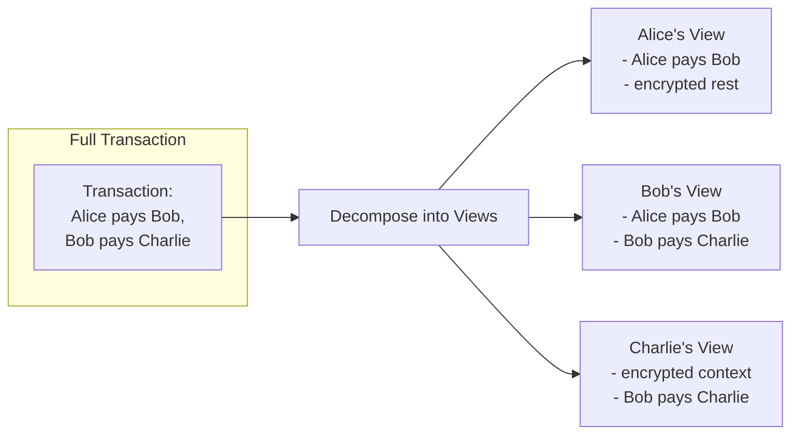

> **출처(원문)**: [Privacy Model Explained](https://docs.canton.network/overview/learn/privacy-model) · 번역일 2026-06-15

## 📌 개발자 노트
- **한 줄 요약**: Canton의 정체성인 <abbr class="gloss" title="한 트랜잭션을 &quot;뷰&quot;로 분해해, 각 파티가 자신과 관련된 부분만 보도록 하는 Canton의 핵심 프라이버시 방식">부분 트랜잭션 프라이버시</abbr>를 깊이 설명 — <abbr class="gloss" title="한 트랜잭션을 당사자별로 나눈 조각. 각 당사자는 자기 권한에 해당하는 뷰(자기 몫)만 받아 본다">뷰</abbr> 분해 메커니즘, 가시성 규칙, 프라이버시 보장, 양자 <abbr class="gloss" title="여러 노드가 트랜잭션의 유효성·순서에 함께 동의하는 절차">합의</abbr>·선택적 공개·디벌전스 패턴, 흔한 실수(과다 공유·디벌전스·타이밍 공격), 설계 체크리스트.
- **핵심 용어**: 뷰 분해, 가시성 규칙, 디벌전스(divulgence), 선택적 공개, 감사자(auditor)·<abbr class="gloss" title="컨트랙트를 볼 수 있으나 단독으로 행위할 수는 없는 파티">관찰자</abbr>, 타이밍 공격
- **선행 개념**: [Canton의 해법](https://docs.canton.network/overview/understand/cantons-solution.md), [원장 모델](ledger-model.md). 다음 → [신뢰 모델](trust-model.md)

---

# 프라이버시 모델 설명

> Canton의 고유한 부분 <abbr class="gloss" title="원장 상태를 바꾸는 원자적 작업 단위. 하나 이상의 컨트랙트를 생성·보관하며, 전부 적용되거나 전혀 적용되지 않음">트랜잭션</abbr> 프라이버시 역량에 대한 깊은 이해

Canton의 프라이버시 모델은 그 정체성이다. 이 절은 부분 트랜잭션 프라이버시가 어떻게 작동하는지, 어떤 보장을 제공하는지, 그리고 프라이버시를 의식한 개발의 흔한 패턴을 설명한다.

## 블록체인의 프라이버시 문제

대부분의 블록체인에서 트랜잭션 무결성을 달성하려면 전역 가시성이 필요하다. 모든 <abbr class="gloss" title="파티를 호스팅하고 그 파티의 컨트랙트 데이터를 저장하는 참여자 노드">밸리데이터</abbr>가 모든 트랜잭션을 보아 <abbr class="gloss" title="같은 자산을 두 번 쓰는 부정행위">이중지불</abbr>이 없고 모든 규칙이 지켜지는지 검증한다.

이는 본질적 긴장을 만든다:

| 요구사항 | 전통적 접근 | 문제 |
| --- | --- | --- |
| **무결성(Integrity)** | 밸리데이터가 모든 트랜잭션 검증 | 가시성을 요구 |
| **검증(Verification)** | 트랜잭션 내용 관람 | 비공개 데이터 노출 |
| **프라이버시(Privacy)** | 트랜잭션 내용 숨김 | 검증을 약화 |

전통적 블록체인은 선택을 한다: 프라이버시보다 무결성. 모두가 모든 것을 본다.

### 왜 이것이 엔터프라이즈 도입을 막는가

규제 산업에서 전역 가시성은 시작조차 불가능한 조건이다:

* **포지션 가시성**: 경쟁자가 당신의 거래 전략을 볼 수 있음
* **선행매매 위험**: 관찰자가 트랜잭션 정보를 악용할 수 있음
* **규제 준수**: 데이터를 권한 없는 당사자와 공유하면 안 될 수 있음
* **기밀 계약**: 비즈니스 조건은 당사자 사이에 머물러야 함

## Canton의 접근: 부분 트랜잭션 프라이버시

Canton은 **부분 트랜잭션 프라이버시(sub-transaction privacy)** 로 무결성-프라이버시 긴장을 해소한다: 트랜잭션을 뷰로 분해해, 각 <abbr class="gloss" title="Canton에서 권한과 데이터 가시성의 주체가 되는 식별 가능한 참여 주체">파티</abbr>가 자기 부분을 검증하는 데 필요한 것만 보게 한다.

### 작동 방식

트랜잭션이 여러 파티를 포함할 때, Canton은 전체 트랜잭션을 모두에게 보내지 않는다. 대신:

1. **분해(Decomposition)**: 트랜잭션을 <abbr class="gloss" title="어떤 컨트랙트와 관계를 맺어 그것을 보거나 승인하는 파티 = 서명자 + 관찰자">이해관계자</abbr> 관계에 따라 **뷰**로 분할
2. **암호화(Encryption)**: 각 뷰를 각 수신자에게 암호화
3. **분배(Distribution)**: <abbr class="gloss" title="상태를 저장하지 않고 트랜잭션 합의·순서를 조율하는 Canton 구성요소">Synchronizer</abbr>가 각 참여자에게 권한 있는 뷰만 전달
4. **검증(Validation)**: 각 참여자가 자기 뷰를 독립적으로 검증
5. **<abbr class="gloss" title="이해관계자 밸리데이터가 트랜잭션이 유효함을 미디에이터에 응답하는 것(confirmation)">확인</abbr>(Confirmation)**: 참여자가 자기 뷰만으로 확인



다시 말해, 참여자는 프라이버시 모델에 따라 자신이 권한 있는 트랜잭션 부분만 본다. 권한이 없는 다른 부분에 대해서는, 트랜잭션 페이로드는 물론 관여 참여자나 파티 같은 메타데이터도 보지 못한다.

Synchronizer는 **이 중 아무것도 보지 못한다** — 암호화된 메시지와 확인 결과만 본다.

### 각 파티가 보는 것

| 파티 | 보는 것 | 보지 못하는 것 |
| --- | --- | --- |
| **Alice** | Bob에게의 자기 지불 | Bob의 Charlie에게의 지불; Charlie의 신원 |
| **Bob** | 두 지불 모두 (둘 다 관여) | - |
| **Charlie** | Bob으로부터의 수취 | Alice의 관여; 자금의 원래 출처 |

Synchronizer는 **이 중 아무것도 보지 못한다** — 암호화된 메시지와 확인 결과만 본다.

## 이해관계자 가시성 규칙

Canton의 가시성은 두 핵심 원칙을 따른다:

### 원칙 1: 파티는 자신이 지분을 가진 액션을 본다

| 역할 | 가시성 |
| --- | --- |
| **<abbr class="gloss" title="컨트랙트의 주된 권한자. 생성·보관(소비)에 반드시 동의해야 하는 파티">서명자</abbr>(Signatory)** | 항상 <abbr class="gloss" title="원장에 기록되는 불변 데이터 단위. 상태 변경은 새 컨트랙트 생성으로 표현됨">컨트랙트</abbr>와 그 모든 이벤트를 봄 |
| **관찰자(Observer)** | 명시적 선언으로 컨트랙트를 봄 |
| **<abbr class="gloss" title="컨트랙트의 특정 초이스(동작)를 실행할 권한을 가진 파티">컨트롤러</abbr>(Controller)** | 자신이 실행할 수 있는 <abbr class="gloss" title="컨트랙트에서 수행 가능한 동작(권한이 부여된 당사자만 실행 가능)">초이스</abbr>를 봄 |

### 원칙 2: 액션을 보는 파티는 그 결과를 본다

어떤 액션을 보면, 그것이 만드는 생성/<abbr class="gloss" title="컨트랙트를 소비해 비활성으로 만드는 것(archive). 보관된 컨트랙트는 더 이상 쓸 수 없음">보관</abbr>을 본다. 이는 독립적 검증을 가능하게 한다 — 관찰한 결과를 토대로 액션이 올바르게 실행되었는지 확인할 수 있다.

### 가시성 예시

```haskell
template Payment
  with
    sender : Party
    receiver : Party
    amount : Decimal
  where
    signatory sender
    observer receiver
    
    choice Accept : ContractId Receipt
      controller receiver
      do
        create Receipt with payer = sender, payee = receiver, amount
```

| 파티 | 컨트랙트 가시성 | 초이스 가시성 |
| --- | --- | --- |
| **sender** | ✓ (서명자) | ✓ (결과를 봄) |
| **receiver** | ✓ (관찰자) | ✓ (컨트롤러) |
| **그 외 누구** | ✗ | ✗ |

## 프라이버시 보장

### Canton이 보장하는 것

> ✅ **트랜잭션 내용**은 권한 있는 파티(서명자, 관찰자, 컨트롤러)에게만 보인다.

> ✅ **Synchronizer 운영자**는 트랜잭션 데이터를 읽을 수 없다 — 암호화된 메시지만 본다.

> ✅ 액션을 볼 권한이 없는 파티에 대한 **메타데이터 누출 없음** — 다른 참여자와 파티는 보이지 않는다.

> ✅ **밸리데이터는** 자신이 호스팅하는 파티의 데이터만 저장한다 — 전역 상태 복제 없음.

## 프라이버시 패턴

### 패턴 1: 양자 합의 (Bilateral Agreement)

두 서명자만 컨트랙트를 본다. 양자 합의에 대한 최대 프라이버시.

```haskell
template BilateralContract
  with
    partyA : Party
    partyB : Party
    terms : Text
  where
    signatory partyA, partyB
    -- No observers: only signatories see this contract
```

**언제 쓰나**: 두 파티가 제3자 가시성 없이 사적 합의가 필요할 때.

**가시성**: `partyA`와 `partyB`만.

### 패턴 2: 관찰자를 통한 선택적 공개

가시성은 필요하지만 통제는 필요 없는 특정 파티를 관찰자로 추가한다.

```haskell
template RegulatedAsset
  with
    owner : Party
    issuer : Party
    regulator : Party
    value : Decimal
  where
    signatory issuer
    observer owner, regulator

    choice Transfer : ContractId RegulatedAsset
      with
        newOwner : Party
      controller owner  -- owner can transfer unilaterally
      do
        create this with owner = newOwner
```

**언제 쓰나**: 제3자가 규정 준수·감사·정보 목적으로 가시성이 필요할 때.

**가시성**: `issuer`(서명자), `owner`와 `regulator`(관찰자). `owner`는 `Transfer`의 컨트롤러이기도 하므로 그 초이스를 단독 실행할 수 있다.

### 패턴 3: 디벌전스 (Divulgence)

컨트랙트가 트랜잭션에서 사용되면, 그 트랜잭션의 당사자가 컨트랙트를 알게 될 수 있다. 이 "디벌전스(divulgence)"는 자동이다.

```haskell
-- Contract held by Alice
template Asset with owner : Party where
  signatory owner

-- Alice uses her Asset in a transaction with Bob
template Trade
  with
    seller : Party  -- Alice
    buyer : Party   -- Bob
    assetId : ContractId Asset
  where
    signatory seller, buyer
    
    choice Execute : ()
      controller buyer
      do
        -- Bob sees the Asset contract through divulgence
        asset <- fetch assetId
        archive assetId
        -- ... transfer logic
```

**무슨 일이 일어나나**: `Execute`가 실행되면, Bob(Trade의 당사자)은 원래 관찰자가 아니었더라도 Alice가 소유한 Asset 컨트랙트를 본다.

**조심해서 쓸 것**: 디벌전스는 의도치 않게 정보를 드러낼 수 있다. 무엇이 디벌전스되는지 인지하고 트랜잭션을 설계하라.

## 프라이버시 vs. 감사 가능성

Canton은 감사 가능성을 희생하지 않고 프라이버시를 가능하게 한다. 흔한 패턴:

### 관찰자로서의 감사자

```haskell
template AuditableTransaction
  with
    partyA : Party
    partyB : Party
    auditor : Party
    details : TransactionDetails
  where
    signatory partyA, partyB
    observer auditor  -- Auditor sees everything but cannot act
```

### 선택적 감사 권한

```haskell
template SelectivelyAuditable
  with
    owner : Party
    data : SensitiveData
    auditor : Party
  where
    signatory owner
    
    -- Non-consuming choice: reveals data without changing state
    nonconsuming choice Audit : AuditReport
      controller auditor
      do
        -- Auditor can request audit, seeing only what's returned
        return AuditReport with 
          timestamp = now
          summary = summarize data  -- Controlled disclosure
```

### 감사 가능성 모범 사례

| 실천 | 설명 |
| --- | --- |
| **명시적 감사자 파티** | 감사 추적이 필요한 곳에 감사자를 관찰자로 추가 |
| **감사 초이스** | 감사 정보를 반환하는 비소비형 초이스 생성 |
| **별도 감사 컨트랙트** | 전체 가시성이 불필요하면 전용 감사 추적 컨트랙트 생성 |
| **시간 제한 접근** | 임시 감사 접근을 부여하는 워크플로 패턴 사용 |

## 흔한 프라이버시 실수

### 실수 1: 관찰자를 통한 과다 공유

```haskell
-- BAD: Adding unnecessary observers
template OverShared
  with
    owner : Party
    counterparty : Party
    allUsers : [Party]  -- Why do all users need to see this?
  where
    signatory owner
    observer counterparty, allUsers  -- Privacy leak!
```

**문제**: `allUsers`의 모든 파티가 필요 없어도 이 컨트랙트를 본다.

**해결**: 진짜로 가시성이 필요한 관찰자만 추가하라.

### 실수 2: 디벌전스 무시

```haskell
-- Transaction reveals more than intended
choice RevealingChoice : ()
  controller buyer
  do
    -- Fetching this contract divulges it to all transaction stakeholders
    sensitiveAsset <- fetch sensitiveAssetId
    -- buyer now knows about sensitiveAsset, even if not originally an observer
```

**문제**: 트랜잭션에서 컨트랙트를 조합하면 원래 이해관계자가 아니던 파티에게 정보가 드러날 수 있다.

**해결**: 어떤 컨트랙트가 페치되고 누가 트랜잭션을 보는지 이해하라.

### 실수 3: 타이밍 공격

**문제**: 내용을 보지 못해도, 관찰자는 다음으로부터 정보를 추론할 수 있다:

* 트랜잭션이 일어나는 시점
* 트랜잭션 크기
* 활동 패턴

**해결**:

* 민감한 연산의 배치 처리 고려
* 적절한 곳에 노이즈나 무작위성 추가
* 타이밍 정보 누출을 최소화하도록 워크플로 설계

## 프라이버시 설계 체크리스트

Canton 애플리케이션을 설계할 때 자문하라:

| 질문 | 고려사항 |
| --- | --- |
| **서명자는 누구인가?** | 그들은 항상 모든 것을 본다 |
| **누가 관찰해야 하는가?** | 기본값이 아니라 의도적으로 관찰자를 추가하라 |
| **무엇이 디벌전스되는가?** | 트랜잭션 조합을 따라가며 추적하라 |
| **컨트랙트 키가 무엇을 드러내는가?** | 키가 민감한 관계를 인코딩하면 안 됨 |
| **타이밍이 무엇을 드러낼 수 있는가?** | 내용뿐 아니라 패턴도 고려하라 |
| **내 밸리데이터는 누구인가?** | 그들은 당신의 모든 데이터를 본다 — 신중히 선택하라 |

## 다음 단계

* **[글로벌 Synchronizer](https://docs.canton.network/overview/understand/global-synchronizer)** — 퍼블릭 네트워크 인프라 이해
* **[개발자 트랙 모듈 3: Daml 개발](https://docs.canton.network/appdev/modules/m3-dev-environment)** — 코드에서 프라이버시 패턴 적용
* **[용어집](https://docs.canton.network/overview/understand/glossary)** — 프라이버시 관련 용어 포함 용어 레퍼런스

<!-- nav:start -->

---

⬅️ **이전**: [다중 Synchronizer 아키텍처](multi-synchronizer.md) ・ ➡️ **다음**: [신뢰 모델 개요](trust-model.md)

<!-- nav:end -->
