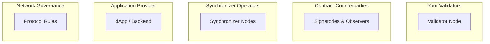

> **출처(원문)**: [Trust Model Overview](https://docs.canton.network/overview/learn/trust-model) · 번역일 2026-06-15

## 📌 개발자 노트
- **한 줄 요약**: Canton은 "모두 신뢰"도 "아무도 불신"도 아닌 **선택적 신뢰** — 무엇을 위해 누구를 신뢰하는지 5개 신뢰 영역(내 <abbr class="gloss" title="파티를 호스팅하고 그 파티의 컨트랙트 데이터를 저장하는 참여자 노드">밸리데이터</abbr>, 거래 상대방, <abbr class="gloss" title="상태를 저장하지 않고 트랜잭션 합의·순서를 조율하는 Canton 구성요소">동기화자</abbr>, 앱 제공자, 네트워크 거버넌스)으로 나누고, 각 영역의 신뢰/불신 항목과 완화책을 정리.
- **핵심 용어**: 선택적 신뢰, 신뢰 영역(trust domain), BFT 시퀀서, 다중 호스팅 <abbr class="gloss" title="Canton에서 권한과 데이터 가시성의 주체가 되는 식별 가능한 참여 주체">파티</abbr>, 외부 파티 서명
- **선행 개념**: [프라이버시 모델](privacy-model.md), [아키텍처 개요](architecture.md). 다음 → [글로벌 동기화자](https://docs.canton.network/overview/understand/global-synchronizer)

---

# 신뢰 모델 개요

> Canton Network에서 누구를 무엇을 위해 신뢰하는지 이해하기

Canton의 신뢰 모델은 전통적 블록체인과 근본적으로 다르다. "모두를 신뢰" 또는 "아무도 신뢰하지 않음"이 아니라, Canton은 **선택적 신뢰(selective trust)** 를 가능하게 한다 — 어떤 목적을 위해 누구를 신뢰할지 당신이 선택한다.

## 핵심 질문

모든 분산 시스템에서 핵심 질문은: **누구를, 무엇을 위해 신뢰해야 하는가?**

Canton은 이를 서로 다른 참여자와 가정을 갖는 별개의 신뢰 영역(trust domains)으로 나눈다.

## 다섯 신뢰 영역

### 1. 당신의 밸리데이터

**무엇을 위해 신뢰하나:**

* 당신의 <abbr class="gloss" title="원장에 기록되는 불변 데이터 단위. 상태 변경은 새 컨트랙트 생성으로 표현됨">컨트랙트</abbr> 데이터를 안전하게 저장하고 당신이 사용할 수 있게 함
* 노드 RPC 접근을 주고 트랜잭션을 제출하게 함
* 당신의 데이터를 권한 없는 당사자에게 드러내지 않음
* 당신의 파티를 대신해 합의에 올바르게 참여함
* 내부 파티를 쓰는 경우: 당신의 서명 키를 다룸

**무엇을 위해서는 신뢰하지 않나:**

* 당신의 트랜잭션 서명 (외부 파티를 쓰는 경우)

**완화책:**

* 자신의 밸리데이터를 직접 운영
* 평판 있는 밸리데이터 운영자 선택
* 여러 밸리데이터로 당신의 파티를 공동 호스팅
* 외부 파티 키 사용 (당신이 키를 보유)
* 밸리데이터의 암호 키를 보호하기 위해 KMS/HSM 솔루션 사용

### 2. 컨트랙트 거래 상대방

**무엇을 위해 신뢰하나:**

* 자신이 <abbr class="gloss" title="어떤 컨트랙트와 관계를 맺어 그것을 보거나 승인하는 파티 = 서명자 + 관찰자">이해관계자</abbr>인 트랜잭션을 정직하게 검증해 트랜잭션이 확정될 수 있게 함
* 그들과 공유된 당신의 비공개 데이터를 누출하지 않음

**무엇을 위해서는 신뢰하지 않나:**

* 원장 무결성과 일관성. 당신의 밸리데이터가 정직한 한, 거래 상대방은 당신이 관여하는 무효 트랜잭션을 확정할 수 없다.

**완화책:**

* <abbr class="gloss" title="다자간 워크플로를 위해 설계된 Canton의 스마트 컨트랙트 언어">Daml</abbr> 권한 규칙이 파티가 할 수 있는 것과 그들의 확인이 필요한 곳을 제한
* 프라이버시에 중요한 데이터는 신뢰하는 상대방과만 공유
* 중요한 연산에 다중 서명 요건
* 감사 추적은 암호학적으로 서명됨

### 3. 동기화자

**무엇을 위해 신뢰하나:**

* 모든 밸리데이터에 일관된 순서로 메시지 전달
* 당신의 트랜잭션을 무한정 검열하지 않음
* 가용성 유지
* 확인 투표를 올바르게 집계
* 정확한 평결 전달
* 프라이빗 동기화자의 경우: 트랜잭션 메타데이터를 비공개로 유지

**무엇을 위해서는 신뢰하지 않나:**

* 프라이버시: 그들은 당신의 트랜잭션 내용을 읽을 수 없음 (암호화됨)
* 권한: 그들은 메시지/트랜잭션을 위조할 수 없음 (서명 필요)
* 적합성: 그들은 무효 트랜잭션을 승인할 수 없음 (이해관계자가 검증)

**완화책:**

* 여러 독립 운영자를 둔 BFT 동기화자
* 자신의 동기화자 직접 운영

### 4. 애플리케이션 제공자

**무엇을 위해 신뢰하나:**

* 사용자 동작에 대해 트랜잭션을 제출한다면: 실제로 그렇게 하고 검열하지 않음
* 안전한 스마트 컨트랙트 로직을 올바르게 구현
* 오프-원장 비즈니스 로직을 올바르게 구현
* web2 방식 로그인·인증을 한다면: 당신의 자격증명/세션 보호

**완화책:**

* 온-원장 권한(Daml) vs 오프-원장
* 외부 파티 서명 (당신이 각 트랜잭션을 승인)
* 오픈소스 / 감사된 애플리케이션
* 자신의 밸리데이터로 트랜잭션을 준비·제출

### 5. 네트워크 거버넌스

**무엇을 위해 신뢰하나:**

* 프로토콜 업그레이드가 당신의 애플리케이션과 해당 컨트랙트를 깨지 않음
* 네트워크 파라미터와 트래픽 비용이 공정하게 설정됨
* 분쟁 해결 절차

**완화책:**

* 투명한 거버넌스 (Canton Network의 CIP)
* 이탈 권리 (다른 동기화자로 이동)
* 업그레이드를 예상한 컨트랙트 설계

## 한눈에 보는 신뢰

당신의 밸리데이터는 당신의 모든 데이터를 보고 당신을 차단할 수 있다. 거래 상대방은 자신이 당사자인 컨트랙트만 보며, Daml 규칙과 Canton 합의가 그들이 할 수 있는 것을 제약한다. 시퀀서와 미디에이터는 암호화된 데이터만 다룬다 — 메시지를 일시적으로 지연시킬 수는 있어도 읽거나 위조할 수는 없다. 애플리케이션 제공자와 거버넌스 기구는 설계·구성 방식에 따라 신뢰 수준이 달라진다.

## 탈중앙화 옵션

Canton은 각 계층에서 탈중앙화를 지원한다.

**밸리데이터 수준에서**, 단일 운영자를 신뢰하는 단일 밸리데이터를 운영하거나, 신뢰가 분산된 다중 호스팅 파티를 쓸 수 있다.

**동기화자 수준에서**, 단일 운영자 동기화자는 한 주체에 대한 신뢰가 필요하다. BFT 시퀀서는 신뢰를 분산해, 시스템이 작동하려면 노드의 2/3만 정직하면 된다. 여러 동기화자에 연결하면 단일 장애점 위험이 더 줄어든다.

**<abbr class="gloss" title="슈퍼 밸리데이터들이 공동 운영하는 Canton의 퍼블릭 조율(합의) 계층">글로벌 동기화자</abbr>**는 최대 탈중앙화를 제공한다: 여러 독립 <abbr class="gloss" title="글로벌 동기화자를 운영하고 네트워크 거버넌스에 참여하는 노드">슈퍼 밸리데이터</abbr>가 시퀀서·미디에이터 노드를 운영하고, BFT 합의가 임계값까지 비잔틴 장애를 견디며, 투명한 CIP 절차가 프로토콜 변경을 거버넌스한다.

## Canton vs 전통적 블록체인

전통적 블록체인에서는 모두가 모든 트랜잭션을 보고 모든 노드가 검증한다. 당신은 다수가 정직하게 행동하리라 신뢰한다. Canton은 이 모델을 뒤집는다: 이해관계자만 트랜잭션을 보고, 영향받는 파티만 검증하며, 당신은 주로 자신의 밸리데이터를 신뢰한다. 동기화자는 암호화된 데이터만 보고, 거버넌스는 네트워크 수준뿐 아니라 동기화자별로도 작동한다.

## 관련 주제

* [2계층 합의](https://docs.canton.network/overview/learn/two-layer-consensus) — 합의 계층들이 상호작용하는 방식
* [아키텍처 개요](architecture.md) — 구성 요소 책임
* [프라이버시 모델](privacy-model.md) — 각 파티가 볼 수 있는 것

<!-- nav:start -->
---
⬅️ **이전**: [프라이버시 모델 설명](privacy-model.md) ・ ➡️ **다음**: [2계층 합의](two-layer-consensus.md)
<!-- nav:end -->
