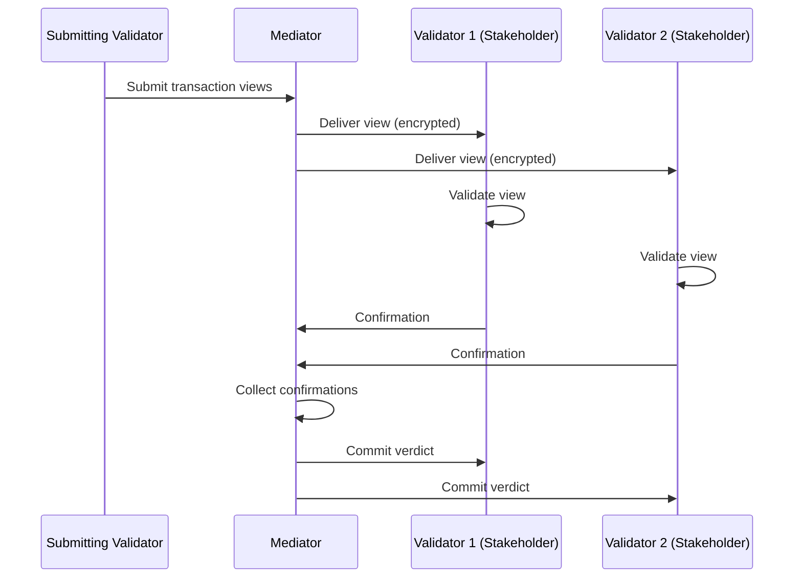
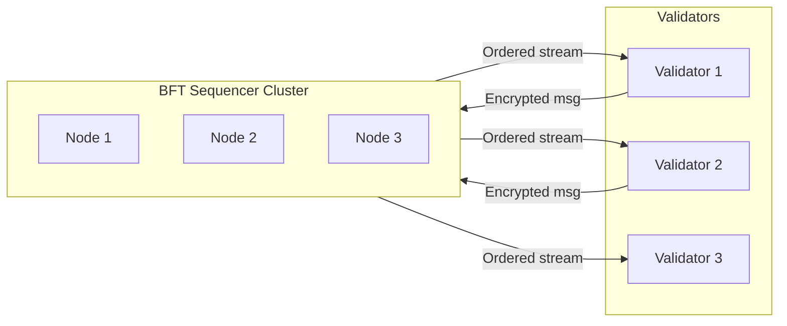
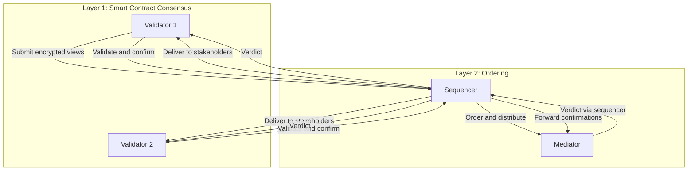

> **출처(원문)**: [Two-Layer Consensus](https://docs.canton.network/overview/learn/two-layer-consensus) · 번역일 2026-06-15

## 📌 개발자 노트
- **한 줄 요약**: Canton은 합의를 두 계층으로 분리한다 — ①스마트 <abbr class="gloss" title="원장에 기록되는 불변 데이터 단위. 상태 변경은 새 컨트랙트 생성으로 표현됨">컨트랙트</abbr> 합의(<abbr class="gloss" title="어떤 컨트랙트와 관계를 맺어 그것을 보거나 승인하는 파티 = 서명자 + 관찰자">이해관계자</abbr> 증명, 프라이버시) ②순서화 합의(BFT 시퀀싱, 무결성). 두 계층의 작동·상호작용·분리의 이점과 타 접근과의 비교.
- **핵심 용어**: 이해관계자 증명(Proof of Stakeholder), BFT 시퀀싱, 전체 순서(total order), ISS 알고리즘, 1/3 비잔틴 허용
- **선행 개념**: [트랜잭션 작동 방식](how-transactions-work.md), [신뢰 모델](trust-model.md), [글로벌 Synchronizer 아키텍처](global-synchronizer-architecture.md).

---

# 2계층 합의

> Canton이 스마트 컨트랙트 검증과 트랜잭션 순서화를 분리해 프라이버시와 무결성을 모두 달성하는 방법

Canton은 **스마트 컨트랙트 트랜잭션 합의**와 **순서화 합의(ordering consensus)** 를 분리하는 2계층 합의 아키텍처를 쓴다. 이 분리가 Canton이 무결성을 유지하면서 프라이버시를 달성하게 하는 비결이다.

## 왜 두 계층인가?

전통적 블록체인은 순서화와 검증을 단일 합의 과정에 결합한다. 모든 <abbr class="gloss" title="파티를 호스팅하고 그 파티의 컨트랙트 데이터를 저장하는 참여자 노드">밸리데이터</abbr>가 모든 트랜잭션을 보아 정확성을 검증하고 순서에 합의한다. 이 강한 결합이 본질적 프라이버시 한계를 만든다.

Canton은 이 관심사를 두 계층으로 분리한다:

* **스마트 컨트랙트 합의**는 트랜잭션 정확성을 검증한다. 영향받는 이해관계자만 참여하며, 각자 자기 트랜잭션 부분만 본다.
* **순서화 합의**는 전역 트랜잭션 순서를 확립한다. <abbr class="gloss" title="상태를 저장하지 않고 트랜잭션 합의·순서를 조율하는 Canton 구성요소">Synchronizer</abbr> 노드가 참여하지만, 암호화된 메시지만 본다.

## 계층 1: 스마트 컨트랙트 합의 (이해관계자 증명)

Canton의 스마트 컨트랙트 합의는 **이해관계자 증명(Proof of Stakeholder)** 모델을 따른다. 컨트랙트에 지분을 가진 <abbr class="gloss" title="Canton에서 권한과 데이터 가시성의 주체가 되는 식별 가능한 참여 주체">파티</abbr>만 그 컨트랙트에 영향을 주는 트랜잭션을 검증할 수 있다.

### 작동 방식

1. **이해관계자 식별**: 트랜잭션이 컨트랙트에 영향을 줄 때, Canton은 모든 이해관계자(<abbr class="gloss" title="컨트랙트의 주된 권한자. 생성·보관(소비)에 반드시 동의해야 하는 파티">서명자</abbr>, <abbr class="gloss" title="컨트랙트를 볼 수 있으나 단독으로 행위할 수는 없는 파티">관찰자</abbr>, 컨트롤러)를 식별한다
2. **뷰 분배**: 각 이해관계자는 자신이 볼 권한이 있는 트랜잭션 뷰만 받는다
3. **독립 검증**: 각 이해관계자는 자기 뷰를 <abbr class="gloss" title="다자간 워크플로를 위해 설계된 Canton의 스마트 컨트랙트 언어">Daml</abbr> 규칙에 대해 검증한다
4. **확인**: 이해관계자가 확인 또는 거부를 미디에이터에 보낸다
5. **평결**: 충분한 확인이 수집되면 트랜잭션이 전체로서 커밋되거나 중단된다

비이해관계자는 트랜잭션을 아예 보지 못한다. 영향받는 파티만 검증 작업을 하고, Daml 권한 규칙은 이해관계자 자신에 의해 강제된다.

여기서의 신뢰 가정은 단순하다: 서명자와 컨트롤러가 자기 부분을 올바르게 검증하리라 신뢰한다. 그들은 컨트랙트에 직접적 이해관계가 있으므로(서명했거나 관찰하고 있으므로) 정직하게 검증할 인센티브가 있다.

## 계층 2: 순서화 합의 (BFT 시퀀싱)

순서화 계층은 한 Synchronizer의 모든 트랜잭션에 대한 **전체 순서(total order)** 를 확립한다. 이는 모든 참여자가 같은 Synchronizer로부터 같은 순서로 이벤트를 보게 해, 이중지불을 막고 일관성을 보장한다.

### 작동 방식

Synchronizer의 시퀀서 구성 요소는:

1. 참여자로부터 암호화된 트랜잭션 메시지를 받는다
2. 그 Synchronizer에 대해 전역적으로 고유한 타임스탬프/시퀀스 번호를 부여한다
3. 메시지를 권한 있는 모든 수신자에게 순서대로 분배한다
4. 모든 수신자가 같은 순서를 보도록 보장한다

### BFT 순서화

(<abbr class="gloss" title="슈퍼 밸리데이터들이 공동 운영하는 Canton의 퍼블릭 조율(합의) 계층">글로벌 Synchronizer</abbr> 같은) 탈중앙화 Synchronizer의 경우, 순서화는 비잔틴 장애 허용(BFT) 합의를 쓴다:

* 여러 시퀀서 노드가 순서화 프로토콜을 실행
* 최대 1/3의 비잔틴(악의적) 노드를 허용
* ISS(Insanely Scalable State-Machine Replication) 알고리즘 기반
* 안전성(safety)과 라이브니스(liveness) 보장 제공

모든 밸리데이터가 동일한 순서로 메시지를 받아 일관성을 보장한다. 시퀀서는 암호화된 메시지만 보므로 순서화가 프라이버시를 훼손하지 않는다. 그리고 BFT 프로토콜은 일부 노드가 실패해도 계속 작동한다.

신뢰 가정: 시퀀서 노드의 1/3 미만이 악의적이다. 글로벌 Synchronizer에서는 이 신뢰가 독립적인 <abbr class="gloss" title="글로벌 Synchronizer를 운영하고 네트워크 거버넌스에 참여하는 노드">슈퍼 밸리데이터</abbr> 전반에 분산된다.

## 계층들이 상호작용하는 방식

두 계층은 Canton의 트랜잭션 프로토콜에서 함께 작동한다:

흐름은 순서화 계층에서 시작한다: 밸리데이터가 암호화된 트랜잭션을 제출하면, 시퀀서가 전역 순서에서의 위치를 부여한다. 그런 다음 시퀀서가 관련 뷰를 이해관계자에게 분배한다. 미디에이터는 평결에 도달하기 위해 필요한 확인 수를 알게 된다. 이 시점에서 스마트 컨트랙트 합의가 이어받는다 — 각 이해관계자가 자기 뷰를 검증하고 미디에이터에 확인을 보낸다. 마지막으로 미디에이터가 확인을 집계하고 시퀀서의 순서화 계층을 통해 평결을 다시 브로드캐스트한다.

## 분리의 이점

**무결성을 희생하지 않는 프라이버시.** 순서화 계층은 이중지불을 막고(무결성·일관성), 스마트 컨트랙트 계층은 이해관계자만 데이터를 보도록 보장한다(프라이버시). 어느 계층도 단독으로는 둘 다 달성할 수 없다.

**유연한 신뢰 모델.** 서로 다른 Synchronizer가 서로 다른 순서화 신뢰 모델을 쓸 수 있다 — 프라이빗 배포에는 단일 운영자 시퀀서, 탈중앙화 네트워크에는 BFT 시퀀서 — 반면 스마트 컨트랙트 합의는 어느 경우든 동일하게 유지된다.

**확장성.** 순서화 계층은 동기화만 다뤄 가볍게 유지된다. 검증 작업은 영향받는 밸리데이터에만 분산되며, 전역 상태 복제가 필요 없다.

## 다른 접근과의 비교

| 접근 | 순서화 | 검증 | 프라이버시 |
| --- | --- | --- | --- |
| **전통적 블록체인** | 모든 밸리데이터 | 모든 밸리데이터 | 없음 |
| **L2 롤업** | 시퀀서 | 사기/유효성 증명 | 제한적 |
| **Canton** | Synchronizer (BFT) | 영향받는 이해관계자만 | 완전한 부분 트랜잭션 |

## 관련 주제

* [신뢰 모델 개요](trust-model.md) — 각 계층의 신뢰 가정
* [아키텍처 개요](architecture.md) — 구성 요소가 맞물리는 방식
* [프라이버시 모델](privacy-model.md) — <abbr class="gloss" title="한 트랜잭션을 &quot;뷰&quot;로 분해해, 각 파티가 자신과 관련된 부분만 보도록 하는 Canton의 핵심 프라이버시 방식">부분 트랜잭션 프라이버시</abbr> 상세

<!-- nav:start -->

---

⬅️ **이전**: [신뢰 모델 개요](trust-model.md) ・ ➡️ **다음**: [밸리데이터 아키텍처](validator-architecture.md)

<!-- nav:end -->
