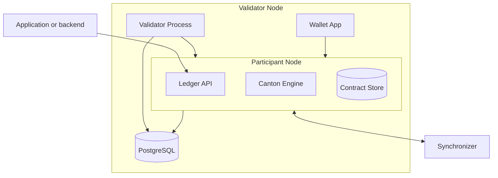

> **출처(원문)**: [Validator Architecture](https://docs.canton.network/overview/learn/validator-architecture) · 번역일 2026-06-15

## 📌 개발자 노트
- **한 줄 요약**: Canton <abbr class="gloss" title="파티를 호스팅하고 그 파티의 컨트랙트 데이터를 저장하는 참여자 노드">밸리데이터</abbr> 노드의 내부 구성 — <abbr class="gloss" title="파티를 호스팅하고 그 파티의 컨트랙트를 저장·실행하는 노드. 밸리데이터의 핵심 구성요소">참여자 노드</abbr>(코어)와 밸리데이터 프로세스(CN 특화 기능), PostgreSQL, <abbr class="gloss" title="상태를 저장하지 않고 트랜잭션 합의·순서를 조율하는 Canton 구성요소">Synchronizer</abbr> 연결 방식(아웃바운드만), Ledger API.
- **핵심 용어**: 참여자 노드, 밸리데이터 프로세스, Canton 엔진, <abbr class="gloss" title="원장에 기록되는 불변 데이터 단위. 상태 변경은 새 컨트랙트 생성으로 표현됨">컨트랙트</abbr> 스토어, <abbr class="gloss" title="글로벌 Synchronizer를 구동하는 오픈소스 애플리케이션 모음(SV·밸리데이터·월렛 등)">Splice</abbr> 월렛 앱, Ledger API
- **선행 개념**: [아키텍처 개요](architecture.md), [핵심 개념](../understand/core-concepts.md).

---

# 밸리데이터 아키텍처

> Canton Network 밸리데이터 노드의 내부 구성 요소

밸리데이터는 Canton Network의 기본 인프라 단위다. <abbr class="gloss" title="Canton에서 권한과 데이터 가시성의 주체가 되는 식별 가능한 참여 주체">파티</abbr>를 <abbr class="gloss" title="참여자 노드가 파티의 데이터·키를 맡아 두고, 그 파티를 대신해 원장에서 활동(저장·제출·확인)해 주는 것">호스팅</abbr>하고, 그들의 컨트랙트 데이터를 저장하며, 그들을 대신해 <abbr class="gloss" title="원장 상태를 바꾸는 원자적 작업 단위. 하나 이상의 컨트랙트를 생성·보관하며, 전부 적용되거나 전혀 적용되지 않음">트랜잭션</abbr>을 처리한다. 밸리데이터 내부에 무엇이 있는지 이해하면 배포 계획, 문제 해결, 용량 산정에 도움이 된다.

## 밸리데이터의 구성 요소

밸리데이터는 두 개의 주요 프로세스와 그 지원 인프라로 구성된다:

### 참여자 노드 (Participant node)

참여자 노드는 핵심 구성 요소다. 다음을 수행한다:

* 파티를 호스팅하고 그들의 신원을 관리
* 호스팅 파티의 컨트랙트 데이터를 로컬 데이터베이스에 저장
* 애플리케이션이 <abbr class="gloss" title="애플리케이션이 원장에 제출하는 명령(컨트랙트 생성·초이스 실행 요청)">커맨드</abbr>를 제출하고, 트랜잭션을 읽고, 파티를 관리하도록 Ledger API를 노출
* 트랜잭션 처리·검증·프라이버시를 다루는 Canton 프로토콜 엔진 실행
* 데이터 트랜잭션을 제출·수신하기 위해 Synchronizer와 통신
* <abbr class="gloss" title="어떤 노드·파티·키가 네트워크에 참여하는지를 정의하는 구성 정보">토폴로지</abbr> 트랜잭션을 제출·수신하기 위해 Synchronizer와 통신

### 밸리데이터 프로세스 (Validator process)

밸리데이터 프로세스는 참여자 노드 위에서 Canton Network 특화 기능을 다룬다:

* <abbr class="gloss" title="슈퍼 밸리데이터들이 공동 운영하는 Canton의 퍼블릭 조율(합의) 계층">글로벌 Synchronizer</abbr>로의 온보딩 관리
* <abbr class="gloss" title="트랜잭션 수수료와 밸리데이터 보상에 쓰이는 네이티브 유틸리티 토큰(CC)">Canton Coin</abbr>을 써서 <abbr class="gloss" title="Synchronizer에 쓰기를 요청할 때 소비하는 자원. Canton Coin으로 비용을 지불">트래픽</abbr> 구매 처리
* 호스팅 파티를 위한 Splice 월렛 애플리케이션 실행
* 트래픽 자동 충전, Canton Coin 스윕(sweep) 구성 같은 자동 연산 관리

### 데이터베이스

참여자 노드와 밸리데이터 프로세스 모두 영속 저장에 PostgreSQL을 쓴다. 프로덕션에서는 적절한 백업과 고가용성 구성을 갖춘 관리형 데이터베이스 서비스(Cloud SQL, RDS 등)여야 한다.

## 밸리데이터가 Synchronizer에 연결하는 방식

밸리데이터는 TLS(포트 443) 위에서 <abbr class="gloss" title="Synchronizer 구성요소. 암호화된 메시지에 전체 순서·타임스탬프를 부여하고 참여자에게 전달">시퀀서</abbr> 엔드포인트를 통해 Synchronizer에 연결한다. 연결은 아웃바운드 전용이다 — 밸리데이터는 네트워크로부터의 인바운드 연결을 받을 필요가 없다.

밸리데이터는 여러 Synchronizer에 동시에 연결할 수 있다. 자신이 호스팅하는 파티와 관련된 트랜잭션만 받으므로, Synchronizer가 모든 참여자를 가로질러 조율하더라도 프라이버시가 유지된다.

## Ledger API

Ledger API는 애플리케이션이 <abbr class="gloss" title="거래·컨트랙트가 기록되는 장부. Canton에선 활성 컨트랙트의 모음">원장</abbr>과 상호작용하는 주된 인터페이스다. gRPC 또는 JSON API 전송을 써서 다음을 수행할 수 있다:

* **커맨드 제출(Command submission)** — 컨트랙트 생성과 <abbr class="gloss" title="컨트랙트에서 수행 가능한 동작(권한이 부여된 당사자만 실행 가능)">초이스</abbr> 실행
* **트랜잭션 스트림(Transaction stream)** — <abbr class="gloss" title="트랜잭션이 최종 확정되어 원장에 반영되는 것">커밋</abbr>되는 대로 확정 트랜잭션 읽기
* **<abbr class="gloss" title="아직 보관(소비)되지 않아 현재 유효한 컨트랙트">활성 컨트랙트</abbr> 집합(Active contract set)** — 현재 활성 컨트랙트 집합 조회
* **파티 관리(Party management)** — 파티 할당·관리

애플리케이션은 gRPC로 직접, 또는 그 위에 HTTP/JSON 계층을 제공하는 JSON API를 통해 Ledger API에 연결한다.

<!-- nav:start -->

---

⬅️ **이전**: [2계층 합의](two-layer-consensus.md) ・ ➡️ **다음**: [Canton Coin 토크노믹스](../reference/canton-coin-tokenomics.md)

<!-- nav:end -->
