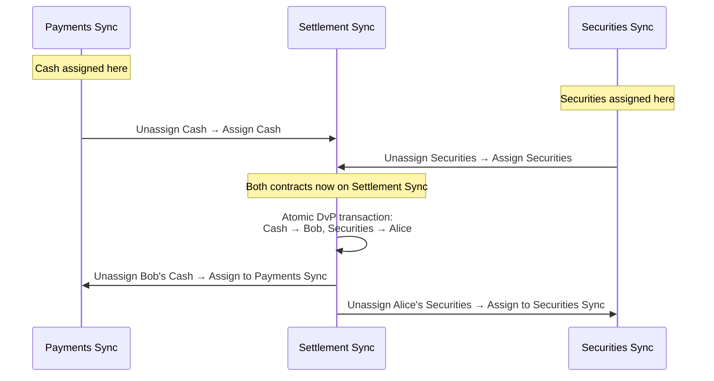

> **출처(원문)**: [Cross-Synchronizer DvP Example](https://docs.canton.network/overview/reference/cross-sync-dvp-example) · 번역일 2026-06-15

## 📌 개발자 노트
- **한 줄 요약**: 자산이 서로 다른 <abbr class="gloss" title="상태를 저장하지 않고 트랜잭션 합의·순서를 조율하는 Canton 구성요소">Synchronizer</abbr>에 있는 두 <abbr class="gloss" title="Canton에서 권한과 데이터 가시성의 주체가 되는 식별 가능한 참여 주체">파티</abbr> 간 DvP(인도-지불) 거래를, <abbr class="gloss" title="컨트랙트를 한 Synchronizer에서 다른 Synchronizer로 옮기는 프로토콜">재할당</abbr> 프로토콜로 공통 Synchronizer에 모아 원자적으로 정산하는 워크플로 예시. 단계별 <abbr class="gloss" title="원장에 기록되는 불변 데이터 단위. 상태 변경은 새 컨트랙트 생성으로 표현됨">컨트랙트</abbr> 위치 변화와 원자성 경계.
- **핵심 용어**: DvP, 재할당(언어사인→어사인), 공통 Synchronizer(Settlement Sync), 원자적 정산, 정산 위험
- **선행 개념**: [다중 Synchronizer 아키텍처](../learn/multi-synchronizer.md), [재할당 프로토콜](reassignment-protocol.md).

---

# 크로스-Synchronizer DvP 예시

> Canton의 재할당 프로토콜을 써서 여러 Synchronizer에 걸쳐 인도-지불(DvP)을 정산하는 실전 예시

이 페이지는 자산이 서로 다른 Synchronizer에 있는 두 파티 간의 인도-지불(Delivery-versus-Payment, DvP) 거래를 단계별로 살펴본다. 이 예시는 Canton의 재할당 프로토콜이, 모든 자산이 같은 인프라에서 비롯될 것을 요구하지 않고도 원자적 정산을 가능하게 하는 방법을 보여준다.

## 설정

**파티와 역할:**

* **Alice** (매수자) — 증권을 취득하려 하며 현금을 보유
* **Bob** (매도자) — 증권을 팔려 하며 현금을 받음
* **PaymentBank** — 현금 컨트랙트의 <abbr class="gloss" title="컨트랙트의 주된 권한자. 생성·보관(소비)에 반드시 동의해야 하는 파티">서명자</abbr>
* **SecuritiesDepository** — 증권 컨트랙트의 서명자

**Synchronizer:**

* **Payments Sync** — 결제 컨소시엄이 운영; 현금 컨트랙트가 여기 할당됨
* **Securities Sync** — 자본시장 인프라 제공자가 운영; 증권 컨트랙트가 여기 할당됨
* **Settlement Sync** — 두 파티와 서명자가 모두 연결된 공통 Synchronizer(예: <abbr class="gloss" title="슈퍼 밸리데이터들이 공동 운영하는 Canton의 퍼블릭 조율(합의) 계층">글로벌 Synchronizer</abbr>)

**컨트랙트:**

* `Cash` — 서명자: PaymentBank; 소유자: Alice. Payments Sync에 할당.
* `Securities` — 서명자: SecuritiesDepository; 소유자: Bob. Securities Sync에 할당.

각 파티의 <abbr class="gloss" title="파티를 호스팅하고 그 파티의 컨트랙트 데이터를 저장하는 참여자 노드">밸리데이터</abbr>는 그 파티와 관련된 Synchronizer에 연결된다. Alice의 밸리데이터는 Payments Sync와 Settlement Sync에 연결된다. Bob의 밸리데이터는 Securities Sync와 Settlement Sync에 연결된다. PaymentBank와 SecuritiesDepository의 밸리데이터는 셋 모두에 연결된다.

## 왜 여러 Synchronizer인가?

현금과 증권 컨트랙트가 별도 Synchronizer에 있는 데는 현실적 이유가 있다: 서로 다른 정산 인프라는 서로 다른 주체가 거버넌스하고, 서로 다른 규제 체제 하에서 운영될 수 있으며, 별개의 성능·비용 특성을 갖는다. 결제 네트워크와 증권 정산 시스템이 단일 Synchronizer를 공유할 가능성은 낮다.

<abbr class="gloss" title="다자간 워크플로를 위해 설계된 Canton의 스마트 컨트랙트 언어">Daml</abbr> 트랜잭션은 같은 Synchronizer에 할당된 컨트랙트만 소비할 수 있다. DvP를 원자적으로 — 현금을 Bob에게, 증권을 Alice에게, 하나의 분리 불가능한 단계로 — 정산하려면, 두 컨트랙트가 먼저 공통 Synchronizer로 재할당되어야 한다.

## DvP 워크플로

### 1단계: 거래 조건 합의

Alice와 Bob이 DvP 거래에 합의한다(오프-원장으로, 또는 `TradeAgreement` 컨트랙트를 통해). 조건은 어떤 현금 컨트랙트와 어떤 증권 컨트랙트가 교환될지 명시한다.

### 2단계: Settlement Sync에 연결

관여하는 모든 밸리데이터가 Settlement Sync에 연결되어야 한다. 실무에서 Settlement Sync가 글로벌 Synchronizer라면 대부분의 밸리데이터가 이미 연결되어 있다. 사설 Synchronizer라면, Alice·Bob·PaymentBank·SecuritiesDepository의 밸리데이터가 재할당 진행 전에 각각 활성 연결을 가져야 한다.

### 3단계: 현금을 Settlement Sync로 재할당

`Cash` 컨트랙트가 Payments Sync에서 Settlement Sync로 재할당된다. 2단계 과정이다:

1. Payments Sync에서 **언어사인** — 컨트랙트가 Payments Sync에서 비활성이 되고 "어사인 대기" 상태에 들어간다.
2. Settlement Sync에서 **어사인** — 컨트랙트가 Settlement Sync에서 활성이 된다.

이 단계 후 `Cash` 컨트랙트는 Settlement Sync에서는 트랜잭션에 쓰일 수 있지만 Payments Sync에서는 더 이상 쓰일 수 없다.

### 4단계: 증권을 Settlement Sync로 재할당

`Securities` 컨트랙트가 같은 언어사인/어사인 시퀀스를 통해 Securities Sync에서 Settlement Sync로 재할당된다.

### 5단계: 원자적 정산

이제 두 컨트랙트가 모두 Settlement Sync에 할당되었다. 단일 Daml 트랜잭션이 스왑을 실행한다: 원래 `Cash`와 `Securities` 컨트랙트를 보관하고 새것을 생성한다 — Bob이 소유한 `Cash`와 Alice가 소유한 `Securities`. 두 입력 컨트랙트가 같은 Synchronizer에 있으므로 이 트랜잭션은 원자적이다. 두 이전이 모두 일어나거나 둘 다 안 일어난다.

### 6단계: 되돌려 재할당

정산 후, 새 컨트랙트는 자기 홈 Synchronizer로 재할당될 수 있다:

* Bob의 새 `Cash` 컨트랙트가 Settlement Sync에서 Payments Sync로 되돌려 재할당된다.
* Alice의 새 `Securities` 컨트랙트가 Settlement Sync에서 Securities Sync로 되돌려 재할당된다.

이 단계는 선택이다. 컨트랙트는 Settlement Sync에서도 작동하지만, 되돌려 재할당하면 자산이 그 생애주기(향후 이전, 기업 행위 등)에 가장 적합한 인프라에 머문다.

## 시퀀스 다이어그램

## 각 상태에서의 컨트랙트 위치

| 상태 | 현금 컨트랙트 | 증권 컨트랙트 |
| --- | --- | --- |
| 초기 상태 | Payments Sync (소유자: Alice) | Securities Sync (소유자: Bob) |
| 현금 재할당 후 | Settlement Sync (소유자: Alice) | Securities Sync (소유자: Bob) |
| 증권 재할당 후 | Settlement Sync (소유자: Alice) | Settlement Sync (소유자: Bob) |
| 원자적 정산 후 | Settlement Sync (소유자: **Bob**) | Settlement Sync (소유자: **Alice**) |
| 되돌려 재할당 후 | Payments Sync (소유자: Bob) | Securities Sync (소유자: Alice) |

## 원자성 경계

재할당 단계(3, 4, 6)는 각각 두 단계이며 자체 트랜잭션으로 일어난다. 컨트랙트의 언어사인 트랜잭션과 어사인 트랜잭션 사이에 그 컨트랙트는 "어사인 대기" 상태이며 쓸 수 없다. 어사인이 실패하면(예: <abbr class="gloss" title="어떤 노드·파티·키가 네트워크에 참여하는지를 정의하는 구성 정보">토폴로지</abbr> 변경으로), 상황이 해소될 때까지 컨트랙트는 대기 상태로 남는다.

정산 단계(5)는 **원자적이다**. Daml 트랜잭션이 전부 커밋되거나 아예 안 된다. Alice가 현금을 냈지만 증권을 못 받거나 그 반대인 상태는 없다.

이 구분이 핵심 설계 속성이다: 재할당은 컨트랙트를 공통 Synchronizer로 옮겨 원자적 트랜잭션이 거래를 정산할 수 있게 한다. 재할당은 두 개의 별도 트랜잭션으로 이루어지고 컨트랙트가 일시적으로 사용 불가가 될 가능성이 있지만, 정산 위험을 수반하지 않는다 — 원자적 단계가 실행될 때까지 어떤 가치도 손바뀜하지 않는다.

## 더 읽기

* [재할당 프로토콜](reassignment-protocol.md) — 언어사인·어사인의 상세 프로토콜 메커니즘
* [아키텍처 개요](../learn/architecture.md) — Synchronizer·밸리데이터·글로벌 Synchronizer가 맞물리는 방식

<!-- nav:start -->

---

⬅️ **이전**: [CIP 인덱스](cip-index.md) ・ ➡️ **다음**: [탈중앙화 (Decentralization)](decentralization.md)

<!-- nav:end -->
