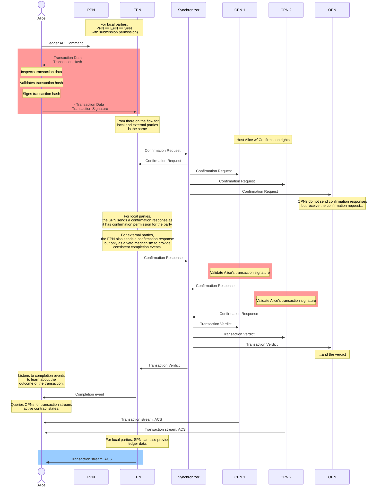

> **출처(원문)**: [Local and External Parties](https://docs.canton.network/overview/reference/external-party) · 번역일 2026-06-15

## 📌 개발자 노트
- **한 줄 요약**: 로컬 <abbr class="gloss" title="Canton에서 권한과 데이터 가시성의 주체가 되는 식별 가능한 참여 주체">파티</abbr> vs 외부 파티 — 호스팅 관계(SPN/CPN/OPN 권한·임계값), 제출 키 보유자, 네임스페이스, 두 파티 유형의 정의·호스팅·제출 흐름(준비 PPN/실행 EPN), 한계, 신뢰 모델, FAQ.
- **핵심 용어**: SPN/CPN/OPN, 제출 키 보유자, 외부 파티, PartyToParticipant, PPN(준비)·EPN(실행), <abbr class="gloss" title="이해관계자 밸리데이터가 트랜잭션이 유효함을 미디에이터에 응답하는 것(confirmation)">확인</abbr> 임계값
- **선행 개념**: [탈중앙화](decentralization.md), [토폴로지](topology.md), [신뢰 모델](../learn/trust-model.md).

---

# 로컬 파티와 외부 파티

Canton에서 **파티(party)** 는 <abbr class="gloss" title="거래·컨트랙트가 기록되는 장부. Canton에선 활성 컨트랙트의 모음">원장</abbr>에서 <abbr class="gloss" title="원장에 기록되는 불변 데이터 단위. 상태 변경은 새 컨트랙트 생성으로 표현됨">컨트랙트</abbr>를 생성·상호작용할 수 있는 주체를 나타낸다. 각 파티는 파티와 원장 사이의 중개자 역할을 하는 하나 이상의 **<abbr class="gloss" title="파티를 호스팅하고 그 파티의 컨트랙트를 저장·실행하는 노드. 밸리데이터의 핵심 구성요소">참여자 노드</abbr>**에 호스팅된다. 서로 다른 종류의 상호작용은 파티로부터 적절한 인증·권한을 요구한다. 이 페이지는 파티가 Canton 프로토콜과 통합·상호작용하는 방식, 관련된 신뢰 관계, 그 함의를 설명한다.

> 💡 **팁:** 서명 키와 권한에 대한 흔한 질문의 답은 이 페이지 끝 FAQ 절을 확인하라.

## 호스팅 관계

파티의 호스팅 관계는 각 참여자 노드의 권한과 확인 임계값을 명시한다.

참여자 노드는 호스팅하는 파티를 대신해 서로 다른 권한을 가질 수 있다.

### 제출 참여자 노드 (SPN)

제출 권한을 가진 노드를 **제출 참여자 노드(Submitting Participant Node, SPN)** 라 한다. 파티는 SPN에게 자신을 대신해 <abbr class="gloss" title="다자간 워크플로를 위해 설계된 Canton의 스마트 컨트랙트 언어">Daml</abbr> <abbr class="gloss" title="원장 상태를 바꾸는 원자적 작업 단위. 하나 이상의 컨트랙트를 생성·보관하며, 전부 적용되거나 전혀 적용되지 않음">트랜잭션</abbr>의 원장 제출을 일방적으로 인가할 것을 위임한다. 각 SPN은 자기 개인키를 써서 파티를 대신해 트랜잭션에 서명·인가한다. 이는 참여자 노드에 가능한 가장 강한 권한이다; SPN은 정의상 CPN과 OPN이기도 하다(아래 참고).

### 확인 참여자 노드 (CPN)

확인 권한을 가진 노드를 **확인 참여자 노드(Confirming Participant Node, CPN)** 라 한다. 파티는 CPN에게 자신을 대신해 유효한 트랜잭션이 원장에 <abbr class="gloss" title="트랜잭션이 최종 확정되어 원장에 반영되는 것">커밋</abbr>되도록 확인·인가할 것을 위임한다. CPN은 자기 개인키로 확인 응답에 서명해 트랜잭션을 확인할 수 있다. 파티를 위해 트랜잭션을 개시할 수는 없다. CPN은 정의상 OPN이다(아래 참고). CPN은 임계값으로 구성된다. Canton 프로토콜은 유효한 트랜잭션이 원장에 커밋되려면 파티 CPN 중 적어도 임계값 수의 확인을 요구한다. 이는 파티에 추가 복원력과 보안을 제공한다. 임계값 1인 단일 CPN이 가장 단순한 시나리오다.

이의 즉각적 결과는 가용성과 보안 간 트레이드오프다:

* 임계값이 높을수록 보안은 높지만 가용성 보장은 낮다: 더 적은 오프라인 CPN으로 트랜잭션 승인을 막을 수 있다
* 임계값이 낮을수록 가용성 보장은 높지만 보안은 낮다: 더 적은 악의적 CPN으로 무효 트랜잭션을 승인할 수 있다

> **참고:** Canton의 프라이버시 속성 때문에, CPN과 SPN만 제출 노드가 제출 권한을 가졌음을 신뢰성 있게 강제할 수 있다. 이는 원칙적으로 악의적 CPN이 제출 권한이 없는데도 파티를 대신해 트랜잭션을 제출하려 시도할 수 있음을 의미한다. 임계값 > 1로 여러 호스팅 CPN을 택하는 것이 그 위험에 대한 효과적 완화책이다. 또한 파티가 로컬이면, 어떤 SPN도 단독으로 트랜잭션 제출을 인가할 수 없으므로 그 파티를 대신한 제출을 사실상 불가능하게 만든다.

### 관찰 참여자 노드 (OPN)

관찰 권한을 가진 노드를 **관찰 참여자 노드(Observing Participant Node, OPN)** 라 한다. 파티는 OPN에게 자신과 관련된 트랜잭션을 원장에 충실히 기록하고 읽기 접근을 제공할 것을 위임한다. 관찰 권한만 가진 노드는 호스팅하는 파티를 대신해 트랜잭션을 제출하거나 확인할 수 없다.

## 제출 키 보유자

자기 제출 서명 키를 보유·통제하는 파티는 제출 키 보유자다. Canton은 임계값과 함께 여러 제출 서명 키 쌍의 등록을 지원한다. 연관된 개인 서명 키는 파티만 통제·사용할 수 있다. 파티는 자기 개인키를 관리·유지할 책임이 있다. 그 방법은 파티 운영자나 클라이언트 애플리케이션에 맡겨지며 Canton 범위 밖이다. 보통 사용자는 암호 커스터디 제공자나 다른 암호 키 관리 서비스를 써서 키를 보호할 수 있다.

가장 단순한 경우, 임계값 `1`인 단일 키 쌍이 단일 서명으로 트랜잭션 제출을 가능하게 한다. 더 복잡한 과정은 여러 서명을 요구할 수 있다; 그 경우 제출 키 보유자는 더 높은 임계값으로 여러 (고유) 키 쌍을 등록할 수 있다. Canton 프로토콜은 트랜잭션을 원장에 인가하려면 서로 다른 키의 적어도 임계값 수의 유효한 서명이 트랜잭션과 함께 제공되어야 함을 보장한다. 그 키와 연관 임계값은 `PartyToParticipant` <abbr class="gloss" title="어떤 노드·파티·키가 네트워크에 참여하는지를 정의하는 구성 정보">토폴로지</abbr> 트랜잭션에 정의된다.

```protobuf
// Mapping that maps a party to a participant
// The PartyToParticipant mapping may also specify a list of signing keys for setting up an external party, in which
// case the keys and the threshold take precedence over any PartyToKeyMapping for the same party.
// Additionally, the list of signing keys may contain the public key of the party's namespace, which allows this
// mapping to authorize itself without the need of a NamespaceDelegation root certificate (called self-signed).
// authorization: the required authorization of the mapping is a union of the authorization for individual changes
//  - threshold change: party namespace
//  - adding a signing key: party namespace + all the new signing key
//  - removing a signing key: party namespace
//  - changing the signing key threshold: party namespace
//  - upgrading a participant permission or adding a new participant: namespaces from party and the participant namespace
//  - downgrading a participant permission or removing a participant: party namespace OR the participant namespace
//  - setting a participant's onboarding flag from false to true: party namespace
//  - setting a participant's onboarding flag from true to false: participant namespace
//  - the removal of a PTP must be authorized just by the party
// revocation: Revoking a self-signed PTP does not prevent later re-creation of a PTP with the same partyId.
//  To prevent further usage of the key associated with the party's namespace,
//  revoke a NamespaceDelegation root certificate for that namespace.
// UNIQUE(party)
message PartyToParticipant {
  message HostingParticipant {
    message Onboarding {}

    // the target participant that the party should be mapped to
    string participant_uid = 1;

    // permission of the participant for this particular party (the actual
    // will be min of ParticipantSynchronizerPermission.ParticipantPermission and this setting)
    Enums.ParticipantPermission permission = 2;

    // optional, present iff the party is being onboarded to the participant
    Onboarding onboarding = 3;
  }

  // the party that is to be represented by the participants
  string party = 1;

  // the signatory threshold required by the participants to be able to act on behalf of the party.
  // a mapping with threshold > 1 is considered a definition of a consortium party
  uint32 threshold = 2;

  // which participants will host the party.
  // if threshold > 1, must be Confirmation or Observation.
  // if all participants have Observation permission, the confirmation treshold is ignored, making the party
  // a purely observing party.
  repeated HostingParticipant participants = 3;

  reserved 4; // was group_addressing = 4;

  reserved 5; // was synchronizer = 5;

  // Contains protocol signing keys for the party used to authorize externally signed Daml transactions,
  // along with a signing threshold.
  // The max number of keys is 20
  optional com.digitalasset.canton.crypto.v30.SigningKeysWithThreshold party_signing_keys = 6;
}
```

## 네임스페이스

네임스페이스는 Canton 토폴로지의 개념이다. 모든 파티는 그 네임스페이스의 루트 서명 키 쌍의 공개키에서 파생되는 네임스페이스 안에 존재하므로 파티에 관련이 있다. 모든 Canton 노드도 자신을 위한 네임스페이스를 정의한다는 점에 유의하라. 네임스페이스는 본질적으로 네트워크에서 파티나 노드의 신원을 정의한다.

## 로컬 파티

로컬 파티는 하나 이상의 SPN을 가진 파티로 정의된다. 그 SPN 중 하나와 네임스페이스를 공유하며, 따라서 토폴로지 관리를 SPN 운영자에게 위임한다. 로컬 파티는 Canton 원장과 상호작용하는 가장 단순한 방법이자 호스팅 노드에 가장 많은 신뢰를 두는 방법이다. SPN이 명시적 승인 없이 트랜잭션을 제출할 완전한 권한을 가지므로, 보통 파티를 대신해 <abbr class="gloss" title="애플리케이션이 원장에 제출하는 명령(컨트랙트 생성·초이스 실행 요청)">커맨드</abbr>를 실행하는 자동화가 필요한 상황에 가장 적합하다.

## 외부 파티

외부 파티는 제출 키 보유자로, SPN이 **없고**, 자기 서명 키로 통제되는 고유 네임스페이스를 가진 파티로 정의된다(SPN의 네임스페이스 아래 존재하는 로컬 파티와 대조). `PartyToParticipant` 토폴로지 트랜잭션의 서명 키는 파티가 자기 키로 원장에 트랜잭션을 제출할 수 있게 한다. 결정적으로, 어떤 노드에도 **제출 권한**을 부여하지 **않는다**. 이는 참여자 노드가 파티의 명시적 승인 없이 원장에서 행위할 능력을 제거함으로써 참여자 노드의 잠재적 규제 부담을 없앤다. 외부 파티는 여전히 자신을 대신해 트랜잭션을 확인하고 원장 상태를 기록할 **적어도 하나의 CPN** 이 필요하다. 이는 네트워크 지연을 합리적으로 유지하고 파티가 원장에서 활동을 기록할 신뢰된 출처를 제공한다.

## 로컬 vs 외부 파티 호스팅

다음 표는 서로 다른 노드 권한에 대한 로컬·외부 파티의 호스팅 관계를 요약한다.

| | 로컬 파티 | 외부 파티 |
| --- | --- | --- |
| # SPN | 적어도 1 | 0 |
| # CPN | 임의 수 | 적어도 1 |
| # OPN | 임의 수 | 임의 수 |

## 제출 흐름

로컬과 외부 파티의 차이는, 외부 파티의 경우 트랜잭션 인가에 쓰이는 개인키를 파티가 단독 통제한다는 것이다(로컬 파티는 SPN이 그 키를 통제). 대신 외부 파티는 각 트랜잭션 제출에 자기 개인키로 명시적으로 서명한다. 더 구체적으로, 트랜잭션이 원장에 성공적으로 커밋되면 가질 모든 원장 효과를 정확히 나타내는 트랜잭션 트리의 해시에 서명한다. 이 트랜잭션 생성에는 무엇보다 복잡한 로직, Daml 해석 엔진, 최신 토폴로지, ACS 지식이 필요하다. 과정을 단순화하기 위해, 외부 파티의 제출 흐름은 두 단계로 나뉜다:

* **준비(Preparation)**: Ledger API 커맨드를 Daml 트랜잭션으로 변환.
  이 단계는 트랜잭션의 선택 <abbr class="gloss" title="상태를 저장하지 않고 트랜잭션 합의·순서를 조율하는 Canton 구성요소">Synchronizer</abbr>와 트랜잭션이 요구하는 패키지에 연결된 임의의 참여자 노드가 수행할 수 있다. 그런 노드를 **준비 참여자 노드(Preparing Participant Node, PPN)** 라 한다. 파티를 대신해 트랜잭션을 준비하려면 파티에 대한 `readAs` 범위를 가진 Ledger API 사용자가 필요하다.

* **실행(Execution)**: 트랜잭션과 그 서명이 트랜잭션이 실행될 Synchronizer에 연결된 참여자 노드로 전송됨.
  이 참여자 노드는 단순히 트랜잭션을 Synchronizer로 전달한다. 그런 노드를 **실행 참여자 노드(Executing Participant Node, EPN)** 라 한다. 파티를 대신해 트랜잭션을 실행하려면 파티에 대한 `actAs` 범위를 가진 Ledger API 사용자가 필요하다.

이것이 제출 경로다. 읽기 경로(원장에 커밋된 트랜잭션 관찰)에서, 외부 파티는 CPN이나 OPN에서 트랜잭션 스트림을 읽을 수 있다. 추가 보안을 위해 여러 곳에서 읽고 임계값으로 결과를 교차 비교해 비잔틴 장애 허용을 달성할 수 있다.

다음 시퀀스 다이어그램은 로컬·외부 파티의 제출 흐름을 차이를 강조하며 설명한다:

* 빨간 배경의 상호작용은 외부 파티 전용
* 파란 배경의 상호작용은 로컬 파티 전용
* 배경 없는 상호작용은 로컬·외부 파티 공통



## 한계

* **로컬 파티**:
  * 참여자 임계값 > 1이면, 파티는 트랜잭션을 제출할 수 없고 자신이 <abbr class="gloss" title="어떤 컨트랙트와 관계를 맺어 그것을 보거나 승인하는 파티 = 서명자 + 관찰자">이해관계자</abbr>인 트랜잭션만 확인할 수 있다.
* **외부 파티**:
  * 단일 루트 노드: 단일 루트 노드를 가진 트랜잭션만 지원된다.
  * 단일 제출 파티: 단일 파티의 권한을 요구하는 트랜잭션만 지원된다.
* **로컬·외부 공통**:
  * 개별 제출의 커맨드 완료는 제출에 쓰인 SPN(외부 파티는 EPN)에서만 가능하다
  * 개별 제출의 커맨드 중복제거는 제출에 쓰인 SPN(외부 파티는 EPN)에서만 가능하다

## 신뢰 모델

### 정의

* **사용자(User)**: 파티를 `actAs`할 권한을 가진 Ledger API 사용자. 커맨드 제출에서 파티의 의도에 따라 충실히 행동한다고 가정.
* **파티 소유자(Party owner)**: 파티의 네임스페이스 키를 통제하는 개인이나 주체. 파티 거버넌스에서 파티의 의도에 따라 충실히 행동한다고 가정.

### 신뢰 관계

* **SPN**: 사용자가 SPN을 완전히 신뢰한다. 예컨대 SPN은 로컬 파티가 필요 인가자인 임의의 트랜잭션을 사용자의 승인 없이 제출·인가할 수 있다.

* **CPN**:

  * 사용자는 임계값 미만의 CPN만이 Canton 프로토콜이 기대하는 대로 호스팅 파티를 대신해 요청을 잘못 승인·거부한다고 신뢰한다. 다만 임계값 수의 CPN이 악의적이면, 무효 트랜잭션을 잘못 승인할 수 있다. 여기에는 외부 파티의 무효한 외부 서명을 가진 트랜잭션이 포함된다.
  * 사용자는 임계값 미만의 CPN 운영자만이 악의적이거나 무효한 Daml 패키지를 베팅한다고 신뢰한다. 특히 정직한 CPN 운영자는 참여자 노드 ACS에 이전 패키지 버전으로 생성된 <abbr class="gloss" title="아직 보관(소비)되지 않아 현재 유효한 컨트랙트">활성 컨트랙트</abbr>가 있으면 새 패키지를 이전 버전과 비교해야 한다. 그 경우 정직한 CPN 운영자는 새 패키지 버전을 베팅하기 전에 컨트랙트 <abbr class="gloss" title="컨트랙트의 주된 권한자. 생성·보관(소비)에 반드시 동의해야 하는 파티">서명자</abbr>의 승인을 얻어야 한다. 다만 임계값 수의 CPN 운영자가 악의적 패키지를 베팅하면, 새/기존 컨트랙트에 임의의 <abbr class="gloss" title="원장 위에서 규칙대로 자동 실행되는 코드화된 계약. Canton에선 Daml 템플릿으로 작성">스마트 컨트랙트</abbr> 코드가 실행될 수 있다.

* **PPN**: 사용자가 PPN을 신뢰하지 않는다.

* **EPN**: 사용자가 EPN을 신뢰하지 않는다, 단 다음 경우는 예외:

  > * EPN으로부터 얻은 커맨드 완료에 따라 행동할 때
  > * `max_record_time` 필드를 통한 TTL(Time To Live) 기능을 쓸 때

예컨대 EPN은 의도적으로 잘못된 완료 이벤트를 방출해, 사용자가 제출이 실패했다고 생각해 재시도하게 만들 수 있으나 실제로는 성공했을 수 있다. 또한 `max_record_time` 필드를 무시·수정할 수 있으며, 그 경우 사용자의 의도대로 강제되지 않는다.

### 사용자 책임

사용자는 커맨드 제출을 위해 참여자 노드와 상호작용할 때 아래 지침을 따라야 한다:

* **SPN과 CPN**: 파티 소유자가 SPN과 CPN을 신중히 선택한다.

* **PPN**: 사용자가 PPN으로부터 준비된 트랜잭션을 시각화한다.
  그것이 자기 의도와 맞는지 확인한다. 또한 트랜잭션이 안전하게 제출될 수 있도록 그 안의 데이터를 검증한다. 특히:

  * 트랜잭션이 사용자가 생성하려는 원장 효과에 대응한다

  * 준비 시간이 Synchronizer의 현재 <abbr class="gloss" title="Synchronizer 구성요소. 암호화된 메시지에 전체 순서·타임스탬프를 부여하고 참여자에게 전달">시퀀서</abbr> 시간보다 앞서지 않는다. 이를 신뢰성 있게 확인하려면 `preparation_time`을 다음의 최솟값과 비교한다:

    > * 제출 애플리케이션의 벽시계 시간
    > * 적어도 참여자 임계값 수의 CPN이 방출한 마지막 기록 시간 + Synchronizer의 구성된 `mediatorDeduplicationTimeout`

    * prepare 요청에 min_ledger_time이 정의되면, 응답의 min_ledger_effective_time이 비어 있거나 요청된 `min_ledger_time`보다 앞서는지 검증한다.

    * 사용자가 여기 기술된 명세에 따라 트랜잭션의 해시를 계산한다.
      PPN이 신뢰되지 않는 한 PPN 응답의 해시는 무시해야 한다.

* **EPN**:
  * 사용자가 Daml 트랜잭션으로부터 계산한 해시에 서명한다
  * 트랜잭션 서명에 쓰이는 키는 이 목적으로만 쓴다
  * 서명용 키는 안전하게 저장되고 비공개로 유지된다
  * 사용자가 커맨드 완료의 제출 ID에 의존하지 않는다

### 완화책

**악의적 CPN**: 파티 소유자가 참여자 임계값을 1보다 크게 설정해 여러 CPN이 장애 허용 모드로 공동 호스팅하게 한다. 임계값보다 적은 CPN이 결함이면 위협이 완화된다. Canton은 원장에 커밋될 트랜잭션에 대해 참여자 임계값 수의 CPN 승인을 요구해 장애 허용을 달성한다. 거부도 마찬가지로, 트랜잭션이 거부되려면 적어도 임계값 수의 거부에 도달해야 한다. 파티가 트랜잭션 스트림 같은 정보를 CPN에서 소비하면, 장애 허용을 위해 참여자 임계값 수의 서로 다른 CPN으로부터의 정보를 교차 확인해야 한다.

**악의적 EPN**: 악의적 EPN은 의도적으로 잘못된 완료 이벤트를 방출할 수 있다. 현재 실용적인 일반 완화책은 없다. 다만 자기 충돌(self-conflicting) 트랜잭션은 이 위협의 대상이 아니다 — 예컨대 트랜잭션이 제출 파티가 서명자인 적어도 하나의 컨트랙트에 <abbr class="gloss" title="컨트랙트를 소비해 비활성으로 만드는 것(archive). 보관된 컨트랙트는 더 이상 쓸 수 없음">보관</abbr>(archive)을 담을 때. 그 경우 CPN이 그 트랜잭션의 재제출을 거부한다. 사용자는 (신뢰된) CPN의 트랜잭션 스트림과 완료 이벤트를 상관지으려 시도할 수 있다. 다만 트랜잭션 스트림은 커밋된 트랜잭션만 방출하므로 실무에서 활용하기 어렵다.

## FAQ

### 로컬 파티가 쓰는 암호 키는 무엇인가?

로컬 파티가 인가에 쓰는 모든 키는 파티의 호스팅 노드가 관리한다:

> * 트랜잭션 제출을 인가하는 제출 노드의 프로토콜 키
> * 네임스페이스 관리를 인가하는 제출 노드의 네임스페이스 키
> * 유효한 트랜잭션 확인을 인가하는 확인 노드의 프로토콜 키

### 외부 파티가 쓰는 암호 키는 무엇인가?

> * 트랜잭션 제출과 네임스페이스 관리를 인가하는 파티 자신의 키
> * 유효한 트랜잭션 확인을 인가하는 확인 노드의 키

### 다중 호스팅은 외부 파티에 어떤 영향을 주나?

외부 파티 다중 호스팅의 핵심 차이는 그 네임스페이스가 어떤 호스팅 노드와도 공유되지 않는다는 것이다. 이는 외부 파티가 관여하는 토폴로지 트랜잭션이 파티의 외부 네임스페이스 키로 서명되어야 함을 함의한다. 여기에는 파티 호스팅을 구성하는 파티-참여자 매핑이 포함된다.

자세한 내용은 다중 호스팅 파티 문서를 참고하라.

## 추가 자원

* SDK 외부 서명 개요
* 외부 파티 온보딩 튜토리얼
* 외부 파티 트랜잭션 제출 튜토리얼
* 외부 서명 트랜잭션 해시

<!-- nav:start -->

---

⬅️ **이전**: [탈중앙화 (Decentralization)](decentralization.md) ・ ➡️ **다음**: [Canton Foundation 정책 (CF Policies)](gsf-policies.md)

<!-- nav:end -->
