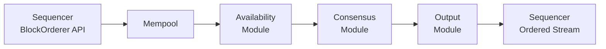

> **출처(원문)**: [Ordering Consensus](https://docs.canton.network/overview/reference/ordering-consensus) · 번역일 2026-06-15

## 📌 개발자 노트
- **한 줄 요약**: Canton 2계층 합의 중 순서화 계층 — 시퀀서·미디에이터 노드, BFT 순서화 서비스(ISS·Narwhal 기반 4모듈 파이프라인), BFT 신뢰 모델(1/3 미만 결함), 중앙집중/CometBFT/네이티브 BFT 백엔드, 시퀀서 보장.
- **핵심 용어**: 시퀀서·미디에이터, BFT, ISS·Narwhal, PoA(가용성 증명), Mempool/Availability/Consensus/Output 모듈, 전체 순서
- **선행 개념**: [2계층 합의](../learn/two-layer-consensus.md), [Canton 프로토콜 명세](canton-protocol-specification.md).

---

# 순서화 합의 (Ordering Consensus)

순서화 합의 계층은 Canton [2계층 합의 아키텍처](canton-protocol-specification.md)의 절반이다. 스마트 <abbr class="gloss" title="원장에 기록되는 불변 데이터 단위. 상태 변경은 새 컨트랙트 생성으로 표현됨">컨트랙트</abbr> 합의 계층이 영향받는 <abbr class="gloss" title="Canton에서 권한과 데이터 가시성의 주체가 되는 식별 가능한 참여 주체">파티</abbr> 사이에서 트랜잭션 정확성을 검증한다면, 순서화 계층은 주어진 <abbr class="gloss" title="상태를 저장하지 않고 트랜잭션 합의·순서를 조율하는 Canton 구성요소">Synchronizer</abbr>의 이벤트에 대한 단일·전역 순서를 확립한다. 이를 트랜잭션 내용에 접근하지 않고 수행한다 — 페이로드는 종단 간 암호화된 채로 남고, 순서화 인프라는 메타데이터만 본다.

## Synchronizer 구성 요소

Synchronizer는 두 노드 유형으로 구성된다: **시퀀서**와 **미디에이터**. 함께 인증된·순서화된 메시지 전달과 트랜잭션 최종화를 제공한다. 두 유형 모두 복호화된 트랜잭션 페이로드를 저장하거나 접근하지 않는다.

### 시퀀서 노드

시퀀서는 인증된·타임스탬프된 멀티캐스트를 제공한다. Synchronizer의 메시지 라우팅 백본이다.

* **Synchronizer에 대한 전체 순서.** 시퀀서에 제출된 각 메시지 배치는 타임스탬프 역할을 하는 단조 증가 값을 받는다. 모든 수신자는 이 타임스탬프에서 도출된 같은 전역 순서를 관찰한다. 이 전체 순서는 Synchronizer의 모든 상태 변경에 결정론적 시퀀스 위치를 부여해 이중지불을 막는다.
* **암호화된 페이로드 전달.** 시퀀서는 불투명한(암호화된) 메시지를 전달한다. 메타데이터 — 수신자 목록과 메시지 크기 — 는 보지만 트랜잭션 내용은 보지 않는다. 암호화 키는 참여자 간에 관리되며, 시퀀서는 결코 복호화 키를 보유하지 않는다.
* **발신자 프라이버시.** 수신자는 발신자의 파티 ID를 알지 못한다. 시퀀서는 다른 파티에게 메시지를 전달하기 전에 발신자 정보를 제거한다.
* **트래픽 관리.** 시퀀서는 남용과 서비스 거부(DoS) 공격으로부터 Synchronizer를 보호하기 위해 트래픽 한도를 강제한다. 각 인가된 멤버는 트래픽 잔액을 누적하며, 멤버의 가용 잔액을 초과하는 제출 요청은 거부된다. 트래픽 비용은 페이로드 크기, 수신자 수, 이벤트당 베이스 비용에 비례한다.

참여자와 미디에이터는 결코 서로 직접 통신하지 않는다. 모든 프로토콜 메시지는 시퀀서를 통해 흐른다.

### 미디에이터 노드

미디에이터는 트랜잭션을 최종화하는 2단계 커밋 프로토콜을 동기화한다. 시퀀서가 암호화된 트랜잭션 뷰를 영향받는 참여자에게 분배한 후, 참여자가 자기 뷰를 검증하고 확인 응답(승인 또는 거부)을 시퀀서를 통해 미디에이터에 다시 보낸다.

* **확인 수집.** 미디에이터는 주어진 트랜잭션에 대해 모든 확인 참여자로부터 확인 응답을 수집한다.
* **평결 발행.** 미디에이터가 결과를 판정할 만큼 충분한 응답을 받으면, 트랜잭션 평결(커밋 또는 거부)을 낸다. 그러면 시퀀서가 이 평결을 영향받는 모든 참여자에게 분배한다.
* **제한된 가시성.** 미디에이터는 인포미 목록(어떤 파티가 어떤 트랜잭션 뷰에 관여하는지)과 확인 결과(뷰별 승인/거부)를 본다. 암호화된 트랜잭션 페이로드 자체는 보지 않는다.

Synchronizer는 작업을 분산하기 위해 여러 미디에이터 그룹을 실행할 수 있다. Synchronizer 소유자는 <abbr class="gloss" title="어떤 노드·파티·키가 네트워크에 참여하는지를 정의하는 구성 정보">토폴로지</abbr> 트랜잭션으로 미디에이터 그룹 멤버십을 구성한다.

## BFT 순서화 서비스

시퀀서를 뒷받침하는 순서화 서비스는 다른 구성으로 작동할 수 있다. 가장 중요한 구분은 중앙집중형 백엔드와 비잔틴 장애 허용(BFT) 백엔드 사이다.

BFT 오더러가 활성일 때, Canton 시퀀서 JVM 프로세스 내에서 실행된다. 메시지 서명, 서명 검증, 키 관리, 거버넌스(토폴로지 상태)를 위해 같은 위치의 시퀀서에 의존한다. BFT 오더러는 `BlockOrderer` API를 구현하며, 이를 통해 시퀀서가 순서화 요청(쓰기)을 제출하고 전역 순서화된 트랜잭션 스트림(읽기)을 구독할 수 있다.

BFT 오더러는 두 보장을 제공한다:

* **안전성(일관성).** 모든 정상 노드가 같은 순서화 출력을 생성한다. 두 정상 시퀀서가 상충하는 트랜잭션 순서를 전달하지 않는다.
* **라이브니스(진전).** 장애 허용 임계값을 초과하지 않는 한 시스템은 트랜잭션 순서화를 계속한다.

## BFT 신뢰 모델

BFT 오더러는 표준 비잔틴 장애 허용 가정을 쓴다:

* **장애 임계값.** 전체 BFT 오더러 노드의 1/3 미만이 동시에 비잔틴 장애(크래시, 메시지 손상, 능동적 악의를 포함한 임의 행동)를 보일 수 있다. 전체 N개 노드에 대해, 시스템은 3f + 1 ≤ N인 f개의 비잔틴 결함을 허용한다.
* **합의 정족수.** 신뢰 임계값 k = floor(2N/3). 순서화에 진전하려면 적어도 k + 1개 노드가 동의해야 한다.
* **암호학적 가정.** 적대자는 큰 대역폭과 연산 자원을 가질 수 있지만, 표준 암호 프리미티브(디지털 서명, 해시 함수)를 깰 수 없다.
* **공동 운명(shared fate).** BFT 오더러 노드와 같은 위치의 시퀀서는 공동 운명 모델 하에서 작동한다. 하나가 침해되면 다른 하나도 침해된 것으로 가정해야 한다.
* **거버넌스와 온보딩.** 신뢰된 관리자가 BFT 오더러 구성을 관리한다. 온보딩되는 새 노드는 에폭 번호, 블록 번호, 타임스탬프 같은 BFT 메타데이터를 묶은 피어 시퀀서 스냅숏으로부터 올바른 시작 상태를 얻는다.
* **저장 무결성.** 기반 데이터베이스가 손상되지 않았다고 가정한다.

## BFT 아키텍처

BFT 오더러는 두 발표된 알고리즘에 기반한다:

**ISS (Insanely Scalable State-Machine Replication)** 는 병렬 리더 기반 BFT 복제 프로토콜이다. ISS는 BFT 오더러의 핵심 합의 하위 프로토콜에 영감을 준다. 고정 블록 길이의 에폭으로 작업을 나누고, 에폭의 서로 다른 세그먼트에서 여러 리더가 블록을 병렬로 제안한다. 이 병렬성은 일부 리더가 가용하지 않아도 다운타임 없이 리더 역할과 연관된 비싼 비용을 부하 분산한다.

**Narwhal** 은 데이터 전파(dissemination)를 데이터 순서화(ordering)와 분리한다. BFT 오더러는 이 아이디어를 합의 전 가용성 하위 프로토콜에 적용한다: 데이터가 먼저 전파되고, 합의는 데이터 자체가 아니라 이미 가용한 데이터에 대한 참조를 순서화한다. 이 분리는 순서화 서비스의 병목이 되기 쉬운 합의 프로토콜의 통신 부하를 줄인다.

### 모듈 아키텍처

BFT 오더러는 파이프라인을 이루는 네 모듈로 조직된다:

**Mempool** — `BlockOrderer` API를 통해 로컬 시퀀서로부터 순서화 요청을 받는다. 요청은 인메모리 큐에 보관된다. 큐가 가득 차면 mempool은 들어오는 요청을 거부해 배압(backpressure)을 가한다. 다운스트림 availability 모듈이 데이터를 요청하면, mempool은 큐에 쌓인 요청을 배치로 묶어 전달한다.

**Availability 모듈** — Narwhal 기반 데이터 전파 단계를 구현한다. availability 모듈이 mempool로부터 배치를 받으면, 배치를 로컬에 저장하고 다른 BFT 오더러 노드의 피어 availability 모듈에 전달한다. 배치를 성공적으로 받은 각 피어는 서명된 가용성 확인(ACK)을 반환한다. 모듈은 적어도 f + 1개의 서로 다른 ACK(f는 허용 가능한 비잔틴 결함 수)를 모아 **가용성 증명(proof of availability, PoA)** 을 생성한다. 더 강한 보장을 위해 최대 N - f개의 ACK를 기다릴 수 있다. PoA는 적어도 하나의 정상 노드가 데이터를 보유하고 필요한 노드에 제공할 수 있음을 증명한다. 이는 비잔틴 노드가 실제로 존재하지 않는 데이터에 대한 참조를 제안하는 것을 막는다.

**Consensus 모듈** — ISS 기반 순서화 프로토콜을 구현한다. 작업은 고정 블록 길이의 개별 에폭으로 나뉜다. 모든 노드가 토폴로지 상태를 통해 각 에폭의 적격 리더 집합에 합의한다. 리더는 에폭 전반의 블록에 결정론적으로 할당되며, 각 리더는 PBFT에서 파생된 3단계 프로토콜로 할당된 블록을 독립적으로 순서화한다:

1. **Pre-prepare.** 리더가 PoA 참조를 담은 순서화 블록을 브로드캐스트한다.
2. **Prepare.** 다른 노드가 pre-prepare를 확인한다.
3. **Commit.** 노드가 유효한 pre-prepare와 2/3 초과의 prepare 메시지를 받은 후 commit 메시지를 보낸다.

노드가 유효한 pre-prepare와 2/3 초과의 commit 메시지를 받으면 블록이 순서화된 것으로 간주된다.

**Output 모듈** — 합의 출력으로부터 완전한·전역 순서화된 트랜잭션 스트림을 재구성한다. PoA 참조를 써서 availability 모듈로부터 전체 요청 데이터를 가져온다(캐시되어 있으면 로컬에서, 아니면 원격 피어에서). 리더가 블록을 병렬로 순서화하므로, output 모듈은 블록을 올바른 전역 순서로 재배열한다. 각 블록에 엄격히 증가하는 BFT 타임스탬프를 부여한다 — consensus 모듈이 후보 타임스탬프를 계산하고, output 모듈이 단조성을 보장하도록 결정론적으로 조정한다. 최종 순서화된 스트림은 같은 위치의 시퀀서에 전달된다.

### 네트워크 전송

BFT 오더러 노드는 P2P로 통신한다. 각 노드는 순서화 서비스의 다른 모든 피어에 gRPC/HTTP2 스트림을 확립한다. 이 연결은 점대점 인증과 무결성을 위해 TLS를 쓴다. P2P API는 보통 공개적으로 노출되지 않으며, 접근은 알려진 BFT 오더러 피어로 제한된다.

## 중앙집중 vs. 탈중앙 옵션

Canton은 여러 시퀀서 백엔드를 지원한다. 백엔드 선택이 Synchronizer의 신뢰 모델을 결정한다.

**중앙집중형(단일 데이터베이스 백엔드).** 단일 데이터베이스가 순서화를 제공한다. 가장 단순한 구성이다: 최저 지연, 운영 최용이, 그러나 단일 신뢰·장애 지점. 데이터베이스나 운영자가 침해되면 순서화 무결성이 상실된다. Synchronizer 운영자가 모든 참여자에게 신뢰받는 사설 Synchronizer에 적합하다. 중앙집중형 오더러는 Alpha 상태이며 아직 프로덕션 준비가 되지 않았다는 점에 유의하라. 이 옵션은 단일 시퀀서 배포에서도 네이티브 BFT 오더러 실행을 선호해 제거될 예정이다.

**CometBFT 드라이버.** [CometBFT](https://cometbft.com/)를 쓰는 외부 BFT 순서화 서비스. Canton은 CometBFT를 시퀀서 백엔드로 통합하는 드라이버를 포함한다. 확립된 합의 엔진을 통해 비잔틴 장애 허용을 제공하지만, 시퀀서 JVM 외부의 별도 프로세스로 실행된다.

**네이티브 BFT 오더러.** 위에서 설명한 ISS 기반 오더러로, 시퀀서와 같은 프로세스에서 실행된다. 시퀀서의 요구사항에 맞춰 설계되고 Canton의 토폴로지·키 관리와 긴밀히 통합된 Canton 자체 BFT 구현이다.

**<abbr class="gloss" title="슈퍼 밸리데이터들이 공동 운영하는 Canton의 퍼블릭 조율(합의) 계층">글로벌 Synchronizer</abbr>**는 <abbr class="gloss" title="글로벌 Synchronizer를 운영하고 네트워크 거버넌스에 참여하는 노드">슈퍼 밸리데이터</abbr>가 운영하는 BFT 구성을 쓴다. 각 슈퍼 <abbr class="gloss" title="파티를 호스팅하고 그 파티의 컨트랙트 데이터를 저장하는 참여자 노드">밸리데이터</abbr>가 시퀀서·미디에이터 노드를 운영하며, BFT 오더러 노드가 슈퍼 밸리데이터 인프라 전반에서 P2P로 통신한다. 사설 Synchronizer는 어떤 백엔드든 쓸 수 있다 — 단순함을 위한 단일 데이터베이스 백엔드, 또는 신뢰를 여러 운영자에 분산해야 할 때 BFT 백엔드.

## 시퀀서 보장

시퀀서는 백엔드와 무관하게 Canton 프로토콜에 다음 보장을 제공한다:

* **전체 순서.** 모든 수신자가 같은 메시지 시퀀스를 관찰한다. 이는 이중지불을 막고 같은 Synchronizer에 연결된 참여자 전반의 일관성을 보장하는 기초다.
* **타임스탬핑.** 각 메시지 배치가 단조 증가 타임스탬프를 받는다. 이 타임스탬프가 모든 프로토콜 타임아웃과 순서화 결정을 구동한다.
* **인증된 전달.** 시퀀서가 전달하는 메시지는 서명되어, 수신자가 그 메시지가 실제로 시퀀싱되었음(제3자가 위조하지 않았음)을 검증할 수 있다.
* **페이로드 프라이버시.** 트랜잭션 페이로드는 참여자 간 암호화된다. 시퀀서는 암호문을 전송하며 자신이 라우팅하는 메시지의 내용을 읽을 수 없다.
* **발신자 프라이버시.** 시퀀서는 발신자의 신원을 수신자에게 드러내지 않는다. 이는 발신자-수신자 상관에 기반한 트래픽 분석을 막는다.
* **트래픽 관리.** 시퀀서는 멤버별 트래픽 한도를 강제한다. 멤버는 베이스 할당(Synchronizer 시간에 걸친 수동 누적)과 구매한 추가 트래픽으로 트래픽을 누적한다. 멤버의 가용 트래픽 잔액을 초과하는 제출은 거부되어, 자원 고갈로부터 Synchronizer를 보호한다.

<!-- nav:start -->

---

⬅️ **이전**: [원장 모델 (상세)](ledger-model-detailed.md) ・ ➡️ **다음**: [프루닝 (Pruning)](pruning.md)

<!-- nav:end -->
