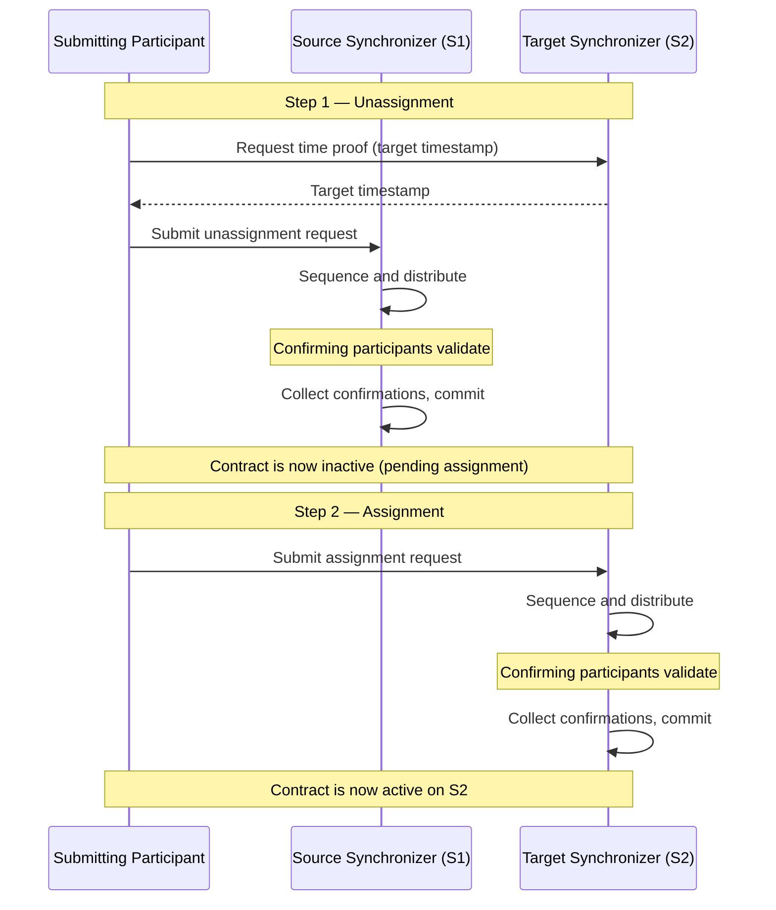

> **출처(원문)**: [Reassignment Protocol](https://docs.canton.network/overview/reference/reassignment-protocol) · 번역일 2026-06-15

## 📌 개발자 노트
- **한 줄 요약**: <abbr class="gloss" title="상태를 저장하지 않고 트랜잭션 합의·순서를 조율하는 Canton 구성요소">Synchronizer</abbr> <abbr class="gloss" title="컨트랙트를 한 Synchronizer에서 다른 Synchronizer로 옮기는 프로토콜">재할당</abbr> 프로토콜의 기술 레퍼런스 — 언어사인/어사인 2단계, 핵심 정의(재할당 카운터·대상 타임스탬프·재할당 참여자·<abbr class="gloss" title="컨트랙트의 주된 권한자. 생성·보관(소비)에 반드시 동의해야 하는 파티">서명자</abbr> 언어사인/어사인 참여자), 검증·제출·배타성 정책, 자동/명시 재할당, Ledger API 데이터, 가시성 진입·이탈.
- **핵심 용어**: 언어사인·어사인, 재할당 카운터, 대상 타임스탬프, 재할당 참여자, 어사인 배타성, Synchronizer 라우터
- **선행 개념**: [다중 Synchronizer 아키텍처](../learn/multi-synchronizer.md), [크로스-Synchronizer DvP 예시](cross-sync-dvp-example.md).

---

# 재할당 프로토콜

## 재할당이 존재하는 이유

<abbr class="gloss" title="파티를 호스팅하고 그 파티의 컨트랙트를 저장·실행하는 노드. 밸리데이터의 핵심 구성요소">참여자 노드</abbr>는 여러 Synchronizer에 연결할 수 있다. 서로 다른 Synchronizer는 서로 다른 목적을 수행할 수 있다: 규제 준수, 성능 특성, 비용, 거버넌스 모델, 애플리케이션별 제한. 서로 다른 Synchronizer에서 생성된 <abbr class="gloss" title="원장에 기록되는 불변 데이터 단위. 상태 변경은 새 컨트랙트 생성으로 표현됨">컨트랙트</abbr>가 같은 <abbr class="gloss" title="원장 상태를 바꾸는 원자적 작업 단위. 하나 이상의 컨트랙트를 생성·보관하며, 전부 적용되거나 전혀 적용되지 않음">트랜잭션</abbr>에 참여할 방법이 필요하며, 재할당이 그 메커니즘이다.

> **참고:** Synchronizer는 <abbr class="gloss" title="어떤 컨트랙트와 관계를 맺어 그것을 보거나 승인하는 파티 = 서명자 + 관찰자">이해관계자</abbr>가 컨트랙트 변경을 동기화하는 데 쓰는 상품(commodity)이다. 컨트랙트 자체는 참여자 노드에만 저장된다. 할당(assignation)은 이해관계자 간의 <abbr class="gloss" title="여러 노드가 트랜잭션의 유효성·순서에 함께 동의하는 절차">합의</abbr>이며, 재할당을 통해 시간에 따라 바꿀 수 있다.

## 2단계 과정: 언어사인과 어사인

## 핵심 정의

### 재할당 카운터 (Reassignment counter)

**재할당 카운터**는 컨트랙트가 재할당된 횟수를 추적한다. 컨트랙트 생성 시 0으로 설정되고 각 언어사인마다 1 증가한다. 언어사인 이벤트와 대응하는 어사인 이벤트는 같은 재할당 카운터를 갖는다.

### 대상 타임스탬프 (Target timestamp)

언어사인이 제출되면 대상 Synchronizer에서 시간 증명이 요청된다. 이 타임스탬프 — **대상 타임스탬프** — 는 언어사인 처리 중 대상 Synchronizer 관련 검증(패키지 베팅, 이해관계자 <abbr class="gloss" title="참여자 노드가 파티를 대신해 원장에서 활동(컨트랙트 저장·트랜잭션 제출·확인)해 주는 것. 로컬 파티는 키까지 노드가 관리하고, 외부 파티는 제출 키를 파티 자신이 보유(노드는 중계)">호스팅</abbr> 등)을 수행하는 데 쓰인다. 단일 고정 대상 타임스탬프를 쓰면 모든 <abbr class="gloss" title="이해관계자 밸리데이터가 트랜잭션이 유효함을 미디에이터에 응답하는 것(confirmation)">확인</abbr> 참여자가 같은 <abbr class="gloss" title="어떤 노드·파티·키가 네트워크에 참여하는지를 정의하는 구성 정보">토폴로지</abbr> 스냅숏에 대해 같은 검증을 실행하도록 보장한다.

### 재할당 참여자 (Reassigning participant)

재할당 참여자는 소스·대상 Synchronizer 모두에 연결되고 둘 다에서 이해관계자를 호스팅한다. 이 이중 연결성이 전체 재할당을 검증하고 <abbr class="gloss" title="같은 자산을 두 번 쓰는 부정행위">이중지불</abbr>을 막을 수 있게 한다.

형식적으로, 참여자 `P`는 다음이 모두 성립하면 <abbr class="gloss" title="Canton에서 권한과 데이터 가시성의 주체가 되는 식별 가능한 참여 주체">파티</abbr> `S`와 컨트랙트 `c`에 대한 **재할당 참여자**다:

* `S`가 `c`의 이해관계자다.
* `S`가 대상 타임스탬프에 대상 Synchronizer에서 `P`에 호스팅된다.
* `S`가 소스 Synchronizer에서 `P`에 호스팅된다.

마지막 조건은 제출 중 최근 토폴로지 스냅숏으로, 프로토콜 3단계 중 요청 시점 토폴로지 스냅숏으로 확인된다.

### 서명자 언어사인 참여자 (Signatory unassigning participant)

컨트랙트 `c`와 파티 `S`에 대한 **서명자 언어사인 참여자**는 다음을 만족하는 재할당 참여자다:

* `S`가 `c`의 **서명자**다.
* `S`가 소스 Synchronizer에서 적어도 확인 권한으로 `P`에 호스팅된다.

서명자 언어사인 참여자는 언어사인 요청의 확인자다 — 비서명자 <abbr class="gloss" title="컨트랙트를 볼 수 있으나 단독으로 행위할 수는 없는 파티">관찰자</abbr>는 어차피 재할당을 막지 못하므로 서명자만 확인해야 한다.

### 서명자 어사인 참여자 (Signatory assigning participant)

컨트랙트 `c`와 파티 `S`에 대한 **서명자 어사인 참여자**는 다음을 만족하는 재할당 참여자다:

* `S`가 `c`의 **서명자**다.
* `S`가 대상 Synchronizer에서 적어도 확인 권한으로 `P`에 호스팅된다.

서명자 어사인 참여자는 컨트랙트의 언어사인과 어사인 모두를 통지받으며, 어사인 요청의 확인자다.

## 확인 정책

## 검증 규칙

### 언어사인 검증

### 어사인 검증

일반 <abbr class="gloss" title="다자간 워크플로를 위해 설계된 Canton의 스마트 컨트랙트 언어">Daml</abbr> 트랜잭션에도 적용되는 표준 검증이 두 단계 모두에 수행된다: 올바른 <abbr class="gloss" title="한 트랜잭션을 당사자별로 나눈 조각. 각 당사자는 자기 권한에 해당하는 뷰(자기 몫)만 받아 본다">뷰</abbr> 복호화, 올바른 수신자 목록, 올바른 루트 해시 메시지.

> ⚠️ **주의:** 언어사인과 어사인 사이에 토폴로지가 바뀌면, 재할당 완료가 불가능해질 수 있다. 그 경우, 토폴로지를 조정해 어사인을 허용하거나, 복구 서비스(repair service)를 써서 모든 관련 참여자 노드에서 컨트랙트의 할당을 수동으로 고칠 수 있다.

## 제출 정책

이 완화된 요건에는 두 동기가 있다. 첫째, 재할당 후 Synchronizer에서 제출 권한을 잃은 파티도 되돌려 재할당을 개시할 수 있어 <abbr class="gloss" title="컨트랙트에서 수행 가능한 동작(권한이 부여된 당사자만 실행 가능)">초이스</abbr> 실행 능력을 보존한다. 둘째, (Daml 트랜잭션을 제출할 수 없는) 탈중앙화 파티도 조합 가능성을 위해 재할당은 제출할 수 있어야 한다.

## 어사인 배타성 (Assignment exclusivity)

이 메커니즘은 개시자에게 방해 없이 재할당을 완료할 창을 주면서도, 다른 참여자가 방치된 재할당을 마칠 수 있게 한다.

## 자동 vs. 명시적 재할당

재할당을 두 방법으로 트리거할 수 있다.

### 자동 (Synchronizer 라우터)

Ledger API로 트랜잭션을 제출하면, Canton의 Synchronizer 라우터가 자동으로 적합한 Synchronizer를 식별한다. 모든 입력 컨트랙트를 그 Synchronizer로 재할당하고, 트랜잭션을 실행하고, 선택적으로 이후 출력 컨트랙트를 재할당한다. 애플리케이션은 Synchronizer 선택이나 재할당 <abbr class="gloss" title="애플리케이션이 원장에 제출하는 명령(컨트랙트 생성·초이스 실행 요청)">커맨드</abbr>를 관리할 필요가 없다.

라우터는 가장 높은 우선순위를 갖고, 재할당 수를 최소화하고, (동점 처리로) 가장 낮은 Synchronizer ID를 가진 허용 가능한 Synchronizer를 선택한다. 애플리케이션은 Synchronizer별 패키지 베팅, 비균질 파티 호스팅, 명시적으로 공개된 컨트랙트를 통해 라우팅에 영향을 줄 수 있다.

### 명시적 (Ledger API 커맨드)

세밀한 제어를 위해, Ledger API로 재할당 커맨드를 직접 제출할 수 있다. 언어사인 커맨드는 컨트랙트, 소스 Synchronizer, 대상 Synchronizer를 명시한다. 어사인 커맨드는 언어사인이 반환한 unassign ID를 참조한다. 트랜잭션 제출 시 어떤 Synchronizer를 쓸지 지정할 수도 있다; 그 Synchronizer가 적합하지 않으면 제출이 실패한다.

> **참고:** 자동 재할당은 편리하지만 예기치 않은 경합을 일으킬 수 있다. 언어사인과 어사인 모두 컨트랙트를 잠그므로, 재할당이 읽기 전용 트랜잭션을 포함한 다른 워크플로와 경쟁한다. 경합이 우려되면, 명시적 재할당을 염두에 두고 Daml 워크플로를 설계하라.

## Ledger API 데이터

### 언어사인 커맨드 필드

* **컨트랙트**: 재할당할 컨트랙트(모두 같은 서명자와 이해관계자를 공유해야 함).
* **소스 Synchronizer**: 현재 할당.
* **대상 Synchronizer**: 원하는 할당.

### 언어사인 이벤트 필드

* **Unassign ID**: 재할당을 고유하게 식별하는 불투명 식별자로, 어사인 제출에 쓰임.
* **재할당 카운터**: 컨트랙트가 재할당된 횟수.
* **어사인 배타성**: 그 전까지는 언어사인 제출자만 어사인을 제출할 수 있는 데드라인.

### 어사인 커맨드 필드

* **Unassign ID**: 언어사인 이벤트의 식별자.
* **소스 Synchronizer**: 이전 할당.
* **대상 Synchronizer**: 새 할당.

### 어사인 이벤트 필드

* **Unassign ID**: 언어사인·어사인 이벤트 상관용.
* **재할당 카운터**: 언어사인 이벤트와 같은 값.
* **Created event**: 컨트랙트 데이터. (가시성에 진입해) 컨트랙트를 처음 알게 된 참여자가 페이로드에 접근할 수 있도록 포함됨.

## 컨트랙트의 가시성 진입·이탈

컨트랙트는 참여자가 대상 Synchronizer에서 이해관계자를 호스팅(따라서 어사인의 인포미)하지만 소스 Synchronizer에서는 이해관계자를 호스팅하지 않았(따라서 언어사인의 인포미가 아니었)을 때 그 참여자의 **가시성에 진입**할 수 있다. 어사인 이벤트에 포함된 created event는 참여자가 컨트랙트가 처음으로 사용 가능해질 때 그 페이로드를 알 수 있게 한다.

반대로 — 컨트랙트가 참여자의 **가시성을 이탈** — 는 참여자가 (소스 Synchronizer에서 이해관계자를 호스팅했으므로) 언어사인의 인포미였지만 (같은 이해관계자가 대상에서 호스팅되지 않거나, 그 이해관계자가 대상 Synchronizer에서 다른 노드에 호스팅되므로) 어사인의 인포미가 아닐 때 일어난다. 컨트랙트는 언어사인 후 그 참여자에서 사용 불가가 되지만, 대상 Synchronizer의 다른 이해관계자에게는 활성으로 남는다.

컨트랙트는 생애주기 동안 여러 번 참여자의 가시성에 진입·이탈할 수 있다. 이는 보통 참여자에 호스팅된 이해관계자가 Synchronizer 전반에서 시간에 따라 바뀌는 방식으로 다중 호스팅될 때 일어난다.

## 업데이트 스트림 순서

참여자가 여러 Synchronizer에 연결되면, 업데이트 스트림은 그 모두의 이벤트를 병합한다. 시간은 Synchronizer 간에 비교할 수 없으므로, 업데이트 스트림에 전역 인과성 보장이 없다. 서로 다른 Synchronizer의 이벤트는 어떤 순서로든 나타날 수 있고, 참여자마다 다른 순서를 볼 수 있다.

단일 Synchronizer 내에서는 순서가 일관된다: created 이벤트는 그 컨트랙트의 어떤 unassigned나 archived 이벤트보다 항상 먼저 나타나고, archived 이벤트는 어떤 assigned나 created 이벤트보다 항상 나중에 나타난다.

<!-- nav:start -->

---

⬅️ **이전**: [프루닝 (Pruning)](pruning.md) ・ ➡️ **다음**: [스마트 컨트랙트 합의](smart-contract-consensus.md)

<!-- nav:end -->
