> **출처(원문)**: [Super Validator Components](https://docs.canton.network/overview/reference/super-validator-components) · 번역일 2026-06-15

## 📌 개발자 노트
- **한 줄 요약**: <abbr class="gloss" title="글로벌 Synchronizer를 운영하고 네트워크 거버넌스에 참여하는 노드">슈퍼 밸리데이터</abbr>(SV) 노드를 이루는 구성 요소 상세 — 3계층(<abbr class="gloss" title="파티를 호스팅하고 그 파티의 컨트랙트 데이터를 저장하는 참여자 노드">밸리데이터</abbr> 스택 + <abbr class="gloss" title="상태를 저장하지 않고 트랜잭션 합의·순서를 조율하는 Canton 구성요소">Synchronizer</abbr> 인프라 + SV 전용 앱), <abbr class="gloss" title="Synchronizer 구성요소. 암호화된 메시지에 전체 순서·타임스탬프를 부여하고 참여자에게 전달">시퀀서</abbr>·<abbr class="gloss" title="Synchronizer 구성요소. 이해관계자들의 확인을 모아 트랜잭션 승인/거부를 판정">미디에이터</abbr>·<abbr class="gloss" title="비잔틴 장애 허용(Byzantine Fault Tolerance). 일부 노드가 악의적이거나 고장 나도 시스템이 올바르게 동작하는 성질">BFT</abbr> 오더러, SV 앱·Scan 앱/API, 네트워크 연결, SV 역할·책임, DB 요구사항, 배포 파드.
- **핵심 용어**: SV 3계층, 시퀀서·미디에이터·CometBFT, SV App·Scan App, BFT P2P, 마이그레이션 ID
- **선행 개념**: [글로벌 Synchronizer](../understand/global-synchronizer.md), [밸리데이터 노드 구성 요소](validator-node-components.md), [순서화 합의](ordering-consensus.md).

---

# 슈퍼 밸리데이터 구성 요소

슈퍼 밸리데이터(SV)는 일반 밸리데이터가 실행하는 모든 것에 더해 <abbr class="gloss" title="슈퍼 밸리데이터들이 공동 운영하는 Canton의 퍼블릭 조율(합의) 계층">글로벌 Synchronizer</abbr> 인프라와 거버넌스 도구를 실행한다. SV는 <abbr class="gloss" title="탈중앙 Synchronizer 운영(Decentralized Synchronizer Operations) 파티. 슈퍼 밸리데이터들의 공동 거버넌스 주체">DSO</abbr> 거버넌스 절차로 승인된 주요 기관이 운영하며, 글로벌 Synchronizer의 탈중앙 운영의 백본을 이룬다.

## 구성 요소 아키텍처

SV 노드는 세 계층으로 구성된다: 기본 밸리데이터 스택, Synchronizer 인프라, SV 전용 애플리케이션.

```mermaid
flowchart TB
    subgraph SV["Super Validator Node"]
        direction TB

        subgraph SVApps["SV-Specific Applications"]
            SVAPP[SV App<br>Governance]
            SVUI[SV Web UI<br>Dashboard]
            SCANAPP[Scan App<br>Transaction Index]
            SCANUI[Scan Web UI<br>Network Explorer]
        end

        subgraph SyncInfra["Synchronizer Infrastructure"]
            SEQ[Sequencer Node]
            MED[Mediator Node]
            BFT[CometBFT / BFT Orderer Node]
        end

        subgraph ValStack["Validator Stack"]
            VALAPP[Validator App]
            WALLET[Wallet UI]
            CNSUI[Canton Name Service UI]
            PART[Canton Participant<br>with Splice DARs<br>Ledger API &#8226; Admin API]
            JAPI[JSON API]
            SCANPROXY[Scan Proxy]
            DB[(PostgreSQL Databases)]
        end

        SVAPP --> PART
        SCANAPP --> PART
        VALAPP --> PART
        PART --> DB
        SEQ --> DB
        MED --> DB
        BFT --> SEQ
        JAPI --> PART
    end

    ExtVal[External Validators] <-->|Sequencer API| SEQ
    OtherSV[Other SV Nodes] <-->|BFT P2P + Gossip| BFT
    OtherSV <-->|Scan Backfill| SCANAPP
    Apps[Applications] --> PART
    Apps --> JAPI
    Public[Public Clients] --> SCANAPP
```

## 밸리데이터 스택

모든 SV는 전체 밸리데이터 스택을 포함한다. 상세 분해는 [밸리데이터 노드 구성 요소](validator-node-components.md) 레퍼런스를 참고하라.

밸리데이터 계층이 제공하는 것:

* **Validator App** — 밸리데이터 생애주기, <abbr class="gloss" title="Canton에서 권한과 데이터 가시성의 주체가 되는 식별 가능한 참여 주체">파티</abbr> 온보딩, <abbr class="gloss" title="Synchronizer에 쓰기를 요청할 때 소비하는 자원. Canton Coin으로 비용을 지불">트래픽</abbr> 충전, 월렛 자동화 관리
* **Canton Participant** — 파티를 <abbr class="gloss" title="참여자 노드가 파티를 대신해 원장에서 활동(컨트랙트 저장·트랜잭션 제출·확인)해 주는 것. 로컬 파티는 키까지 노드가 관리하고, 외부 파티는 제출 키를 파티 자신이 보유(노드는 중계)">호스팅</abbr>하고, <abbr class="gloss" title="원장에 기록되는 불변 데이터 단위. 상태 변경은 새 컨트랙트 생성으로 표현됨">컨트랙트</abbr>를 저장하고, Canton 프로토콜에 참여하는 <abbr class="gloss" title="다자간 워크플로를 위해 설계된 Canton의 스마트 컨트랙트 언어">Daml</abbr> 실행 엔진. <abbr class="gloss" title="글로벌 Synchronizer를 구동하는 오픈소스 애플리케이션 모음(SV·밸리데이터·월렛 등)">Splice</abbr> DAR(<abbr class="gloss" title="트랜잭션 수수료와 밸리데이터 보상에 쓰이는 네이티브 유틸리티 토큰(CC)">Canton Coin</abbr>, 거버넌스, 월렛)이 참여자에 설치됨.
* **Wallet UI와 Canton Name Service UI** — Canton Coin 보유 관리와 사람이 읽을 수 있는 파티 이름 등록을 위한 웹 인터페이스
* **Ledger API (gRPC)와 JSON API** — <abbr class="gloss" title="애플리케이션이 원장에 제출하는 명령(컨트랙트 생성·초이스 실행 요청)">커맨드</abbr> 제출과 <abbr class="gloss" title="원장 상태를 바꾸는 원자적 작업 단위. 하나 이상의 컨트랙트를 생성·보관하며, 전부 적용되거나 전혀 적용되지 않음">트랜잭션</abbr> 스트리밍을 위한 애플리케이션 대면 API
* **Admin API** — 노드 관리, 파티 관리, 신원 연산
* **Scan Proxy** — 여러 SV가 호스팅하는 Scan API에 대한 BFT 읽기를 제공해, 밸리데이터가 단일 SV의 Scan 인스턴스를 신뢰할 필요가 없게 함
* **PostgreSQL 데이터베이스** — 참여자의 <abbr class="gloss" title="거래·컨트랙트가 기록되는 장부. Canton에선 활성 컨트랙트의 모음">원장</abbr> 샤드와 애플리케이션 상태를 위한 영속 저장

## Synchronizer 인프라

SV는 모든 밸리데이터(SV 자신의 참여자 포함)가 연결하는 분산 Synchronizer를 운영한다. 각 SV가 각 Synchronizer 구성 요소의 인스턴스를 하나씩 실행하며, 함께 SV들이 분산 글로벌 Synchronizer를 이룬다.

### 시퀀서 노드

시퀀서는 글로벌 Synchronizer를 위한 인증된·타임스탬프된 멀티캐스트를 제공한다. 참여자로부터 암호화된 트랜잭션 메시지를 받아 지정된 수신자에게 일관된 전체 순서로 전달한다.

시퀀서는 메시지 내용을 복호화하지 않는다. 암호화된 봉투와 메타데이터를 기반으로 라우팅과 순서화를 다룬다.

글로벌 Synchronizer에서 각 SV가 시퀀서 노드를 실행한다. 밸리데이터는 BFT 시퀀서 연결을 써서 여러 SV 시퀀서에 연결한다 — 결함이 있거나 가용하지 않은 노드를 허용하기 위해 시퀀서 임계값에서 읽고 쓴다.

### 미디에이터 노드

미디에이터는 글로벌 Synchronizer의 트랜잭션에 대한 2단계 <abbr class="gloss" title="트랜잭션이 최종 확정되어 원장에 반영되는 것">커밋</abbr> 프로토콜을 촉진한다. 트랜잭션에 관여하는 <abbr class="gloss" title="어떤 컨트랙트와 관계를 맺어 그것을 보거나 승인하는 파티 = 서명자 + 관찰자">이해관계자</abbr> 참여자로부터 <abbr class="gloss" title="이해관계자 밸리데이터가 트랜잭션이 유효함을 미디에이터에 응답하는 것(confirmation)">확인</abbr> 평결을 수집하고, 그 평결을 집계하고, 트랜잭션 결과(커밋 또는 거부)를 선언한다.

시퀀서와 마찬가지로 미디에이터는 복호화된 트랜잭션 내용을 보지 않는다. 암호화된 확인 메시지 위에서 작동한다.

각 SV가 미디에이터 노드를 실행한다. 미디에이터는 BFT 상태 머신 복제를 써서, 충분한 임계값의 미디에이터가 정직하고 가용한 한 확인 프로토콜이 계속 작동하게 한다.

### CometBFT / BFT 오더러 노드

BFT 오더러 노드는 시퀀서가 처리하는 메시지의 전체 순서를 확립하는 <abbr class="gloss" title="여러 노드가 트랜잭션의 유효성·순서에 함께 동의하는 절차">합의</abbr> 프로토콜에 참여한다. 현재 구현은 [CometBFT](https://cometbft.com/)(이전 Tendermint)를 쓰며, 각 SV가 블록 생산과 투표에 참여하는 CometBFT 밸리데이터를 실행한다.

CometBFT 노드는 다른 모든 SV CometBFT 노드와 P2P 연결을 유지하고, (밸리데이터가 쓰는 HTTPS API와 분리된) 전용 TCP 가십/합의 채널로 통신한다. BFT 합의는 블록을 생산하려면 SV 노드의 2/3 초과의 동의를 요구하며, 이는 시스템이 `f = floor((n-1)/3)`(n은 총 SV 수)인 최대 `f`개의 비잔틴(결함·악의) 노드를 허용함을 의미한다.

순서화 합의 작동 방식은 [순서화 합의](ordering-consensus.md)를 참고하라.

## SV 전용 애플리케이션

이 Splice 애플리케이션들은 SV 노드에만 고유하며 거버넌스 참여와 퍼블릭 네트워크 투명성을 제공한다.

### SV App

SV App은 SV의 DSO 거버넌스 참여를 관리한다. 이를 통해 SV는:

* Canton 개선 제안(<abbr class="gloss" title="Canton 개선 제안(Canton Improvement Proposal). 네트워크 규칙·표준 변경을 제안·비준하는 절차">CIP</abbr>)에 투표
* 네트워크 파라미터 변경(트래픽 가격, 보상 분배, 업그레이드 일정)에 투표
* 새 SV 온보딩 요청을 승인하거나 거부
* SV가 후원하는 밸리데이터를 위한 온보딩 시크릿 생성
* SV의 amulet(Canton Coin) 환율 투표 관리
* 구성된 수혜자에게 SV 보상 쿠폰 분배

SV App은 Ledger API로 로컬 참여자에 연결하고 OIDC로 인증한다.

### SV Web UI

SV Web UI는 거버넌스와 노드 모니터링을 위한 운영자 대시보드다. 제공하는 것:

* DSO 거버넌스 개요(활성 투표, 네트워크 파라미터, SV 멤버십)
* CIP·파라미터 변경을 위한 투표 생성·관리 인터페이스
* 밸리데이터 온보딩 시크릿 생성
* CometBFT 디버그 정보(피어 연결성, 블록 높이, 합의 상태)
* 글로벌 Synchronizer 노드 상태(시퀀서·미디에이터 건강)

### Scan App

Scan App은 글로벌 Synchronizer에서 DSO 파티에게 보이는 트랜잭션 이력을 색인한다. SV의 <abbr class="gloss" title="파티를 호스팅하고 그 파티의 컨트랙트를 저장·실행하는 노드. 밸리데이터의 핵심 구성요소">참여자 노드</abbr>를 구독하고 Canton Coin 이전, 거버넌스 연산, 마이닝 라운드, 보상 분배의 조회 가능한 <abbr class="gloss" title="한 트랜잭션을 당사자별로 나눈 조각. 각 당사자는 자기 권한에 해당하는 뷰(자기 몫)만 받아 본다">뷰</abbr>를 재구성한다.

각 SV가 자체 Scan App 인스턴스를 실행한다. Scan App은 다른 SV Scan 인스턴스로부터 BFT 방식으로 데이터를 백필(backfill)하여, 그 기록이 네트워크 전반에서 일관되게 한다. 이로써 대중이 단일 SV를 신뢰할 필요 없이 여러 SV 호스팅 Scan 인스턴스 간 데이터를 비교할 수 있다.

### Scan API

Scan API는 Scan App이 노출하는 퍼블릭 HTTP API다. 제공하는 것:

* Canton Coin 잔액과 이전 이력
* 마이닝 라운드 데이터(열림·닫히는 중·닫힌 라운드와 발행 정보)
* SV 정보(신원, 보상 가중치, 거버넌스 참여)
* 글로벌 Synchronizer 연결 정보(시퀀서 URL, 패키지 참조)
* 네트워크 활동에 대한 집계 통계
* 전체 이력 내보내기와 ACS 스냅숏을 위한 벌크 데이터 API

Scan API는 OpenAPI 명세로 문서화되어 있다. `external`로 표시된 엔드포인트는 제3자 사용을 의도하며 릴리스 전반에서 하위 호환성을 유지한다.

## 네트워크 연결

SV 노드는 일반 밸리데이터가 필요로 하는 것을 넘어 여러 별개의 네트워크 연결 요구사항을 갖는다.

**BFT P2P 연결**: 각 SV의 CometBFT 노드가 전용 P2P 포트(예: 포트 `26<MIGRATION_ID>56`)에서 다른 모든 SV의 CometBFT 노드에 TCP 연결을 유지한다. 이 연결이 합의 가십 프로토콜을 운반한다.

**Sequencer API**: SV는 외부 밸리데이터(와 다른 SV의 참여자)가 연결할 수 있도록 시퀀서를 HTTPS로 노출한다. 밸리데이터는 여러 SV 시퀀서에 동시에 읽고 쓰는 BFT 시퀀서 연결을 쓴다.

**Scan 백필**: 각 SV의 Scan App이 다른 모든 SV의 Scan API에 연결해 BFT 방식으로 트랜잭션 이력을 백필·교차확인한다.

**후원자 연결성**: 새 SV 온보딩 시, 후원 SV의 시퀀서·Scan·SV App 엔드포인트가 합류 노드에서 도달 가능해야 한다.

## SV 역할과 책임

SV 노드를 운영한다는 것은 여러 역할을 동시에 수행함을 의미한다:

* **Synchronizer 운영자** — 밸리데이터가 트랜잭션 처리에 의존하는 시퀀서·미디에이터 노드를 실행·유지
* **BFT 합의 참여자** — 블록 생산과 메시지 순서화에 기여하는 CometBFT 오더러 노드 실행
* **거버넌스 참여자** — DSO 거버넌스 절차를 통해 CIP에 투표하고, 새 밸리데이터·SV를 승인하고, 네트워크 파라미터를 설정
* **Scan 인프라 제공자** — 투명성과 제3자 통합을 위해 글로벌 Synchronizer 활동을 색인하는 퍼블릭 Scan 인스턴스 호스팅
* **밸리데이터 운영자** — 다른 밸리데이터처럼 파티를 호스팅하고, Canton Coin 보유를 관리하고, 애플리케이션을 실행

## 핵심 속성

각 SV는 전체 스택을 실행한다: 밸리데이터 계층, Synchronizer 인프라, 거버넌스 애플리케이션. 부분 SV 배포는 없다 — 모든 구성 요소를 실행하지 않는 SV는 DSO에서의 역할을 수행할 수 없다.

SV는 DSO 거버넌스 절차로 승인된 기관이 운영한다. SV 추가·제거에는 기존 SV 승인 임계값을 갖춘 거버넌스 투표가 필요하다.

BFT 순서화 서비스는 안전성(상충하는 순서 없음)과 라이브니스(지속적 블록 생산)를 위해 SV의 2/3 초과가 정직할 것을 요구한다. `n`개 SV로, 시스템은 최대 `floor((n-1)/3)`개의 비잔틴 결함을 허용한다.

SV는 Canton Coin 발행 메커니즘을 통해 네트워크 활동에서 보상을 번다. 인프라 운영, 거버넌스 참여, 밸리데이터 활동이 모두 SV 발행 권한에 기여한다.

## 데이터베이스 요구사항

SV 노드는 네 개의 PostgreSQL 인스턴스를 필요로 한다(통합할 수 있지만 운영 유연성을 위해 분리를 권장):

* **시퀀서 데이터베이스** — 시퀀서 상태와 메시지 큐 저장
* **미디에이터 데이터베이스** — 미디에이터 상태와 확인 데이터 저장
* **참여자 데이터베이스** — 참여자의 원장 샤드(호스팅 파티의 컨트랙트) 저장
* **앱 데이터베이스** — SV App, Scan App, Validator App, 월렛의 상태 저장

## 배포된 파드

Kubernetes에서 실행 중인 SV 노드는 다음 파드로 구성된다(`kubectl get pods`로 표시):

* `global-domain-<M>-cometbft` — CometBFT 합의 노드
* `global-domain-<M>-sequencer` — 시퀀서 노드
* `global-domain-<M>-mediator` — 미디에이터 노드
* `participant-<M>` — Canton 참여자
* `sv-app` — SV 거버넌스 애플리케이션
* `sv-web-ui` — SV 운영자 대시보드
* `scan-app` — Scan 색인기와 API
* `scan-web-ui` — Scan 네트워크 익스플로러 UI
* `validator-app` — 밸리데이터 애플리케이션
* `wallet-web-ui` — 월렛 인터페이스
* `ans-web-ui` — Canton 네임 서비스 인터페이스
* `info` — 노드 정보 서비스
* `sequencer-pg`, `mediator-pg`, `participant-pg`, `apps-pg` — PostgreSQL 인스턴스

여기서 `<M>`은 글로벌 Synchronizer의 현재 마이그레이션 ID다.

<!-- nav:start -->

---

⬅️ **이전**: [Splice 월렛 레퍼런스](splice-wallet-reference.md) ・ ➡️ **다음**: [SV 거버넌스 레퍼런스](sv-governance-reference.md)

<!-- nav:end -->
