> **출처(원문)**: [Validator Node Components](https://docs.canton.network/overview/reference/validator-node-components) · 번역일 2026-06-15

## 📌 개발자 노트
- **한 줄 요약**: <abbr class="gloss" title="파티를 호스팅하고 그 파티의 컨트랙트 데이터를 저장하는 참여자 노드">밸리데이터</abbr> 노드의 계층별 구성 요소 — 애플리케이션 계층(월렛·CNS UI), <abbr class="gloss" title="글로벌 Synchronizer를 구동하는 오픈소스 애플리케이션 모음(SV·밸리데이터·월렛 등)">Splice</abbr> 계층(Validator App·Splice/토큰표준 DAR), Canton 참여자(<abbr class="gloss" title="다자간 워크플로를 위해 설계된 Canton의 스마트 컨트랙트 언어">Daml</abbr> 엔진·<abbr class="gloss" title="활성 컨트랙트 집합(Active Contract Set). 노드가 보관 중인, 현재 유효한 컨트랙트 전체">ACS</abbr>·프로토콜 계층), API, 데이터 계층(PostgreSQL·PQS), <abbr class="gloss" title="상태를 저장하지 않고 트랜잭션 합의·순서를 조율하는 Canton 구성요소">Synchronizer</abbr> 연결, <abbr class="gloss" title="Synchronizer에 쓰기를 요청할 때 소비하는 자원. Canton Coin으로 비용을 지불">트래픽</abbr> 관리, K8s 파드.
- **핵심 용어**: Validator App, Splice DAR(<abbr class="gloss" title="Canton Coin(CC)의 Daml/Scan상 기술적 이름. CC = Amulet">Amulet</abbr>/Wallet/ANS), Daml 엔진·ACS, Ledger/Admin/JSON API, PQS, <abbr class="gloss" title="네트워크의 공개 통계·활동을 보여주는 익스플로러(블록 익스플로러의 Canton판)">Scan</abbr> Proxy
- **선행 개념**: [밸리데이터 아키텍처](../learn/validator-architecture.md), [트랜잭션 생애주기](transaction-lifecycle.md), [토폴로지](topology.md).

---

# 밸리데이터 노드 구성 요소

Canton Network의 밸리데이터는 Canton <abbr class="gloss" title="파티를 호스팅하고 그 파티의 컨트랙트를 저장·실행하는 노드. 밸리데이터의 핵심 구성요소">참여자 노드</abbr> 이상이다. Canton 참여자에 Splice 애플리케이션 계층 — <abbr class="gloss" title="트랜잭션 수수료와 밸리데이터 보상에 쓰이는 네이티브 유틸리티 토큰(CC)">Canton Coin</abbr>, 월렛, Canton 네임 서비스, 네트워크 관리 자동화를 구현하는 소프트웨어 — 을 묶는다. 이 페이지는 각 구성 요소 계층과 계층 간 관계를 설명한다.

## 구성 요소 아키텍처

```mermaid
flowchart TB
    subgraph UI["Application Layer (Web UIs)"]
        direction TB
        WUI[Wallet UI]
        CNSUI[Canton Name Service UI]
    end

    subgraph APIS["External APIs"]
        direction TB
        VALAPI[Validator App API]
        JAPI[JSON API &#40;HTTP&#41;]
        SCANP[Scan Proxy]
    end

    subgraph SPLICE["Splice Layer"]
        direction TB
        VAPP[Validator App]
        SDARS[Splice DARs<br>Amulet &#8226; Wallet &#8226; Name Service]
        TSDARS[Token Standard DARs]
    end

    subgraph PARTICIPANT["Canton Participant"]
        direction TB
        LAPI[Ledger API &#40;gRPC&#41;]
        AAPI[Admin API]
        ENGINE[Daml Engine]
        ACS[(Active Contract Set)]
        PROTO[Protocol Layer<br>preparation &#8226; validation &#8226; confirmation]
    end

    subgraph DATA["Data Layer"]
        direction TB
        PQS[PQS<br>Participant Query Store]
        PG[(PostgreSQL)]
    end

    subgraph SYNC["Synchronizer Connections"]
        direction TB
        GS[Global Synchronizer<br>via sequencer&#40;s&#41;]
        PS[Private Synchronizer&#40;s&#41;<br>optional]
    end

    WUI --> VALAPI
    CNSUI --> VALAPI
    VALAPI --> VAPP
    VAPP --> LAPI
    SDARS --> ENGINE
    TSDARS --> ENGINE
    LAPI --> ENGINE
    JAPI --> LAPI
    PQS --> LAPI
    ENGINE --> ACS
    ENGINE --> PROTO
    AAPI --> PARTICIPANT
    PARTICIPANT --> PG
    PQS --> PG
    PROTO <--> GS
    PROTO <--> PS
    SCANP --> GS
```

## 애플리케이션 계층

애플리케이션 계층은 모든 밸리데이터 배포에 함께 제공되는 웹 UI로 구성된다.

**Wallet UI** — 밸리데이터 운영자(와 선택적으로 <abbr class="gloss" title="참여자 노드가 파티를 대신해 원장에서 활동(컨트랙트 저장·트랜잭션 제출·확인)해 주는 것. 로컬 파티는 키까지 노드가 관리하고, 외부 파티는 제출 키를 파티 자신이 보유(노드는 중계)">호스팅</abbr> 사용자)가 Canton Coin 보유를 관리하고, <abbr class="gloss" title="원장 상태를 바꾸는 원자적 작업 단위. 하나 이상의 컨트랙트를 생성·보관하며, 전부 적용되거나 전혀 적용되지 않음">트랜잭션</abbr> 이력을 보고, 이전 오퍼를 수락·전송하고, 보상 수집을 모니터링하는 브라우저 기반 인터페이스. Wallet UI는 Validator App API와 통신한다.

**Canton 네임 서비스(CNS) UI** — 네트워크에서 <abbr class="gloss" title="Canton에서 권한과 데이터 가시성의 주체가 되는 식별 가능한 참여 주체">파티</abbr> 식별자에 매핑되는 사람이 읽을 수 있는 이름을 구매·관리하는 브라우저 기반 인터페이스. CNS 이름은 DNS 레코드처럼 작동한다: 파티가 전역 고유 이름(예: `alice.unverified.cns`)을 등록해 전체 파티 식별자 대신 쓸 수 있다.

두 UI 모두 외부 OIDC 제공자(Auth0, Keycloak 등)를 통해 사용자를 인증하며, 밸리데이터의 인그레스 뒤에서 단일 페이지 애플리케이션(SPA)으로 제공된다.

## Splice 계층

Splice 계층은 밸리데이터를 순수 Canton 참여자와 구별짓는 것이다.

### Validator App

Validator App은 웹 UI와 Canton 참여자 사이에 위치하는 백엔드 프로세스다. 다음을 수행한다:

* 참여자의 <abbr class="gloss" title="슈퍼 밸리데이터들이 공동 운영하는 Canton의 퍼블릭 조율(합의) 계층">글로벌 Synchronizer</abbr> 연결을 관리(장애나 마이그레이션 후 재연결)
* 온보딩 자동화: 후원 <abbr class="gloss" title="글로벌 Synchronizer를 운영하고 네트워크 거버넌스에 참여하는 노드">슈퍼 밸리데이터</abbr>에 온보딩 시크릿을 제시하고 핸드셰이크 완료
* 참여자에서 Splice DAR 패키지를 업로드·베팅
* 파티를 할당하고 사용자-파티 매핑 관리
* 월렛 자동화 실행 — 밸리데이터 보상 수집, 반복 구독 결제 실행, 트래픽 구매
* 월렛 연산, 사용자 관리, CNS 엔트리 관리, 외부 서명, Scan Proxy 엔드포인트를 다루는 REST API 표면 노출(아래 API 참고)

### Splice DAR

Splice DAR는 Canton Network의 내장 애플리케이션을 구현하는 Daml 패키지다. Canton 참여자에서 일반 <abbr class="gloss" title="원장 위에서 규칙대로 자동 실행되는 코드화된 계약. Canton에선 Daml 템플릿으로 작성">스마트 컨트랙트</abbr>로 실행되며 다음을 포함한다:

* **Amulet** — Canton Coin의 Daml 로직: <abbr class="gloss" title="CC가 발행·정산되는 시간 단위. 열림→발행중→닫힘으로 진행되며 라운드마다 기여 비례 보상">마이닝 라운드</abbr>, 보상 쿠폰, 보유 수수료, 코인 이전
* **Wallet** — 이전 오퍼, 트래픽 구매 요청, 구독 결제, 스윕 자동화
* **Amulet Name Service(ANS)** — 이름 등록, 갱신, 해석

### 토큰 표준 DAR

토큰 표준 DAR는 [Canton Network 토큰 표준(CIP-0056)](https://github.com/global-synchronizer-foundation/cips/blob/main/cip-0056/cip-0056.md)을 구현한다. Daml 인터페이스를 통해 Canton Coin(과 잠재적으로 다른 토큰)을 이전하는 표준화된 인터페이스를 제공한다. Canton Coin과 통합하는 애플리케이션은 더 저수준의 Amulet <abbr class="gloss" title="원장에 기록되는 불변 데이터 단위. 상태 변경은 새 컨트랙트 생성으로 표현됨">컨트랙트</abbr>가 아니라 이 인터페이스에 대해 구축해야 한다.

## Canton 참여자

Canton 참여자는 Daml 스마트 컨트랙트를 실행하고 Canton 트랜잭션 프로토콜에 참여하는 핵심 런타임이다. 세 주요 하위 구성 요소를 갖는다.

### Daml 엔진

Daml 엔진은 Daml 스마트 컨트랙트 코드를 해석·실행한다. 애플리케이션이 Ledger API로 <abbr class="gloss" title="애플리케이션이 원장에 제출하는 명령(컨트랙트 생성·초이스 실행 요청)">커맨드</abbr>를 제출하면, Daml 엔진은:

1. 커맨드를 파싱·검증
2. Daml 코드를 평가해 트랜잭션 트리 — 루트 액션과 그 모든 결과 — 를 생성
3. 프라이버시를 위한 <abbr class="gloss" title="한 트랜잭션을 당사자별로 나눈 조각. 각 당사자는 자기 권한에 해당하는 뷰(자기 몫)만 받아 본다">뷰</abbr> 분해를 계산(각 파티는 자신이 권한 있는 하위 뷰만 본다)

### 활성 컨트랙트 집합 (ACS)

ACS는 참여자의 <abbr class="gloss" title="아직 보관(소비)되지 않아 현재 유효한 컨트랙트">활성 컨트랙트</abbr> 로컬 투영이다. 그 참여자에 호스팅된 파티가 <abbr class="gloss" title="어떤 컨트랙트와 관계를 맺어 그것을 보거나 승인하는 파티 = 서명자 + 관찰자">이해관계자</abbr>(<abbr class="gloss" title="컨트랙트의 주된 권한자. 생성·보관(소비)에 반드시 동의해야 하는 파티">서명자</abbr> 또는 <abbr class="gloss" title="컨트랙트를 볼 수 있으나 단독으로 행위할 수는 없는 파티">관찰자</abbr>)인 컨트랙트만 담는다. ACS는 참여자의 PostgreSQL 데이터베이스에 저장된다.

트랜잭션이 <abbr class="gloss" title="트랜잭션이 최종 확정되어 원장에 반영되는 것">커밋</abbr>되면, 참여자는 소비된 컨트랙트를 <abbr class="gloss" title="컨트랙트를 소비해 비활성으로 만드는 것(archive). 보관된 컨트랙트는 더 이상 쓸 수 없음">보관</abbr>하고 새로 생성된 것을 삽입한다. 트랜잭션이 거부되면, 잠긴 컨트랙트가 해제된다. 따라서 ACS는 이 참여자 관점의 <abbr class="gloss" title="거래·컨트랙트가 기록되는 장부. Canton에선 활성 컨트랙트의 모음">원장</abbr> 현재 상태를 반영한다.

### 프로토콜 계층

프로토콜 계층은 다단계 Canton 트랜잭션 프로토콜을 다룬다:

* **준비(Preparation)**: 제출 참여자가 <abbr class="gloss" title="이해관계자 밸리데이터가 트랜잭션이 유효함을 미디에이터에 응답하는 것(confirmation)">확인</abbr> 요청을 구성하고, 트랜잭션을 머클 트리에 임베드하고, 수신자별 암호화된 봉투를 생성
* **제출(Submission)**: 암호화된 봉투가 순서화·분배를 위해 <abbr class="gloss" title="Synchronizer 구성요소. 암호화된 메시지에 전체 순서·타임스탬프를 부여하고 참여자에게 전달">시퀀서</abbr>로 전송됨
* **검증(Validation)**: 수신 참여자가 Daml 엔진과 로컬 컨트랙트 상태에 대해 자기 뷰를 검증
* **확인(Confirmation)**: 참여자가 시퀀서를 통해 승인 또는 거부 응답을 <abbr class="gloss" title="Synchronizer 구성요소. 이해관계자들의 확인을 모아 트랜잭션 승인/거부를 판정">미디에이터</abbr>에 전송
* **결과(Result)**: 미디에이터가 응답을 집계하고 시퀀서를 통해 커밋 또는 롤백을 선언; 참여자가 결과를 적용

이 단계들의 전체 설명은 [트랜잭션 생애주기](transaction-lifecycle.md)를 참고하라.

## API

밸리데이터는 서로 다른 소비자를 위한 여러 API 표면을 노출한다.

### Ledger API (gRPC)

Ledger API는 Canton 참여자에 대한 주된 애플리케이션 인터페이스다. 다음 핵심 서비스 엔드포인트를 가진 gRPC 서비스다:

* **Command Submission Service** — 실행을 위한 Daml 커맨드(생성, 실행) 제출
* **Command Completion Service** — 제출된 커맨드의 결과 폴링
* **Transaction Service** — 파티 집합에게 보이는 커밋된 트랜잭션 스트리밍
* **Active Contract Service** — 파티 집<abbr class="gloss" title="여러 노드가 트랜잭션의 유효성·순서에 함께 동의하는 절차">합의</abbr> 현재 ACS 스냅숏 획득
* **State Service** — 활성 컨트랙트와 트랜잭션 트리 조회

애플리케이션은 구성된 OIDC 제공자에 대해 검증되는 JWT 토큰으로 Ledger API에 인증한다.

### JSON API

JSON API는 Ledger API를 감싸는 HTTP·WebSocket 래퍼다. JSON 요청을 gRPC 호출로 변환하고 JSON 응답을 반환한다. Canton 3.x에서 JSON API는 Canton 참여자 프로세스에 통합되어 있다(2.x에서처럼 별도 사이드카가 아님). 많은 백엔드 애플리케이션이 gRPC Ledger API를 직접 쓴다 — 고처리량 백엔드에는 gRPC가 권장된다. JSON API 엔드포인트는 인그레스로 구성될 때 보통 `/api/json-api`에 노출된다.

### Admin API

Admin API는 노드 관리 역량을 제공한다. 이를 통해 운영자는:

* Synchronizer 연결 관리(연결, 연결 해제, 재연결)
* DAR 패키지 업로드(Ledger API로도 가능)
* 파티 할당·관리
* <abbr class="gloss" title="어떤 노드·파티·키가 네트워크에 참여하는지를 정의하는 구성 정보">토폴로지</abbr> 상태와 노드 신원 조회
* <abbr class="gloss" title="더 이상 필요 없는 과거 원장 데이터를 정리해 저장공간을 줄이는 작업">프루닝</abbr> 일정 구성

Admin API는 기본적으로 인그레스로 노출되지 않으며 신뢰된 운영자로 제한해야 한다.

### Validator App API

Validator App은 포트 5003에서 기능별로 그룹화된 엔드포인트를 가진 REST API를 노출한다:

* **Wallet API** (`/v0/wallet/*`) — 이전 오퍼 생성, 트래픽 구매, 잔액·트랜잭션 이력 조회
* **User Management API** (`/v0/admin/users/*`, `/v0/register`) — 밸리데이터에 호스팅된 사용자 온보딩·오프보딩
* **CNS API** (`/v0/entry/*`) — Canton 네임 서비스 엔트리 생성·나열
* **External Signing API** (`/v0/admin/external-party/*`) — Canton Coin용 외부 서명 파티 설정·운영
* **Validator Management API** (`/v0/admin/participant/*`) — 참여자 신원과 Synchronizer 연결 구성 조회

### Scan Proxy

Scan Proxy(`/v0/scan-proxy/*`)는 슈퍼 밸리데이터가 호스팅하는 퍼블릭 Scan API 데이터에 대한 <abbr class="gloss" title="비잔틴 장애 허용(Byzantine Fault Tolerance). 일부 노드가 악의적이거나 고장 나도 시스템이 올바르게 동작하는 성질">BFT</abbr> 읽기 접근을 제공한다. 단일 SV의 Scan 인스턴스를 신뢰하는 대신, Scan Proxy는 각 질의를 여러 SV Scan 서비스에 브로드캐스트하고 합의 결과를 반환한다. 엔드포인트에는 amulet 규칙, 열린 마이닝 라운드, CNS 엔트리, 이전 커맨드 상태 조회가 포함된다.

## 데이터 계층

### PostgreSQL

참여자는 상태를 PostgreSQL 데이터베이스에 저장한다. 주요 저장소:

* **원장 스토어(Ledger store)** — 커밋된 트랜잭션과 ACS
* **시퀀서 클라이언트 스토어** — Synchronizer로부터 받은 메시지
* **토폴로지 스토어** — 신원 매핑, 키 등록, 파티-참여자 할당([토폴로지](topology.md) 참고)
* **밸리데이터 앱 스토어** — Validator App 자체 운영 상태

Splice 애플리케이션 계층(Validator App, 월렛 자동화)은 같은 PostgreSQL 인스턴스 내 추가 DB 스키마를 쓴다.

운영자는 참여자 프루닝을 구성해 보존 창을 넘는 과거 트랜잭션을 제거하고 ACS만 유지할 수 있다. 이는 무제한 DB 증가를 막지만, 예상 다운타임에 대비해 보존 창을 신중히 산정해야 한다.

### PQS (참여자 쿼리 스토어)

PQS는 참여자의 Ledger API 트랜잭션 스트림을 구독하고 비정규화된 투영을 자체 PostgreSQL 데이터베이스에 쓰는 선택적 읽기 측 구성 요소다. 애플리케이션은 gRPC Ledger API가 아니라 표준 SQL(JDBC)로 PQS를 조회한다.

PQS는 애플리케이션이 다음을 필요로 할 때 유용하다:

* 컨트랙트 페이로드에 대한 SQL 기반 쿼리(Ledger API는 <abbr class="gloss" title="컨트랙트의 구조와 규칙(권한·초이스)을 정의하는 Daml 청사진">템플릿</abbr> 필드를 색인하지 않음)
* 투영을 만들기 위한 컨트랙트 데이터 SQL 조인(예: 여러 템플릿 유형 조인)
* 감사 추적·규정 준수 쿼리를 위한 과거 컨트랙트 데이터 보존
* 참여자에 과부하를 줄 분석·리포팅 워크로드
* 커맨드 제출(Ledger API)과 읽기 쿼리(PQS DB) 간 CQRS 스타일 분리

PQS는 원장에 쓰지 않는다 — 트랜잭션 데이터의 수동 소비자다.

## Synchronizer 연결

밸리데이터는 하나 이상의 Synchronizer에 연결한다. 각 연결은 Synchronizer의 시퀀서 노드에 대한 인증된 채널을 수반하며, 이를 통해 밸리데이터가 더 넓은 Synchronizer 인프라(미디에이터 포함)와 통신한다.

### 글로벌 Synchronizer

Canton Network의 모든 밸리데이터는 글로벌 Synchronizer에 연결한다. 이 연결은 다음을 운반한다:

* Canton Coin, CNS 엔트리, 글로벌 Synchronizer의 기타 컨트랙트가 관여하는 트랜잭션의 암호화된 확인 요청·응답
* 상태 일관성을 검증하기 위한 참여자 간 ACS 커밋먼트 교환
* 토폴로지 트랜잭션(파티 할당, 패키지 베팅, 키 회전)

시퀀서 엔드포인트 URL과 연결 파라미터는 보통 온보딩 중 Scan API에서 얻는다. 기본적으로 밸리데이터는 BFT 장애 허용을 위해 여러 시퀀서 엔드포인트에 연결하지만, 운영자가 선택적으로 단일 신뢰 시퀀서를 구성할 수 있다.

### 사설 Synchronizer

밸리데이터는 글로벌 Synchronizer 외의 추가 Synchronizer에 연결할 수 있다. 사설 Synchronizer는 기업이나 컨소시엄이 자신의 애플리케이션 도메인을 위해 운영한다. 서로 다른 Synchronizer의 컨트랙트는 컨트랙트를 한 Synchronizer에서 다른 Synchronizer로 옮기는 <abbr class="gloss" title="컨트랙트를 한 Synchronizer에서 다른 Synchronizer로 옮기는 프로토콜">재할당</abbr>(이전) 연산을 통해 상호작용할 수 있다.

다중 Synchronizer 연결성은 단일 밸리데이터가 서로 다른 애플리케이션 도메인의 워크플로에 참여하는 파티를 호스팅하면서 글로벌 Synchronizer를 통해 수수료를 정산하게 한다.

## 트래픽 관리

글로벌 Synchronizer에 트랜잭션을 제출하면 트래픽을 소비한다. 모든 참여자는 구성 가능한 시간 창에 걸쳐 재생성되는 무료 베이스 레이트 트래픽 허용량을 갖는다. 그 기준선을 넘으면, 밸리데이터는 Canton Coin을 소각해 추가 트래픽을 구매해야 한다.

Validator App은 내장 충전 자동화를 포함한다: 운영자가 목표 처리량을 구성하면, 앱이 충분한 잔액을 유지하도록 자동으로 트래픽을 구매한다. 트래픽 잔액이 예약 임계값 아래로 떨어지면, Validator App은 충전 트랜잭션을 위한 충분한 잔액을 보존하기 위해 자신의 원장 제출을 일시 중지한다.

트래픽 회계는 참여자별이다 — 같은 밸리데이터에 호스팅된 모든 파티가 하나의 트래픽 잔액을 공유한다.

## Kubernetes 파드 토폴로지

밸리데이터의 전형적 Kubernetes 배포는 다음 파드를 생성한다:

* `postgres` — PostgreSQL 인스턴스
* `participant` — Canton 참여자 프로세스
* `validator-app` — Splice Validator App 백엔드
* `wallet-web-ui` — Wallet UI 프론트엔드
* `ans-web-ui` — Canton 네임 서비스 UI 프론트엔드

각 파드는 별도 Kubernetes 배포(PostgreSQL은 스테이트풀셋)로 실행된다. Validator App이 시작하기 전에 참여자가 실행 중이어야 하고, 둘 중 어느 것보다 먼저 PostgreSQL이 실행 중이어야 한다.

## 계층들이 어떻게 관련되나

순수 Canton 참여자는 Daml 컨트랙트를 실행하고 Synchronizer에 연결할 수 있지만, Canton Coin, 월렛, Canton 네임 서비스에 대한 지식이 없다. Splice 계층은 Daml 패키지(DAR)를 참여자에 배포하고 <abbr class="gloss" title="원장(Daml 컨트랙트) 위에서 실행·기록되는 것. 모든 이해관계자가 공유·검증·강제">온-원장</abbr> 이벤트에 반응하는 자동화 계층으로 Validator App을 실행함으로써 그 지식을 더한다.

참여자 관점에서 Splice DAR는 다른 것과 같은 그저 Daml 패키지다. Validator App은 또 하나의 Ledger API 클라이언트일 뿐이다. 이 구분이 중요한 이유는, Splice 계층 업그레이드(새 DAR 버전, 새 Validator App 릴리스)가 Canton 참여자 런타임 업그레이드와 독립적이기 때문이다. 다만 둘 다 네트워크가 요구하는 버전과 호환을 유지해야 한다.

## 관련 페이지

* [트랜잭션 생애주기](transaction-lifecycle.md) — Canton 프로토콜이 트랜잭션을 제출부터 커밋까지 처리하는 방식.
* [토폴로지](topology.md) — 신원 관리, 키 등록, 파티-참여자 매핑.
* [슈퍼 밸리데이터 구성 요소](super-validator-components.md) — 표준 밸리데이터를 넘어 슈퍼 밸리데이터가 운영하는 추가 구성 요소.
* [Canton Coin 토크노믹스](canton-coin-tokenomics.md) — 발행, 소각, 보상, 소각-발행 균형 메커니즘.

<!-- nav:start -->

---

⬅️ **이전**: [트랜잭션 생애주기](transaction-lifecycle.md) ・ ➡️ **다음**: [CIP 레퍼런스 (CIP란?)](what-are-cips.md)

<!-- nav:end -->
