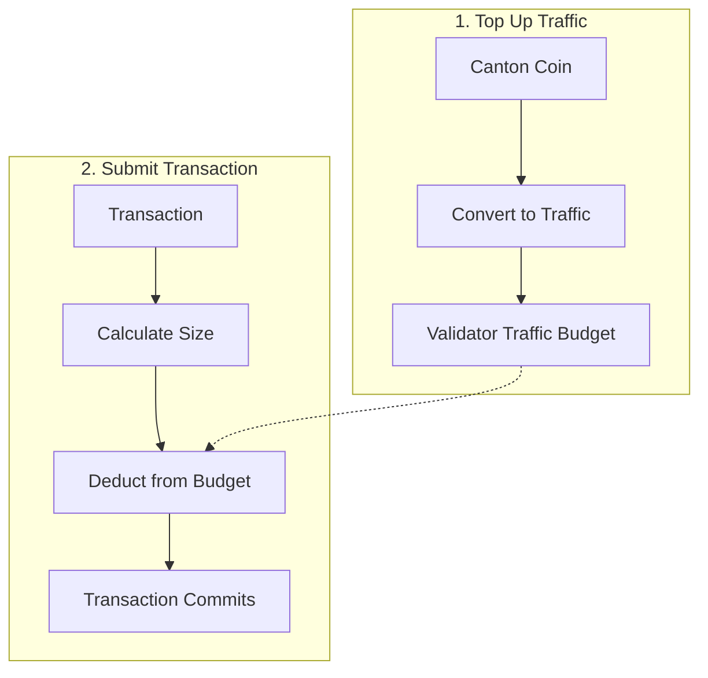

> **출처(원문)**: [Canton Coin and the Global Synchronizer](https://docs.canton.network/overview/understand/canton-coin) · 번역일 2026-06-15

## 📌 개발자 노트
- **한 줄 요약**: <abbr class="gloss" title="트랜잭션 수수료와 밸리데이터 보상에 쓰이는 네이티브 유틸리티 토큰(CC)">Canton Coin</abbr>(CC)은 <abbr class="gloss" title="슈퍼 밸리데이터들이 공동 운영하는 Canton의 퍼블릭 조율(합의) 계층">글로벌 Synchronizer</abbr>의 네이티브 유틸리티 토큰. <abbr class="gloss" title="Synchronizer에 쓰기를 요청할 때 소비하는 자원. Canton Coin으로 비용을 지불">트래픽</abbr>(수수료)의 2단계(충전→소비) 메커니즘, CC 획득 방법(환경별), <abbr class="gloss" title="파티를 호스팅하고 그 파티의 컨트랙트 데이터를 저장하는 참여자 노드">밸리데이터</abbr> 보상, 토크노믹스, 잔액이 비공개인 점까지.
- **핵심 용어**: Canton Coin(CC), 트래픽 크레딧·트래픽 예산, 자동 충전(auto-top-up), 라이브니스 보상, <abbr class="gloss" title="글로벌 Synchronizer를 구동하는 오픈소스 애플리케이션 모음(SV·밸리데이터·월렛 등)">Splice</abbr>
- **선행 개념**: [글로벌 Synchronizer](global-synchronizer.md). 다음 → [CIP 소개](cips-introduction.md)

---

# Canton Coin과 글로벌 Synchronizer

> 네트워크 경제에서 Canton Coin의 역할 이해

Canton Coin(CC)은 글로벌 <abbr class="gloss" title="상태를 저장하지 않고 트랜잭션 합의·순서를 조율하는 Canton 구성요소">Synchronizer</abbr>의 네이티브 유틸리티 토큰으로, 네트워크 운영의 경제적 토대를 제공한다.

## Canton Coin이란?

Canton Coin은 다음에 쓰이는 네이티브 토큰이다:

| 용도 | 설명 |
| --- | --- |
| **<abbr class="gloss" title="원장 상태를 바꾸는 원자적 작업 단위. 하나 이상의 컨트랙트를 생성·보관하며, 전부 적용되거나 전혀 적용되지 않음">트랜잭션</abbr> 수수료(트래픽)** | 트랜잭션 제출 시 네트워크 사용료 지불 |
| **밸리데이터 보상** | 인프라 운영자에게 인센티브 |
| **거버넌스** | <abbr class="gloss" title="글로벌 Synchronizer를 운영하고 네트워크 거버넌스에 참여하는 노드">슈퍼 밸리데이터</abbr>가 참여를 위해 CC를 스테이킹 |

Canton Coin은 탈중앙화 Canton Synchronizer를 위한 오픈소스 인프라인 [Splice](https://github.com/canton-network/splice)를 통해 구현된다.

## 트래픽: 트랜잭션 수수료

"트래픽(Traffic)"은 트랜잭션 수수료를 가리키는 Canton 용어다. 글로벌 Synchronizer에서 거래하려면 밸리데이터의 트래픽 예산(traffic budget)에 트래픽 크레딧이 필요하다.

**2단계 과정:**

1. **충전(Top up)**: Canton Coin을 트래픽 크레딧으로 변환해 밸리데이터의 트래픽 예산에 추가
2. **소비(Consume)**: 트랜잭션이 제출되면 예산에서 트래픽 크레딧이 차감됨

트래픽 크레딧은 양도 불가다 — CC가 트래픽으로 변환되면 트랜잭션 수수료 지불에만 쓸 수 있다.

### 트래픽 작동 방식

트래픽 비용은 다음에 좌우된다:

| 요인 | 영향 |
| --- | --- |
| **트랜잭션 크기** | 클수록 비용 증가 |
| **연산 복잡도** | 복잡할수록 비용 증가 |
| **네트워크 수요** | 네트워크 부하에 따라 변동 가능 |

### 트래픽 관리

당신의 트랜잭션이 처리될 수 있도록:

1. 밸리데이터의 트래픽 예산에 **트래픽 크레딧 유지**
2. 예산이 부족해지면 CC를 트래픽 크레딧으로 변환해 **충전**
3. 비용 계획을 위해 **사용량 모니터링**

> **참고:** 밸리데이터의 트래픽 예산이 소진되면 트랜잭션이 실패한다. 밸리데이터는 잔액이 임계값 아래로 떨어질 때 CC를 트래픽 크레딧으로 자동 변환하는 자동 충전(auto-top-up)을 구성할 수 있다.

## Canton Coin 얻기

CC를 얻는 방법은 환경에 따라 다르다:

| 환경 | 방법 |
| --- | --- |
| **LocalNet** | 자동으로 사용 가능 (테스트 CC) |
| **DevNet** | 포셋("tapping")이 테스트 CC 제공 |
| **TestNet** | 포셋이 테스트 CC 제공 |
| **MainNet** | 구매 또는 네트워크 활동으로 획득 |

### DevNet/TestNet 포셋

테스트 네트워크에서는 무료 테스트 CC를 "탭(tap)"할 수 있다:

1. 월렛 인터페이스 접근
2. 탭/포셋 기능 사용
3. 테스트 CC 수령 (실제 가치 없음)

테스트 CC는 속도 제한이 있고 경제적 가치가 없다.

### MainNet 획득

MainNet에서 CC는 실제 경제 가치를 갖는다:

| 방법 | 설명 |
| --- | --- |
| **거래소** | 지원 거래소에서 구매 |
| **네트워크 활동** | 밸리데이터 운영으로 획득 |
| **직접 이전** | 다른 <abbr class="gloss" title="Canton에서 권한과 데이터 가시성의 주체가 되는 식별 가능한 참여 주체">파티</abbr>로부터 수령 |

## 밸리데이터 보상

글로벌 Synchronizer에서 운영하는 밸리데이터는 다음으로 CC를 벌 수 있다:

| 보상 유형 | 설명 |
| --- | --- |
| **라이브니스 보상(Liveness rewards)** | 노드 가용성 유지에 대해 |
| **트랜잭션 보상** | 트래픽 수수료의 몫 |

슈퍼 밸리데이터는 Synchronizer 인프라 운영에 대한 추가 보상 메커니즘을 갖는다.

## 토크노믹스

글로벌 Synchronizer의 토크노믹스는 다음을 위해 설계되었다:

| 목표 | 메커니즘 |
| --- | --- |
| **인프라 지속** | 운영자에 대한 보상 |
| **공정한 가격 보장** | 시장 주도 트래픽 비용 |
| **거버넌스 정렬 촉진** | 스테이크 기반 참여 |
| **네트워크 성장 촉진** | 도입 인센티브 |

상세 토크노믹스는 [canton.foundation](https://canton.foundation)을 참고하라.

## Canton Coin vs. 다른 암호화폐

| 측면 | Canton Coin | 다른 L1 토큰 |
| --- | --- | --- |
| **주된 용도** | 네트워크 유틸리티 | 다양 |
| **프라이버시** | 잔액 비공개 | 종종 공개 |
| **보유자 가시성** | 권한 있는 파티에게만 | 공개 |
| **트랜잭션 수수료** | 트래픽 지불 | 가스 지불 |

### 보유의 프라이버시

잔액이 공개되는 대부분의 암호화폐와 달리:

* 당신의 CC 잔액은 당신과 권한 있는 파티에게만 보임
* 이전 상세는 송신자와 수신자 사이에서 사적
* 공개 부자 목록(rich list)이나 잔액 조회 없음

## 통합 고려사항

### 애플리케이션 개발자용

| 고려사항 | 접근 |
| --- | --- |
| **트래픽 추정** | 사용자 연산의 비용 추정 |
| **충전 흐름** | 자동 또는 사용자 트리거 충전 구축 |
| **오류 처리** | 잔액 부족을 우아하게 처리 |
| **사용자 커뮤니케이션** | 트래픽 비용을 사용자에게 알림 |

### 밸리데이터용

| 고려사항 | 접근 |
| --- | --- |
| **트래픽 예산 모니터링** | 호스팅 파티의 트래픽 크레딧 잔액 추적 |
| **자동 충전** | 예산이 낮을 때 CC → 트래픽 자동 변환 구성 |
| **보상 관리** | 획득한 CC 보상 처리 |

## 다음 단계

* **[사용자용 월렛](https://docs.canton.network/integrations/wallets/for-users)** — Canton Coin 관리.
* **[밸리데이터 운영](https://docs.canton.network/global-synchronizer/understand/introduction)** — 운영하고 보상 획득.

<!-- nav:start -->

---

➡️ **다음**: [Canton의 해법 — 세 가지 기둥](cantons-solution.md)

<!-- nav:end -->
