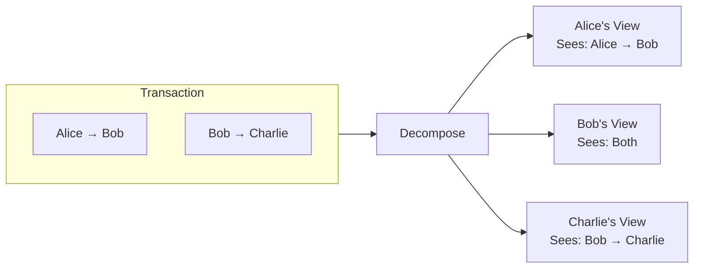
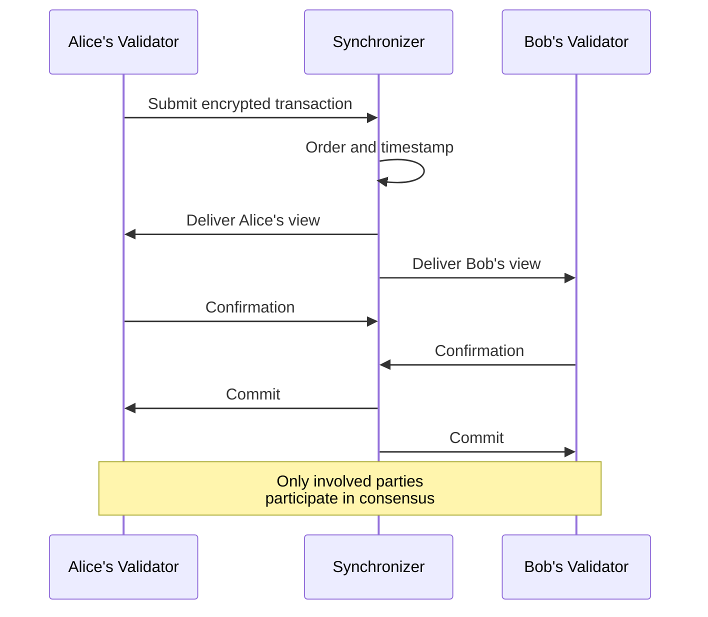
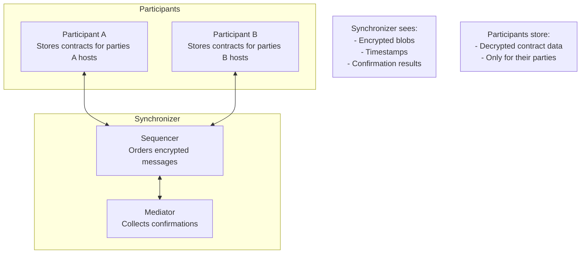
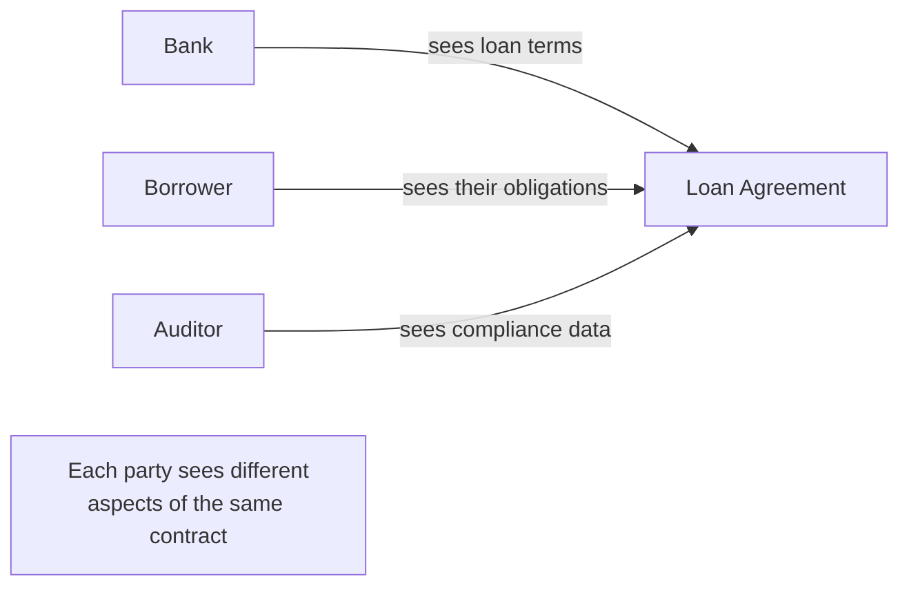

> **출처(원문)**: [Canton's Solution: Three Pillars](https://docs.canton.network/overview/understand/cantons-solution) · 번역일 2026-06-15

## 📌 개발자 노트
- **한 줄 요약**: Canton은 ①<abbr class="gloss" title="한 트랜잭션을 &quot;뷰&quot;로 분해해, 각 파티가 자신과 관련된 부분만 보도록 하는 Canton의 핵심 프라이버시 방식">부분 트랜잭션 프라이버시</abbr> ②이해관계자 합의 증명 ③가시성 없는 동기화 — 세 기둥으로 프라이버시와 무결성을 동시에 달성한다.
- **핵심 용어**: 뷰(view) 분해, 이해관계자 합의(Proof of stakeholder), <abbr class="gloss" title="상태를 저장하지 않고 트랜잭션 합의·순서를 조율하는 Canton 구성요소">동기화자</abbr>(Synchronizer), 시퀀서(Sequencer)·미디에이터(Mediator), 컨트롤러(controller)
- **선행 개념**: [Canton이 푸는 문제](the-problem.md). 다음 → [핵심 개념](https://docs.canton.network/overview/understand/core-concepts)

---

# Canton의 해법: 세 가지 기둥

> 무결성을 희생하지 않고 프라이버시를 달성하는 방법

Canton은 함께 작동하는 세 가지 아키텍처 기둥을 통해 프라이버시-무결성 트레이드오프를 해소하며, 강력한 프라이버시 보장과 블록체인급 무결성을 모두 제공한다.

## 기둥 1: 부분 트랜잭션 프라이버시

Canton의 핵심 혁신은 **부분 트랜잭션 프라이버시(sub-transaction privacy)** 다. 이것은 두 수준에서 작동한다:

1. **트랜잭션 격리**: 서로 다른 트랜잭션은 완전히 분리된다 — 무관한 당사자는 다른 트랜잭션이 존재하는지조차 모른다
2. **뷰 분해(View decomposition)**: 단일 트랜잭션 내에서, 서로 다른 당사자는 자신과 관련된 부분만 본다

### 뷰가 작동하는 방식

트랜잭션이 여러 당사자를 포함할 때, Canton은 전체 트랜잭션을 모두에게 보내지 않는다. 대신:

1. **분해(Decomposition)**: 트랜잭션이 이해관계자 관계에 따라 여러 뷰로 분할된다
2. **암호화(Encryption)**: 각 뷰는 특정 수신자를 위해 암호화된다
3. **분배(Distribution)**: 동기화자는 각 참여자에게 권한 있는 뷰만 전달한다
4. **검증(Validation)**: 각 참여자는 자신의 뷰를 독립적으로 검증한다
5. **확인(Confirmation)**: 참여자는 자신의 뷰만으로 확인한다

이 예에서, 하나의 원자적 트랜잭션이 Alice → Bob → Charlie로 가치를 이동시킨다. 하지만 Alice는 Charlie를 결코 알지 못하고, Charlie는 Alice를 결코 알지 못한다.

### 각 당사자가 보는 것

| 당사자 | 보는 것 | 보지 못하는 것 |
| --- | --- | --- |
| **Alice** | Bob에게의 자기 지불 | Bob의 Charlie에게의 지불; Charlie의 신원 |
| **Bob** | 두 지불 모두 (둘 다 관여) | 숨겨진 것 없음 |
| **Charlie** | Bob으로부터의 수취 | Alice의 관여; 원래 출처 |
| **동기화자** | 암호화된 메시지만 | 어떤 트랜잭션 내용도 보지 못함 |

이것은 단지 데이터를 숨기는 것이 아니라, 정보 흐름에 대해 **수학적으로 강제되는 경계**를 제공하는 것이다.

## 기둥 2: 이해관계자 합의 증명 (Proof of Stakeholder Consensus)

전통적 블록체인은 모든 <abbr class="gloss" title="파티를 호스팅하고 그 파티의 컨트랙트 데이터를 저장하는 참여자 노드">밸리데이터</abbr>가 모든 트랜잭션을 검증할 것을 요구한다. Canton은 다른 접근을 쓴다: **트랜잭션의 이해관계자만 그것을 확인하면 된다.**

### 왜 이것이 작동하는가

생각해 보자: 밸리데이터가 자신이 참여하지 않는 트랜잭션을 왜 검증해야 하는가?

전통적 블록체인에서 밸리데이터는 이중지불을 막고 규칙 준수를 보장하기 위해 모든 것을 검증한다. 그러나 어떤 트랜잭션이 Alice와 Bob에게만 영향을 준다면, Alice와 Bob만 그것을 검증하면 된다. 다음 조건이 충족되는 한:

* Alice의 밸리데이터가 Alice가 트랜잭션을 승인했음을 확인한다
* Bob의 밸리데이터가 Bob이 받기로 한 것을 받고 있음을 확인한다
* 양측이 트랜잭션이 유효하다는 데 동의한다

그러면 트랜잭션은 유효하다. Charlie의 밸리데이터는 그것을 보거나, 검증하거나, 존재한다는 것조차 알 필요가 없다.

### 전역 가시성 없는 무결성

이 접근이 무결성을 유지하는 이유:

* **이중지불 방지**: Alice의 밸리데이터는 Alice의 <abbr class="gloss" title="원장에 기록되는 불변 데이터 단위. 상태 변경은 새 컨트랙트 생성으로 표현됨">컨트랙트</abbr>를 추적한다; 존재하지 않는 것은 쓸 수 없다; 그리고 평판 있는 토큰의 예에서는 발행에 발행자의 승인이 필요하다.
* **권한 강제**: 컨트롤러로 선언된 당사자만 <abbr class="gloss" title="컨트랙트에서 수행 가능한 동작(권한이 부여된 당사자만 실행 가능)">초이스</abbr>를 실행할 수 있다
* **일관성**: 동기화자는 모든 당사자가 일관된 이벤트 순서를 보도록 보장한다
* **원자성(Atomicity)**: 관련된 모든 당사자가 확인하거나, 아니면 트랜잭션이 거부된다

## 기둥 3: 가시성 없는 동기화

**동기화자**(시퀀서 + 미디에이터 노드)는 트랜잭션 내용을 보지 않고 트랜잭션 순서와 확인을 동기화한다.

### 동기화자가 하는 일

| 기능 | 설명 |
| --- | --- |
| **순서화(Ordering)** | 트랜잭션·이벤트에 타임스탬프와 전체 순서를 부여 |
| **분배(Distribution)** | 암호화된 뷰를 권한 있는 참여자에게 라우팅 |
| **중재(Mediation)** | 확인을 수집하고 결과를 선언 |
| **일관성(Consistency)** | 모든 참여자가 같은 순서를 보도록 보장 |

### 동기화자가 할 수 없는 일

| 한계 | 보장 |
| --- | --- |
| **내용 읽기** | 암호화된 뷰만 본다 |
| **최종 사용자 식별** | 라우팅을 위해 <abbr class="gloss" title="Canton에서 권한과 데이터 가시성의 주체가 되는 식별 가능한 참여 주체">파티</abbr>는 알지만, 그 뒤의 사람/시스템은 모른다 |
| **트랜잭션 수정** | 통과시키거나 거부만 할 수 있다 |
| **상태 저장** | 영속적 트랜잭션 데이터 없음 |

### 신뢰 모델

동기화자의 제한된 능력은 한계가 아니라 **기능**이다:

* 데이터에 관해 **동기화자를 신뢰할 필요가 없다** — 읽을 수 없기 때문이다
* 순서화와 가용성에 대해서는 **동기화자를 신뢰한다**
* 동기화자는 자신이 동기화하는 것을 볼 수 없으므로 **부정행위를 할 수 없다**

이러한 관심사의 분리가 의미하는 바:

* 프라이버시는 정책이 아니라 암호학적으로 강제된다
* 동기화자 운영자는 트랜잭션 정보를 추출할 수 없다
* 동기화자 운영자를 더 추가해도 데이터 노출이 늘지 않는다

## 세 기둥이 함께 작동하는 방식

세 기둥은 상호 의존적이다:

| 기둥 | 가능하게 하는 것 |
| --- | --- |
| **부분 트랜잭션 프라이버시** | 독립적으로 검증 가능한 뷰 |
| **이해관계자 증명** | 전역 가시성 없는 합의 |
| **가시성 없는 동기화** | 데이터 노출 없는 순서화 |

이들이 함께, 다음과 같은 시스템을 만든다:

1. 각 당사자는 자신의 뷰만 받는다
2. 각 당사자는 자신의 뷰만 검증한다
3. 동기화자는 어떤 뷰도 보지 않는다
4. 모든 이해관계자가 확인하면 트랜잭션이 원자적으로 커밋된다

## 실세계 영향

이 아키텍처는 전통적 블록체인에서는 불가능한 활용 사례를 가능하게 한다:

### 기밀 다자간 워크플로

여러 조직이 각자 자기 부분만 보는 워크플로를 공유할 수 있다:

### 프라이버시 보존 정산

거래 당사자가 관찰자에게 가격을 노출하지 않고 정산한다:

* 매수자가 보는 것: 받은 자산, 지불한 대금
* 매도자가 보는 것: 이전한 자산, 받은 대금
* 시장: 가격이나 당사자를 볼 수 없음

### 규제 준수

공유된 진실을 유지하면서 데이터 보호 요건을 충족:

* 데이터는 권한 있는 당사자에게 머문다
* 감사 권한이 있는 자를 위한 감사 추적이 존재한다
* 국경 간 데이터 흐름이 최소화된다

## 다음 단계

* **[활용 사례](https://docs.canton.network/overview/understand/use-cases)** — Canton이 실제로 동작하는 구체적 예시.
* **[핵심 개념](https://docs.canton.network/overview/understand/core-concepts)** — 파티, 밸리데이터, 동기화자에 대해 학습.
* **[아키텍처 심층 분석](https://docs.canton.network/overview/learn/architecture)** — 구성 요소가 기술적으로 함께 작동하는 방식 이해.
* **[프라이버시 모델](https://docs.canton.network/overview/learn/privacy-model)** — 프라이버시 보장을 상세히 탐구.
