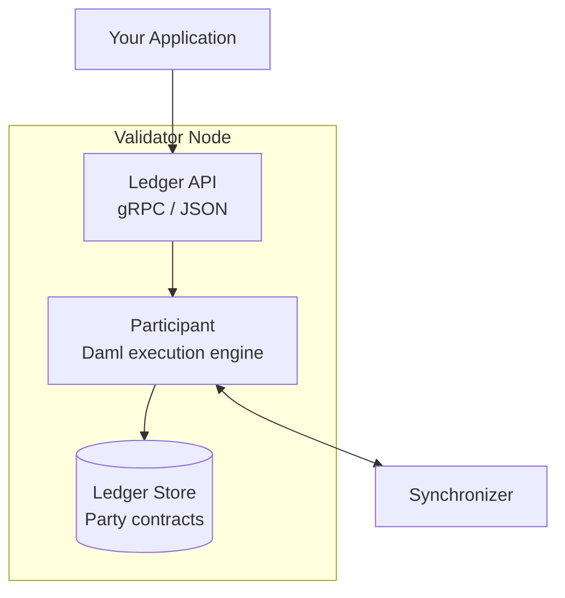
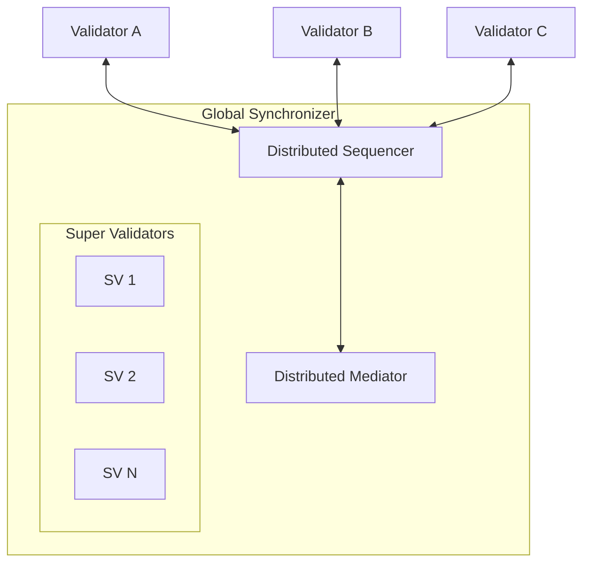
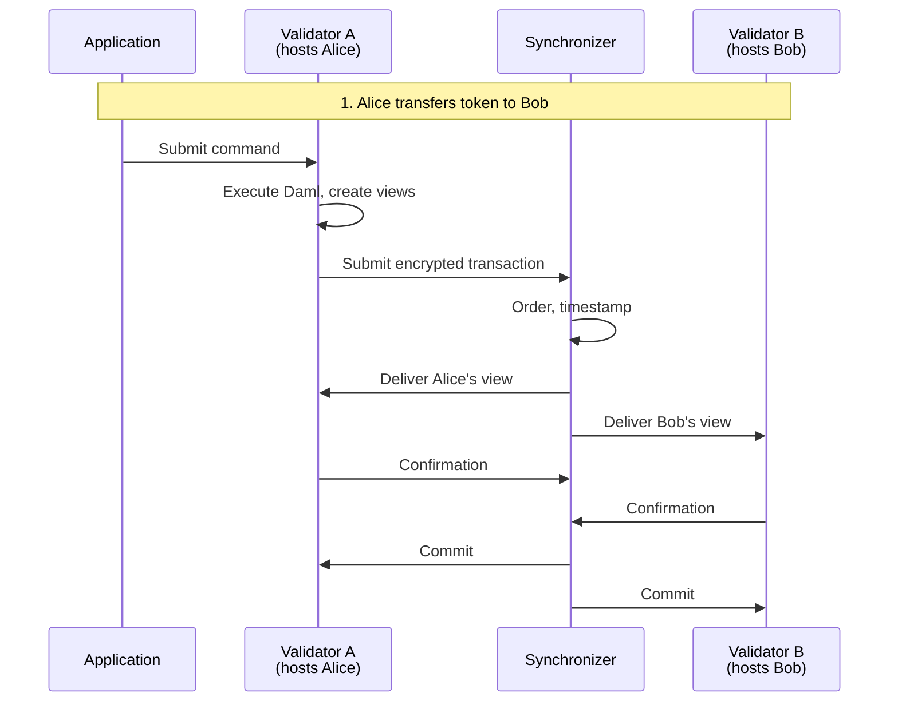

> **출처(원문)**: [Core Concepts](https://docs.canton.network/overview/understand/core-concepts) · 번역일 2026-06-15

## 📌 개발자 노트
- **한 줄 요약**: Canton을 이루는 네 가지 기본 개념 — <abbr class="gloss" title="Canton에서 권한과 데이터 가시성의 주체가 되는 식별 가능한 참여 주체">파티</abbr>, <abbr class="gloss" title="파티를 호스팅하고 그 파티의 컨트랙트 데이터를 저장하는 참여자 노드">밸리데이터</abbr>, <abbr class="gloss" title="상태를 저장하지 않고 트랜잭션 합의·순서를 조율하는 Canton 구성요소">동기화자</abbr>, <abbr class="gloss" title="컨트랙트의 구조와 규칙(권한·초이스)을 정의하는 Daml 청사진">템플릿</abbr>(스마트 <abbr class="gloss" title="원장에 기록되는 불변 데이터 단위. 상태 변경은 새 컨트랙트 생성으로 표현됨">컨트랙트</abbr>) — 을 소개하고 이들이 트랜잭션 흐름에서 어떻게 맞물리는지 설명.
- **핵심 용어**: 파티(Party), 밸리데이터(Validator), 동기화자(Synchronizer), 템플릿(template)·<abbr class="gloss" title="컨트랙트에서 수행 가능한 동작(권한이 부여된 당사자만 실행 가능)">초이스</abbr>(choice), 서명자/관찰자/컨트롤러, 활성 컨트랙트 집합(Active Contract Set)
- **선행 개념**: [5분 만에 보는 Canton Network](five-minute-overview.md). 다음 → [활용 사례](use-cases.md)

---

# 핵심 개념

> Canton Network의 필수 빌딩 블록: 파티, 밸리데이터, 동기화자, 스마트 컨트랙트

Canton을 이해하려면 네 가지 기본 개념을 파악해야 한다: **파티(parties)**, **밸리데이터(validator)** 노드, **동기화자(synchronizers)**, **템플릿(templates)**(스마트 컨트랙트). 이 페이지는 각각을 소개하고 이들이 어떻게 함께 작동하는지 설명한다.

## 파티 (Parties)

**파티**는 Canton의 온-원장(on-ledger) 신원으로, 다른 블록체인의 주소나 계정과 유사하지만 명시적 권한 의미론(authorization semantics)을 갖는다.

### 파티 식별자 형식

```
alice::1220f2fe29866fd6a0009ecc8a64ccdc09f1958bd0f801166baaee469d1251b2eb72
└┬┘  └─────────────────────────────────────────┘
name                                fingerprint (hash of public key)
```

### 파티가 하는 일

| 능력 | 설명 |
| --- | --- |
| **서명(Sign)** | 컨트랙트 생성 승인 (서명자로서) |
| **행위(Act)** | 컨트랙트에서 초이스 실행 (컨트롤러로서) |
| **관람(See)** | 컨트랙트와 트랜잭션 관찰 (이해관계자로서) |
| **검증(Validate)** | 자신의 컨트랙트에 영향을 주는 트랜잭션 확인 |

### 로컬 파티 vs. 외부 파티

| 유형 | 키 보유자 | 활용 사례 |
| --- | --- | --- |
| **로컬 파티(Local Party)** | 밸리데이터 | 더 단순함; 밸리데이터가 파티를 대신해 서명. 자동화에 적합. |
| **외부 파티(External Party)** | 외부 시스템 | 사용자 월렛; 명시적 서명 워크플로 필요 |

> **참고:** Ethereum 주소와 달리, 파티는 밸리데이터에 상태를 생성하며 생성에 비용이 따른다. 파티 구조를 신중하게 설계하라 — 불필요하게 파티를 만들지 말 것.

### 컨트랙트에서의 파티 역할

파티는 세 가지 역할로 컨트랙트와 상호작용한다:

```haskell
template Asset
  with
    issuer : Party   -- Will be signatory
    owner : Party    -- Will be observer and controller
    auditor : Party  -- Will be observer
  where
    signatory issuer        -- Must authorize creation; always sees contract
    observer owner, auditor -- Can see contract

    choice Transfer : ContractId Asset
      with newOwner : Party
      controller owner      -- Only owner can exercise this choice
      do create this with owner = newOwner
```

| 역할 | 생성 가능 | 관람 가능 | 행위 가능 |
| --- | --- | --- | --- |
| **서명자(Signatory)** | 승인해야 함 | 항상 | 컨트롤러이기도 하면 |
| **관찰자(Observer)** | 아니오 | 예 | 컨트롤러이기도 하면 |
| **컨트롤러(Controller)** | 아니오 | 실행할 때 | 예 (특정 초이스) |

> **참고:** **이해관계자(Stakeholder)** = 서명자 + 관찰자. 이해관계자는 컨트랙트를 볼 수 있는 모든 파티다. 밸리데이터는 자신이 호스팅하는 파티가 이해관계자일 때 그 컨트랙트를 저장한다.

## 밸리데이터 (참여자 노드)

**밸리데이터**는 파티를 호스팅하고, 그들의 컨트랙트 데이터를 저장하며, Canton 프로토콜에 참여한다. 밸리데이터는 참여자 노드(participant node, <abbr class="gloss" title="다자간 워크플로를 위해 설계된 Canton의 스마트 컨트랙트 언어">Daml</abbr> 실행 엔진)와 밸리데이터 프로세스로 구성된다.

### 밸리데이터가 하는 일

| 기능 | 설명 |
| --- | --- |
| **파티 호스팅** | 호스팅하는 파티의 컨트랙트 저장 |
| **Daml 실행** | 스마트 컨트랙트 로직 실행 |
| **트랜잭션 검증** | 권한과 정확성 확인 |
| **API 노출** | 애플리케이션을 위한 Ledger API 제공 |

### 밸리데이터 아키텍처



### 주요 특성

* 각 밸리데이터는 원장의 **국소적·사적 뷰**(*활성 컨트랙트 집합, Active Contract Set*이라 부름)를 유지한다
* 밸리데이터는 자신이 호스팅하는 파티가 이해관계자인 컨트랙트만 저장한다
* 하나의 밸리데이터에 여러 파티를 호스팅할 수 있다
* 밸리데이터는 여러 동기화자에 연결할 수 있다
* 하나의 파티는 여러 밸리데이터에 호스팅될 수 있다

> ⚠️ **주의:** 당신을 호스팅하는 밸리데이터는 당신의 모든 데이터를 본다. 밸리데이터를 신중히 선택하라 — 이것은 신뢰 관계다.

## 동기화자 (Synchronizers)

**동기화자**는 트랜잭션 내용을 보지 않고 트랜잭션 순서와 합의를 조율한다. 두 구성 요소로 이루어진다:

### 시퀀서 (Sequencer)

시퀀서는 메시지를 정렬하고 분배한다:

| 기능 | 설명 |
| --- | --- |
| **순서화(Order)** | 타임스탬프와 전체 순서 부여 |
| **분배(Distribute)** | 암호화된 메시지를 수신자에게 라우팅 |
| **일관성(Consistency)** | 모든 참여자가 같은 순서를 보도록 보장 |

시퀀서가 **하지 않는** 것:

* 메시지 복호화
* 트랜잭션 내용 관람
* 트랜잭션 데이터 영구 저장 (캐시는 할 수 있음)
* 어떤 최종 사용자가 관여하는지 파악 (파티 정보로 라우팅은 함)

### 미디에이터 (Mediator)

미디에이터는 트랜잭션을 확인하는 합의 프로토콜을 촉진한다:

| 기능 | 설명 |
| --- | --- |
| **수집(Collect)** | 참여자로부터 확인을 모음 |
| **집계(Aggregate)** | 합의 임계값 충족 여부 판단 |
| **선언(Declare)** | 트랜잭션 결과 발표 (커밋/거부) |

미디에이터가 **하지 않는** 것:

* 트랜잭션 내용 관람
* 무엇이 확인되는지 파악
* 확인 상세 저장

### 글로벌 동기화자

**<abbr class="gloss" title="슈퍼 밸리데이터들이 공동 운영하는 Canton의 퍼블릭 조율(합의) 계층">글로벌 동기화자</abbr>**는 Canton Network의 퍼블릭 동기화자다:



* **<abbr class="gloss" title="글로벌 동기화자를 운영하고 네트워크 거버넌스에 참여하는 노드">슈퍼 밸리데이터</abbr>**(주요 기관)가 운영
* 탈중앙화 — 단일 운영자가 통제하지 않음
* 트랜잭션 수수료를 내기 위한 트래픽 구매에 **<abbr class="gloss" title="트랜잭션 수수료와 밸리데이터 보상에 쓰이는 네이티브 유틸리티 토큰(CC)">Canton Coin</abbr> (CC)** 사용
* **Canton Foundation**이 거버넌스를 담당

## 스마트 컨트랙트 (템플릿)

Canton의 스마트 컨트랙트는 다자간 워크플로를 위해 특별히 설계된 언어인 **Daml**로 정의된다. Daml **템플릿**은 보통 다음을 정의한다:

* **데이터(Data)**: 컨트랙트가 담는 정보
* **파티(Parties)**: 컨트랙트를 보고 행위할 수 있는 자
* **초이스(Choices)**: 가능한 동작

### 템플릿 구조

```haskell
template Token
  with
    -- Data fields
    owner : Party
    issuer : Party
    amount : Decimal
  where
    -- Authorization
    signatory issuer
    observer owner

    -- Actions
    choice Transfer : ContractId Token
      with
        newOwner : Party
      controller owner
      do
        create this with owner = newOwner
```

### 컨트랙트는 불변이다

가변 상태를 갖는 Solidity 컨트랙트와 달리, Daml 컨트랙트(템플릿 인스턴스)는 불변이다. `created`(생성) 또는 `archived`(보관)만 가능하다.

| Solidity | Daml |
| --- | --- |
| 상태를 제자리에서 수정 | 기존 컨트랙트 보관, 새 컨트랙트 생성 |
| `balances[addr] = newValue` | `create Token with owner = newOwner` |
| 상태 이력 암묵적 | 상태 이력이 컨트랙트로 명시적 |

이 불변성이 Canton의 프라이버시·무결성 보장의 핵심이다.

### 초이스: 소비형 vs. 비소비형

| 유형 | 효과 | 활용 사례 |
| --- | --- | --- |
| **소비형(Consuming)** | 컨트랙트를 보관(archive) | 상태 전이, 이전(transfer) |
| **비소비형(Non-consuming)** | 컨트랙트가 활성 유지 | 조회, 읽기 연산, 수신 클라이언트용 이벤트 |

```haskell
-- Consuming: archives the contract
choice Transfer : ContractId Token
  controller owner
  do create this with owner = newOwner

-- Non-consuming: contract stays active
nonconsuming choice GetBalance : Decimal
  controller owner
  do return amount
```

## 구성 요소가 함께 작동하는 방식

완전한 트랜잭션 흐름은 네 개념 모두를 포함한다:



| 단계 | 구성 요소 | 동작 |
| --- | --- | --- |
| 1 | **애플리케이션** | Ledger API로 커맨드 제출 |
| 2 | **밸리데이터 A** | Daml 실행, 트랜잭션 뷰 생성 |
| 3 | **동기화자** | 암호화된 뷰 순서화·분배 |
| 4 | **밸리데이터들** | 각자의 뷰 검증 |
| 5 | **동기화자** | 확인 수집, 커밋 선언 |
| 6 | **밸리데이터들** | 커밋된 컨트랙트 저장 |

## 요약 표

| 개념 | 무엇인가 | 핵심 속성 |
| --- | --- | --- |
| **파티(Party)** | 온-원장 신원 | 명시적 권한 역할을 가짐 |
| **밸리데이터(Validator)** | 파티를 호스팅하는 노드 | 호스팅 파티의 데이터만 저장 |
| **동기화자(Synchronizer)** | 조율 계층 | 내용을 보지 않고 순서화 |
| **템플릿(Template)** | 스마트 컨트랙트 정의 | 데이터·파티·초이스를 정의 |
| **컨트랙트(Contract)** | 템플릿 인스턴스 | 불변; 변경은 새 컨트랙트를 생성 |

## 다음 단계

* **[아키텍처 심층 분석](https://docs.canton.network/overview/learn/architecture)** — 구성 요소가 기술적으로 함께 작동하는 방식 보기.
* **[글로벌 동기화자](https://docs.canton.network/overview/understand/global-synchronizer)** — 퍼블릭 조율 계층 학습.
* **[프라이버시 모델](https://docs.canton.network/overview/learn/privacy-model)** — <abbr class="gloss" title="한 트랜잭션을 &quot;뷰&quot;로 분해해, 각 파티가 자신과 관련된 부분만 보도록 하는 Canton의 핵심 프라이버시 방식">부분 트랜잭션 프라이버시</abbr> 상세 이해.
* **[구축 시작하기](https://docs.canton.network/appdev/get-started/choose-your-path)** — Canton 개발 시작.

<!-- nav:start -->
---
<sub>⬅️ **이전**: [Canton 개선 제안 (CIP) 소개](cips-introduction.md) ・ ➡️ **다음**: [5분 만에 보는 Canton Network](five-minute-overview.md)</sub>
<!-- nav:end -->
