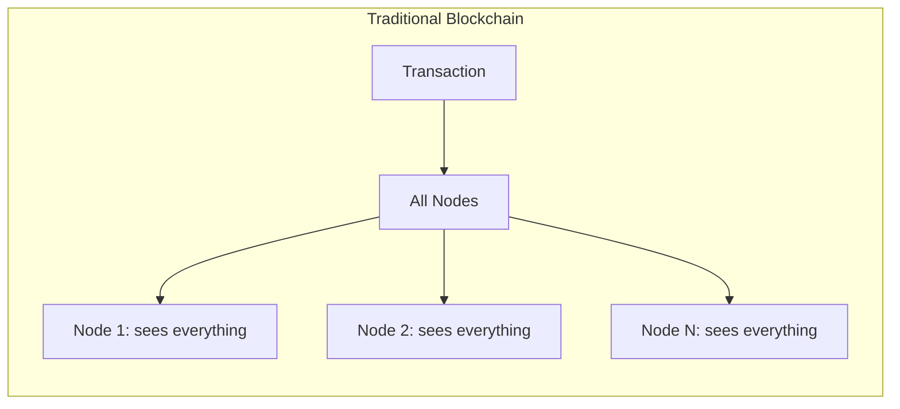
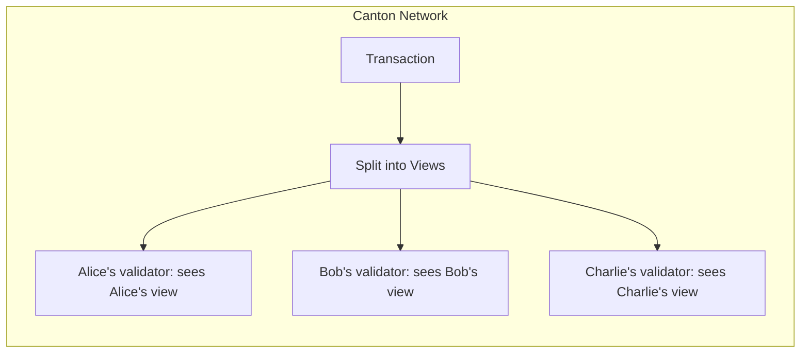
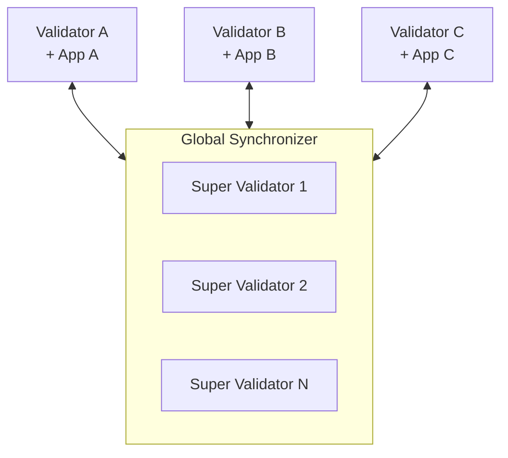

> **출처(원문)**: [Canton Network in 5 Minutes](https://docs.canton.network/overview/understand/five-minute-overview) · 번역일 2026-06-15

## 📌 개발자 노트
- **한 줄 요약**: "데이터는 필요한 곳에만 간다"는 핵심 통찰로 Canton을 5분 만에 훑는 페이지 — <abbr class="gloss" title="한 트랜잭션을 &quot;뷰&quot;로 분해해, 각 파티가 자신과 관련된 부분만 보도록 하는 Canton의 핵심 프라이버시 방식">부분 트랜잭션 프라이버시</abbr>, <abbr class="gloss" title="상태를 저장하지 않고 트랜잭션 합의·순서를 조율하는 Canton 구성요소">Synchronizer</abbr>, <abbr class="gloss" title="다자간 워크플로를 위해 설계된 Canton의 스마트 컨트랙트 언어">Daml</abbr>의 프라이버시 선언, 네트워크 구성, 타 블록체인과의 차이까지.
- **핵심 용어**: <abbr class="gloss" title="한 트랜잭션을 당사자별로 나눈 조각. 각 당사자는 자기 권한에 해당하는 뷰(자기 몫)만 받아 본다">뷰</abbr>(view), <abbr class="gloss" title="컨트랙트의 주된 권한자. 생성·보관(소비)에 반드시 동의해야 하는 파티">서명자</abbr>(signatory)·<abbr class="gloss" title="컨트랙트를 볼 수 있으나 단독으로 행위할 수는 없는 파티">관찰자</abbr>(observer)·<abbr class="gloss" title="컨트랙트의 특정 초이스(동작)를 실행할 권한을 가진 파티">컨트롤러</abbr>(controller), <abbr class="gloss" title="슈퍼 밸리데이터들이 공동 운영하는 Canton의 퍼블릭 조율(합의) 계층">글로벌 Synchronizer</abbr>, <abbr class="gloss" title="트랜잭션 수수료와 밸리데이터 보상에 쓰이는 네이티브 유틸리티 토큰(CC)">Canton Coin</abbr>
- **선행 개념**: [Canton Network이란?](what-is-canton.md). 다음 → [핵심 개념](core-concepts.md)

---

# 5분 만에 보는 Canton Network

> 프라이버시 보존 블록체인에 대한 Canton Network의 접근을 빠르게 소개

Canton Network은 근본적인 문제를 푸는 퍼블릭 블록체인이다: 민감한 데이터를 모두에게 노출하지 않으면서 블록체인의 이점(공유된 진실, 자동화, 감사 가능성)을 어떻게 얻을 것인가?

## 핵심 통찰

전통적 블록체인은 모든 데이터를 모든 노드에 복제한다. 이는 강력한 무결성 보장을 제공하지만, 추가 계층 없이는 프라이버시를 막는다.

Canton은 이 모델을 뒤집는다: **데이터는 가야 할 곳에만 간다.** 각 <abbr class="gloss" title="Canton에서 권한과 데이터 가시성의 주체가 되는 식별 가능한 참여 주체">파티</abbr>는 자신이 볼 권한이 있는 것만 보지만, 시스템은 완전 복제 블록체인과 동일한 무결성 보장을 유지한다.





## 어떻게 달성하는가

Canton은 세 가지 핵심 혁신으로 이를 달성한다:

### 1. 부분 트랜잭션 프라이버시

<abbr class="gloss" title="원장 상태를 바꾸는 원자적 작업 단위. 하나 이상의 컨트랙트를 생성·보관하며, 전부 적용되거나 전혀 적용되지 않음">트랜잭션</abbr>은 **뷰(view)** 로 분해된다. 각 파티는 자신의 역할(서명자signatory, 관찰자observer, 컨트롤러controller)에 따라 볼 권한이 있는 뷰만 받는다.

Alice가 Bob에게 지불하고, Bob이 Charlie에게 지불하는 것이 단일 원자적 트랜잭션이라면:

* Alice는 Bob에게의 자기 지불을 본다
* Bob은 두 지불 모두 본다 (둘 다 관여)
* Charlie는 Bob으로부터의 수취만 본다
* 그 외 누구도 아무것도 보지 못한다

### 2. Synchronizer는 동기화만 하고 트랜잭션 상태를 저장하지 않는다

**글로벌 Synchronizer**는 트랜잭션을 정렬하고 <abbr class="gloss" title="여러 노드가 트랜잭션의 유효성·순서에 함께 동의하는 절차">합의</abbr>를 촉진하지만 트랜잭션 내용은 결코 보지 않는다. 암호화된 메시지와 <abbr class="gloss" title="이해관계자 밸리데이터가 트랜잭션이 유효함을 미디에이터에 응답하는 것(confirmation)">확인</abbr> 결과만 다룬다.

이 분리가 의미하는 바:

* 모든 데이터를 읽을 수 있는 중앙 지점이 없음
* 가시성 없는 동기화
* <abbr class="gloss" title="파티를 호스팅하고 그 파티의 컨트랙트 데이터를 저장하는 참여자 노드">밸리데이터</abbr>는 자신이 <abbr class="gloss" title="참여자 노드가 파티를 대신해 원장에서 활동(컨트랙트 저장·트랜잭션 제출·확인)해 주는 것. 로컬 파티는 키까지 노드가 관리하고, 외부 파티는 제출 키를 파티 자신이 보유(노드는 중계)">호스팅</abbr>하는 파티의 데이터를 저장

### 3. 스마트 컨트랙트가 프라이버시를 정의한다

프라이버시는 덧붙인(bolt-on) 기능이 아니다. Daml <abbr class="gloss" title="원장 위에서 규칙대로 자동 실행되는 코드화된 계약. Canton에선 Daml 템플릿으로 작성">스마트 컨트랙트</abbr>는 다음을 명시적으로 선언한다:

* **서명자(Signatories)**: 승인해야 하고 항상 <abbr class="gloss" title="원장에 기록되는 불변 데이터 단위. 상태 변경은 새 컨트랙트 생성으로 표현됨">컨트랙트</abbr>를 보는 자
* **관찰자(Observers)**: 볼 수 있지만 행위할 수 없는 자
* **컨트롤러(Controllers)**: 특정 동작을 실행할 수 있는 자

```haskell
template Asset
  with
    owner : Party
    issuer : Party
    regulator : Party
  where
    signatory issuer      -- Must authorize; always sees
    observer owner, regulator  -- Can see

    choice Transfer : ContractId Asset
      with newOwner : Party
      controller owner    -- Only owner can execute the Transfer choice
      do create this with owner = newOwner
```

## 네트워크

Canton Network은 다음으로 구성된다:

| 구성 요소 | 역할 |
| --- | --- |
| **글로벌 Synchronizer** | <abbr class="gloss" title="글로벌 Synchronizer를 운영하고 네트워크 거버넌스에 참여하는 노드">슈퍼 밸리데이터</abbr>가 운영하는 퍼블릭 동기화 계층 |
| **밸리데이터(Validators)** | 파티를 호스팅하고 그들의 컨트랙트 데이터를 저장하는 노드 |
| **Canton Coin (CC)** | 트랜잭션 수수료용 네이티브 토큰 |
| **애플리케이션(Applications)** | 그 위에 당신이 만드는 것 |



각 밸리데이터는 보통 하나 이상의 애플리케이션을 실행한다. 애플리케이션은 다른 애플리케이션과 조합될 수도 있다 — 공개된 Daml 패키지를 사용해 기존 기능 위에 프라이버시를 유지하며 구축한다.

## 왜 중요한가

Canton은 전통적 블록체인에서는 불가능한 활용 사례를 가능하게 한다:

| 활용 사례 | Canton이 작동하는 이유 |
| --- | --- |
| **규제 금융** | 데이터가 권한 있는 당사자에게 머묾; 규정 준수가 가능해짐 |
| **<abbr class="gloss" title="여러 조직·당사자가 함께 참여하는 업무 흐름(예: 결제·정산·대출)">다자간 워크플로</abbr>** | 가시성은 공유하지 않으면서 진실을 공유 |
| **기밀 계약** | 조건이 서명자에게만 보임 |
| **포지션 프라이버시** | 거래 전략이 보호됨 |

## 무엇이 다른가

다른 블록체인에서 넘어왔다면:

| 전통적 블록체인 | Canton |
| --- | --- |
| 모두가 모든 것을 봄 | 파티는 자신의 뷰만 봄 |
| 전역 상태 복제 | 파티별 분산 상태 |
| 프라이버시 = 추가 계층 | 프라이버시 = 핵심 프로토콜 |
| 가스 수수료(Gas fees) | <abbr class="gloss" title="Synchronizer에 쓰기를 요청할 때 소비하는 자원. Canton Coin으로 비용을 지불">트래픽</abbr> 수수료(Traffic fees) |
| <abbr class="gloss" title="이더리움에서 개인키로 직접 제어되는 외부 소유 계정(Externally Owned Account)">EOA</abbr>/주소(Address) | 파티(Party) |
| 가변 컨트랙트 | 불변; 변경은 새 컨트랙트를 생성 |

## 다음 단계

* **[Canton은 왜?](the-problem.md)** — Canton이 푸는 문제를 깊이 이해.
* **[핵심 개념](core-concepts.md)** — 파티, 밸리데이터, Synchronizer, 스마트 컨트랙트 학습.
* **[Ethereum 개발자를 위해](https://docs.canton.network/appdev/modules/m2-canton-for-ethereum-devs)** — 기존 블록체인 지식을 Canton으로 옮기기.
* **[아키텍처](https://docs.canton.network/overview/learn/architecture)** — 구성 요소가 함께 작동하는 방식 보기.

<!-- nav:start -->

---

⬅️ **이전**: [핵심 개념](core-concepts.md) ・ ➡️ **다음**: [앱을 피처드로 등록하기](getting-app-featured.md)

<!-- nav:end -->
