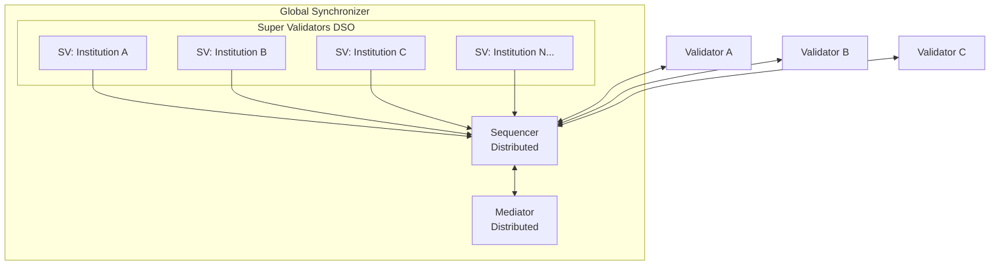
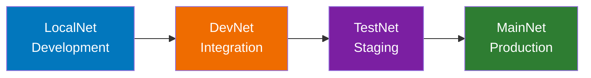

> **출처(원문)**: [The Global Synchronizer](https://docs.canton.network/overview/understand/global-synchronizer) · 번역일 2026-06-15

## 📌 개발자 노트
- **한 줄 요약**: <abbr class="gloss" title="슈퍼 밸리데이터들이 공동 운영하는 Canton의 퍼블릭 조율(합의) 계층">글로벌 Synchronizer</abbr>는 <abbr class="gloss" title="글로벌 Synchronizer를 운영하고 네트워크 거버넌스에 참여하는 노드">슈퍼 밸리데이터</abbr>(<abbr class="gloss" title="탈중앙 Synchronizer 운영(Decentralized Synchronizer Operations) 파티. 슈퍼 밸리데이터들의 공동 거버넌스 주체">DSO</abbr>)가 공동 운영하는 Canton Network의 퍼블릭 인프라 백본. <abbr class="gloss" title="트랜잭션 수수료와 밸리데이터 보상에 쓰이는 네이티브 유틸리티 토큰(CC)">Canton Coin</abbr>·<abbr class="gloss" title="Synchronizer에 쓰기를 요청할 때 소비하는 자원. Canton Coin으로 비용을 지불">트래픽</abbr>(수수료), 4개 네트워크 환경(Local/Dev/Test/MainNet), 슈퍼 <abbr class="gloss" title="파티를 호스팅하고 그 파티의 컨트랙트 데이터를 저장하는 참여자 노드">밸리데이터</abbr>·거버넌스(Canton Foundation)·<abbr class="gloss" title="글로벌 Synchronizer를 구동하는 오픈소스 애플리케이션 모음(SV·밸리데이터·월렛 등)">Splice</abbr>·업그레이드까지.
- **핵심 용어**: 글로벌 <abbr class="gloss" title="상태를 저장하지 않고 트랜잭션 합의·순서를 조율하는 Canton 구성요소">Synchronizer</abbr>, 슈퍼 밸리데이터(SV)·DSO, Canton Coin·트래픽, Splice, LocalNet/DevNet/TestNet/MainNet, Canton Foundation
- **선행 개념**: [핵심 개념](core-concepts.md), [아키텍처 개요](../learn/architecture.md). 다음 → [글로벌 Synchronizer 아키텍처](../learn/global-synchronizer-architecture.md)

---

# 글로벌 Synchronizer

> Canton Network의 퍼블릭 인프라 백본

글로벌 Synchronizer는 Canton Network의 퍼블릭 인프라 백본으로, 슈퍼 밸리데이터가 운영하는 탈중앙화 Synchronizer다.

## 무엇인가

글로벌 Synchronizer는:

* 여러 독립 주체가 운영하는 **Synchronizer 인스턴스**(여러 <abbr class="gloss" title="Synchronizer 구성요소. 암호화된 메시지에 전체 순서·타임스탬프를 부여하고 참여자에게 전달">시퀀서</abbr> + <abbr class="gloss" title="Synchronizer 구성요소. 이해관계자들의 확인을 모아 트랜잭션 승인/거부를 판정">미디에이터</abbr> 노드의 <abbr class="gloss" title="비잔틴 장애 허용(Byzantine Fault Tolerance). 일부 노드가 악의적이거나 고장 나도 시스템이 올바르게 동작하는 성질">BFT</abbr> 구성)
* **탈중앙화**: 단일 주체가 통제하지 않음
* Canton Network 애플리케이션을 위한 **기본 조율 계층**
* **Canton Foundation**(Linux Foundation 산하)이 거버넌스

유의할 점:

* 글로벌 Synchronizer는 Canton Network와 **별개의 블록체인이 아니다**
* 밸리데이터가 자기 상태를 저장한다; 글로벌 Synchronizer는 **별개의 저장 계층이 아니다**
* 프라이빗 Synchronizer도 존재할 수 있다; 모든 Canton 애플리케이션에 글로벌 Synchronizer가 **필수는 아니다**

## Canton Coin (CC)

Canton Coin은 글로벌 Synchronizer의 네이티브 유틸리티 토큰으로, 다음에 쓰인다:

| 용도 | 설명 |
| --- | --- |
| **<abbr class="gloss" title="원장 상태를 바꾸는 원자적 작업 단위. 하나 이상의 컨트랙트를 생성·보관하며, 전부 적용되거나 전혀 적용되지 않음">트랜잭션</abbr> 수수료(트래픽)** | 트랜잭션 제출 시 네트워크 사용료 지불 |
| **인프라 보상** | 인프라를 제공하는 Synchronizer 운영자에게 인센티브 |
| **거버넌스 참여** | 슈퍼 밸리데이터가 거버넌스 참여를 위해 CC를 스테이킹 |

Canton Coin은 **Splice**를 통해 구현된다. Splice는 탈중앙화 Synchronizer를 위한 경제·거버넌스 인프라를 제공하는 참조 애플리케이션 집합이다.

### 트래픽 (트랜잭션 수수료)

"트래픽(Traffic)"은 트랜잭션 수수료를 가리키는 Canton 용어다. 글로벌 Synchronizer를 통해 트랜잭션을 제출하면 Canton Coin으로 트래픽 비용을 낸다.

트래픽 비용은 대체로 다음에 좌우된다:

* 트랜잭션 크기
* 연산 복잡도
* 현재 네트워크 수요

### Canton Coin 얻기

| 환경 | 방법 |
| --- | --- |
| **LocalNet** | 실제 가치 없는 로컬 테스트 CC |
| **DevNet** | 포셋(faucet, "tapping")이 테스트 CC 제공 |
| **TestNet** | 포셋이 테스트 CC 제공 |
| **MainNet** | 거래소에서 구매하거나 네트워크 활동으로 획득 |

## 네트워크 환경

Canton Network은 네 개 환경에서 운영되며, 각각 개발 생애주기에서 다른 목적을 수행한다.

| 환경 | 목적 | 접근 방법 | CC 유형 |
| --- | --- | --- | --- |
| **LocalNet** | 로컬 개발 | 자기 머신에서 로컬 실행 | 테스트 (가치 없음) |
| **DevNet** | 통합 테스트 | VPN 자격증명 + SV 후원 | 테스트 (포셋) |
| **TestNet** | 스테이징/검증 | 신청 절차 | 테스트 (포셋) |
| **MainNet** | 프로덕션 | 완전한 온보딩 | 실제 가치 |

### LocalNet

> **참고:** LocalNet은 글로벌 Synchronizer를 전적으로 자기 머신에서 실행하도록 시뮬레이션한다 — 외부 네트워크가 필요 없다.

* **목적**: 개발 및 초기 테스트
* **접근**: <abbr class="gloss" title="다자간 워크플로를 위해 설계된 Canton의 스마트 컨트랙트 언어">Daml</abbr> SDK를 설치한 누구나
* **한계**: 단일 머신; 실제 네트워크 동작은 테스트하지 못함

**언제 쓰나**: Daml <abbr class="gloss" title="원장에 기록되는 불변 데이터 단위. 상태 변경은 새 컨트랙트 생성으로 표현됨">컨트랙트</abbr> 작성·테스트; 초기 애플리케이션 개발; Canton 학습.

### DevNet

* **목적**: 실제 네트워크 인프라로 통합 테스트
* **접근**: VPN 자격증명과 슈퍼 밸리데이터 후원 필요
* **CC**: 포셋("tapping")으로 테스트 토큰 제공

**언제 쓰나**: 다중 밸리데이터 워크플로 테스트; 네트워크 통합 검증; 프로덕션 전 테스트.

**접근 절차**:

1. 슈퍼 밸리데이터 후원자에게 연락
2. VPN 자격증명 수령
3. 밸리데이터가 연결하도록 구성
4. 테스트 CC를 탭(tap)

### TestNet

* **목적**: 스테이징 환경; 프로덕션 전 최종 검증
* **접근**: Canton Network을 통한 신청 절차
* **CC**: 테스트 토큰; 실제 가치 없음

**언제 쓰나**: 최종 통합 테스트; 성능 검증; 사용자 수용 테스트; CN 및 애플리케이션 업그레이드 연습.

### MainNet

* **목적**: 프로덕션 환경
* **접근**: 완전한 온보딩 절차
* **CC**: 피처드 애플리케이션으로 승인되면 실제 경제 가치

**언제 쓰나**: 프로덕션 배포; 실제 트랜잭션; 라이브 애플리케이션.

> **참고:** DevNet, TestNet, MainNet은 모두 동일한 슈퍼 밸리데이터가 운영하는 인프라에서 돌아간다. 차이는 접근 요건과 Canton Coin이 실제 경제 가치를 갖는지 여부다.

### 환경 진행

환경 간 이동에 필요한 것:

* **LocalNet → DevNet**: VPN 접근, SV 후원
* **DevNet → TestNet**: 신청 승인, 운영 준비
* **TestNet → MainNet**: 완전한 온보딩, 프로덕션 준비 검토

## 슈퍼 밸리데이터 (Super Validators)

슈퍼 밸리데이터(SV)는 글로벌 Synchronizer 인프라를 운영하는 주체다.

### 책임

| 책임 | 설명 |
| --- | --- |
| **인프라 운영** | 시퀀서·미디에이터 노드 운영 |
| **거버넌스 참여** | 네트워크 파라미터·업그레이드에 투표 |
| **밸리데이터 후원** | 네트워크에 합류하는 새 밸리데이터 후원 |
| **보상 분배** | 밸리데이터 보상 수령·분배 |

### 탈중앙화 Synchronizer 운영자 (DSO)

함께 노드를 운영하는 슈퍼 밸리데이터 그룹이 DSO(Decentralized Synchronizer Operator)를 이룬다. DSO는 집합적으로:

* Synchronizer 인프라를 운영
* 거버넌스 결정을 내림
* Splice 애플리케이션을 관리
* 새 참여자를 온보딩

슈퍼 밸리데이터에는 주요 금융기관과 기술 제공자가 포함된다. 현재 목록은 Canton Foundation이 관리한다.

## 밸리데이터 되기

글로벌 Synchronizer에서 밸리데이터로 참여하려면:

### 옵션

| 접근 | 설명 | 노력 | 통제 |
| --- | --- | --- | --- |
| **Node-as-a-Service** | 제공자를 통해 밸리데이터를 호스팅 | 가장 적음 | 중간 |
| **자체 호스팅(Self-hosted)** | 자기 밸리데이터 인프라를 직접 운영 | 가장 많음 | 완전 |

### 요구사항

1. **후원 확보**: 슈퍼 밸리데이터가 당신의 온보딩을 후원해야 함
2. **인프라 배포**: 요구 사양으로 밸리데이터 노드 설정
3. **Synchronizer 연결**: 네트워크 연결성 구성
4. **업그레이드 관리**: 네트워크가 자주 업그레이드됨; 밸리데이터는 보조를 맞춰야 함

### 후원 절차

1. 슈퍼 밸리데이터에 연락 (목록은 [canton.foundation](https://canton.foundation)에서 <abbr class="gloss" title="이해관계자 밸리데이터가 트랜잭션이 유효함을 미디에이터에 응답하는 것(confirmation)">확인</abbr>)
2. 활용 사례와 조직 설명
3. 필요한 계약 완료
4. 후원과 접근 자격증명 수령

> **참고:** 애플리케이션 개발자에게는 자체 호스팅보다 기존 밸리데이터(node-as-a-service)를 쓰는 것이 종종 더 간단한 길이다. 운영 부담 없이 네트워크 접근을 제공한다.

## 거버넌스

### Canton Foundation

**Canton Foundation(CF)** 은 글로벌 Synchronizer를 거버넌스하는 Linux Foundation 산하의 독립적 비영리 기구다.

**책임**:

* 네트워크 정책·파라미터 설정
* 업그레이드·유지보수 조율
* 슈퍼 밸리데이터 참여 감독
* Splice 코드베이스 거버넌스 관리
* 피처드 애플리케이션 검토·위촉

### 의사결정

거버넌스 결정은 구조화된 절차를 따른다:

1. **제안(Proposal)**: 어떤 SV든 변경을 제안할 수 있음
2. **논의(Discussion)**: SV들이 영향과 수정을 논의
3. **투표(Voting)**: SV들이 거버넌스 규칙에 따라 투표
4. **구현(Implementation)**: 승인된 변경을 구현

### 무엇이 거버넌스되나

| 영역 | 예시 |
| --- | --- |
| **프로토콜 파라미터** | 트랜잭션 한도, 타이밍 윈도 |
| **경제 파라미터** | 수수료 구조, 보상 분배 |
| **멤버십** | SV 승인, 밸리데이터 요건 |
| **업그레이드** | 프로토콜 버전, 업그레이드 일정 |

## Splice 애플리케이션

**Splice**는 탈중앙화 Canton Synchronizer를 운영·재정지원·거버넌스하는 인프라를 제공하는 오픈소스 프로젝트(Hyperledger Labs 산하)다.

### 구성 요소

| 구성 요소 | 목적 |
| --- | --- |
| **Canton Coin** | 네이티브 토큰 구현 |
| **Validator App** | 밸리데이터 노드 관리 |
| **Wallet** | CC용 사용자 월렛 |
| **Scan** | 네트워크 익스플로러 |
| **Governance** | 투표·제안 관리 |

### 토큰 표준

Splice는 Canton Network에서 토큰을 만들기 위한 토큰 표준([CIP-0056](https://github.com/canton-foundation/cips/blob/main/cip-0056/cip-0056.md))을 포함한다. 이는 다음을 제공한다:

* 토큰 연산을 위한 표준 인터페이스
* 애플리케이션 간 상호운용성
* 일관된 월렛 통합

## 업그레이드 고려사항

글로벌 Synchronizer와 밸리데이터는 현재 자주 업그레이드되며, 향후 1년 안에 그 속도가 느려질 것으로 예상된다. 밸리데이터나 애플리케이션 개발자로서 다음을 예상하라:

| 빈도 | 유형 | 영향 |
| --- | --- | --- |
| **주~월 단위** | 마이너 업데이트 | 최소; 보통 하위 호환 |
| **분기 단위** | 기능 릴리스 | 애플리케이션 업데이트가 필요할 수 있음 |
| **필요 시** | 보안 패치 | 치명적; 신속한 배포 필요 |

### 최신 상태 유지

* **공지 모니터링**: Canton Network 커뮤니케이션 구독
* **DevNet/TestNet에서 테스트**: MainNet 업그레이드 전 호환성 검증
* **유지보수 윈도 계획**: 업데이트 시간 확보
* **롤백 능력 유지**: 필요 시 되돌리는 절차 보유
* **커뮤니티 채널 참여**: [#gsf-global-synchronizer-appdev](https://daholdings.slack.com/archives/C08FQRCRFUN), [#gsf-outreach](https://daholdings.slack.com/archives/C08PT9P8ERM), [#validator-operations](https://daholdings.slack.com/archives/C08AP9QR7K4)

## 다음 단계

* **[용어집](https://docs.canton.network/overview/understand/glossary)** — 용어 레퍼런스
* **[밸리데이터 운영](https://docs.canton.network/global-synchronizer/understand/introduction)** — 자기 밸리데이터 배포
* **[배포 진행](https://docs.canton.network/appdev/modules/m5-deployment-progression)** — 환경에 걸쳐 애플리케이션 배포

<!-- nav:start -->

---

⬅️ **이전**: [앱을 피처드로 등록하기](getting-app-featured.md) ・ ➡️ **다음**: [용어집 (Glossary)](glossary.md)

<!-- nav:end -->
