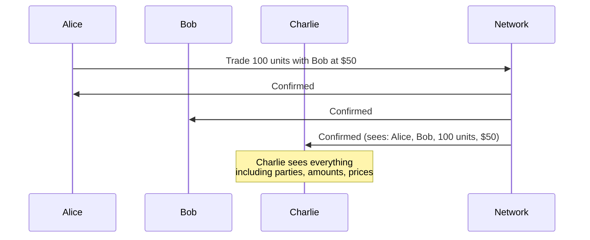

> **출처(원문)**: [The Problem Canton Solves](https://docs.canton.network/overview/understand/the-problem) · 번역일 2026-06-15

## 📌 개발자 노트
- **한 줄 요약**: 전통적 블록체인은 무결성을 "전면 공개"로 달성하기에 프라이버시가 필요한 실세계 응용에 부적합하며, 기존 프라이버시 보완책(<abbr class="gloss" title="특정 참여자끼리만 거래 데이터를 공유하는 별도 통로. 채널 밖에서는 내용이 보이지 않음(예: 상태/결제 채널, Hyperledger Fabric channel)">프라이빗 채널</abbr>·ZK·L2·암호화)은 모두 한계가 있다는 문제 정의.
- **핵심 용어**: <abbr class="gloss" title="한 트랜잭션을 &quot;뷰&quot;로 분해해, 각 파티가 자신과 관련된 부분만 보도록 하는 Canton의 핵심 프라이버시 방식">부분 트랜잭션 프라이버시</abbr>(Sub-transaction privacy), 프라이빗 채널, <abbr class="gloss" title="영지식 증명으로 다수 트랜잭션을 체인 밖에서 처리하고 유효성 증명만 L1에 올리는 L2 기술. 내용을 공개하지 않고 검증 가능해 프라이버시에도 활용">ZK-롤업</abbr>, <abbr class="gloss" title="L1 위에 얹혀 처리량을 늘리는 확장 계층(L2). 보안은 L1에 의존(예: Base, Arbitrum)">레이어 2</abbr>, 선행매매(front-running)
- **선행 개념**: [Canton Network이란?](what-is-canton.md). 다음 → [Canton의 해법](cantons-solution.md)

---

# Canton이 푸는 문제

> 블록체인 시스템에서 프라이버시 대 공개 가시성의 트레이드오프 이해하기

블록체인 기술은 서로를 완전히 신뢰하지 않는 당사자 간에 "공유된 진실"을 약속한다. 그러나 전통적 블록체인은 이 신뢰를 **전면 공개**로 달성한다 — 모두가 모든 것을 본다. 많은 실세계 애플리케이션에서 이것은 치명적 결함이다.

## 공개 가시성 문제

Ethereum에서 Alice가 Bob과 거래할 때 무슨 일이 일어나는지 보자:

1. Alice가 트랜잭션을 제출한다
2. 트랜잭션이 멤풀(mempool)에 들어간다 (모두에게 보임)
3. 채굴자/<abbr class="gloss" title="파티를 호스팅하고 그 파티의 컨트랙트 데이터를 저장하는 참여자 노드">밸리데이터</abbr>가 블록에 포함시킨다
4. 네트워크의 모든 노드가 트랜잭션을 저장한다
5. 누구나 트랜잭션 상세를 영구히 조회할 수 있다

이것이 의미하는 바:

* Charlie는 Alice가 Bob과 거래했음을 볼 수 있다
* Charlie는 가격, 자산, 수량을 볼 수 있다
* Charlie는 시간에 따른 Alice의 거래 패턴을 분석할 수 있다
* Charlie가 경쟁자라면, 그는 이제 가치 있는 정보를 손에 쥔다

## 프라이버시가 중요한 이유

공개 투명성 문제는 이론적인 것이 아니다. 실제 도입을 막는다:

### 선행매매(Front-Running) 위험

트랜잭션이 실행 전·실행 중에 보이면, <abbr class="gloss" title="컨트랙트를 볼 수 있으나 단독으로 행위할 수는 없는 파티">관찰자</abbr>는 그 정보를 악용할 수 있다. 전통적 금융에서 이것은 불법이다. 퍼블릭 블록체인에서는 구조적이다.

### 경쟁 정보 노출

모든 트랜잭션은 정보를 드러낸다:

* **거래 전략**: 패턴 분석이 당신의 접근 방식을 노출한다
* **비즈니스 관계**: 누구와 거래하는지가 파트너를 드러낸다
* **포지션 규모**: 경쟁자가 당신의 익스포저를 알게 된다
* **가격 정보**: 거래 상대방이 당신의 다른 거래를 본다

### 규제 장벽

많은 산업이 데이터에 관한 법적 요건을 갖는다:

* **금융 규제**: 고객 데이터는 보호되어야 한다
* **데이터 주권**: 정보가 특정 관할권을 벗어나면 안 될 수 있다
* **기밀 유지 의무**: 계약상 프라이버시 요건

### 비즈니스 현실

어떤 기업도 경쟁자가 읽을 수 있는 시스템에 민감한 비즈니스 로직과 트랜잭션을 올리지 않는다. 예외 없이.

## 불완전한 보완책들

업계는 퍼블릭 블록체인에 프라이버시를 더하기 위해 여러 접근을 시도해 왔다:

### 프라이빗 채널

Hyperledger Fabric 같은 시스템은 참여자 부분집합을 위한 별도 채널을 만든다.

**문제점:**

* 단편화: 채널 간 공유 상태가 없음
* 복잡성: 채널 멤버십 관리
* 제한된 상호운용성: 채널 간 트랜잭션이 어려움

### 영지식 증명 (Zero-Knowledge Proofs)

ZK-롤업과 ZK 기반 시스템은 내용을 드러내지 않고 트랜잭션 유효성을 증명한다.

**문제점:**

* 연산 오버헤드: 증명 생성이 비쌈
* 복잡성: ZK 회로는 개발·감사가 어려움
* 제한된 표현력: 모든 비즈니스 로직이 ZK 제약에 맞지는 않음
* 신뢰 설정(trusted setup) 요건: 일부 시스템은 신뢰 가정을 요구

### 레이어 2 솔루션

트랜잭션을 메인 체인 밖으로 옮기고 주기적으로 온체인 정산한다.

**문제점:**

* 데이터 가용성: L2 운영자는 보통 모든 트랜잭션을 본다
* 신뢰 가정: 사용자는 L2 운영자를 신뢰해야 함
* 정산 지연: 최종성(finality)이 L1 확정을 기다려야 함
* 브릿지 위험: 계층 간 자산 이동이 공격 표면을 늘림

### 저장 시 암호화 (Encryption at Rest)

온체인에 저장되는 데이터를 암호화한다.

**문제점:**

* 키 관리: 복호화 키는 누가 보유하는가?
* 메타데이터 노출: 트랜잭션 패턴은 여전히 보임
* 미래 취약성: 오늘 암호화된 데이터가 내일 복호화될 수 있음
* 연산 한계: 암호화된 데이터 위에서 연산하기 어려움

## 근본적 긴장

이 접근들은 모두 프라이버시를 **공개 시스템 위에 덧붙일 무언가**로 취급한다. 아키텍처에 맞서 싸우는 것이지, 함께 일하는 것이 아니다.

근본적 긴장은 이렇다:

| 요구사항 | 전통적 접근 | 결과 |
| --- | --- | --- |
| **무결성(Integrity)** | 모든 노드가 모든 트랜잭션을 검증 | 가시성을 요구함 |
| **검증(Verification)** | 밸리데이터가 트랜잭션 내용을 봄 | 비공개 데이터를 노출함 |
| **프라이버시(Privacy)** | 트랜잭션 내용을 숨김 | 검증을 약화시킴 |

전통적 블록체인은 선택을 강요한다: 무결성이냐 프라이버시냐.

## Canton의 통찰

Canton은 "합의(consensus)"의 의미를 바꿔 이 긴장을 해소한다:

* 밸리데이터는 자신이 참여하지 않는 트랜잭션을 볼 필요가 없다
* 합의는 트랜잭션에 관련된 당사자들에 의해 달성될 수 있다
* 조율자(coordinator)는 내용을 보지 않고도 트랜잭션을 정렬할 수 있다

이것은 우회책이 아니라 **다른 아키텍처적 토대**다. 프라이버시는 트랜잭션이 작동하는 방식에 내장되어 있으며, 위에 덧씌워진 것이 아니다.

> **참고:** Canton은 이 접근을 **부분 트랜잭션 프라이버시(sub-transaction privacy)** 라고 부른다. 각 <abbr class="gloss" title="Canton에서 권한과 데이터 가시성의 주체가 되는 식별 가능한 참여 주체">파티</abbr>는 자신의 역할(<abbr class="gloss" title="컨트랙트의 주된 권한자. 생성·보관(소비)에 반드시 동의해야 하는 파티">서명자</abbr>signatory, 관찰자observer, 컨트롤러controller)에 따라 볼 권한이 있는 트랜잭션 부분만 본다. 시스템은 전역 가시성을 요구하지 않고도 무결성을 유지한다.

## 다음 단계

* **[Canton의 해법](cantons-solution.md)** — Canton이 프라이버시-무결성 트레이드오프를 어떻게 해소하는지 학습.
* **[프라이버시 모델](https://docs.canton.network/overview/learn/privacy-model)** — 부분 트랜잭션 프라이버시 메커니즘 심층 분석.

<!-- nav:start -->
---
⬅️ **이전**: [용어집 (Glossary)](glossary.md) ・ ➡️ **다음**: [활용 사례](use-cases.md)
<!-- nav:end -->
