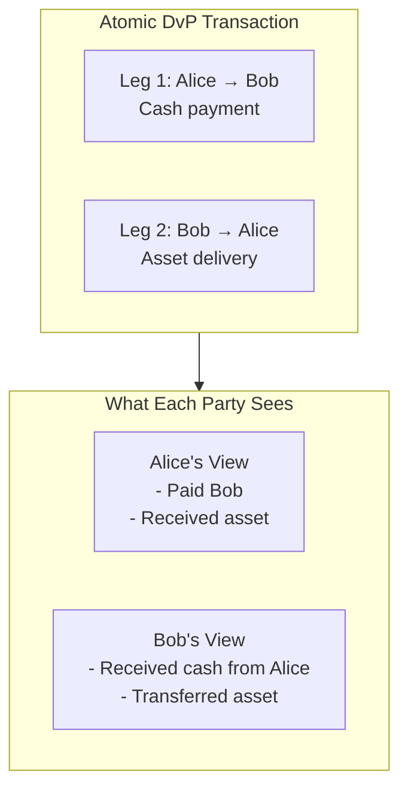
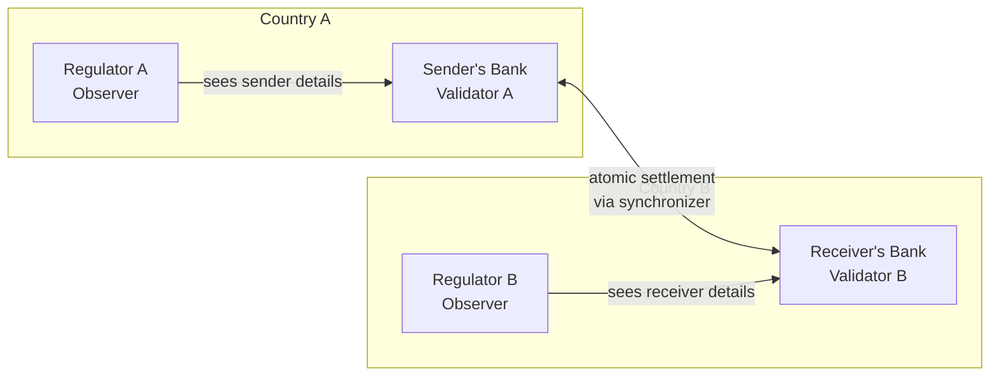
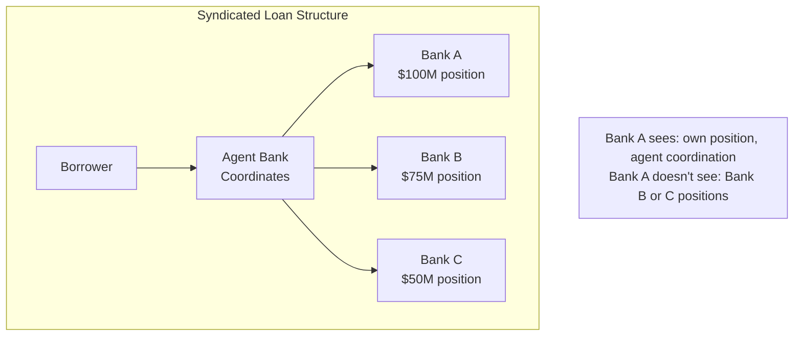

> **출처(원문)**: [Use Cases](https://docs.canton.network/overview/understand/use-cases) · 번역일 2026-06-15

## 📌 개발자 노트
- **한 줄 요약**: Canton의 프라이버시 모델이 전통 블록체인에서 불가능한 해법을 가능하게 하는 실제 사례 — DvP(인도-지불), 토큰화 증권, 국경 간 결제, 신디케이트 대출, 공급망 금융 — 과 적합/부적합 기준.
- **핵심 용어**: DvP(Delivery vs. Payment), 원자적 정산(atomic settlement), <abbr class="gloss" title="어떤 컨트랙트와 관계를 맺어 그것을 보거나 승인하는 파티 = 서명자 + 관찰자">이해관계자</abbr>(stakeholder), 선택적 공개(selective disclosure)
- **선행 개념**: [핵심 개념](core-concepts.md), [Canton의 해법](cantons-solution.md). 다음 → [구축 시작하기](https://docs.canton.network/appdev/get-started/choose-your-path)

---

# 활용 사례

> Canton의 프라이버시 모델이 전통적 블록체인에서는 불가능한 해법을 가능하게 하는 실세계 응용

Canton의 아키텍처는 퍼블릭 블록체인에서 불가능한 활용 사례를 가능하게 한다. 이 페이지는 핵심 패턴과 구체적 예시를 살펴본다.

## 인도 대 지불 (Delivery vs. Payment, DvP)

Canton 역량의 대표적 예는 서로 다른 자산과 당사자 간의 원자적 인도-지불이다.

### 시나리오

Alice는 Bob으로부터 토큰화된 자산을 사고 싶어 하며, 프라이빗 결제 <abbr class="gloss" title="상태를 저장하지 않고 트랜잭션 합의·순서를 조율하는 Canton 구성요소">동기화자</abbr>에서 정산되는 토큰화 현금 수단으로 지불한다. 정산은 다음과 같아야 한다:

* **원자적(Atomic)**: 두 다리(leg)가 모두 완료되거나, 둘 다 안 되거나
* **사적(Private)**: <abbr class="gloss" title="컨트랙트를 볼 수 있으나 단독으로 행위할 수는 없는 파티">관찰자</abbr>는 거래 상대방이나 가격을 보면 안 됨

### 전통적 블록체인에서

이는 문제가 된다:

* 두 트랜잭션으로 하면: 하나만 완료되고 다른 하나는 안 될 위험
* 원자적으로 하면: 모든 당사자(와 관찰자)가 거래의 모든 다리를 봄
* 지켜보는 누구나 가격과 조건을 볼 수 있음

### Canton에서

전체 교환이 <abbr class="gloss" title="한 트랜잭션을 &quot;뷰&quot;로 분해해, 각 파티가 자신과 관련된 부분만 보도록 하는 Canton의 핵심 프라이버시 방식">부분 트랜잭션 프라이버시</abbr>를 갖춘 단일 원자적 트랜잭션으로 일어난다:



| 당사자 | 보는 것 | 보지 못하는 것 |
| --- | --- | --- |
| **Alice** | 두 다리 모두 (매수자) | 해당 없음 |
| **Bob** | 두 다리 모두 (매도자) | 해당 없음 |
| **제3자** | 아무것도 | 이 거래에 관한 모든 것 |

> **참고:** 이 예는 현금 다리와 자산 다리가 모두, 거래 참여자만 유일한 이해관계자인 동기화자에서 정산된다고 가정한다 — 예컨대 현금 다리는 프라이빗 결제 동기화자, 자산 다리는 프라이빗 증권 동기화자. <abbr class="gloss" title="슈퍼 밸리데이터들이 공동 운영하는 Canton의 퍼블릭 조율(합의) 계층">글로벌 동기화자</abbr>에서 정산되는 자산이 관여하는 거래는 다르게 동작한다: <abbr class="gloss" title="트랜잭션 수수료와 밸리데이터 보상에 쓰이는 네이티브 유틸리티 토큰(CC)">Canton Coin</abbr> 이전, <abbr class="gloss" title="어떤 노드·파티·키가 네트워크에 참여하는지를 정의하는 구성 정보">토폴로지</abbr> 트랜잭션, 네트워크 거버넌스 트랜잭션은 글로벌 동기화자를 운영하는 <abbr class="gloss" title="글로벌 동기화자를 운영하고 네트워크 거버넌스에 참여하는 노드">슈퍼 밸리데이터</abbr>에게 보이므로 같은 의미로 사적이지 않다. 프라이빗 동기화자는 완전한 부분 트랜잭션 프라이버시 모델을 보존한다.

### 왜 중요한가

* **규제 준수**: 각 당사자는 자신이 권한 있는 정보만 봄
* **원자적 정산**: 정산 위험 없음 — 두 다리 모두이거나 아예 없거나
* **프라이버시**: 거래 관계와 가격이 보호됨
* **감사 추적**: 권한 있는 감사자를 관찰자로 추가 가능

## 토큰화 증권 (Tokenized Securities)

규제 준수를 내장한 채 증권을 발행하고 거래한다.

### 요구사항

* 발행자가 누가 증권을 보유할 수 있는지 통제
* 규제기관이 감사 가시성을 가짐
* 거래는 매수자와 매도자 사이에서 사적
* 기업 행위(corporate actions)는 모든 보유자에게 영향 (단, 보유 내역은 사적 유지)

### Canton 설계

```haskell
template Security
  with
    issuer : Party
    holder : Party
    regulator : Party
    cusip : Text
    quantity : Decimal
    approvedHolders : [Party]  -- Issuer maintains list of eligible holders
  where
    signatory issuer
    observer holder, regulator  -- Regulator sees all holdings

    choice Transfer : ContractId Security
      with
        newHolder : Party
      controller holder, issuer  -- Issuer approval required for compliance
      do
        assert (newHolder `elem` approvedHolders)
        create this with holder = newHolder
```

규제기관은 그 데이터가 공개되지 않으면서 모든 보유 내역(규정 준수용)을 관찰한다. 발행자는 모든 이전을 승인해야 하며, 적격 당사자만 증권을 보유하도록 보장한다. 거래는 감사 가능하면서도 거래 상대방 사이에서 사적으로 유지된다.

## 국경 간 결제 (Cross-Border Payments)

데이터 주권 요건을 존중하면서 관할권을 넘어 가치를 이동한다.

### 과제

* 송금인의 은행은 데이터 현지화 요건이 있는 A국에 있음
* 수취인의 은행은 다른 요건이 있는 B국에 있음
* 코레스폰던트 뱅킹(correspondent banking)은 조율이 필요
* 어느 국가의 규제기관도 다른 국가의 고객 데이터를 보면 안 됨

### Canton 해법

각 관할권의 데이터는 그 관할권의 <abbr class="gloss" title="파티를 호스팅하고 그 파티의 컨트랙트 데이터를 저장하는 참여자 노드">밸리데이터</abbr>에 머문다:



* 송금인의 정보는 A국에 머문다
* 수취인의 정보는 B국에 머문다
* 정산은 동기화자를 가로질러 원자적이다
* 각 규제기관은 자기 관할권의 데이터만 본다

## 신디케이트 대출 관리 (Syndicated Loan Management)

여러 은행이 서로의 포지션이나 조건을 보지 않고 한 대출에 참여한다.

### 시나리오

신디케이트 대출에서:

* 여러 은행이 동일 대출의 일부를 보유
* 각 은행의 포지션은 기밀
* 에이전트 은행이 지불을 조율
* 차입자는 그룹 전체와 상호작용

퍼블릭 시스템에서는 모든 참여자가 모든 포지션을 보게 되어 기밀성이 무너진다.

### Canton 해법



각 은행이 보는 것:

* 자기 포지션과 조건
* 자신에게 오가는 지불
* 자기 몫에 대한 에이전트 조율

각 은행이 보지 못하는 것:

* 다른 은행의 포지션
* 다른 은행의 조건
* 신디케이트 전체 규모 (명시적으로 공유되지 않는 한)

## 공급망 금융 (Supply Chain Finance)

상업적 관계를 노출하지 않고 여러 당사자에 걸친 상품과 지불을 추적한다.

### 시나리오

제조사가 유통사에 출하하고, 유통사가 소매업체에 출하한다. 각 단계에서 금융이 제공된다.

### 프라이버시 요구사항

* 제조사는 소매업체의 매입 가격을 보면 안 됨
* 소매업체는 제조 원가를 보면 안 됨
* 각 금융기관은 자기 채무자의 몫만 봄
* 물류 제공자는 배송 정보를 보되 금융 조건은 못 봄

### Canton 접근

Canton의 프라이버시는 <abbr class="gloss" title="원장에 기록되는 불변 데이터 단위. 상태 변경은 새 컨트랙트 생성으로 표현됨">컨트랙트</abbr> 수준에서 작동한다 — 관찰자는 개별 필드가 아니라 컨트랙트 전체를 본다. 서로 다른 당사자에게 서로 다른 정보 접근을 주려면, 대상별로 별도의 컨트랙트를 설계한다:

```haskell
-- Shipping details: visible to logistics provider
template ShipmentTracking
  with
    shipper : Party
    receiver : Party
    logisticsProvider : Party
    goods : GoodsDescription
    trackingId : Text
  where
    signatory shipper, receiver
    observer logisticsProvider
    -- Logistics provider sees goods and routing, not financial terms

-- Financing terms: visible to financier
template ShipmentFinancing
  with
    shipper : Party
    receiver : Party
    financier : Party
    terms : FinancingTerms
    shipmentRef : Text  -- Reference to link related contracts
  where
    signatory shipper, receiver
    observer financier
    -- Financier sees payment terms, not goods details or other legs' pricing
```

단일 원자적 트랜잭션이 두 컨트랙트를 모두 생성할 수 있다. 물류 제공자와 금융기관은 각자 관련된 컨트랙트만 보고, 출하인과 수취인(둘 다의 <abbr class="gloss" title="컨트랙트의 주된 권한자. 생성·보관(소비)에 반드시 동의해야 하는 파티">서명자</abbr>)은 모든 것을 본다. 공급망의 하류 참여자는 상류 가격을 결코 보지 못한다. 그 컨트랙트들은 이해관계자가 다르기 때문이다.

이 패턴 — 대상별로 데이터를 별도 컨트랙트로 분리하는 것 — 이 Canton이 원자성을 유지하면서 세밀한 프라이버시를 달성하는 방법이다.

## Canton이 맞을 때

다음이 필요할 때 Canton이 이상적이다:

| 요구사항 | Canton이 제공하는 것 |
| --- | --- |
| **다자간 조율** | 명시적 권한을 갖춘 네이티브 다자간 컨트랙트 |
| **기밀 실행** | 설계상 부분 트랜잭션 프라이버시 |
| **규제 준수** | 권한 있는 당사자에게 선택적 공개 |
| **원자적 정산** | 당사자 간 전부 아니면 전무(all-or-nothing) 실행 |
| **감사 추적** | 권한 있는 감사자를 위한 관찰자 역할 |

## Canton이 맞지 않을 수 있을 때

다음이 필요하면 대안을 고려하라:

| 요구사항 | 고려사항 |
| --- | --- |
| **완전 공개형 애플리케이션** | 투명성이 한계가 아니라 기능 (예: 공공 거버넌스, 공개 경매) |
| **EVM 호환성** | Canton은 Ethereum 스마트 컨트랙트와 네이티브로 상호운용되지 않음 |
| **익명 참여** | Canton <abbr class="gloss" title="Canton에서 권한과 데이터 가시성의 주체가 되는 식별 가능한 참여 주체">파티</abbr>는 신원을 가짐; 진정한 익명 시스템은 다른 접근이 필요 |
| **단순 단일 파티 앱** | 블록체인 오버헤드가 정당화되지 않을 수 있음 |

## 다음 단계

* **[핵심 개념](core-concepts.md)** — 파티, 밸리데이터, 동기화자 이해.
* **[구축 시작하기](https://docs.canton.network/appdev/get-started/choose-your-path)** — 개발 여정 시작.

<!-- nav:start -->
---
<sub>⬅️ **이전**: [Canton이 푸는 문제](the-problem.md) ・ ➡️ **다음**: [Canton Network이란?](what-is-canton.md)</sub>
<!-- nav:end -->
