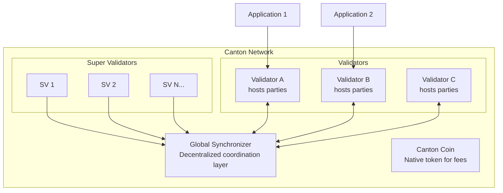

> **출처(원문)**: [What is Canton Network?](https://docs.canton.network/overview/understand/what-is-canton) · 번역일 2026-06-15

## 📌 개발자 노트
- **한 줄 요약**: Canton은 규제 자산과 <abbr class="gloss" title="여러 조직·당사자가 함께 참여하는 업무 흐름(예: 결제·정산·대출)">다자간 워크플로</abbr>를 위한 프라이버시 보존형 퍼블릭 L1 블록체인으로, 모든 참여자에게 데이터가 공개되는 일반 블록체인과 달리 "선택적 공개"를 제공한다.
- **핵심 용어**: <abbr class="gloss" title="한 트랜잭션을 &quot;뷰&quot;로 분해해, 각 파티가 자신과 관련된 부분만 보도록 하는 Canton의 핵심 프라이버시 방식">부분 트랜잭션 프라이버시</abbr>(Sub-transaction privacy), <abbr class="gloss" title="상태를 저장하지 않고 트랜잭션 합의·순서를 조율하는 Canton 구성요소">Synchronizer</abbr>, <abbr class="gloss" title="파티를 호스팅하고 그 파티의 컨트랙트 데이터를 저장하는 참여자 노드">밸리데이터</abbr>(Validator), <abbr class="gloss" title="다자간 워크플로를 위해 설계된 Canton의 스마트 컨트랙트 언어">Daml</abbr>, <abbr class="gloss" title="트랜잭션 수수료와 밸리데이터 보상에 쓰이는 네이티브 유틸리티 토큰(CC)">Canton Coin</abbr>(CC)
- **선행 개념**: 없음 (입문 페이지). 다음 → 아키텍처([overview/learn/architecture](https://docs.canton.network/overview/learn/architecture)), 프라이버시 모델([overview/learn/privacy-model](https://docs.canton.network/overview/learn/privacy-model))

---

# Canton Network이란?

> 규제 자산과 다자간 워크플로를 위한 프라이버시 지원 블록체인

Canton Network은 프라이버시 보존 <abbr class="gloss" title="원장 상태를 바꾸는 원자적 작업 단위. 하나 이상의 컨트랙트를 생성·보관하며, 전부 적용되거나 전혀 적용되지 않음">트랜잭션</abbr>을 위해 설계된 퍼블릭 <abbr class="gloss" title="자체 합의로 트랜잭션을 직접 확정하는 기반 블록체인(L1). 다른 체인에 의존하지 않음">레이어 1</abbr> 블록체인이다. 모든 트랜잭션이 모든 참여자에게 보이는 전통적 블록체인과 달리, Canton은 선택적 공개(selective disclosure)를 가능하게 한다 — 각 <abbr class="gloss" title="Canton에서 권한과 데이터 가시성의 주체가 되는 식별 가능한 참여 주체">파티</abbr>(party)는 자신이 볼 권한이 있는 데이터만 본다.

## 60초 요약 (The 60-Second Pitch)

Canton Network은 블록체인의 근본적 긴장 관계인 **투명성 대 프라이버시**를 해결한다. Ethereum 같은 전통적 블록체인은 무결성과 탈중앙화를 제공하지만, 모든 트랜잭션 데이터를 모든 네트워크 참여자에게 노출한다. 이 때문에 규제 금융시장, 기밀 비즈니스 프로세스, 그리고 데이터 프라이버시가 타협 불가능한 모든 애플리케이션에는 적합하지 않다.

Canton은 다음을 제공한다:

* **부분 트랜잭션 프라이버시(Sub-transaction privacy)**: 동일한 트랜잭션에 참여하는 서로 다른 파티는 자신과 관련된 부분만 본다
* **탈중앙화 <abbr class="gloss" title="여러 노드가 트랜잭션의 유효성·순서에 함께 동의하는 절차">합의</abbr>(Decentralized consensus)**: 단일 주체가 네트워크를 통제하지 않는다
* **규제 준수(Regulatory compliance)**: 데이터는 그것을 소유한 파티에게 머문다
* **수평적 확장성(Horizontal scalability)**: 전역 상태 복제 없이 노드를 추가해 확장한다

## Canton이 푸는 문제

간단한 예를 보자: Alice가 Bob과 자산을 거래하려 한다. Ethereum에서는 이 거래가 모두에게 보인다 — Charlie, Dave, 그리고 수천 명의 익명 <abbr class="gloss" title="컨트랙트를 볼 수 있으나 단독으로 행위할 수는 없는 파티">관찰자</abbr>가 가격, 거래 당사자, 자산 상세를 볼 수 있다.

규제 금융에서 이는 시작조차 불가능한 조건이다. 포지션 가시성은 선행매매(front-running)를 가능하게 한다. 트랜잭션 패턴은 거래 전략을 드러낸다. 규정 준수 요건상 특정 데이터를 권한 없는 당사자와 공유하는 것이 금지될 수 있다.

Canton은 **어떤 데이터가 어디로 분산되는지**를 근본적으로 바꿔 이 문제를 해결한다. 대부분의 블록체인에서는 모든 상태와 트랜잭션이 모든 노드로 복제된다. Canton에서는 상태와 트랜잭션이 <abbr class="gloss" title="원장 위에서 규칙대로 자동 실행되는 코드화된 계약. Canton에선 Daml 템플릿으로 작성">스마트 컨트랙트</abbr>에 명시된 노드로만 분산된다. 이것은 추가된 프라이버시 계층(bolt-on)이 아니라 핵심 아키텍처 원칙이다.

## Canton은 무엇이 다른가

Canton은 세 가지 근본적인 면에서 다른 블록체인 플랫폼과 다르다:

### 부분 트랜잭션 프라이버시

다른 블록체인이 프라이버시를 사후에 덧붙이는(<abbr class="gloss" title="영지식 증명으로 다수 트랜잭션을 체인 밖에서 처리하고 유효성 증명만 L1에 올리는 L2 기술. 내용을 공개하지 않고 검증 가능해 프라이버시에도 활용">ZK-롤업</abbr>, <abbr class="gloss" title="특정 참여자끼리만 거래 데이터를 공유하는 별도 통로. 채널 밖에서는 내용이 보이지 않음(예: 상태/결제 채널, Hyperledger Fabric channel)">프라이빗 채널</abbr>) 반면, Canton은 프라이버시를 프로토콜 계층에 내장한다. 트랜잭션은 "<abbr class="gloss" title="한 트랜잭션을 당사자별로 나눈 조각. 각 당사자는 자기 권한에 해당하는 뷰(자기 몫)만 받아 본다">뷰</abbr>(view)"로 분해되며, 각 파티는 자신의 부분만 본다.

### Synchronizer(Synchronizers) vs. 전역 합의

Canton은 모든 노드가 복제하는 단일 블록체인을 사용하지 않는다. 대신 **Synchronizer(synchronizer)**가 상태를 저장하지 않으면서 합의를 조율하고, **<abbr class="gloss" title="파티를 호스팅하고 그 파티의 컨트랙트를 저장·실행하는 노드. 밸리데이터의 핵심 구성요소">참여자 노드</abbr>(밸리데이터)**는 자신이 <abbr class="gloss" title="참여자 노드가 파티의 데이터·키를 맡아 두고, 그 파티를 대신해 원장에서 활동(저장·제출·확인)해 주는 것">호스팅</abbr>하는 파티와 관련된 데이터만 수신·저장한다.

### Daml 스마트 컨트랙트

Canton은 다자간 워크플로를 위해 특별히 설계된 언어인 Daml을 사용한다. Solidity의 명령형 모델과 달리 Daml은 다음을 제공한다:

* 명시적 권한 선언(누가 무엇을 할 수 있는가)
* 내장 프라이버시 제어(누가 무엇을 볼 수 있는가)
* 불변 <abbr class="gloss" title="원장에 기록되는 불변 데이터 단위. 상태 변경은 새 컨트랙트 생성으로 표현됨">컨트랙트</abbr>(상태 변경은 새 컨트랙트를 생성한다)

## Canton Network 생태계

**주요 구성 요소:**

* **<abbr class="gloss" title="슈퍼 밸리데이터들이 공동 운영하는 Canton의 퍼블릭 조율(합의) 계층">글로벌 Synchronizer</abbr>**: <abbr class="gloss" title="글로벌 Synchronizer를 운영하고 네트워크 거버넌스에 참여하는 노드">슈퍼 밸리데이터</abbr>가 운영하는 퍼블릭 조율 계층
* **Canton Coin (CC)**: 트랜잭션 수수료와 밸리데이터 보상에 쓰이는 네이티브 유틸리티 토큰
* **밸리데이터(Validators)**: 파티를 호스팅하고 그들의 컨트랙트 데이터를 저장하는 참여자 노드
* **애플리케이션(Applications)**: 당신이 만드는 것 — Ledger API를 통해 밸리데이터에 연결된다

## 누가 Canton을 사용하는가

Canton Network은 2023년 5월 은행, 시장 인프라, 트레이딩 전반의 주요 금융기관들의 지원을 받아 출범했다. 현재 참여자 목록은 [Canton Network 웹사이트](https://www.canton.network/)를 참고하라.

이러한 기관의 지원은 엔터프라이즈 활용 사례에 대한 Canton의 접근 방식을 검증해 주지만, 동시에 플랫폼이 직접적인 지원 관계를 가진 엔터프라이즈 개발자를 중심으로 발전해 왔음을 의미하기도 한다. 글로벌 Synchronizer의 출범으로 Canton은 금융 인프라를 구축하려는 누구나 접근할 수 있게 되었다.

## 언제 Canton을 사용하는가

### 이상적인 활용 사례

| 활용 사례 | Canton이 적합한 이유 |
| --- | --- |
| **기밀성이 필요한 다자간 워크플로** | 참여자가 서로의 포지션을 보면 안 됨 (예: 신디케이트 대출, 무역 금융) |
| **규제 자산의 <abbr class="gloss" title="실물·금융 자산을 원장 위의 토큰(컨트랙트)으로 표현하는 것">토큰화</abbr>** | 규정 준수상 데이터 주권이 필요함 (예: 증권, 부동산) |
| **조직 간 프로세스** | 가시성은 공유하지 않으면서 상태를 공유 (예: 공급망, 컨소시엄 애플리케이션) |
| **프라이버시 보존 DeFi** | 포지션과 포트폴리오를 비공개로 유지 (예: 트레이딩, 대출) |

### 덜 이상적인 활용 사례

| 활용 사례 | Canton이 맞지 않을 수 있는 이유 |
| --- | --- |
| **완전 공개형 애플리케이션** | 투명성이 한계가 아니라 기능 그 자체임 (예: 공공 거버넌스, 공개 경매) |
| **단순 단일 파티 애플리케이션** | 분산 <abbr class="gloss" title="거래·컨트랙트가 기록되는 장부. Canton에선 활성 컨트랙트의 모음">원장</abbr> 속성에서 얻는 이점이 없음 |
| **EVM 상호운용성이 필요한 경우** | Canton은 Ethereum 스마트 컨트랙트와 네이티브로 상호운용되지 않음 |
| **익명 공개 참여** | Canton 파티는 신원을 가짐; 진정한 익명 시스템은 다른 접근이 필요 |

## 다음 단계

* **[블록체인 개발자를 위한 Canton](https://docs.canton.network/appdev/modules/m2-canton-for-ethereum-devs)** — 기존 블록체인 지식을 Canton 개념에 매핑한다
* **[아키텍처 개요](https://docs.canton.network/overview/learn/architecture)** — Canton 구성 요소가 어떻게 함께 작동하는지 이해한다
* **[프라이버시 모델 설명](https://docs.canton.network/overview/learn/privacy-model)** — 부분 트랜잭션 프라이버시 심층 분석

<!-- nav:start -->

---

⬅️ **이전**: [활용 사례](use-cases.md) ・ ➡️ **다음**: [누가 이 문서를 읽어야 하나](who-should-read.md)

<!-- nav:end -->
